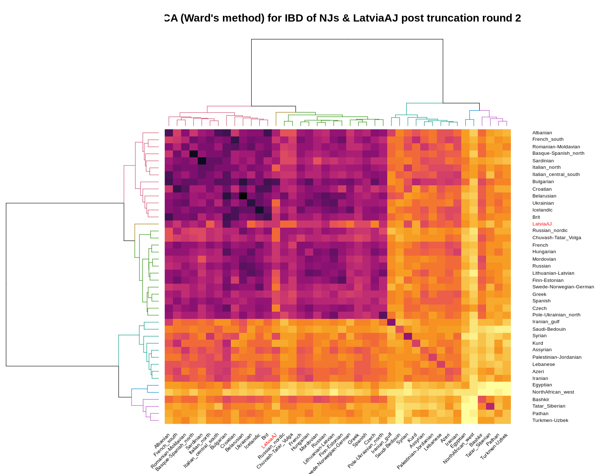
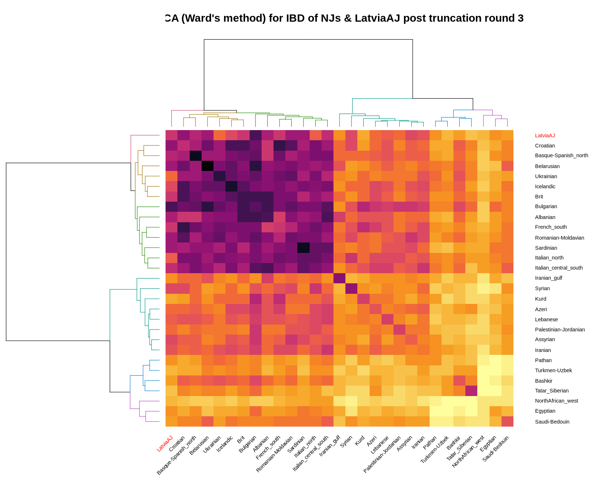
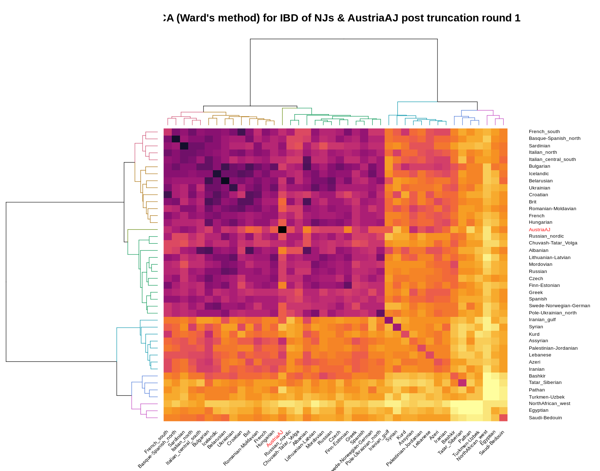
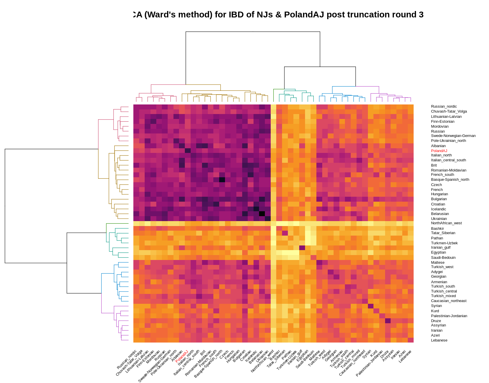
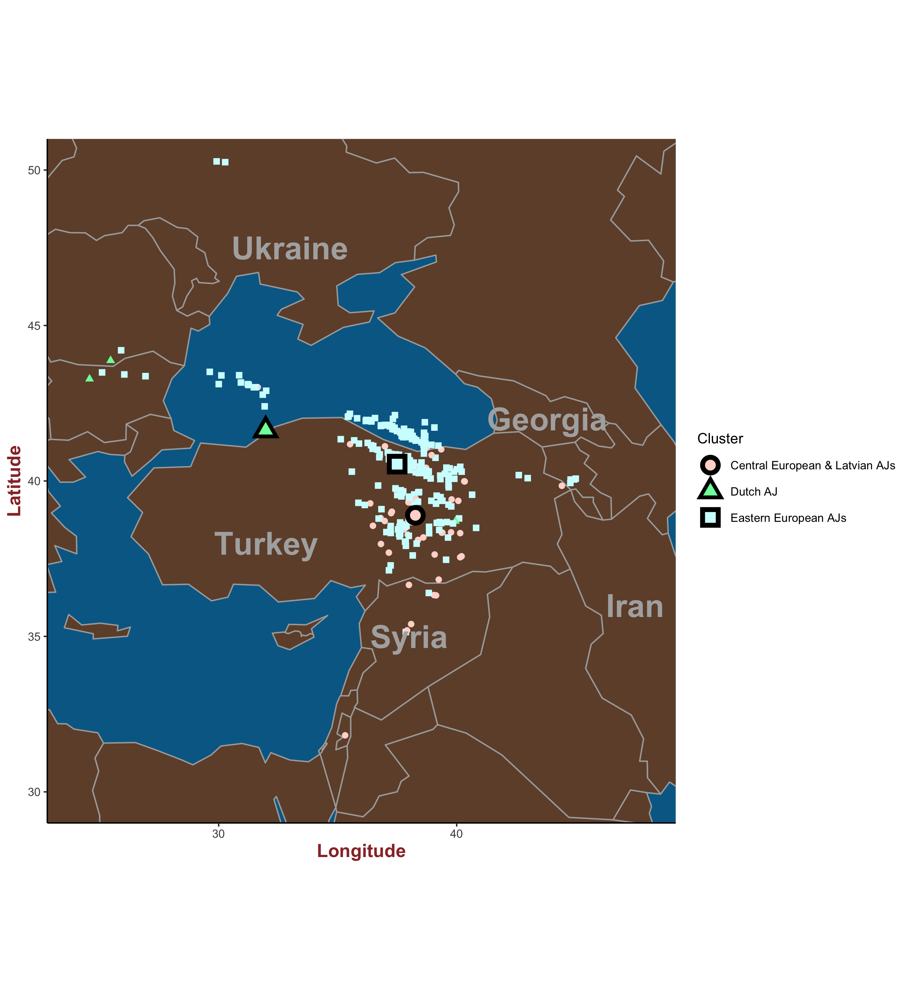

# Lund University BINP50 Master's Thesis Project in bioinformatics: 
# Identifying a fine genetic structure across Ashkenazic Jews
## April 2021 - August 2021
### Author: Jiawei Zhao (ji8842zh-s@student.lu.se)
### Supervisor: Prof. Eran Elhaik

<hr />
<br />

[Section I: Basic Setup for the project](#sec1) <br />
[Section II: Download and extract genotype data of Jews for IBD and GPS analyses](#sec2) <br />
[Section III: Extract genotype data of non-Jews from regions of interest in Afro-Eurasia for subsequent IBD analyses](#sec3) <br />
[Section IV: IBD inference by <code>phasedibd</code> and Extract of IBD segments](#sec4) <br />
+ [Run phasedibd](#run-phasedibd)
+ [Removing replicate individuals and close relatives(minimally half-cousins) from Jewish individuals](#jew-qc)
+ [Extracting IBD segments between and within AJs, other Jews, and non-Jews](#ibd-analyses)
[Section V: Statistical and Hierarchical Clustering analyses (HCA) in R for IBD](#sec5) <br />
+ [K-S test for the "local European proselyte hypothesis" for each AJ community](#null-hyp)
+ [Heatmap and HCA 12 AJ communities](#aj-ibd)
+ [Heatmap and HCA for all non-Jewish populations](#nj-ibd)
+ [Heatmap, HCA, and K-S test for all non-Jewish populations and 12 AJ communities](#nj-all-aj-ibd)
+ [Heatmap and HCA for all non-Jewish populations and each of the 12 AJ communities](#nj-each-aj-ibd)
+ [Plotting all NJ populations, and closest NJ populations with each AJ community at map](#nj-map)
[Section VI: Preprocessing in Python, Plotting and HCA in R for GPS predictions](#sec6) <br />
+ [Relocalize each AJ predicted to sea by GPS to the nearest shore in Python](#to-shore)
+ [Heatmap HCA for GPS predictions in R](#gps-analyses)
+ [Plotting biogeographical coordinates predicted by GPS in R](#aj-gps-map)


<hr />

<a name="sec1"></a>
# Section I: Basic Setup for the project

### Create a directory called "../main_folder" to conduct our major analysis. However, the directory should be git ignore or it would be too large to be put on Github.

```bash
%%bash
mkdir -p ../main_folder && cd ../main_folder
```


#### Download PLINK 1.9

```bash
%%bash
curl -sSL https://s3.amazonaws.com/plink1-assets/plink_linux_x86_64_20210606.zip -o plink.zip &&
unzip plink.zip
```

#### Download the tool to convert .geno & .snp & .ind formats into PLINK formats: https://github.com/DReichLab/EIG


```bash
%%bash
git clone https://github.com/DReichLab/EIG && ls -l EIG/CONVERTF/*
```

```bash
%%bash
cat EIG/CONVERTF/par.ANCESTRYMAP.EIGENSTRAT
```

    genotypename:    example.ancestrymapgeno
    snpname:         example.snp
    indivname:       example.ind
    outputformat:    EIGENSTRAT
    genotypeoutname: example.eigenstratgeno
    snpoutname:      example.snp
    indivoutname:    example.ind


```bash
%%bash
cat EIG/CONVERTF/par.PED.PACKEDPED
```

    genotypename:    example.ped
    snpname:         example.pedsnp # or example.map, either works
    indivname:       example.pedind # or example.ped, either works
    outputformat:    PACKEDPED
    genotypeoutname: example.bed
    snpoutname:      example.pedsnp
    indivoutname:    example.pedind
    familynames:     NO


#### use 
#### <code>sudo apt-get install -y libgsl-dev -y libopenblas-dev -y liblapacke-dev -y libblas-dev -y libatlas-base-dev</code> 
#### to install necessary dependencies for makefile


```bash
%%bash
cd EIG/src && make && make install && cd ../..
```

<a name="sec2"></a>
# Section II: Download and extract genotype data of Jews for IBD and GPS analyses

### Collect genotype data of modern AJ individuals

### We obtained, processed and merged four datasets of autosomal Jewish genotype data. The merged dataset consists of 935 Jewish individuals before Quality Control.

#### 1. 20 AJs and 101 other Jews from Behar et al. 2010 (https://pubmed.ncbi.nlm.nih.gov/20531471/) at ~570K SNPs
#### 2. 1 AJ and 83 other Jews from Behar et al. 2013 (https://pubmed.ncbi.nlm.nih.gov/25079123/) at ~300K SNPs
#### 3. 343 AJs (221 mixed-origin and 122 single-origin) from Gladstein et al. 2019 (https://pubmed.ncbi.nlm.nih.gov/30840069/) at ~710K SNPs
#### 4. 147 AJs and 240 other Jews from Kopelman et al. 2020 (https://pubmed.ncbi.nlm.nih.gov/31919450/) at ~470K SNPs

#### The annotation file for the 935 pre-QC Jewish individuals is hosted at <a>https://github.com/Orthologues/Jews-Genetics-Project/blob/main/pre_QC_935_Jews_annotation.csv</a>

#### The original merged dataset is hosted at <a>https://github.com/Orthologues/Jews-Genetics-Project/blob/main/pre_QC_935_Jews_original_gt.tar.gz</a>

#### The text file for autosomal genochip SNPs is hosted at <a>https://github.com/Orthologues/Jews_Genetics_Project/blob/main/genochip_autosomal_snps.txt</a>

#### The merged dataset post imputation (for IBD inference) is hosted at <a>https://github.com/Orthologues/Jews_Genetics_Project/blob/main/HRC_eu_ref_imputed_935Jews_for_IBD.tar.gz</a>

### Clone the github repository of this project and unzip its genotype files

```bash
%%bash
git clone git@github.com:Orthologues/Jews_Genetics_Project &&
tar -xzvf Jews_Genetics_Project/pre_QC_935Jews_original_gt.tar.gz &&
tar -xzvf Jews_Genetics_Project/HRC_eu_ref_imputed_935Jews_for_IBD.tar.gz
```

### Extract autosomal genochip SNPs from the original genotype dataset of Jews for ADMIXTURE and GPS analyses
```bash
%%bash
plink --bfile Jews_Genetics_Project/pre_QC_935Jews_original_gt/pre_QC_935Jews_original_gt --extract Jews_Genetics_Project/genochip_autosomal_snps.txt \
--allow-no-sex --make-bed --out pre_QC_935Jews_genochip
```

<a name="sec3"></a>
# Section III: Extract genotype data of non-Jews from regions of interest in Afro-Eurasia for subsequent IBD analyses

### In order to perform a more comprehensive IBD analysis, we would need to extract modern populations from regions of interest available at https://reich.hms.harvard.edu/allen-ancient-dna-resource-aadr-downloadable-genotypes-present-day-and-ancient-dna-data from the v44.3 1240K+HO panel

### Link to the original .tar file: <a>https://reichdata.hms.harvard.edu/pub/datasets/amh_repo/curated_releases/V44/V44.3/SHARE/public.dir/v44.3_HO_public.tar</a>

### Reference for searching samples: https://www.coriell.org/0/Sections/Search/

### An extra high-coverage SNP dataset consisting of non-Jewish modern individuals: 
#### Paper: https://www.nature.com/articles/nature19792 (Pagani et. al., 2016)
#### Link to data: https://evolbio.ut.ee/


```bash
%%bash
cd ../main_folder/
```


```bash
%%bash
mkdir -p 1240K_HO_pop_of_interest
```


```bash
%%bash
cd 1240K_HO_pop_of_interest/
```

```bash
%%bash
curl -sSL \
https://reichdata.hms.harvard.edu/pub/datasets/amh_repo/curated_releases/V44/V44.3/SHARE/public.dir/\
v44.3_HO_public.tar -o v44.3_HO_public.tar
```


```bash
%%bash
tar -xf v44.3_HO_public.tar && rm v44.3_HO_public.tar
```


```bash
%%bash
head -n 5 v44.3_HO_public.ind
```

                 MAL-005 M Malawi_Yao
                 MAL-009 M Malawi_Yao
                 MAL-011 M Malawi_Chewa
                 MAL-012 M Malawi_Chewa
                 MAL-014 M Malawi_Chewa


```bash
%%bash
echo "\
genotypename:    v44.3_HO_public.geno
snpname:         v44.3_HO_public.snp
indivname:       v44.3_HO_public.ind
outputformat:    PACKEDPED
genotypeoutname: v44.3_HO_public.bed
snpoutname:      v44.3_HO_public.bim
indivoutname:    v44.3_HO_public.fam
familynames:     NO" > par.HO_MAP.PACKEDPED
```


```bash
%%bash
../EIG/src/convertf -p par.HO_MAP.PACKEDPED
```

    parameter file: par.HO_MAP.PACKEDPED
    genotypename: v44.3_HO_public.geno
    snpname: v44.3_HO_public.snp
    indivname: v44.3_HO_public.ind
    outputformat: PACKEDPED
    genotypeoutname: v44.3_HO_public.bed
    snpoutname: v44.3_HO_public.bim
    indivoutname: v44.3_HO_public.fam
    familynames: NO
    read 1073741824 bytes
    read 1971990900 bytes
    packed geno read OK
    end of inpack
    numvalidind:  13197  maxmiss: 13197001
    packedped output
    ##end of convertf run


```bash
%%bash
head -n 5 v44.3_HO_public.fam
```

         1        MAL-005 0 0 1 1
         2        MAL-009 0 0 1 1
         3        MAL-011 0 0 1 1
         4        MAL-012 0 0 1 1
         5        MAL-014 0 0 1 1


```bash
%%bash
grep Armenian v44.3_HO_public.ind
```

                  ARK-59 M Armenian_Hemsheni
                  ARK-72 M Armenian_Hemsheni
                  ARK-76 M Armenian_Hemsheni
                  ARK-78 M Armenian_Hemsheni
                  ARK-82 M Armenian_Hemsheni
                  ARK-84 M Armenian_Hemsheni
                  ARK-88 M Armenian_Hemsheni
                  ARK-89 M Armenian_Hemsheni
                  ARM012 M Armenian.WGA
                  ARM013 M Armenian.WGA
                  ARM014 M Armenian.WGA
              armenia176 M   Armenian
              armenia191 M   Armenian
               armenia86 M   Armenian
              armenia279 M   Armenian
               armenia91 M   Armenian
              armenia293 M   Armenian
              armenia102 M   Armenian
              armenia106 M   Armenian
              armenia139 M   Armenian
              armenia162 M   Armenian
         S_Armenian-1.DG M Armenian.DG
         S_Armenian-2.DG M Armenian.DG


### Suitable populations in summary: 
#### Turkic : Turkish, Chuvash, Tatar, Bashkir, Uzbek, Turkmen
#### Mid-eastern and Iranic: Iranian, Iranian(Bandari, Gulf region), Bedouin, Druze, Palestinian, Syrian, Assyrian, Kurd, Lebanese (Christian, Muslim, unknown), Jordanian, Saudi, Pathan
#### Caucasus: Adygei, Armenian, Hemsheni, Chechen, Georgian, Azeri,  Ingushian, Avar, Darginian
#### Eastern-Europe: Albanian, Bulgarian, Croatian, Greek, Hungarian, Polish(Only 1+plus 4 from Pagani et. al., 2016), Czech, Ukrainian, Belarusian, Moldavian, Mordovian(Ugric people in Russia) Romanian, Serbian(0), Slovakian(0), Russian, Latvian(3 from Pagani et. al., 2016), Lithuanian, Estonian, German(3 from Pagani et. al., 2016), Swedes(2 from Pagani et. al., 2016), Romani(3 from Pagani et. al., 2016)
#### Western-Europe: Dutch(0), German(0), Basque, French, French_south, Northern Italian, Southern Italian, Sardinian, Tuscan, Spanish, Northern Spanish, Portuguese(0), English, Scottish, Icelandic, Maltese
#### Northern Europe: Norwegian, Finnish
#### North Africa: Tunisian, Algerian, Egyptian, Moroccan, Libyan


## Mid-eastern and Iranic

```bash
%%bash
grep Kurd v44.3_HO_public.ind|grep -v [Jjew]
```

                   KRD-5 F       Kurd
                   KRD-8 F       Kurd
                  KRD-14 F       Kurd
                  KRD-31 M       Kurd
                  KRD-40 M       Kurd
                  KRD-43 F       Kurd
                  KRD-45 F       Kurd
                  KRD-49 M       Kurd
                 KRD_010 M   Kurd.WGA
                 KRD_011 M   Kurd.WGA


```bash
%%bash
grep Kurd v44.3_HO_public.ind|grep -v [Jjew]|grep -v [Ii]gnore|grep -v SG$|grep -v SDG$|grep -v DG$|grep -v outlier|\
sed -r 's/^\s+//'|cut -d ' ' -f 1 > Kurd.id && wc -l Kurd.id
```

    10 Kurd.id


```bash
%%bash
grep Saudi v44.3_HO_public.ind|grep -v [Jjew]
```

                 SaudiA5 M      Saudi
                 SaudiA6 M      Saudi
                 SaudiA7 M      Saudi
               saudi1434 M      Saudi
               saudi1424 M      Saudi
                 SaudiA9 M      Saudi
                 SaudiA1 M      Saudi
               saudi1403 M      Saudi


```bash
%%bash
grep Saudi v44.3_HO_public.ind|grep -v [Jjew]|grep -v [Ii]gnore|grep -v SG$|grep -v SDG$|grep -v DG$|grep -v outlier|\
sed -r 's/^\s+//'|cut -d ' ' -f 1 > Saudi.id && wc -l Saudi.id
```

    8 Saudi.id


```bash
%%bash
grep Jordanian v44.3_HO_public.ind|grep -v [Jj]ew
```

               Jordan543 M  Jordanian
               Jordan214 M  Jordanian
               Jordan445 M  Jordanian
                Jordan62 M  Jordanian
               Jordan603 M  Jordanian
               Jordan307 M  Jordanian
               Jordan444 M Ignore_Jordanian
               Jordan503 M  Jordanian
               Jordan646 M  Jordanian
               Jordan384 M  Jordanian
        S_Jordanian-2.DG M Jordanian.DG
        S_Jordanian-3.DG M Jordanian.DG
        S_Jordanian-1.DG M Jordanian.DG


```bash
%%bash
grep Jordanian v44.3_HO_public.ind|grep -v [Jj]ew|grep -v [Ii]gnore|grep -v SG$|grep -v SDG$|grep -v DG$|grep -v outlier|\
sed -r 's/^\s+//'|cut -d ' ' -f 1 > Jordanian.id && wc -l Jordanian.id
```

    9 Jordanian.id


```bash
%%bash
grep Lebanese v44.3_HO_public.ind|grep -v [Jj]ew
```

                Lebanon5 M   Lebanese
                Lebanon6 M   Lebanese
                Lebanon7 M   Lebanese
                Lebanon8 M   Lebanese
                Lebanon1 M   Lebanese
                Lebanon2 M   Lebanese
                Lebanon3 M   Lebanese
                Lebanon4 M   Lebanese
          Lebanese1AQ127 M Lebanese_Christian
          Lebanese1AQ170 F Lebanese_Christian
          Lebanese2AQ121 F Lebanese_Muslim
          Lebanese2AQ127 M Lebanese_Muslim
          Lebanese4AQ115 M Lebanese_Christian
          Lebanese6AQ115 M Lebanese_Christian
          Lebanese6AQ170 M Lebanese_Christian
           Lebanese6AS15 M Lebanese_Muslim
          Lebanese7AQ150 M Lebanese_Muslim
           Lebanese7AR20 M Lebanese_Muslim
           Lebanese7AR23 M Lebanese_Muslim
           Lebanese8AS15 M Lebanese_Christian
         Lebanese10AQ127 M Lebanese_Muslim
          Lebanese10AR37 M Lebanese_Christian
          Lebanese11AS14 F Lebanese_Muslim
          Lebanese15AR37 M Lebanese_Christian
          Lebanese20AR21 F Lebanese_Muslim
          Lebanese22BA23 F Lebanese_Christian
          Lebanese24AR27 M Lebanese_Muslim
          Lebanese30AR21 M Lebanese_Muslim


```bash
%%bash
grep Lebanese_Christian v44.3_HO_public.ind|grep -v [Jj]ew|grep -v [Ii]gnore|grep -v SG$|grep -v SDG$|grep -v DG$|grep -v outlier|\
sed -r 's/^\s+//'|cut -d ' ' -f 1 > Lebanese_Christian.id && wc -l Lebanese_Christian.id
```

    9 Lebanese_Christian.id


```bash
%%bash
grep Lebanese_Muslim v44.3_HO_public.ind|grep -v [Jj]ew|grep -v [Ii]gnore|grep -v SG$|grep -v SDG$|grep -v DG$|grep -v outlier|\
sed -r 's/^\s+//'|cut -d ' ' -f 1 > Lebanese_Muslim.id && wc -l Lebanese_Muslim.id
```

    11 Lebanese_Muslim.id


```bash
%%bash
grep Lebanese v44.3_HO_public.ind|grep -v Muslim|grep -v Christian|grep -v [Ii]gnore|grep -v SG$|grep -v SDG$|grep -v DG$|grep -v outlier|\
sed -r 's/^\s+//'|cut -d ' ' -f 1 > Lebanese_unknown.id && wc -l Lebanese_unknown.id
```

    8 Lebanese_unknown.id


```bash
%%bash
grep Iranian v44.3_HO_public.ind|grep -v [Jj]ew
```

                  iran19 M    Iranian
                  iran14 M    Iranian
                   iran2 M    Iranian
                  iran20 M    Iranian
                   iran3 M    Iranian
                   iran7 M Ignore_Iranian
                  iran11 M    Iranian
                  iran16 M    Iranian
                  iran17 M    Iranian
                   PV001 M Iranian_Bandari
                   PV002 M Iranian_Bandari
                   PV003 M Iranian_Bandari
                   PV004 M Iranian_Bandari
                   PV005 M Iranian_Bandari
                   PV006 M Iranian_Bandari
                   PV007 M Iranian_Bandari
                   PV008 M Iranian_Bandari
                   PV019 M    Iranian
                   PV020 M    Iranian
                   PV021 M    Iranian
                   PV022 M    Iranian
                   PV023 M    Iranian
                   PV024 M    Iranian
                   PV025 M    Iranian
                   PV026 M    Iranian
                   PV027 M    Iranian
                   PV028 M    Iranian
                   PV009 M    Iranian
                   PV010 M    Iranian
                   PV011 M    Iranian
                   PV012 M    Iranian
                   PV013 M    Iranian
                   PV014 M    Iranian
                   PV015 M    Iranian
                   PV016 M    Iranian
                   PV017 M    Iranian
                   PV018 M    Iranian
                   PV029 M    Iranian
                   PV030 M    Iranian
                   PV031 M    Iranian
                   PV032 M    Iranian
                   PV033 M    Iranian
                   PV034 M    Iranian
                   PV035 M    Iranian
                   PV036 M    Iranian
                   PV037 M    Iranian
                   PV038 M    Iranian
          S_Iranian-1.DG M Iranian.DG
          S_Iranian-2.DG M Iranian.DG


#### "Bandari" shall be regarded as Southern Iranians. It status would be considered in our analysis later


```bash
%%bash
grep Iranian v44.3_HO_public.ind|grep -v [Jj]ew|grep -v [Ii]gnore|grep -v SG$|grep -v SDG$|grep -v DG$|grep -v outlier|grep -v Bandari|\
sed -r 's/^\s+//'|cut -d ' ' -f 1 > Iranian.id && wc -l Iranian.id
```

    38 Iranian.id


```bash
%%bash
grep Iranian v44.3_HO_public.ind|grep -v [Jj]ew|grep -v [Ii]gnore|grep -v SG$|grep -v SDG$|grep -v DG$|grep -v outlier|grep Bandari|\
sed -r 's/^\s+//'|cut -d ' ' -f 1 > Iranian_gulf.id && wc -l Iranian_gulf.id
```

    8 Iranian_gulf.id


```bash
%%bash
grep Palestinian v44.3_HO_public.ind|grep -v [Jj]ew|grep -v [Ii]gnore|grep -v SG$|grep -v SDG$|grep -v DG$|grep -v outlier|\
sed -r 's/^\s+//'|cut -d ' ' -f 1 > Palestinian.id && wc -l Palestinian.id
```

    38 Palestinian.id


```bash
%%bash
grep Bedouin v44.3_HO_public.ind|grep -v [Jj]ew|grep -v [Ii]gnore|grep -v SG$|grep -v SDG$|grep -v DG$|grep -v outlier|\
sed -r 's/^\s+//'|cut -d ' ' -f 1 > Bedouin.id && wc -l Bedouin.id
```

    44 Bedouin.id


```bash
%%bash
grep Druze v44.3_HO_public.ind|grep -v [Jj]ew|grep -v [Ii]gnore|grep -v SG$|grep -v SDG$|grep -v DG$|grep -v outlier|grep -v Africa|\
sed -r 's/^\s+//'|cut -d ' ' -f 1 > Druze.id && wc -l Druze.id
```

    39 Druze.id


```bash
%%bash
grep Syrian v44.3_HO_public.ind
```

                syria464 M     Syrian
                syria361 M     Syrian
                syria485 M     Syrian
                syria520 M     Syrian
                  syria4 M     Syrian
                syria461 M     Syrian
                  syria6 M     Syrian
                  syria7 M     Syrian


```bash
%%bash
grep Syrian v44.3_HO_public.ind|grep -v [Jj]ew|grep -v [Ii]gnore|grep -v SG$|grep -v SDG$|grep -v DG$|grep -v outlier|\
sed -r 's/^\s+//'|cut -d ' ' -f 1 > Syrian.id && wc -l Syrian.id
```

    8 Syrian.id


```bash
%%bash
grep Assyrian v44.3_HO_public.ind
```

                 ASR_001 M Assyrian.WGA
                 ASR_002 M Assyrian.WGA
                 ASR_003 M Assyrian.WGA
                 ASR_004 M Assyrian.WGA_outlier
                 ASR_005 M Assyrian.WGA
             Assyrian151 F   Assyrian
             Assyrian152 M   Assyrian
             Assyrian153 M   Assyrian
             Assyrian155 M   Assyrian
             Assyrian159 F   Assyrian
             Assyrian160 M   Assyrian
             Assyrian161 M   Assyrian
             Assyrian162 M   Assyrian
             Assyrian163 F   Assyrian
             Assyrian164 M   Assyrian
             Assyrian165 F   Assyrian


```bash
%%bash
grep Assyrian v44.3_HO_public.ind|grep -v [Jj]ew|grep -v [Ii]gnore|grep -v SG$|grep -v SDG$|grep -v DG$|grep -v outlier|\
sed -r 's/^\s+//'|cut -d ' ' -f 1 > Assyrian.id && wc -l Assyrian.id
```

    15 Assyrian.id


```bash
%%bash
grep Pathan v44.3_HO_public.ind|grep -v [Jj]ew|grep -v [Ii]gnore|grep -v SG$|grep -v SDG$|grep -v DG$|grep -v outlier|\
sed -r 's/^\s+//'|cut -d ' ' -f 1 > Pathan.id && wc -l Pathan.id
```

    17 Pathan.id


## North Africa


```bash
%%bash
grep Egyptian v44.3_HO_public.ind
```

                  Egypt7 M   Egyptian
                  Egypt8 M Ignore_Egyptian
                  Egypt9 M   Egyptian
                 Egypt10 M   Egyptian
                  Egypt3 M   Egyptian
                 Egypt11 M   Egyptian
                  Egypt1 M   Egyptian
                 Egypt12 M   Egyptian
              Egypt8BA65 M Ignore_Egyptian
            Egypt17AQ176 M   Egyptian
            Egypt19AQ172 M Ignore_Egyptian
            Egypt20AQ172 M Ignore_Egyptian
            Egypt15AQ172 M   Egyptian
             Egypt3AQ172 M   Egyptian
             Egypt1AQ172 M   Egyptian
             Egypt5AQ172 M   Egyptian
             Egypt8AT113 M   Egyptian
            Egypt12AQ172 M   Egyptian
             Egypt9AQ177 M   Egyptian
             Egypt9AQ172 M   Egyptian
             Egypt7AQ172 M   Egyptian
             Egypt22TD21 M   Egyptian


```bash
%%bash
grep Egyptian v44.3_HO_public.ind|grep -v [Jj]ew|grep -v [Ii]gnore|grep -v SG$|grep -v SDG$|grep -v DG$|grep -v outlier|\
sed -r 's/^\s+//'|cut -d ' ' -f 1 > Egyptian.id && wc -l Egyptian.id
```

    18 Egyptian.id


```bash
%%bash
grep Libyan v44.3_HO_public.ind
```

           LibyanJew1438 F Jew_Libyan
           LibyanJew1601 M Jew_Libyan
           LibyanJew1104 F Jew_Libyan
           LibyanJew1462 F Jew_Libyan
           LibyanJew1263 F Jew_Libyan
           LibyanJew1611 M Jew_Libyan
           LibyanJew1605 M Jew_Libyan
           LibyanJew1639 M Jew_Libyan
           LibyanJew1659 M Jew_Libyan
                    LIB7 M     Libyan
                   LIB13 M     Libyan
                   LIB18 M     Libyan
                   LIB27 M     Libyan
                   LIB30 F     Libyan


```bash
%%bash
grep Libyan v44.3_HO_public.ind|grep -v [Jj]ew|grep -v [Ii]gnore|grep -v SG$|grep -v SDG$|grep -v DG$|grep -v outlier|\
sed -r 's/^\s+//'|cut -d ' ' -f 1 > Libyan.id && wc -l Libyan.id
```

    5 Libyan.id


```bash
%%bash
grep Tunisian v44.3_HO_public.ind
```

          Tunisian200000 F   Tunisian
         TunisianJew1421 F Jew_Tunisian
            Tunisian20C1 M   Tunisian
            Tunisian20F4 M   Tunisian
         TunisianJew1763 M Jew_Tunisian
         TunisianJew1507 M Jew_Tunisian
            Tunisian20D4 F   Tunisian
         TunisianJew1544 F Jew_Tunisian
            Tunisian20A5 F   Tunisian
            Tunisian20C4 F   Tunisian
         TunisianJew1170 M Jew_Tunisian
         TunisianJew1531 F Jew_Tunisian
         TunisianJew1511 F Jew_Tunisian
            Tunisian20D1 F   Tunisian
            Tunisian20B4 M   Tunisian


```bash
%%bash
grep Tunisian v44.3_HO_public.ind|grep -v [Jj]ew|grep -v [Ii]gnore|grep -v SG$|grep -v SDG$|grep -v DG$|grep -v outlier|\
sed -r 's/^\s+//'|cut -d ' ' -f 1 > Tunisian.id && wc -l Tunisian.id
```

    8 Tunisian.id


```bash
%%bash
grep Algerian v44.3_HO_public.ind
```

           Algerian43A22 F   Algerian
           Algerian43A21 F   Algerian
           Algerian43A34 M   Algerian
           Algerian43A13 M   Algerian
           Algerian43A24 F   Algerian
           Algerian43A32 F   Algerian
           Algerian43A23 F   Algerian


```bash
%%bash
grep Algerian v44.3_HO_public.ind|grep -v [Jj]ew|grep -v [Ii]gnore|grep -v SG$|grep -v SDG$|grep -v DG$|grep -v outlier|\
sed -r 's/^\s+//'|cut -d ' ' -f 1 > Algerian.id && wc -l Algerian.id
```

    7 Algerian.id


```bash
%%bash
grep Moroccan v44.3_HO_public.ind
```

         MoroccanJew5134 M Ignore_Jew_Moroccan
         MoroccanJew5126 M Jew_Moroccan
         MoroccanJew4634 M Jew_Moroccan
         MoroccanJew4789 F Jew_Moroccan
         MoroccanJew5168 M Jew_Moroccan
         MoroccanJew4692 F Jew_Moroccan
         MoroccanJew4683 F Jew_Moroccan
                    MBE3 M Ignore_Moroccan
                   MBE11 M Ignore_Moroccan
                   MBE13 M Ignore_Moroccan
                   MBE16 M Ignore_Moroccan
                   MBE19 M Ignore_Moroccan
                   MBE22 M Ignore_Moroccan
                   MBE23 M Ignore_Moroccan
                    MCA7 M   Moroccan
                    MCA8 M   Moroccan
                    MCA9 F   Moroccan
                   MCA14 M   Moroccan
                   MCA16 M   Moroccan
                   MCA19 M   Moroccan
                   MCA24 F   Moroccan
                   MCA37 M   Moroccan
                   MCA38 M   Moroccan
                   MCA39 F   Moroccan


```bash
%%bash
grep Moroccan v44.3_HO_public.ind|grep -v [Jj]ew|grep -v [Ii]gnore|grep -v SG$|grep -v SDG$|grep -v DG$|grep -v outlier|\
sed -r 's/^\s+//'|cut -d ' ' -f 1 > Moroccan.id && wc -l Moroccan.id
```

    10 Moroccan.id


## Northern Europe


```bash
%%bash
grep Finnish v44.3_HO_public.ind
```

                 HG00171 F    Finnish
                 HG00174 F    Finnish
                 HG00190 M    Finnish
                 HG00266 F    Finnish
                 HG00183 M    Finnish
                 HG00173 F    Finnish
                 HG00181 M    Finnish
                 HG00182 M    Finnish
          S_Finnish-3.DG M Finnish.DG
          S_Finnish-1.DG F Finnish.DG
          S_Finnish-2.DG M Finnish.DG


```bash
%%bash
grep Finnish v44.3_HO_public.ind|grep -v [Jj]ew|grep -v [Ii]gnore|grep -v SG$|grep -v SDG$|grep -v DG$|grep -v outlier|\
sed -r 's/^\s+//'|cut -d ' ' -f 1 > Finnish.id && wc -l Finnish.id
```

    8 Finnish.id


```bash
%%bash
grep Norwegian v44.3_HO_public.ind
```

                  NOR119 M  Norwegian
                  NOR124 M  Norwegian
                  NOR106 M  Norwegian
                  NOR101 M  Norwegian
                  NOR146 M  Norwegian
                  NOR108 M  Norwegian
                  NOR126 M  Norwegian
                  NOR107 M  Norwegian
                  NOR109 M  Norwegian
                  NOR148 M  Norwegian
                  NOR111 M  Norwegian
        S_Norwegian-1.DG U Norwegian.DG


```bash
%%bash
grep Norwegian v44.3_HO_public.ind|grep -v [Jj]ew|grep -v [Ii]gnore|grep -v SG$|grep -v SDG$|grep -v DG$|grep -v outlier|\
sed -r 's/^\s+//'|cut -d ' ' -f 1 > Norwegian.id && wc -l Norwegian.id
```

    11 Norwegian.id


## Western European


```bash
%%bash
grep Maltese v44.3_HO_public.ind
```

              Malta4AM91 M    Maltese
              Malta8AM91 M    Maltese
              Malta7AM91 M    Maltese
             Malta17AM91 M    Maltese
              Malta2AM91 M    Maltese
             Malta16AM91 M    Maltese
             Malta15AM91 M    Maltese
             Malta12AM91 M    Maltese


```bash
%%bash
grep Maltese v44.3_HO_public.ind|grep -v [Jj]ew|grep -v [Ii]gnore|grep -v SG$|grep -v SDG$|grep -v DG$|grep -v outlier|\
sed -r 's/^\s+//'|cut -d ' ' -f 1 > Maltese.id && wc -l Maltese.id
```

    8 Maltese.id


```bash
%%bash
grep Spanish v44.3_HO_public.ind|head -n 20 && grep Spanish v44.3_HO_public.ind|wc -l
```

                 HG01500 M    Spanish
                 HG01501 F    Spanish
                 HG01503 M    Spanish
                 HG01504 F    Spanish
                 HG01506 M    Spanish
                 HG01507 F    Spanish
                 HG01509 M    Spanish
                 HG01510 F    Spanish
                 HG01512 M    Spanish
                 HG01513 F    Spanish
                 HG01515 M Spanish_North
                 HG01516 F Spanish_North
                 HG01518 M Spanish_North
                 HG01524 M    Spanish
                 HG01527 M    Spanish
                 HG01528 F    Spanish
                 HG01530 M    Spanish
                 HG01536 M    Spanish
                 HG01537 F    Spanish
                 HG01605 F    Spanish
    181


```bash
%%bash
grep Spanish v44.3_HO_public.ind|grep -v [Jj]ew|grep -v [Ii]gnore|grep -v SG$|grep -v SDG$|grep -v DG$|grep -v outlier|grep -v North|\
sed -r 's/^\s+//'|cut -d ' ' -f 1 > Spanish.id && wc -l Spanish.id
```

    173 Spanish.id


```bash
%%bash
grep Spanish v44.3_HO_public.ind|grep -v [Jj]ew|grep -v [Ii]gnore|grep -v SG$|grep -v SDG$|grep -v DG$|grep -v outlier|grep North|\
sed -r 's/^\s+//'|cut -d ' ' -f 1 > Spanish_north.id && wc -l Spanish_north.id
```

    5 Spanish_north.id


### Therefore, we would like to seperate "Spanish" and "Spanish_North" (the latter closer to Basque?)


```bash
%%bash
grep Portuguese v44.3_HO_public.ind ## No Portuguese individuals
```


```bash
%%bash
grep Basque v44.3_HO_public.ind
```

               HGDP01357 M     Basque
               HGDP01358 M     Basque
               HGDP01359 M     Basque
               HGDP01360 M     Basque
               HGDP01362 M     Basque
               HGDP01363 F     Basque
               HGDP01364 M     Basque
               HGDP01365 F     Basque
               HGDP01366 F     Basque
               HGDP01367 F     Basque
               HGDP01368 U     Basque
               HGDP01369 F Ignore_Basque
               HGDP01370 M     Basque
               HGDP01371 M     Basque
               HGDP01372 M Ignore_Basque
               HGDP01373 F     Basque
               HGDP01374 M     Basque
               HGDP01375 M     Basque
               HGDP01377 M     Basque
               HGDP01378 M     Basque
               HGDP01379 M     Basque
               HGDP01380 F     Basque
                   BAS35 M     Basque
                   BAS31 F     Basque
                   BAS22 F     Basque
                   BAS25 M     Basque
                   BAS32 M     Basque
                   BAS30 F     Basque
                   BAS29 F Ignore_Basque
                   BAS28 F     Basque
                   BAS27 M     Basque
                   BAS33 F     Basque
           S_Basque-2.DG F  Basque.DG
           S_Basque-1.DG M  Basque.DG
           HGDP01368.SDG U Basque.SDG
           HGDP01361.SDG M Basque.SDG
           HGDP01358.SDG M Basque.SDG
           HGDP01359.SDG M Basque.SDG
           HGDP01357.SDG M Basque.SDG
           HGDP01363.SDG F Basque.SDG
           HGDP01360.SDG M Ignore_Basque.SDG
           HGDP01362.SDG M Basque.SDG
           HGDP01376.SDG M Basque.SDG
           HGDP01375.SDG M Basque.SDG
           HGDP01367.SDG F Basque.SDG
           HGDP01366.SDG F Basque.SDG
           HGDP01369.SDG F Ignore_Basque.SDG
           HGDP01379.SDG M Basque.SDG
           HGDP01378.SDG M Basque.SDG
           HGDP01373.SDG F Basque.SDG
           HGDP01370.SDG M Basque.SDG
           HGDP01372.SDG M Ignore_Basque.SDG
           HGDP01377.SDG M Basque.SDG
           HGDP01380.SDG F Basque.SDG
           HGDP01374.SDG M Basque.SDG
           HGDP01364.SDG M Basque.SDG
           HGDP01365.SDG F Basque.SDG


```bash
%%bash
grep Basque v44.3_HO_public.ind|grep -v [Jj]ew|grep -v [Ii]gnore|grep -v SG$|grep -v SDG$|grep -v DG$|grep -v outlier|\
sed -r 's/^\s+//'|cut -d ' ' -f 1 > Basque.id && wc -l Basque.id
```

    29 Basque.id


```bash
%%bash
grep French v44.3_HO_public.ind
```

               HGDP00511 M     French
               HGDP00512 M     French
               HGDP00513 F     French
               HGDP00514 F     French
               HGDP00515 M     French
               HGDP00516 F     French
               HGDP00517 F     French
               HGDP00518 M     French
               HGDP00519 M     French
               HGDP00520 F Ignore_French
               HGDP00521 M Ignore_French(discovery)
               HGDP00522 M     French
               HGDP00523 F     French
               HGDP00524 F     French
               HGDP00525 M     French
               HGDP00526 F     French
               HGDP00527 F     French
               HGDP00528 M     French
               HGDP00529 F     French
               HGDP00530 M Ignore_French
               HGDP00531 F     French
               HGDP00533 M     French
               HGDP00534 F     French
               HGDP00535 F     French
               HGDP00536 F     French
               HGDP00537 F     French
               HGDP00538 M     French
               HGDP00539 F     French
         SouthFrench3326 M     French
         SouthFrench3947 M     French
         SouthFrench1323 M     French
         SouthFrench3951 M     French
         SouthFrench3068 M     French
         SouthFrench1112 M     French
         SouthFrench4018 M     French
             French23812 M     French
             French23814 M     French
             French23821 F     French
             French23830 M     French
             French23833 F     French
             French23862 M     French
             French23915 M     French
             French23919 F     French
             French23952 M Ignore_French
             French23989 F     French
             French24061 M     French
             French24075 F     French
             French24076 M     French
             French24090 M     French
             French24118 M     French
             French24120 F     French
             French24124 M     French
             French24144 F     French
             French24148 M     French
             French24178 F     French
             French24247 F     French
             French24381 F     French
             French24400 M     French
             French24408 F     French
             French24433 M     French
             French24434 F     French
             French24437 F     French
             French24690 U     French
             French24817 M     French
             French25068 F     French
           HGDP00521_WGA M Ignore_French(discovery)
           A_French-4.DG M Ignore_French(discovery).DG
           S_French-1.DG M  French.DG
           B_French-3.DG M  French.DG
           S_French-2.DG F  French.DG
                  TAP002 M French_Polynesia_200BP
                  TAP003 M French_Polynesia_400BP
                  TAP004 M French_Polynesia_200BP
           HGDP00536.SDG F French.SDG
           HGDP00539.SDG F French.SDG
           HGDP00519.SDG M French.SDG
           HGDP00512.SDG M French.SDG
           HGDP00513.SDG F French.SDG
           HGDP00527.SDG F French.SDG
           HGDP00524.SDG F French.SDG
           HGDP00511.SDG M French.SDG
           HGDP00520.SDG F Ignore_French.SDG
           HGDP00522.SDG M French.SDG
           HGDP00535.SDG F French.SDG
           HGDP00523.SDG F French.SDG
           HGDP00518.SDG M French.SDG
           HGDP00531.SDG F French.SDG
           HGDP00537.SDG F French.SDG
           HGDP00528.SDG M French.SDG
           HGDP00516.SDG F French.SDG
           HGDP00529.SDG F French.SDG
           HGDP00515.SDG M French.SDG
           HGDP00538.SDG M French.SDG
           HGDP00525.SDG M French.SDG
           HGDP00517.SDG F French.SDG
           HGDP00514.SDG F French.SDG
           HGDP00534.SDG F French.SDG
           HGDP00521.SDG M Ignore_French(discovery).SDG
           HGDP00526.SDG F French.SDG
           HGDP00533.SDG M French.SDG
           HGDP00530.SDG M Ignore_French.SDG


```bash
%%bash
grep French v44.3_HO_public.ind|grep -v [Jj]ew|grep -v [Ii]gnore|grep -v SG$|grep -v SDG$|grep -v DG$|grep -v outlier|grep -v Polynesia|\
sed -r 's/^\s+//'|grep -v [Ss]outh|cut -d ' ' -f 1 > French.id && wc -l French.id
```

    54 French.id


```bash
%%bash
grep French v44.3_HO_public.ind|grep -v [Jj]ew|grep -v [Ii]gnore|grep -v SG$|grep -v SDG$|grep -v DG$|grep -v outlier|grep -v Polynesia|\
sed -r 's/^\s+//'|grep [Ss]outh|cut -d ' ' -f 1 > French_south.id && wc -l French_south.id
```

    7 French_south.id


```bash
%%bash
grep Sardinian v44.3_HO_public.ind
```

               HGDP00665 M Ignore_Sardinian(discovery)
               HGDP00666 M  Sardinian
               HGDP00667 F  Sardinian
               HGDP00668 M  Sardinian
               HGDP00669 F  Sardinian
               HGDP00670 M  Sardinian
               HGDP00671 M  Sardinian
               HGDP00672 F  Sardinian
               HGDP00673 F  Sardinian
               HGDP00674 M  Sardinian
               HGDP01062 F  Sardinian
               HGDP01063 M  Sardinian
               HGDP01064 F  Sardinian
               HGDP01065 F  Sardinian
               HGDP01066 M  Sardinian
               HGDP01067 M  Sardinian
               HGDP01068 F  Sardinian
               HGDP01069 M  Sardinian
               HGDP01070 F  Sardinian
               HGDP01071 M  Sardinian
               HGDP01072 F  Sardinian
               HGDP01073 M  Sardinian
               HGDP01074 F  Sardinian
               HGDP01075 M  Sardinian
               HGDP01076 M  Sardinian
               HGDP01077 M  Sardinian
               HGDP01078 F  Sardinian
               HGDP01079 M  Sardinian
           HGDP00665_WGA M Ignore_Italian_Sardinian(discovery)
        A_Sardinian-4.DG M Ignore_Sardinian(discovery).DG
        B_Sardinian-3.DG M Sardinian.DG
        S_Sardinian-1.DG M Sardinian.DG
        S_Sardinian-2.DG F Sardinian.DG
           HGDP01074.SDG F Sardinian.SDG
           HGDP00671.SDG M Sardinian.SDG
           HGDP01073.SDG M Sardinian.SDG
           HGDP01065.SDG F Sardinian.SDG
           HGDP01066.SDG M Sardinian.SDG
           HGDP00670.SDG M Sardinian.SDG
           HGDP01071.SDG M Sardinian.SDG
           HGDP00668.SDG M Sardinian.SDG
           HGDP00674.SDG M Sardinian.SDG
           HGDP01068.SDG F Sardinian.SDG
           HGDP01075.SDG M Sardinian.SDG
           HGDP01070.SDG F Sardinian.SDG
           HGDP00667.SDG F Sardinian.SDG
           HGDP01063.SDG M Sardinian.SDG
           HGDP01067.SDG M Sardinian.SDG
           HGDP01069.SDG M Sardinian.SDG
           HGDP00673.SDG F Sardinian.SDG
           HGDP00669.SDG F Sardinian.SDG
           HGDP01072.SDG F Sardinian.SDG
           HGDP01077.SDG M Sardinian.SDG
           HGDP00666.SDG M Sardinian.SDG
           HGDP01064.SDG F Sardinian.SDG
           HGDP00665.SDG M Ignore_Sardinian(discovery).SDG
           HGDP01079.SDG M Sardinian.SDG
           HGDP01078.SDG F Sardinian.SDG
           HGDP01076.SDG M Sardinian.SDG


```bash
%%bash
grep Sardinian v44.3_HO_public.ind|grep -v [Jj]ew|grep -v [Ii]gnore|grep -v SG$|grep -v SDG$|grep -v DG$|grep -v outlier|\
sed -r 's/^\s+//'|cut -d ' ' -f 1 > Sardinian.id && wc -l Sardinian.id
```

    27 Sardinian.id


```bash
%%bash
grep Tuscan v44.3_HO_public.ind
```

           S_Tuscan-1.DG F Tuscan_1.DG
           S_Tuscan-2.DG M Tuscan_1.DG
           HGDP00672.SDG F Tuscan_2.SDG
           HGDP01062.SDG F Tuscan_2.SDG


```bash
%%bash
grep Tuscan v44.3_HO_public.ind|grep -v [Jj]ew|grep -v [Ii]gnore|grep -v SG$|grep -v outlier|\
sed -r 's/^\s+//'|cut -d ' ' -f 1 > Tuscan.id && wc -l Tuscan.id
```

    4 Tuscan.id


```bash
%%bash
grep Italian_South v44.3_HO_public.ind
```

                   BEL57 M Italian_South
                    ITS2 M Ignore_Italian_South(first_degree_relative)
                    ITS4 F Italian_South
                    ITS5 F Italian_South
                    ITS7 M Italian_South


```bash
%%bash
grep Italian_South v44.3_HO_public.ind|grep -v [Jj]ew|grep -v [Ii]gnore|grep -v SG$|grep -v SDG$|grep -v DG$|grep -v outlier|\
sed -r 's/^\s+//'|cut -d ' ' -f 1 > Italian_south.id && wc -l Italian_south.id
```

    4 Italian_south.id


```bash
%%bash
grep Italian_North v44.3_HO_public.ind
```

               HGDP01147 M Italian_North
               HGDP01149 M Ignore_Italian_North
               HGDP01151 M Italian_North
               HGDP01152 M Italian_North
               HGDP01153 M Italian_North
               HGDP01155 M Italian_North
               HGDP01156 F Italian_North
               HGDP01157 U Italian_North
               HGDP01161 M Italian_North
               HGDP01162 M Italian_North
               HGDP01163 M Italian_North
               HGDP01164 M Italian_North
               HGDP01166 M Italian_North
               HGDP01167 M Italian_North
               HGDP01168 F Italian_North
               HGDP01169 F Italian_North
               HGDP01171 F Italian_North
               HGDP01172 F Italian_North
               HGDP01173 M Italian_North
               HGDP01174 M Italian_North
               HGDP01177 F Italian_North
          S_Bergamo-1.DG M Italian_North.DG
           HGDP01157.SDG U Italian_North.SDG
           HGDP01164.SDG M Italian_North.SDG
           HGDP01156.SDG F Italian_North.SDG
           HGDP01166.SDG M Italian_North.SDG
           HGDP01173.SDG M Italian_North.SDG
           HGDP01171.SDG F Italian_North.SDG
           HGDP01169.SDG F Italian_North.SDG
           HGDP01149.SDG M Ignore_Italian_North.SDG
           HGDP01155.SDG M Italian_North.SDG
           HGDP01161.SDG M Italian_North.SDG
           HGDP01167.SDG M Italian_North.SDG
           HGDP01152.SDG M Italian_North.SDG
           HGDP01162.SDG M Italian_North.SDG
           HGDP01174.SDG M Italian_North.SDG
           HGDP01151.SDG M Italian_North.SDG
           HGDP01177.SDG F Italian_North.SDG
           HGDP01153.SDG M Italian_North.SDG
           HGDP01172.SDG F Italian_North.SDG
           HGDP01163.SDG M Italian_North.SDG
           HGDP01168.SDG F Italian_North.SDG


```bash
%%bash
grep Italian_North v44.3_HO_public.ind|grep -v [Jj]ew|grep -v [Ii]gnore|grep -v SG$|grep -v SDG$|grep -v DG$|grep -v outlier|\
sed -r 's/^\s+//'|cut -d ' ' -f 1 > Italian_north.id && wc -l Italian_north.id
```

    20 Italian_north.id


```bash
%%bash
grep English v44.3_HO_public.ind
```

                 HG00128 F    English
                 HG00129 M    English
                 HG00130 F    English
                 HG00131 M    English
                 HG00233 F    English
                 HG00234 M    English
                 HG00232 F    English
                 HG00231 F    English
                 HG00126 M    English
                 HG00160 M    English
          S_English-1.DG M English.DG
          S_English-2.DG F English.DG


```bash
%%bash
grep English v44.3_HO_public.ind|grep -v [Jj]ew|grep -v [Ii]gnore|grep -v SG$|grep -v SDG$|grep -v DG$|grep -v outlier|\
sed -r 's/^\s+//'|cut -d ' ' -f 1 > English.id && wc -l English.id
```

    10 English.id


```bash
%%bash
grep Scottish v44.3_HO_public.ind
```

                 HG00103 M   Scottish
                 HG00104 F   Scottish
                 HG00105 M   Scottish
                 HG00106 F   Scottish


```bash
%%bash
grep Scottish v44.3_HO_public.ind|grep -v [Jj]ew|grep -v [Ii]gnore|grep -v SG$|grep -v SDG$|grep -v DG$|grep -v outlier|\
sed -r 's/^\s+//'|cut -d ' ' -f 1 > Scottish.id && wc -l Scottish.id
```

    4 Scottish.id


```bash
%%bash
grep Icelandic v44.3_HO_public.ind
```

                 NA15762 F  Icelandic
                 NA15755 M  Icelandic
                 NA15763 F  Icelandic
                 NA15756 M  Icelandic
                 NA15764 F  Icelandic
                 NA15757 M  Icelandic
                 NA15765 F  Icelandic
                 NA15758 M  Icelandic
                 NA15766 F  Icelandic
                 NA15759 M  Icelandic
                 NA15760 M  Icelandic
                 NA15761 F  Icelandic
        S_Icelandic-2.DG F Icelandic.DG
        S_Icelandic-1.DG F Icelandic.DG


```bash
%%bash
grep Icelandic v44.3_HO_public.ind|grep -v [Jj]ew|grep -v [Ii]gnore|grep -v SG$|grep -v SDG$|grep -v DG$|grep -v outlier|\
sed -r 's/^\s+//'|cut -d ' ' -f 1 > Icelandic.id && wc -l Icelandic.id
```

    12 Icelandic.id


## Eastern European people within EU


```bash
%%bash
grep Polish v44.3_HO_public.ind
```

           S_Polish-1.DG M  Polish.DG


#### Only one Polish present


```bash
%%bash
grep Polish v44.3_HO_public.ind|grep -v [Jj]ew|grep -v [Ii]gnore|grep -v SG$|grep -v SDG$|grep -v outlier|\
sed -r 's/^\s+//'|cut -d ' ' -f 1 > Polish.id && wc -l Polish.id
```

    1 Polish.id


```bash
%%bash
grep Czech v44.3_HO_public.ind
```

                 NA15725 M      Czech
                 NA15733 F      Czech
                 NA15726 M      Czech
                 NA15727 M      Czech
                 NA15728 M      Czech
                 NA15729 F      Czech
                 NA15730 F      Czech
                 NA15731 F      Czech
                 NA15724 M      Czech
                 NA15732 F      Czech
                   I7207 M Czech_CordedWare
                   I7208 M Czech_CordedWare
                   I7209 M Czech_CordedWare
                   I7271 M Czech_BellBeaker_brother.I7278
                   I7278 M Czech_BellBeaker
                   I7282 M Czech_BellBeaker
                   I7283 F Czech_BellBeaker_mother.I7282
                   I7289 M Czech_BellBeaker_sibling.I7214
                   I7210 M Czech_BellBeaker_father.or.son.I7212
                   I7212 M Czech_BellBeaker
                   I7214 F Czech_BellBeaker
                   I6695 F Czech_CordedWare
                   I6696 M Czech_CordedWare
                   I7195 F  Czech_EBA
                   I7196 M  Czech_EBA
                   I7197 M   Czech_MN
                   I7198 F  Czech_EBA
                   I7199 M  Czech_EBA
                   I7200 F  Czech_EBA
                   I7201 F  Czech_EBA
                   I7202 M  Czech_EBA
                   I7203 M  Czech_EBA
                   I7205 M Czech_BellBeaker
                   I7211 F Czech_BellBeaker
                   I7213 F Czech_BellBeaker
                   I7249 M Czech_BellBeaker
                   I7251 M Czech_BellBeaker
                   I7250 F Czech_BellBeaker
                   I7269 M Czech_BellBeaker
                   I7272 M Czech_Eneolithic
                   I7270 F Czech_BellBeaker
                   I7275 M Czech_BellBeaker
                   I7276 M Czech_BellBeaker
                   I7279 M Czech_CordedWare
                   I7280 M Czech_CordedWare
                   I7281 F Czech_BellBeaker
                   I7286 M Czech_BellBeaker
                   I7287 M Czech_BellBeaker
                   I7288 M Czech_BellBeaker
                   I7290 F Czech_BellBeaker
            S_Czech-2.DG M   Czech.DG
              RISE566.SG M Czech_BellBeaker_dup.I4145.SG
              RISE567.SG F Czech_BellBeaker_dup.I4136.SG
              RISE568.SG F Czech_EarlySlav.SG
              RISE569.SG F Czech_EarlySlav_dup.I4137.SG
              RISE577.SG F Czech_Unetice_EBA_dup.I4139.SG
              RISE586.SG F Czech_EBA_Unetice_dup.I4130
             Vestonice16 M Czech_Vestonice16
               Pavlov1_d M Czech_Pavlov1
           Vestonice13_d M Czech_Vestonice13
           Vestonice15_d M Czech_Vestonice15
           Vestonice43_d M Czech_Vestonice43
           Vestonice14_d M Czech_Vestonice14_lc
                   I4145 M Czech_BellBeaker
                   I4136 F Czech_BellBeaker
                   I4139 F Czech_EBA_Starounetice_dup.I4139
                   I5037 M Czech_EBA_Protounetice
                   I5042 M Czech_EBA_Protounetice
                   I4141 M Czech_EBA_Unetice
                   I4130 F Czech_EBA_Unetice
                   I4945 F Czech_BellBeaker
                   I4946 F Czech_BellBeaker
                   I4947 M Czech_BellBeaker_lc
                   I4884 M  Czech_EBA
                   I4885 M Czech_BellBeaker
                   I4886 M Czech_BellBeaker
                   I4887 M Czech_BellBeaker_brother.I4888
                   I4888 M Czech_BellBeaker
                   I4889 M Czech_BellBeaker
                   I4890 M Czech_BellBeaker
                   I4891 M Czech_BellBeaker
                   I4892 F  Czech_EBA
                   I4893 M    Czech_N
                   I4894 F    Czech_N
                   I4895 M Czech_BellBeaker
                   I4896 F Czech_BellBeaker
                   I5514 M Czech_BellBeaker
                   I5666 M Czech_BellBeaker
                   I6468 F Czech_BellBeaker
                   I6476 F Czech_BellBeaker
                   I6480 M Czech_BellBeaker
                   I6677 M Czech_Baalberge
                   I7949 M Czech_BA_Veterov_1
                DA111.SG M Czech_IA_Hallstatt.SG
                DA112.SG F Czech_IA_Hallstatt.SG
               kol2BE.SG F Czech_Megalithic.SG
        kol6-ALL_DATA.SG F Czech_Megalithic.SG


### Only the individuals starting with <code>NA</code> are modern ones. Reference: https://www.coriell.org/0/Sections/Search/Panel_Detail.aspx?Ref=HD29&Product=HDP


```bash
%%bash
grep Czech v44.3_HO_public.ind|grep NA|grep -v [Jj]ew|grep -v [Ii]gnore|grep -v SG$|grep -v SDG$|grep -v DG$|grep -v outlier|\
sed -r 's/^\s+//'|cut -d ' ' -f 1 > Czech.id && wc -l Czech.id
```

    10 Czech.id


```bash
%%bash
grep Hungarian v44.3_HO_public.ind
```

                hungary3 M  Hungarian
                hungary6 M  Hungarian
             HungarianC5 M  Hungarian
                hungary7 M  Hungarian
             HungarianE5 M  Hungarian
             HungarianH3 M  Hungarian
               hungary15 M  Hungarian
               hungary20 M  Hungarian
                hungary2 M  Hungarian
             HungarianD1 M  Hungarian
                 NA15202 M  Hungarian
                 NA15203 F  Hungarian
                 NA15204 F  Hungarian
                 NA15205 M  Hungarian
                 NA15206 M  Hungarian
                 NA15199 F  Hungarian
                 NA15207 F  Hungarian
                 NA15200 M  Hungarian
                 NA15208 M  Hungarian
                 NA15201 F  Hungarian
        S_Hungarian-1.DG F Hungarian.DG
        S_Hungarian-2.DG M Hungarian.DG


### All this samples are modern ones


```bash
%%bash
grep Hungarian v44.3_HO_public.ind|grep -v [Jj]ew|grep -v [Ii]gnore|grep -v SG$|grep -v SDG$|grep -v DG$|grep -v outlier|\
sed -r 's/^\s+//'|cut -d ' ' -f 1 > Hungarian.id && wc -l Hungarian.id
```

    20 Hungarian.id


```bash
%%bash
grep Slovakian v44.3_HO_public.ind # No Slovakians present
```


```bash
%%bash
grep Dutch v44.3_HO_public.ind # No Dutch present
```


```bash
%%bash
grep Croatian v44.3_HO_public.ind
```

                   CRO53 M   Croatian
                  CRO103 M   Croatian
                  CRO107 M   Croatian
                   CRO47 M   Croatian
                   CRO41 M   Croatian
                   CRO66 M   Croatian
                  CRO153 M   Croatian
                   CRO31 M   Croatian
                   CRO93 M   Croatian
                   CRO48 M   Croatian


```bash
%%bash
grep Croatian v44.3_HO_public.ind|grep -v [Jj]ew|grep -v [Ii]gnore|grep -v SG$|grep -v SDG$|grep -v DG$|grep -v outlier|\
sed -r 's/^\s+//'|cut -d ' ' -f 1 > Croatian.id && wc -l Croatian.id
```

    10 Croatian.id


```bash
%%bash
grep Greek v44.3_HO_public.ind
```

                  TLA010 M  Greek.WGA
                  TLA011 M Greek_outlier.WGA
                  TLA012 M  Greek.WGA
                  TLA013 M Greek_outlier.WGA
                  TLA015 M  Greek.WGA
                  TLA017 M  Greek.WGA
                  TLA018 M  Greek.WGA
                  TLA019 M  Greek.WGA
                  TLA020 M  Greek.WGA
                  TLA021 M  Greek.WGA
                  TLA022 M  Greek.WGA
                  TLA023 M  Greek.WGA
                  TLA024 M  Greek.WGA
                  TLA025 M  Greek.WGA
                  TLA026 M  Greek.WGA
                  TLA027 M  Greek.WGA
                  TLA028 M  Greek.WGA
                  TLA029 M  Greek.WGA
                 NA17373 F      Greek
                 NA17374 M      Greek
                 NA17375 F      Greek
                 NA17376 M      Greek
                 NA17377 M      Greek
                 NA17370 M Ignore_Greek
                 NA17371 F Ignore_Greek
                 NA17372 F      Greek
          GREEKGRALPOP18 M      Greek
          GREEKGRALPOP13 M      Greek
          GREEKGRALPOP15 M      Greek
           GREEKGRALPOP5 M      Greek
           GREEKGRALPOP9 M      Greek
           GREEKGRALPOP4 M      Greek
          GREEKGRALPOP17 M      Greek
          GREEKGRALPOP16 M      Greek
          GREEKGRALPOP11 M      Greek
          GREEKGRALPOP10 M      Greek
           GREEKGRALPOP3 M      Greek
           GREEKGRALPOP8 M      Greek
          GREEKGRALPOP12 M      Greek
          GREEKGRALPOP14 M      Greek
            S_Greek-1.DG M Greek_1.DG
            S_Greek-2.DG M Greek_2.DG
                   I8340 F Spain_Greek_oLocal
                   I8341 M Spain_Greek_oLocal
                   I8344 M Spain_Greek_oLocal
                   I8209 M Spain_Greek_oLocal
                   I8210 M Spain_Greek_oLocal
                   I8211 M Spain_Greek_oLocal
                   I8212 M Spain_Greek_oLocal
                   I8213 F Spain_Greek_oLocal_lc
                   I8214 F Spain_Greek_oLocal
                   I8215 F Spain_Greek_oAegean


```bash
%%bash
grep Greek v44.3_HO_public.ind|grep -v [Jj]ew|grep -v [Ii]gnore|grep -v SG$|grep -v SDG$|grep -v DG$|grep -v outlier|grep -v Spain|\
sed -r 's/^\s+//'|cut -d ' ' -f 1 > Greek.id && wc -l Greek.id
```

    36 Greek.id


```bash
%%bash
grep Bulgarian v44.3_HO_public.ind
```

             BulgarianD6 M  Bulgarian
             BulgarianA4 M  Bulgarian
             BulgarianE2 M  Bulgarian
             BulgarianB4 M  Bulgarian
             BulgarianA1 M  Bulgarian
             BulgarianB1 M  Bulgarian
             BulgarianC1 M  Bulgarian
             BulgarianF1 M  Bulgarian
             BulgarianH2 F  Bulgarian
             BulgarianF2 F  Bulgarian
        S_Bulgarian-1.DG M Bulgarian.DG
        S_Bulgarian-2.DG M Bulgarian.DG


```bash
%%bash
grep Bulgarian v44.3_HO_public.ind|grep -v [Jj]ew|grep -v [Ii]gnore|grep -v SG$|grep -v SDG$|grep -v DG$|grep -v outlier|\
sed -r 's/^\s+//'|cut -d ' ' -f 1 > Bulgarian.id && wc -l Bulgarian.id
```

    10 Bulgarian.id


```bash
%%bash
grep Lithuanian v44.3_HO_public.ind
```

            LithuanianF1 F Lithuanian
              lithuania3 M Lithuanian
             lithuania10 M Lithuanian
              lithuania9 M Lithuanian
            LithuanianA1 M Lithuanian
            LithuanianE2 F Lithuanian
              lithuania1 M Lithuanian
              lithuania8 M Lithuanian
              lithuania2 M Lithuanian
            LithuanianD1 F Lithuanian


```bash
%%bash
grep Lithuanian v44.3_HO_public.ind|grep -v [Jj]ew|grep -v [Ii]gnore|grep -v SG$|grep -v SDG$|grep -v DG$|grep -v outlier|\
sed -r 's/^\s+//'|cut -d ' ' -f 1 > Lithuanian.id && wc -l Lithuanian.id
```

    10 Lithuanian.id


```bash
%%bash
grep Latvian v44.3_HO_public.ind ## No Latvians
```


```bash
%%bash
grep Estonian v44.3_HO_public.ind
```

                  Est393 M   Estonian
                  Est375 M   Estonian
                  Est380 M   Estonian
                  Est391 M   Estonian
                  Est377 M   Estonian
                  Est372 M   Estonian
                  Est358 M   Estonian
                  Est400 M   Estonian
                  Est397 M   Estonian
                  Est394 M   Estonian
         S_Estonian-2.DG M Estonian.DG
         S_Estonian-1.DG M Estonian.DG


```bash
%%bash
grep Estonian v44.3_HO_public.ind|grep -v [Jj]ew|grep -v [Ii]gnore|grep -v SG$|grep -v SDG$|grep -v DG$|grep -v outlier|\
sed -r 's/^\s+//'|cut -d ' ' -f 1 > Estonian.id && wc -l Estonian.id
```

    10 Estonian.id


```bash
%%bash
grep Ukrainian v44.3_HO_public.ind
```

                UKR-1283 M  Ukrainian
                UKR-1291 M  Ukrainian
                UKR-1292 M  Ukrainian
                UKR-1377 M  Ukrainian
                UKR-1399 M Ukrainian_North
                UKR-1903 M Ukrainian_North
                UKR-1909 M Ukrainian_North
                UKR-1913 M Ukrainian_North
                UKR-1951 M Ukrainian_North
                UKR-1978 M Ukrainian_North
                UKR-1992 M Ukrainian_North
                UKR-2021 M Ukrainian_North
               UkrBel618 M  Ukrainian
                UkrLv240 M  Ukrainian
               UkrBel620 M  Ukrainian
               UkrBel622 M  Ukrainian
               UkrBel733 F  Ukrainian
               UkrBel736 F  Ukrainian
                UkrLv228 M  Ukrainian
               UkrBel614 M  Ukrainian
                UkrLv237 M  Ukrainian


```bash
%%bash
grep Ukrainian v44.3_HO_public.ind|grep -v [Jj]ew|grep -v [Ii]gnore|grep -v SG$|grep -v SDG$|grep -v DG$|grep -v outlier|grep -v North|\
sed -r 's/^\s+//'|cut -d ' ' -f 1 > Ukrainian.id && wc -l Ukrainian.id
```

    13 Ukrainian.id


```bash
%%bash
grep Ukrainian v44.3_HO_public.ind|grep -v [Jj]ew|grep -v [Ii]gnore|grep -v SG$|grep -v SDG$|grep -v DG$|grep -v outlier|grep North|\
sed -r 's/^\s+//'|cut -d ' ' -f 1 > Ukrainian_north.id && wc -l Ukrainian_north.id
```

    8 Ukrainian_north.id


```bash
%%bash
grep Belarusian v44.3_HO_public.ind
```

                  bel43s M Belarusian
                  bel30s M Belarusian
                  bel72c M Belarusian
                  bel93c M Belarusian
                 bel110c M Belarusian
                   bel8s M Belarusian
          belarusian23vp M Belarusian
                  bel23s M Belarusian
          belarusian47zp M Belarusian
                  bel82s M Belarusian


```bash
%%bash
grep Belarusian v44.3_HO_public.ind|grep -v [Jj]ew|grep -v [Ii]gnore|grep -v SG$|grep -v SDG$|grep -v DG$|grep -v outlier|\
sed -r 's/^\s+//'|cut -d ' ' -f 1 > Belarusian.id && wc -l Belarusian.id
```

    10 Belarusian.id


```bash
%%bash
grep Russian v44.3_HO_public.ind|grep -v [Ii]gnore && grep Russian v44.3_HO_public.ind|grep -v [Ii]gnore|wc -l 
```

                Rakr-203 M Russian_Archangelsk_Krasnoborsky
                Rakr-205 M Russian_Archangelsk_Krasnoborsky
                Rakr-237 M Russian_Archangelsk_Krasnoborsky
                Rakr-248 M Russian_Archangelsk_Krasnoborsky
                Rakr-341 M Russian_Archangelsk_Krasnoborsky
                Rakr-345 M Russian_Archangelsk_Krasnoborsky
             Rakrlsh-002 M Russian_Archangelsk_Leshukonsky
             Rakrlsh-140 F Russian_Archangelsk_Leshukonsky
             Rakrlsh-143 M Russian_Archangelsk_Leshukonsky
             Rakrlsh-144 M Russian_Archangelsk_Leshukonsky
             Rakrlsh-149 M Russian_Archangelsk_Leshukonsky
                Rbgp-200 M    Russian
                Rbgp-201 M    Russian
                Rbgp-203 M    Russian
                Rbgp-205 U    Russian
                 Rkbo-12 F    Russian
                 Rkbo-16 M    Russian
                 Rkbo-44 M    Russian
                 Rkbo-58 M    Russian
                Rksh-402 M    Russian
                Rksh-405 M    Russian
                Rksh-407 M    Russian
                Rksh-412 F    Russian
                Rkuch-03 M    Russian
                Rkuch-05 M    Russian
                Rkuch-53 M    Russian
                Rkuch-58 M    Russian
                Rorl-102 F    Russian
                Rorl-110 F    Russian
                Rorl-114 M    Russian
                Rorl-155 M    Russian
                RPin-114 M Russian_Archangelsk_Pinezhsky
                RPin-123 M Russian_Archangelsk_Pinezhsky
                RPin-143 M Russian_Archangelsk_Pinezhsky
                RPin-145 M Russian_Archangelsk_Pinezhsky
                RPin-151 M Russian_Archangelsk_Pinezhsky
                 Rps-002 M    Russian
                 Rps-004 M    Russian
                 Rps-006 M    Russian
                 Rps-012 M    Russian
                 Rps-090 M    Russian
                 Rps-091 M    Russian
                 Rps-098 M    Russian
                 Rrzm-08 M    Russian
                 Rrzm-10 F    Russian
                 Rrzm-13 M    Russian
                 Rrzm-16 M    Russian
                 Rrzm-83 M    Russian
                  Rrzs-3 F    Russian
                  Rrzs-7 M    Russian
                 Rrzs-11 M    Russian
                 Rrzs-32 F    Russian
                 Rrzs-58 M    Russian
                 Rrzs-66 M    Russian
                 Rrzs-88 M    Russian
                 Rsm-103 M    Russian
                 Rsm-109 M    Russian
                 Rsm-166 M    Russian
                 Rsm-171 M    Russian
                 Rsm-176 M    Russian
                 Rsm-179 M    Russian
                 Rsm-181 M    Russian
                RYAR-173 M    Russian
                RYAR-223 M    Russian
                RYAR-232 M    Russian
               HGDP00879 M    Russian
               HGDP00880 M    Russian
               HGDP00882 M    Russian
               HGDP00883 M    Russian
               HGDP00884 F    Russian
               HGDP00887 M    Russian
               HGDP00888 M    Russian
               HGDP00889 F    Russian
               HGDP00890 M    Russian
               HGDP00891 M    Russian
               HGDP00892 M    Russian
               HGDP00893 M    Russian
               HGDP00894 M    Russian
               HGDP00895 M    Russian
               HGDP00896 M    Russian
               HGDP00897 M    Russian
               HGDP00898 F    Russian
               HGDP00899 F    Russian
               HGDP00900 M    Russian
               HGDP00901 F    Russian
               HGDP00902 F    Russian
               HGDP00903 F    Russian
          S_Russian-2.DG F Russian.DG
          S_Russian-1.DG M Russian.DG
           HGDP00879.SDG M Russian.SDG
           HGDP00902.SDG F Russian.SDG
           HGDP00880.SDG M Russian.SDG
           HGDP00900.SDG M Russian.SDG
           HGDP00898.SDG F Russian.SDG
           HGDP00899.SDG F Russian.SDG
           HGDP00901.SDG F Russian.SDG
           HGDP00886.SDG U Russian.SDG
           HGDP00895.SDG M Russian.SDG
           HGDP00891.SDG M Russian.SDG
           HGDP00883.SDG M Russian.SDG
           HGDP00882.SDG M Russian.SDG
           HGDP00884.SDG F Russian.SDG
           HGDP00889.SDG F Russian.SDG
           HGDP00896.SDG M Russian.SDG
           HGDP00890.SDG M Russian.SDG
           HGDP00893.SDG M Russian.SDG
           HGDP00897.SDG M Russian.SDG
           HGDP00885.SDG U Russian.SDG
           HGDP00892.SDG M Russian.SDG
           HGDP00888.SDG M Russian.SDG
           HGDP00894.SDG M Russian.SDG
           HGDP00903.SDG F Russian.SDG
           HGDP00887.SDG M Russian.SDG
    113


```bash
%%bash
grep Russian v44.3_HO_public.ind|grep -v [Jj]ew|grep -v [Ii]gnore|grep -v SG$|grep -v SDG$|grep -v DG$|grep -v outlier|\
grep -v Archangelsk|sed -r 's/^\s+//'|cut -d ' ' -f 1 > Russian.id && wc -l Russian.id
```

    71 Russian.id


```bash
%%bash
ls *.id
```

    Algerian.id    Finnish.id	 Lebanese_Christian.id	Sardinian.id
    Assyrian.id    French.id	 Lebanese_Muslim.id	Saudi.id
    Basque.id      French_south.id	 Lebanese_unknown.id	Scottish.id
    Bedouin.id     Greek.id		 Libyan.id		Spanish.id
    Belarusian.id  Hungarian.id	 Lithuanian.id		Spanish_north.id
    Bulgarian.id   Icelandic.id	 Maltese.id		Syrian.id
    Croatian.id    Iranian_gulf.id	 Moroccan.id		Tunisian.id
    Czech.id       Iranian.id	 Norwegian.id		Tuscan.id
    Druze.id       Italian_north.id  Palestinian.id		Ukrainian.id
    Egyptian.id    Italian_south.id  Pathan.id		Ukrainian_north.id
    English.id     Jordanian.id	 Polish.id
    Estonian.id    Kurd.id		 Russian.id


```bash
%%bash
grep Russian v44.3_HO_public.ind|grep -v [Jj]ew|grep -v [Ii]gnore|grep -v SG$|grep -v SDG$|grep -v DG$|grep -v outlier|\
grep Archangelsk|sed -r 's/^\s+//'|cut -d ' ' -f 1 > Russian_nordic.id && wc -l Russian_nordic.id
```

    16 Russian_nordic.id


```bash
%%bash
grep Albanian v44.3_HO_public.ind
```

                  ALB191 F   Albanian
                  ALB213 F   Albanian
                  ALB202 M   Albanian
                  ALB212 F   Albanian
                  ALB220 F   Albanian
                  ALB230 F   Albanian
         S_Albanian-1.DG F Albanian.DG


```bash
%%bash
grep Albanian v44.3_HO_public.ind|grep -v [Jj]ew|grep -v [Ii]gnore|grep -v SG$|grep -v SDG$|grep -v DG$|grep -v outlier|\
sed -r 's/^\s+//'|cut -d ' ' -f 1 > Albanian.id && wc -l Albanian.id
```

    6 Albanian.id


```bash
%%bash
grep Romanian v44.3_HO_public.ind|grep -v [Jjew]
```

                    A306 F   Romanian
                    A325 F   Romanian
                    A343 F   Romanian
                    A362 F   Romanian
                    A374 F   Romanian
                    G408 F   Romanian
                    G421 F   Romanian
                    G428 F   Romanian
                    G429 F   Romanian
                    G434 F   Romanian


```bash
%%bash
grep Romanian v44.3_HO_public.ind|grep -v [Jj]ew|grep -v [Ii]gnore|grep -v SG$|grep -v SDG$|grep -v DG$|grep -v outlier|\
sed -r 's/^\s+//'|cut -d ' ' -f 1 > Romanian.id && wc -l Romanian.id
```

    10 Romanian.id


```bash
%%bash
grep Moldavian v44.3_HO_public.ind|grep -v [Jjew]
```

                 MOL-005 M  Moldavian
                 MOL-008 M  Moldavian
                 MOL-015 M  Moldavian
                 MOL-024 M  Moldavian
                 MOL-058 M  Moldavian
                 MOL-064 F  Moldavian
                 MOL-065 F  Moldavian
                 MOL-066 F  Moldavian
                 MOL-067 F  Moldavian
                 MOL-069 M  Moldavian


```bash
%%bash
grep Moldavian v44.3_HO_public.ind|grep -v [Jj]ew|grep -v [Ii]gnore|grep -v SG$|grep -v SDG$|grep -v DG$|grep -v outlier|\
sed -r 's/^\s+//'|cut -d ' ' -f 1 > Moldavian.id && wc -l Moldavian.id
```

    10 Moldavian.id


```bash
%%bash
grep Mordovian v44.3_HO_public.ind|grep -v [Jjew]
```

                 MOE-001 M  Mordovian
                 MOE-002 M  Mordovian
                 MOE-010 M  Mordovian
                 MOE-014 M  Mordovian
                 MOE-015 M  Mordovian
                 MOE-020 M  Mordovian
                 MOE-025 M  Mordovian
                 MOE-036 M  Mordovian
                 MOE-043 M  Mordovian
                 MOE-045 M  Mordovian
                 MOE-433 M  Mordovian
                 MOE-445 M  Mordovian
                 MOE-450 M  Mordovian
                 MOE-451 M  Mordovian
                 MOE-452 M  Mordovian
                 MOE-455 M  Mordovian
                 MOE-475 M  Mordovian
                 MOE-485 M  Mordovian
                 MOE-491 M  Mordovian
                 MOE-492 M  Mordovian
                 MOE-495 M  Mordovian
                 MOE-497 M  Mordovian
            Mordovians27 M  Mordovian
            Mordovians28 M  Mordovian
            Mordovians30 M  Mordovian
             Mordovians4 M  Mordovian
            Mordovians31 M  Mordovian
            Mordovians17 M  Mordovian
             Mordovians1 M  Mordovian
            Mordovians22 M  Mordovian
            Mordovians32 M  Mordovian
             Mordovians5 M  Mordovian


```bash
%%bash
grep Mordovian v44.3_HO_public.ind|grep -v [Jj]ew|grep -v [Ii]gnore|grep -v SG$|grep -v SDG$|grep -v DG$|grep -v outlier|\
sed -r 's/^\s+//'|cut -d ' ' -f 1 > Mordovian.id && wc -l Mordovian.id
```

    32 Mordovian.id


## Turkic people


```bash
%%bash
grep Turkish v44.3_HO_public.ind|grep -v [Ii]gnore|grep -v [Jj]ew
```

            Kayseri24392 M    Turkish
          Balikesir16675 F Turkish_Balikesir
            Turkish7BA57 M    Turkish
          Balikesir16790 M Turkish_Balikesir
            Turkish8BA62 M    Turkish
           Istanbul20010 M    Turkish
            Turkish4BA57 M    Turkish
              Adana23114 F    Turkish
            Trabzon21177 M    Turkish
              Aydin18784 M    Turkish
           Istanbul19810 F    Turkish
            Trabzon21557 M    Turkish
            Trabzon21534 M    Turkish
            Turkish9BA57 M    Turkish
            Kayseri24075 M    Turkish
              Adana23108 M    Turkish
          Balikesir16887 F Turkish_Balikesir
            Kayseri24266 F    Turkish
          Balikesir16653 M Turkish_Balikesir
           Istanbul25095 M    Turkish
              Aydin18112 M    Turkish
            Kayseri24402 F    Turkish
           Istanbul25081 M    Turkish
              Aydin18596 M    Turkish
           Istanbul17778 M    Turkish
           Istanbul15781 M    Turkish
              Adana23136 M    Turkish
              Adana23113 M    Turkish
            Trabzon21575 M    Turkish
              Aydin18636 F    Turkish
           Istanbul20040 F    Turkish
              Adana23144 F    Turkish
            Kayseri23967 M    Turkish
            Trabzon21174 M    Turkish
              Aydin18873 M    Turkish
            Kayseri23892 M    Turkish
           Istanbul19185 M    Turkish
           Istanbul25098 M    Turkish
              Adana23133 F    Turkish
            Trabzon21515 M    Turkish
            Kayseri24032 M    Turkish
            Kayseri23549 M    Turkish
            Trabzon21544 M    Turkish
              Adana23150 M    Turkish
            Kayseri23271 F    Turkish
            Trabzon21645 M    Turkish
              Adana23147 M    Turkish
              Aydin18483 F    Turkish
          Balikesir17006 M Turkish_Balikesir
              Aydin18419 F    Turkish
            Kayseri24276 F    Turkish
           Istanbul19708 F    Turkish
            Trabzon21173 M    Turkish
              Adana23112 M    Turkish
              Adana23117 M    Turkish
          S_Turkish-2.DG F Turkish.DG
          S_Turkish-1.DG M Turkish.DG


### Therefore, let's sort out the geographic location of these Turks


```bash
%%bash
grep Turkish v44.3_HO_public.ind|grep -v [Ii]gnore|grep -v [Jj]ew|sed -r 's/^\s+//'|sed -r 's/\s+/ /g'|\
cut -d ' ' -f 1|sed -r 's/[0-9].+$//g'|sort|uniq
```

    Adana
    Aydin
    Balikesir
    Istanbul
    Kayseri
    S_Turkish-
    Trabzon
    Turkish


#### Western coastal: Balikesir, Aydin
#### Southern coastal: Adana
#### Northeastern coastal: Trabzon
#### Central: Kayseri
#### mixed: Istanbul, S_Turkish-, Turkish


```bash
%%bash
grep Turkish v44.3_HO_public.ind|grep -v [Jj]ew|grep -v [Ii]gnore|grep -v SG$|grep -v SDG$|grep -v DG$|grep -v outlier|\
grep -E '(Balikesir|Aydin)'|sed -r 's/^\s+//'|cut -d ' ' -f 1 > Turkish_west.id && wc -l Turkish_west.id
```

    12 Turkish_west.id


```bash
%%bash
grep Turkish v44.3_HO_public.ind|grep -v [Jj]ew|grep -v [Ii]gnore|grep -v SG$|grep -v SDG$|grep -v DG$|grep -v outlier|\
grep -E '(Istanbul|S_Turkish-|Turkish[0-9])'|sed -r 's/^\s+//'|cut -d ' ' -f 1 > \
Turkish_mixed.id && wc -l Turkish_mixed.id
```

    14 Turkish_mixed.id


```bash
%%bash
grep Turkish v44.3_HO_public.ind|grep -v [Jj]ew|grep -v [Ii]gnore|grep -v SG$|grep -v SDG$|grep -v DG$|grep -v outlier|\
grep Trabzon|sed -r 's/^\s+//'|cut -d ' ' -f 1 > Turkish_northeast.id && wc -l Turkish_northeast.id
```

    9 Turkish_northeast.id


```bash
%%bash
grep Turkish v44.3_HO_public.ind|grep -v [Jj]ew|grep -v [Ii]gnore|grep -v SG$|grep -v SDG$|grep -v DG$|grep -v outlier|\
grep Adana|sed -r 's/^\s+//'|cut -d ' ' -f 1 > Turkish_south.id && wc -l Turkish_south.id
```

    10 Turkish_south.id


```bash
%%bash
grep Turkish v44.3_HO_public.ind|grep -v [Jj]ew|grep -v [Ii]gnore|grep -v SG$|grep -v SDG$|grep -v DG$|grep -v outlier|\
grep Kayseri|sed -r 's/^\s+//'|cut -d ' ' -f 1 > Turkish_central.id && wc -l Turkish_central.id
```

    10 Turkish_central.id


```bash
%%bash
grep Turkish v44.3_HO_public.ind|grep -v [Ii]gnore|grep -v [Jj]ew|grep -v DG$|wc -l #check the sum, correct!
```

    55


### It's possible to sub-group these Turkish individuals from their iid(city present). Since Anatolia is a relatively large geographic region. We would like to perform it later in our IBD analysis


```bash
%%bash
grep Tatar v44.3_HO_public.ind
```

                 STA-003 M Tatar_Siberian
                 STA-004 M Tatar_Siberian
                 STA-005 M Ignore_Tatar_Siberian(PCA_outlier)
                 STA-006 M Tatar_Siberian
                 STA-112 M Tatar_Siberian
                 STA-116 M Tatar_Siberian
                 STA-120 M Tatar_Siberian
                 STA-122 M Tatar_Siberian
                 STA-126 M Tatar_Siberian
                 STA-128 M Tatar_Siberian
                 STA-205 M Tatar_Siberian
                 STA-211 M Tatar_Siberian
                 STA-212 M Tatar_Siberian
                 STA-237 M Tatar_Siberian
                 STA-265 M Tatar_Siberian
                 STA-297 M Tatar_Siberian
                 STA-300 M Tatar_Siberian
                 STA-304 M Tatar_Siberian
                 STA-306 M Tatar_Siberian
                 STA-309 M Tatar_Siberian
                 STA-357 M Tatar_Siberian_Zabolotniye
                 STA-362 M Tatar_Siberian_Zabolotniye
                 STA-366 M Tatar_Siberian_Zabolotniye
                 STA-434 M Tatar_Siberian_Zabolotniye
                 STA-435 M Tatar_Siberian_Zabolotniye
                 TTR-086 M Tatar_Kazan
                 TTR-094 M Tatar_Kazan
                 TTR-097 M Tatar_Kazan
                 TTR-201 M Tatar_Kazan
                 TTR-217 M Tatar_Kazan
                 TTR-241 M Tatar_Mishar
                 TTR-244 M Tatar_Kazan
                 TTR-245 M Tatar_Kazan
                 TTR-249 M Tatar_Kazan
                 TTR-250 M Tatar_Kazan
                 TTR-271 M Tatar_Mishar
                 TTR-272 M Tatar_Mishar
                 TTR-330 M Tatar_Kazan
                 TTR-356 M Tatar_Mishar
                 TTR-359 M Tatar_Mishar
                 TTR-362 M Tatar_Mishar
                 TTR-436 M Tatar_Mishar
                 TTR-460 M Tatar_Mishar
                 TTR-462 M Tatar_Mishar
                 TTR-464 M Tatar_Mishar
                 TTR-493 M Tatar_Kazan
                 TTR-501 M Tatar_Kazan
                 TTR-514 M Tatar_Kazan
    IrtyshBarabinskTatars1.SG U Tatar_Irtysh_Barabinsk.SG
    IrtyshBarabinskTatars2.SG U Tatar_Irtysh_Barabinsk.SG
         TomskTatars1.SG U Tatar_Tomsk.SG
         TomskTatars2.SG U Tatar_Tomsk.SG
         VolgaTatars1.SG U Tatar_Volga.SG
         VolgaTatars2.SG U Tatar_Volga.SG


### We would also need sub-grouping for Tatars


```bash
%%bash
grep Tatar v44.3_HO_public.ind|grep -v [Jj]ew|grep -v [Ii]gnore|grep -v SG$|grep -v SDG$|grep -v DG$|grep -v outlier|\
grep Kazan|sed -r 's/^\s+//'|cut -d ' ' -f 1 > Tatar_Kazan.id && wc -l Tatar_Kazan.id
```

    13 Tatar_Kazan.id


### Mishar is a subgroup of Volga Tatars


```bash
%%bash
grep Tatar v44.3_HO_public.ind|grep -v [Jj]ew|grep -v [Ii]gnore|grep -v SG$|grep -v SDG$|grep -v DG$|grep -v outlier|\
grep Mishar|sed -r 's/^\s+//'|cut -d ' ' -f 1 > Tatar_Volga.id && wc -l Tatar_Volga.id
```

    10 Tatar_Volga.id


```bash
%%bash
grep Tatar v44.3_HO_public.ind|grep -v [Jj]ew|grep -v [Ii]gnore|grep -v SG$|grep -v SDG$|grep -v DG$|grep -v outlier|\
grep Siberian|sed -r 's/^\s+//'|cut -d ' ' -f 1 > Tatar_Siberian.id && wc -l Tatar_Siberian.id
```

    24 Tatar_Siberian.id


```bash
%%bash
grep Tatar v44.3_HO_public.ind|grep -v [Jj]ew|grep -v [Ii]gnore|grep -v SG$|grep -v SDG$|grep -v DG$|grep -v outlier|wc -l #Correct!
```

    47


```bash
%%bash
grep Bashkir v44.3_HO_public.ind
```

                 BAS-005 M    Bashkir
                 BAS-006 M    Bashkir
                 BAS-008 M    Bashkir
                 BAS-014 M    Bashkir
                 BAS-017 M    Bashkir
                 BAS-021 M    Bashkir
                 BAS-029 M    Bashkir
                 BAS-031 M    Bashkir
                 BAS-033 M    Bashkir
                 BAS-034 M    Bashkir
                 BAS-042 M    Bashkir
                 BAS-045 M    Bashkir
                 BAS-046 M    Bashkir
                 BAS-060 M    Bashkir
                 BAS-062 M    Bashkir
                 BAS-091 M    Bashkir
                 BAS-094 M    Bashkir
                 BAS-096 M    Bashkir
                 BAS-105 M    Bashkir
                 BAS-111 M    Bashkir
                 BAS-120 M    Bashkir
                 BAS-121 M    Bashkir
                 BAS-125 M    Bashkir
                 BAS-135 M    Bashkir
                 BAS-150 M    Bashkir
                 BAS-153 M    Bashkir
                 BAS-156 M    Bashkir
                 BAS-164 M    Bashkir
                 BAS-600 M    Bashkir
                 BAS-622 M    Bashkir
                 BAS-652 M    Bashkir
                 BAS-655 M    Bashkir
                 BAS-661 M    Bashkir
                 BAS-663 M    Bashkir
                 BAS-669 M    Bashkir
                 BAS-670 M    Bashkir
                 BAS-671 M    Bashkir
                 BAS-672 M    Bashkir
                 BAS-683 M    Bashkir
                 BAS-811 M    Bashkir
                 BAS-813 M    Bashkir
                 BAS-822 M    Bashkir
                 BAS-825 M    Bashkir
                 BAS-831 M    Bashkir
                 BAS-833 M    Bashkir
                 BAS-834 M    Bashkir
                 BAS-849 M    Bashkir
                BAS-1392 M    Bashkir
                BAS-1393 M    Bashkir
                BAS-1394 M    Bashkir
                BAS-1396 M    Bashkir
                BAS-1398 M    Bashkir
                BAS-1400 M    Bashkir
            Bashkirs1.SG U Bashkir.SG
            Bashkirs2.SG U Bashkir_o.SG
            Bashkirs3.SG U Bashkir.SG


```bash
%%bash
grep Bashkir v44.3_HO_public.ind|grep -v [Jj]ew|grep -v [Ii]gnore|grep -v SG$|grep -v SDG$|grep -v DG$|grep -v outlier|\
sed -r 's/^\s+//'|cut -d ' ' -f 1 > Bashkir.id && wc -l Bashkir.id
```

    53 Bashkir.id


```bash
%%bash
grep Chuvash v44.3_HO_public.ind
```

                 Ttr-473 M    Chuvash
                 Ttr-474 F    Chuvash
                 Ttr-481 M    Chuvash
                 Ttr-507 M    Chuvash
                 Ttr-568 M    Chuvash
                 Ttr-569 M    Chuvash
               Chuvash33 M    Chuvash
               Chuvash37 M    Chuvash
               Chuvash13 M    Chuvash
               Chuvash20 M    Chuvash
               Chuvash22 M    Chuvash
               Chuvash26 M    Chuvash
               Chuvash24 M    Chuvash
               Chuvash29 M    Chuvash
               Chuvash25 M    Chuvash
               Chuvash31 M    Chuvash


```bash
%%bash
grep Chuvash v44.3_HO_public.ind|grep -v [Jj]ew|grep -v [Ii]gnore|grep -v SG$|grep -v SDG$|grep -v DG$|grep -v outlier|\
sed -r 's/^\s+//'|cut -d ' ' -f 1 > Chuvash.id && wc -l Chuvash.id
```

    16 Chuvash.id


```bash
%%bash
grep Turkmen v44.3_HO_public.ind|grep -v 'I[0-9]' #exclude Ancient indivs
```

          UZB178_turkmen M    Turkmen
          UZB180_turkmen M    Turkmen
          UZB101_turkmen M Turkmen_outlier
          UZB102_turkmen M    Turkmen
          UZB105_turkmen M    Turkmen
          UZB111_turkmen M    Turkmen
          UZB150_turkmen M    Turkmen
          DA379_final.SG M Turkmenistan_C_Namazga_1d.rel.DA380.SG
          DA380_final.SG F Turkmenistan_C_Namazga.SG
          DA381_final.SG M Turkmenistan_C_Namazga.SG
          DA382_final.SG M Turkmenistan_IA.SG
          DA383_final.SG F Turkmenistan_C_Namazga_o.SG
            Turkmens1.SG U Turkmen.SG
            Turkmens2.SG U Turkmen.SG


```bash
%%bash
grep Turkmen v44.3_HO_public.ind|grep -v [Jj]ew|grep -v [Ii]gnore|grep -v SG$|grep -v SDG$|grep -v DG$|grep -v outlier|grep -v 'I[0-9]'|\
sed -r 's/^\s+//'|cut -d ' ' -f 1 > Turkmen.id && wc -l Turkmen.id
```

    6 Turkmen.id


```bash
%%bash
grep Uzbek v44.3_HO_public.ind|grep -v 'I[0-9]' #exclude Ancient indivs
```

                 UZB-229 M      Uzbek
                 UZB-232 M      Uzbek
                 UZB-234 M      Uzbek
                 UZB-235 M      Uzbek
                 UZB-236 M      Uzbek
                 UZB-237 M      Uzbek
                 UZB-238 M      Uzbek
                 UZB-244 M      Uzbek
                 UZB-246 M      Uzbek
                 UZB-301 M      Uzbek
                 UZB-302 M      Uzbek
                 UZB-303 M      Uzbek
                 UZB-304 M      Uzbek
                 UZB-305 M      Uzbek
                 UZB-306 M      Uzbek
                 UZB-307 M      Uzbek
                 UZB-308 M      Uzbek
                  Tash02 M Uzbek_outlier.WGA
                   usb24 M      Uzbek
                   usb25 M      Uzbek
                   usb35 F      Uzbek
                   usb40 M      Uzbek
                    usb6 F      Uzbek
                   usb64 F      Uzbek
                   usb72 M      Uzbek
                    usb2 F      Uzbek
                   usb78 M      Uzbek
                    usb8 F      Uzbek
              Uzbeks1.SG U   Uzbek.SG
              Uzbeks2.SG U   Uzbek.SG
              Uzbeks3.SG U   Uzbek.SG


```bash
%%bash
grep Uzbek v44.3_HO_public.ind|grep -v [Jj]ew|grep -v [Ii]gnore|grep -v SG$|grep -v SDG$|grep -v DG$|\
grep -v outlier|grep -v 'I[0-9]'|sed -r 's/^\s+//'|cut -d ' ' -f 1 > Uzbek.id && wc -l
```

## Population from Caucasus


```bash
%%bash
grep Armenian v44.3_HO_public.ind
```

                  ARK-59 M Armenian_Hemsheni
                  ARK-72 M Armenian_Hemsheni
                  ARK-76 M Armenian_Hemsheni
                  ARK-78 M Armenian_Hemsheni
                  ARK-82 M Armenian_Hemsheni
                  ARK-84 M Armenian_Hemsheni
                  ARK-88 M Armenian_Hemsheni
                  ARK-89 M Armenian_Hemsheni
                  ARM012 M Armenian.WGA
                  ARM013 M Armenian.WGA
                  ARM014 M Armenian.WGA
              armenia176 M   Armenian
              armenia191 M   Armenian
               armenia86 M   Armenian
              armenia279 M   Armenian
               armenia91 M   Armenian
              armenia293 M   Armenian
              armenia102 M   Armenian
              armenia106 M   Armenian
              armenia139 M   Armenian
              armenia162 M   Armenian
         S_Armenian-1.DG M Armenian.DG
         S_Armenian-2.DG M Armenian.DG


### Hemsheni is a distinct population in Northeastern Anatolia with Armenian origin. It should be regarded as a seperate ethnic group other than Armenians


```bash
%%bash
grep Hemsheni v44.3_HO_public.ind|grep -v [Jj]ew|grep -v [Ii]gnore|grep -v SG$|grep -v SDG$|grep -v DG$|grep -v outlier|\
sed -r 's/^\s+//'|cut -d ' ' -f 1 > Armenian_Hemsheni.id && wc -l Armenian_Hemsheni.id
```

    8 Armenian_Hemsheni.id


```bash
%%bash
grep Armenian v44.3_HO_public.ind|grep -v [Jj]ew|grep -v [Ii]gnore|grep -v SG$|grep -v SDG$|grep -v DG$|grep -v outlier|\
grep -v Hemsheni|sed -r 's/^\s+//'|cut -d ' ' -f 1 > Armenian.id && wc -l Armenian.id
```

    13 Armenian.id


```bash
%%bash
grep Georgian v44.3_HO_public.ind
```

                 GEO-002 M   Georgian
                 GEO-005 M   Georgian
                 GEO-010 M   Georgian
                 GEO-015 M   Georgian
                 GEO-020 M   Georgian
                 GEO-028 M   Georgian
                 GEO-031 M   Georgian
                 GEO-032 M   Georgian
                 GEO-039 M   Georgian
                 GEO-051 M   Georgian
                 GEO-061 M   Georgian
                 GEO-082 M   Georgian
                  GEO001 M   Georgian
                  GEO013 M Georgian.WGA
                  GEO014 M Georgian.WGA
                    mg43 M   Georgian
                    mg47 M   Georgian
                    mg22 M   Georgian
                    mg49 M   Georgian
                    mg23 M   Georgian
                    mg62 M   Georgian
                    mg27 M   Georgian
                    mg31 M   Georgian
                    mg34 M   Georgian
                    mg40 M   Georgian
         GeorgianJew1607 F Jew_Georgian
         GeorgianJew1671 M Jew_Georgian
         GeorgianJew1577 M Jew_Georgian
         GeorgianJew1971 F Jew_Georgian
         GeorgianJew1594 M Jew_Georgian
         GeorgianJew1961 M Ignore_Jew_Georgian
         GeorgianJew1654 F Jew_Georgian
         GeorgianJew1972 F Ignore_Jew_Georgian
         GeorgianJew1883 M Jew_Georgian
         S_Georgian-2.DG M Georgian.DG
         S_Georgian-1.DG M Georgian.DG


```bash
%%bash
grep Georgian v44.3_HO_public.ind|grep -v [Jj]ew|grep -v [Ii]gnore|grep -v SG$|grep -v SDG$|grep -v DG$|grep -v outlier|\
sed -r 's/^\s+//'|cut -d ' ' -f 1 > Georgian.id && wc -l Georgian.id
```

    25 Georgian.id


```bash
%%bash
grep Azeri v44.3_HO_public.ind
```

                AZR-0853 M      Azeri
                AZR-0860 M      Azeri
                AZR-0864 M      Azeri
                AZR-0865 M      Azeri
                AZR-0866 M      Azeri
                AZR-0868 M      Azeri
                AZR-0869 M      Azeri
                AZR-0870 M      Azeri
                AZR-1010 M      Azeri
                AZR-1012 M      Azeri
                AZR-1013 M      Azeri
                AZR-1017 M      Azeri
                AZR-1018 M      Azeri
                AZR-1037 M      Azeri
                AZR-1039 M      Azeri
                AZR-1054 M      Azeri
                AZR-1058 M      Azeri
                  Baku01 M  Azeri.WGA
                  Baku02 M  Azeri.WGA
                  Baku03 M  Azeri.WGA


```bash
%%bash
grep Azeri v44.3_HO_public.ind|grep -v [Jj]ew|grep -v [Ii]gnore|grep -v SG$|grep -v SDG$|grep -v DG$|grep -v outlier|\
sed -r 's/^\s+//'|cut -d ' ' -f 1 > Azeri.id && wc -l Azeri.id
```

    20 Azeri.id


```bash
%%bash
grep Chechen v44.3_HO_public.ind
```

                   ch126 M    Chechen
                    ch16 M    Chechen
                   ch174 M    Chechen
                   ch179 M    Chechen
                   ch193 M    Chechen
                    ch21 M    Chechen
                     ch3 M    Chechen
                   ch113 M    Chechen
                    ch31 M    Chechen
          S_Chechen-1.DG M Chechen.DG


```bash
%%bash
grep Chechen v44.3_HO_public.ind|grep -v [Jj]ew|grep -v [Ii]gnore|grep -v SG$|grep -v SDG$|grep -v DG$|grep -v outlier|\
sed -r 's/^\s+//'|cut -d ' ' -f 1 > Chechen.id && wc -l Chechen.id
```

    9 Chechen.id


```bash
%%bash
grep Avar v44.3_HO_public.ind
```

                 DAG-436 M Avar_outlier1
                 DAG-448 M       Avar
                 DAG-461 M       Avar
                 DAG-474 M       Avar
                 DAG-477 M       Avar
                 DAG-485 M       Avar
                 DAG-492 M       Avar
                 DAG-506 M       Avar
                 DAG-515 M       Avar
                 DAG-529 M Avar_outlier2
                 Avar.SG M    Avar.SG
                     AV1 F Hungary_Avar_5
                     AV2 F Hungary_Avar_5_daughter.or.mother.AV1
                  SZ1.SG M Hungary_Avar_1.SG


```bash
%%bash
grep Avar v44.3_HO_public.ind|grep -v [Jj]ew|grep -v [Ii]gnore|grep -v SG$|grep -v SDG$|grep -v DG$|grep -v outlier|\
grep -v Hungary|sed -r 's/^\s+//'|cut -d ' ' -f 1 > Avar.id && wc -l Avar.id
```

    8 Avar.id


```bash
%%bash
grep Adygei v44.3_HO_public.ind
```

                 Adg-185 F     Adygei
                 Adg-192 M     Adygei
                 Adg-194 M     Adygei
                 Adg-222 M     Adygei
                 Adg-224 M     Adygei
                 Adg-226 F     Adygei
                 Adg-227 F     Adygei
                 Adg-238 M     Adygei
                lpgh-303 M     Adygei
                 Shap-55 F     Adygei
                Shap-156 M     Adygei
                Shap-225 M     Adygei
                    YY-2 M     Adygei
                   YY-18 M     Adygei
                   YY-36 M     Adygei
               HGDP01381 F     Adygei
               HGDP01382 F     Adygei
               HGDP01383 M     Adygei
               HGDP01384 F Ignore_Adygei
               HGDP01385 M     Adygei
               HGDP01386 F     Adygei
               HGDP01387 F     Adygei
               HGDP01388 F Ignore_Adygei
               HGDP01396 M     Adygei
               HGDP01397 M     Adygei
               HGDP01398 F     Adygei
               HGDP01399 F     Adygei
               HGDP01400 F     Adygei
               HGDP01401 F     Adygei
               HGDP01402 M     Adygei
               HGDP01403 M     Adygei
               HGDP01404 M     Adygei
                 NA13626 M     Adygei
                 NA13619 M Ignore_Adygei(relative.of.HGDP01382)
                 NA13622 M Ignore_Adygei(duplicate)
                 NA13624 F Ignore_Adygei(duplicate)
                 NA13625 F Ignore_Adygei(duplicate)
                 NA13617 F Ignore_Adygei(duplicate)
                 NA13618 F Ignore_Adygei(duplicate)
                 NA13620 M Ignore_Adygei(duplicate)
           S_Adygei-1.DG M  Adygei.DG
           S_Adygei-2.DG F  Adygei.DG
           HGDP01385.SDG M Adygei.SDG
           HGDP01396.SDG M Ignore_Adygei.SDG
           HGDP01383.SDG M Adygei.SDG
           HGDP01404.SDG M Adygei.SDG
           HGDP01384.SDG F Ignore_Adygei.SDG
           HGDP01388.SDG F Ignore_Adygei.SDG
           HGDP01400.SDG F Adygei.SDG
           HGDP01398.SDG F Adygei.SDG
           HGDP01382.SDG F Adygei.SDG
           HGDP01397.SDG M Adygei.SDG
           HGDP01386.SDG F Adygei.SDG
           HGDP01403.SDG M Adygei.SDG
           HGDP01399.SDG F Adygei.SDG
           HGDP01387.SDG F Adygei.SDG
           HGDP01402.SDG M Adygei.SDG
           HGDP01401.SDG F Adygei.SDG


```bash
%%bash
grep Adygei v44.3_HO_public.ind|grep -v [Jj]ew|grep -v [Ii]gnore|grep -v SG$|grep -v SDG$|grep -v DG$|grep -v outlier|\
sed -r 's/^\s+//'|cut -d ' ' -f 1 > Adygei.id && wc -l Adygei.id
```

    31 Adygei.id


```bash
%%bash
grep Ingushian v44.3_HO_public.ind
```

                ING-1154 M  Ingushian
                ING-1167 M  Ingushian
                ING-1168 M  Ingushian
                ING-1169 M  Ingushian
                ING-1176 M  Ingushian
                ING-1177 M  Ingushian
                ING-1178 M  Ingushian
                ING-1179 M  Ingushian
                ING-1206 M  Ingushian
                ING-1330 M  Ingushian


```bash
%%bash
grep Ingushian v44.3_HO_public.ind|grep -v [Jj]ew|grep -v [Ii]gnore|grep -v SG$|grep -v SDG$|grep -v DG$|grep -v outlier|\
sed -r 's/^\s+//'|cut -d ' ' -f 1 > Ingushian.id && wc -l Ingushian.id
```

    10 Ingushian.id


```bash
%%bash
grep Darginian v44.3_HO_public.ind
```

                 DAG-146 M  Darginian
                 DAG-161 M  Darginian
                 DAG-165 M  Darginian
                 DAG-206 M  Darginian
                 DAG-225 M  Darginian
                 DAG-231 M  Darginian
                 DAG-232 M  Darginian
                 DAG-350 M  Darginian


```bash
%%bash
grep Darginian v44.3_HO_public.ind|grep -v [Jj]ew|grep -v [Ii]gnore|grep -v SG$|grep -v SDG$|grep -v DG$|grep -v outlier|\
sed -r 's/^\s+//'|cut -d ' ' -f 1 > Darginian.id && wc -l Darginian.id
```

    8 Darginian.id


## Therefore, concatenate all <code>.id</code> files


```bash
%%bash
ls *.id; ls *.id|wc -l
```

    Adygei.id	      French_south.id	     Polish.id
    Albanian.id	      Georgian.id	     Romanian.id
    Algerian.id	      Greek.id		     Russian.id
    Armenian_Hemsheni.id  Hungarian.id	     Russian_nordic.id
    Armenian.id	      Icelandic.id	     Sardinian.id
    Assyrian.id	      Ingushian.id	     Saudi.id
    Avar.id		      Iranian_gulf.id	     Scottish.id
    Azeri.id	      Iranian.id	     Spanish.id
    Bashkir.id	      Italian_north.id	     Spanish_north.id
    Basque.id	      Italian_south.id	     Syrian.id
    Bedouin.id	      Jordanian.id	     Tatar_Kazan.id
    Belarusian.id	      Kurd.id		     Tatar_Siberian.id
    Bulgarian.id	      Lebanese_Christian.id  Tatar_Volga.id
    Chechen.id	      Lebanese_Muslim.id     Tunisian.id
    Chuvash.id	      Lebanese_unknown.id    Turkish_central.id
    Croatian.id	      Libyan.id		     Turkish_mixed.id
    Czech.id	      Lithuanian.id	     Turkish_northeast.id
    Darginian.id	      Maltese.id	     Turkish_south.id
    Druze.id	      Moldavian.id	     Turkish_west.id
    Egyptian.id	      Mordovian.id	     Turkmen.id
    English.id	      Moroccan.id	     Tuscan.id
    Estonian.id	      Norwegian.id	     Ukrainian.id
    Finnish.id	      Palestinian.id	     Ukrainian_north.id
    French.id	      Pathan.id		     Uzbek.id
    72


### 72 population groups are present


```bash
%%bash
cat *.id > indivs_for_ibd.id
```

    cat: indivs_for_ibd.id: input file is output file


```bash
%%bash
cat indivs_for_ibd.id|sort|uniq|wc -l
```

    1305


```bash
%%bash
cat v44.3_HO_public.fam|sed -r 's/^\s+//'|sed -r 's/\s+/ /'|\
cut -d $' ' -f 1,2|tr ' ' '\n' > v44.3_HO_public.fam.keep
```


```bash
%%bash
head -n5 v44.3_HO_public.fam.keep
```

    1
    MAL-005
    2
    MAL-009
    3


```bash
%%bash
grep -B 1 -Fxf indivs_for_ibd.id v44.3_HO_public.fam.keep|sed -E '/^--$/d'|paste - -|head -n 5
```

    47	Adg-185
    48	Adg-192
    49	Adg-194
    50	Adg-222
    51	Adg-224


```bash
%%bash
grep -B 1 -Fxf indivs_for_ibd.id v44.3_HO_public.fam.keep|sed -E '/^--$/d'|paste - - > indivs_for_ibd.keep
```


```bash
%%bash
wc -l indivs_for_ibd.keep
```

    1305 indivs_for_ibd.keep


```bash
%%bash
../plink --bfile v44.3_HO_public --keep indivs_for_ibd.keep --make-bed --out ibd_non_Jews_main
```

    PLINK v1.90b6.24 64-bit (6 Jun 2021)           www.cog-genomics.org/plink/1.9/
    (C) 2005-2021 Shaun Purcell, Christopher Chang   GNU General Public License v3
    Logging to ibd_non_Jews_main.log.
    Options in effect:
      --bfile v44.3_HO_public
      --keep indivs_for_ibd.keep
      --make-bed
      --out ibd_non_Jews_main
    
    15952 MB RAM detected; reserving 7976 MB for main workspace.
    597573 variants loaded from .bim file.
    13197 people (8042 males, 4999 females, 156 ambiguous) loaded from .fam.
    Ambiguous sex IDs written to ibd_non_Jews_main.nosex .
    13197 phenotype values loaded from .fam.
    --keep: 1305 people remaining.
    Warning: Ignoring phenotypes of missing-sex samples.  If you don't want those
    phenotypes to be ignored, use the --allow-no-sex flag.
    Using 1 thread (no multithreaded calculations invoked).
    Before main variant filters, 1305 founders and 0 nonfounders present.
    Calculating allele frequencies... 10111213141516171819202122232425262728293031323334353637383940414243444546474849505152535455565758596061626364656667686970717273747576777879808182838485868788899091929394959697989 done.
    Warning: Nonmissing nonmale Y chromosome genotype(s) present; many commands
    treat these as missing.
    Total genotyping rate in remaining samples is 0.985945.
    597573 variants and 1305 people pass filters and QC.
    Among remaining phenotypes, 0 are cases and 1305 are controls.
    --make-bed to ibd_non_Jews_main.bed + ibd_non_Jews_main.bim +
    ibd_non_Jews_main.fam ... 101112131415161718192021222324252627282930313233343536373839404142434445464748495051525354555657585960616263646566676869707172737475767778798081828384858687888990919293949596979899done.

### Extract German, Latvian, Polish, Swedish and Romani individuals from the high-coerage SNP dataset Pagani et. al., 2016

#### Step 1. Merge the original dataset from 22 seperate sets of files chromosome-wise

```bash
%%bash
curl -sSL https://evolbio.ut.ee/CGgenomes_VCF/EGDP_PaganiEtAl2016_Release_Build37_PLINK.tar.gz -o PaganiEtAl2016Dataset.tar.gz &&
tar -xvzf PaganiEtAl2016Dataset.tar.gz
```

```bash
%%bash
ls PaganiEtAl2016Dataset/EGDP_PaganiEtAl2016_Release_Build37_PLINK/
```

    EGDP_PaganiEtAl2016_Release_Build37_Chr10.vcf_plink.bed
    EGDP_PaganiEtAl2016_Release_Build37_Chr10.vcf_plink.bim
    EGDP_PaganiEtAl2016_Release_Build37_Chr10.vcf_plink.fam
    EGDP_PaganiEtAl2016_Release_Build37_Chr11.vcf_plink.bed
    EGDP_PaganiEtAl2016_Release_Build37_Chr11.vcf_plink.bim
    EGDP_PaganiEtAl2016_Release_Build37_Chr11.vcf_plink.fam
    EGDP_PaganiEtAl2016_Release_Build37_Chr12.vcf_plink.bed
    EGDP_PaganiEtAl2016_Release_Build37_Chr12.vcf_plink.bim
    EGDP_PaganiEtAl2016_Release_Build37_Chr12.vcf_plink.fam
    EGDP_PaganiEtAl2016_Release_Build37_Chr13.vcf_plink.bed
    EGDP_PaganiEtAl2016_Release_Build37_Chr13.vcf_plink.bim
    EGDP_PaganiEtAl2016_Release_Build37_Chr13.vcf_plink.fam
    EGDP_PaganiEtAl2016_Release_Build37_Chr14.vcf_plink.bed
    EGDP_PaganiEtAl2016_Release_Build37_Chr14.vcf_plink.bim
    EGDP_PaganiEtAl2016_Release_Build37_Chr14.vcf_plink.fam
    EGDP_PaganiEtAl2016_Release_Build37_Chr15.vcf_plink.bed
    EGDP_PaganiEtAl2016_Release_Build37_Chr15.vcf_plink.bim
    EGDP_PaganiEtAl2016_Release_Build37_Chr15.vcf_plink.fam
    EGDP_PaganiEtAl2016_Release_Build37_Chr16.vcf_plink.bed
    EGDP_PaganiEtAl2016_Release_Build37_Chr16.vcf_plink.bim
    EGDP_PaganiEtAl2016_Release_Build37_Chr16.vcf_plink.fam
    EGDP_PaganiEtAl2016_Release_Build37_Chr17.vcf_plink.bed
    EGDP_PaganiEtAl2016_Release_Build37_Chr17.vcf_plink.bim
    EGDP_PaganiEtAl2016_Release_Build37_Chr17.vcf_plink.fam
    EGDP_PaganiEtAl2016_Release_Build37_Chr18.vcf_plink.bed
    EGDP_PaganiEtAl2016_Release_Build37_Chr18.vcf_plink.bim
    EGDP_PaganiEtAl2016_Release_Build37_Chr18.vcf_plink.fam
    EGDP_PaganiEtAl2016_Release_Build37_Chr19.vcf_plink.bed
    EGDP_PaganiEtAl2016_Release_Build37_Chr19.vcf_plink.bim
    EGDP_PaganiEtAl2016_Release_Build37_Chr19.vcf_plink.fam
    EGDP_PaganiEtAl2016_Release_Build37_Chr1.vcf_plink.bed
    EGDP_PaganiEtAl2016_Release_Build37_Chr1.vcf_plink.bim
    EGDP_PaganiEtAl2016_Release_Build37_Chr1.vcf_plink.fam
    EGDP_PaganiEtAl2016_Release_Build37_Chr20.vcf_plink.bed
    EGDP_PaganiEtAl2016_Release_Build37_Chr20.vcf_plink.bim
    EGDP_PaganiEtAl2016_Release_Build37_Chr20.vcf_plink.fam
    EGDP_PaganiEtAl2016_Release_Build37_Chr21.vcf_plink.bed
    EGDP_PaganiEtAl2016_Release_Build37_Chr21.vcf_plink.bim
    EGDP_PaganiEtAl2016_Release_Build37_Chr21.vcf_plink.fam
    EGDP_PaganiEtAl2016_Release_Build37_Chr22.vcf_plink.bed
    EGDP_PaganiEtAl2016_Release_Build37_Chr22.vcf_plink.bim
    EGDP_PaganiEtAl2016_Release_Build37_Chr22.vcf_plink.fam
    EGDP_PaganiEtAl2016_Release_Build37_Chr2.vcf_plink.bed
    EGDP_PaganiEtAl2016_Release_Build37_Chr2.vcf_plink.bim
    EGDP_PaganiEtAl2016_Release_Build37_Chr2.vcf_plink.fam
    EGDP_PaganiEtAl2016_Release_Build37_Chr3.vcf_plink.bed
    EGDP_PaganiEtAl2016_Release_Build37_Chr3.vcf_plink.bim
    EGDP_PaganiEtAl2016_Release_Build37_Chr3.vcf_plink.fam
    EGDP_PaganiEtAl2016_Release_Build37_Chr4.vcf_plink.bed
    EGDP_PaganiEtAl2016_Release_Build37_Chr4.vcf_plink.bim
    EGDP_PaganiEtAl2016_Release_Build37_Chr4.vcf_plink.fam
    EGDP_PaganiEtAl2016_Release_Build37_Chr5.vcf_plink.bed
    EGDP_PaganiEtAl2016_Release_Build37_Chr5.vcf_plink.bim
    EGDP_PaganiEtAl2016_Release_Build37_Chr5.vcf_plink.fam
    EGDP_PaganiEtAl2016_Release_Build37_Chr6.vcf_plink.bed
    EGDP_PaganiEtAl2016_Release_Build37_Chr6.vcf_plink.bim
    EGDP_PaganiEtAl2016_Release_Build37_Chr6.vcf_plink.fam
    EGDP_PaganiEtAl2016_Release_Build37_Chr7.vcf_plink.bed
    EGDP_PaganiEtAl2016_Release_Build37_Chr7.vcf_plink.bim
    EGDP_PaganiEtAl2016_Release_Build37_Chr7.vcf_plink.fam
    EGDP_PaganiEtAl2016_Release_Build37_Chr8.vcf_plink.bed
    EGDP_PaganiEtAl2016_Release_Build37_Chr8.vcf_plink.bim
    EGDP_PaganiEtAl2016_Release_Build37_Chr8.vcf_plink.fam
    EGDP_PaganiEtAl2016_Release_Build37_Chr9.vcf_plink.bed
    EGDP_PaganiEtAl2016_Release_Build37_Chr9.vcf_plink.bim
    EGDP_PaganiEtAl2016_Release_Build37_Chr9.vcf_plink.fam
    Samples.xlsx


```bash
%%bash
ssconvert PaganiEtAl2016Dataset/EGDP_PaganiEtAl2016_Release_Build37_PLINK/Samples.xlsx PaganiEtAl2016Samples.csv
```

### Extract only the German, Latvian, Polish, Swedish and Romani individuals


```bash
%%bash
grep -E "(,Roma,|,Swedes,|,Germans,|,Latvians,|,Poles,)" PaganiEtAl2016Samples.csv
grep -E "(,Roma,|,Swedes,|,Germans,|,Latvians,|,Poles,)" PaganiEtAl2016Samples.csv|wc -l
```

    Ger1,GS000016892-ASM,1,1,"S&W Europe",0,female,,Germans,Western-Europe,Germany,Europe,"Western Europe",Indo-European/Germanic,approximate_probably_born_in_Germany,"this study","52,5","10,1",blood,normal,,,,,,135,2.2.0.26,"2,2",German13,German13,,GS01565-DNA_D06,GS000021467-DID,GS000016892-ASM,TRUE,"660 000","Human660W-Quad v1.0"
    Ger2,GS000016893-ASM,1,1,"S&W Europe",0,female,,Germans,Western-Europe,Germany,Europe,"Western Europe",Indo-European/Germanic,approximate_germany_actual_birthplace_Jrvamaa,"this study","52,5","10,1",blood,normal,,,,,,135,2.2.0.26,"2,2",German16,German16,,GS01565-DNA_E06,GS000021468-DID,GS000016893-ASM,TRUE,"660 000","Human660W-Quad v1.0"
    Ger3,GS000016891-ASM,1,1,"S&W Europe",1,male,R1b3,Germans,Western-Europe,Germany,Europe,"Western Europe",Indo-European/Germanic,approximate_germany_actual_birthplace_Sverdlovskoe_oblast,"this study","52,5","10,1",blood,normal,,,,,,135,2.2.0.26,"2,2",German6,german_V01118,German6,GS01565-DNA_C06,GS000021466-DID,GS000016891-ASM,TRUE,"660 000","Human660W-Quad v1.0"
    Lat1,GS000016903-ASM,1,1,"E&N Europe",0,female,,Latvians,,Latvia,Europe,"Northern Europe",Indo-European/Balto-Slavic/Baltic,approximate,"this study",57,"24,4",blood,normal,,,,,,135,2.2.0.26,"2,2",latvian_V45318,latvian_V45318,,GS01565-DNA_A08,GS000021480-DID,GS000016903-ASM,TRUE,"1 000 000",HumanOmni1-Quad
    Lat2,GS000035027-ASM,1,1,"E&N Europe",0,male,N3a3a,Latvians,Cesis,Latvia,Europe,"Northern Europe",Indo-European/Balto-Slavic/Baltic,"parents from Cesis and Jelgava_Liepaja. Coordinates are approximate of those of parents","this study","56,9","24,5",blood,normal,,,,,,137,2.4.0.43,"2,4",NOT_DONE,NOT_DONE,,GS01548-DNA_G02,GS000035456-DID,GS000035027-ASM,TRUE,,
    Lat3,GS000035148-ASM,1,1,"E&N Europe",0,male,N3a3a,Latvians,Dobele,Latvia,Europe,"Northern Europe",Indo-European/Balto-Slavic/Baltic,"parents from Kurzeme and Zemgale regions. Cooordinates are of birthplace which is inbetween of parents origins","this study","56,6","23,3",blood,normal,,,,,,137,2.4.0.43,"2,4",NOT_DONE,NOT_DONE,,GS01548-DNA_H02,GS000035457-DID,GS000035148-ASM,TRUE,,
    Pole1,GS000016888-ASM,1,1,"E&N Europe",0,female,,Poles,,Poland,Europe,"Eastern Europe",Indo-European/Balto-Slavic/Slavic/West,approximate_but_born_in_Kohtla_Jrve,"this study","52,5","20,8",blood,normal,,,,,,135,2.2.0.26,"2,2",Poland137,Poland137,polish_V2873,GS01565-DNA_H05,GS000021463-DID,GS000016888-ASM,TRUE,"660 000","Human660W-Quad v1.0"
    Pole2,GS000016889-ASM,1,1,"E&N Europe",0,female,,Poles,,Poland,Europe,"Eastern Europe",Indo-European/Balto-Slavic/Slavic/West,approximate,"this study","52,5","20,8",blood,normal,,,,,,135,2.2.0.26,"2,2",Poland141,Poland141,,GS01565-DNA_A06,GS000021464-DID,GS000016889-ASM,TRUE,"660 000","Human660W-Quad v1.0"
    Pole3,GS000016890-ASM,1,1,"E&N Europe",0,female,,Poles,,Poland,Europe,"Eastern Europe",Indo-European/Balto-Slavic/Slavic/West,approximate,"this study","52,5","20,8",blood,normal,,,,,,135,2.2.0.26,"2,2",Poland150,Poland150,,GS01565-DNA_B06,GS000021465-DID,GS000016890-ASM,TRUE,"660 000","Human660W-Quad v1.0"
    Pole4,GS000015869-ASM,1,1,"E&N Europe",0,female,,Poles,Wroclaw,Poland,Europe,"Eastern Europe",Indo-European/Balto-Slavic/Slavic/West,,"this study","51,1",17,blood,normal,,,,,,135,2.2.0.26,"2,2",pole12p_1m,pole12p_1m,,GS01562-DNA_B01,GS000020360-DID,GS000015869-ASM,TRUE,"1 000 000",HumanOmni1-Quad
    RomBH1,GS000015870-ASM,1,0,,1,female,,Roma,Zavidovici,Bosnia-Herzegovina,Europe,"Southern Europe",Indo-European/Indo-Iranian,"3rd degree relative with RomaBH5","this study","44,4","18,1",blood,normal,,,,,,135,2.2.0.26,"2,2",romaBH1_1m,romaBH1_1m,,GS01562-DNA_C01,GS000020361-DID,GS000015870-ASM,TRUE,"1 000 000",HumanOmni1-Quad
    RomBH2,GS000014325-ASM,1,0,,0,female,,Roma,Zavidovici,Bosnia-Herzegovina,Europe,"Southern Europe",Indo-European/Indo-Iranian,,"this study","44,4","18,1",blood,normal,,,,,,135,2.2.0.26,"2,2",romaBH2_1m,romaBH2_1m,,GS01567-DNA_D01,GS000018360-DID,GS000014325-ASM,TRUE,"1 000 000",HumanOmni1-Quad
    RomBH5,GS000014352-ASM,1,0,,1,female,,Roma,Zavidovici,Bosnia-Herzegovina,Europe,"Southern Europe",Indo-European/Indo-Iranian,"3rd degree relative with RomaBH1","this study","44,4","18,1",blood,normal,,,,,,135,2.2.0.26,"2,2",romaBH5_1m,romaBH5_1m,,GS01567-DNA_E01,GS000018361-DID,GS000014352-ASM,TRUE,"1 000 000",HumanOmni1-Quad
    Swe1,GS000035109-ASM,1,1,"E&N Europe",0,male,R1a1e,Swedes,,Sweden,Europe,"Northern Europe",Indo-European/Germanic,"approximate location (capital)","this study","59,4",18,blood,normal,,,,,,137,2.4.0.43,"2,4",swede_V49245,swede_V49245,,GS01548-DNA_A05,GS000035474-DID,GS000035109-ASM,TRUE,"1 000 000",HumanOmni1-Quad
    Swe2,GS000035240-ASM,1,1,"E&N Europe",0,male,R1a1e,Swedes,Nykping,Sweden,Europe,"Northern Europe",Indo-European/Germanic,"parents and grandparents from same region","this study","58,8",17,blood,normal,,,,,,137,2.4.0.43,"2,4",NOT_DONE,NOT_DONE,,GS01548-DNA_E08,GS000035502-DID,GS000035240-ASM,TRUE,,
    15


### Therefore, we would have 15 individuals to extract


```bash
%%bash
grep ",Poles," PaganiEtAl2016Samples.csv|cut -d , -f 2 >> Polish.id && wc -l Polish.id
```

    5 Polish.id


```bash
%%bash
grep ",Roma," PaganiEtAl2016Samples.csv|cut -d , -f 2 > Romani.id && wc -l Romani.id
grep ",Germans," PaganiEtAl2016Samples.csv|cut -d , -f 2 > German.id && wc -l German.id
grep ",Swedes," PaganiEtAl2016Samples.csv|cut -d , -f 2 > Swede.id && wc -l Swede.id
grep ",Latvians," PaganiEtAl2016Samples.csv|cut -d , -f 2 > Latvian.id && wc -l Latvian.id
```

    3 Romani.id
    3 German.id
    2 Swede.id
    3 Latvian.id


```bash
%%bash
ls *.id|grep -E -v "(^HGDP|^indiv)"|wc -l  ## we would have 76 non-Jewish populations to study
```

    76


```bash
%%bash
grep -E "(,Roma,|,Swedes,|,Germans,|,Latvians,|,Poles,)" PaganiEtAl2016Samples.csv|cut -d , -f 2|\
awk -v OFS=" " '{print $0,$0 >> "PaganiEtAl2016_15indivs.keep"}' && cat PaganiEtAl2016_15indivs.keep &&
wc -l PaganiEtAl2016_15indivs.keep
```

    GS000016892-ASM GS000016892-ASM
    GS000016893-ASM GS000016893-ASM
    GS000016891-ASM GS000016891-ASM
    GS000016903-ASM GS000016903-ASM
    GS000035027-ASM GS000035027-ASM
    GS000035148-ASM GS000035148-ASM
    GS000016888-ASM GS000016888-ASM
    GS000016889-ASM GS000016889-ASM
    GS000016890-ASM GS000016890-ASM
    GS000015869-ASM GS000015869-ASM
    GS000015870-ASM GS000015870-ASM
    GS000014325-ASM GS000014325-ASM
    GS000014352-ASM GS000014352-ASM
    GS000035109-ASM GS000035109-ASM
    GS000035240-ASM GS000035240-ASM
    15 PaganiEtAl2016_15indivs.keep


### Merge 22 .bim files at the original dataset of Pagani et. al., 2016 and extract only the overlapping SNps with the 1240K+HO dataset


```bash
%%bash
ls PaganiEtAl2016Dataset/EGDP_PaganiEtAl2016_Release_Build37_PLINK/*.bim|wc -l
cat PaganiEtAl2016Dataset/EGDP_PaganiEtAl2016_Release_Build37_PLINK/*.bim > PaganiEtAl2016_allSNPs.bim &&
wc -l PaganiEtAl2016_allSNPs.bim
```

    22
    42971058 PaganiEtAl2016_allSNPs.bim

```bash
%%bash
head -n5 PaganiEtAl2016_allSNPs.bim &&
cat PaganiEtAl2016_allSNPs.bim|cut -d $'\t' -f 2 > PaganiEtAl2016_allSNPs.txt
head -n3 PaganiEtAl2016_allSNPs.txt && wc -l PaganiEtAl2016_allSNPs.txt
wc -l ibd_non_Jews_main.bim &&
head -n5 ibd_non_Jews_main.bim
cat ibd_non_Jews_main.bim|cut -d $'\t' -f 1,4|tr $'\t' : > 1240K_HO_snps_alt_form.txt &&
head -n3 1240K_HO_snps_alt_form.txt && wc -l 1240K_HO_snps_alt_form.txt
```

    10	10:62010	0	62010	T	C
    10	10:62493	0	62493	T	C
    10	10:68303	0	68303	G	A
    10	10:69967	0	69967	T	C
    10	10:70769	0	70769	A	C
    10:62010
    10:62493
    10:68303
    42971058 PaganiEtAl2016_allSNPs.txt
    597573 ibd_non_Jews_main.bim
    1	rs3094315	0.02013	752566	G	A
    1	rs7419119	0.022518	842013	G	T
    1	rs13302957	0.024116	891021	G	A
    1	rs6696609	0.024457	903426	T	C
    1	rs8997	0.025727	949654	A	G
    1:752566
    1:842013
    1:891021
    597573 1240K_HO_snps_alt_form.txt


```bash
%%bash
grep -Fxf 1240K_HO_snps_alt_form.txt PaganiEtAl2016_allSNPs.txt|wc -l
grep -Fxf 1240K_HO_snps_alt_form.txt PaganiEtAl2016_allSNPs.txt > PaganiEtAl2016_1240K_HO_snps.txt
```

    539759


```bash
%%bash
for chr in {2..22}; do
echo -e "PaganiEtAl2016Dataset/EGDP_PaganiEtAl2016_Release_Build37_PLINK/\
EGDP_PaganiEtAl2016_Release_Build37_Chr${chr}.vcf_plink.bed \
PaganiEtAl2016Dataset/EGDP_PaganiEtAl2016_Release_Build37_PLINK/\
EGDP_PaganiEtAl2016_Release_Build37_Chr${chr}.vcf_plink.bim \
PaganiEtAl2016Dataset/EGDP_PaganiEtAl2016_Release_Build37_PLINK/\
EGDP_PaganiEtAl2016_Release_Build37_Chr${chr}.vcf_plink.fam" >> PaganiEtAl2016_mergelist.txt
done && wc -l PaganiEtAl2016_mergelist.txt
```

    21 PaganiEtAl2016_mergelist.txt


```bash
%%bash
../plink --bfile PaganiEtAl2016Dataset/EGDP_PaganiEtAl2016_Release_Build37_PLINK/\
EGDP_PaganiEtAl2016_Release_Build37_Chr1.vcf_plink --merge-list PaganiEtAl2016_mergelist.txt \
--extract PaganiEtAl2016_1240K_HO_snps.txt --keep PaganiEtAl2016_15indivs.keep --allow-no-sex --autosome \
--make-bed --out PaganiEtAl2016_15indivs_1240K_HO
```

    PLINK v1.90b6.24 64-bit (6 Jun 2021)           www.cog-genomics.org/plink/1.9/
    (C) 2005-2021 Shaun Purcell, Christopher Chang   GNU General Public License v3
    Logging to PaganiEtAl2016_15indivs_1240K_HO.log.
    Options in effect:
      --allow-no-sex
      --autosome
      --bfile PaganiEtAl2016Dataset/EGDP_PaganiEtAl2016_Release_Build37_PLINK/EGDP_PaganiEtAl2016_Release_Build37_Chr1.vcf_plink
      --extract PaganiEtAl2016_1240K_HO_snps.txt
      --keep PaganiEtAl2016_15indivs.keep
      --make-bed
      --merge-list PaganiEtAl2016_mergelist.txt
      --out PaganiEtAl2016_15indivs_1240K_HO
    
    15952 MB RAM detected; reserving 7976 MB for main workspace.
    Performing 2-pass merge (402 people, 38236289/42971058 variants per pass).
    Pass 1 complete.
    Merged fileset written to PaganiEtAl2016_15indivs_1240K_HO-merge.bed +
    PaganiEtAl2016_15indivs_1240K_HO-merge.bim +
    PaganiEtAl2016_15indivs_1240K_HO-merge.fam .
    42971058 variants loaded from .bim file.
    402 people (0 males, 0 females, 402 ambiguous) loaded from .fam.
    Ambiguous sex IDs written to PaganiEtAl2016_15indivs_1240K_HO.nosex .
    --extract: 539759 variants remaining.
    --keep: 15 people remaining.
    Using 1 thread (no multithreaded calculations invoked).
    Before main variant filters, 15 founders and 0 nonfounders present.
    Calculating allele frequencies... 0%1%2%3%4%5%6%7%8%9%10%11%12%13%14%15%16%17%18%19%20%21%22%23%24%25%26%27%28%29%30%31%32%33%34%35%36%37%38%39%40%41%42%43%44%45%46%47%48%49%50%51%52%53%54%55%56%57%58%59%60%61%62%63%64%65%66%67%68%69%70%71%72%73%74%75%76%77%78%79%80%81%82%83%84%85%86%87%88%89%90%91%92%93%94%95%96%97%98%99% done.
    Total genotyping rate in remaining samples is exactly 1.
    539759 variants and 15 people pass filters and QC.
    Note: No phenotypes present.
    --make-bed to PaganiEtAl2016_15indivs_1240K_HO.bed +
    PaganiEtAl2016_15indivs_1240K_HO.bim + PaganiEtAl2016_15indivs_1240K_HO.fam ...
    0%1%2%3%4%5%6%7%8%9%10%11%12%13%14%15%16%17%18%19%20%21%22%23%24%25%26%27%28%29%30%31%32%33%34%35%36%37%38%39%40%41%42%43%44%45%46%47%48%49%50%51%52%53%54%55%56%57%58%59%60%61%62%63%64%65%66%67%68%69%70%71%72%73%74%75%76%77%78%79%80%81%82%83%84%85%86%87%88%89%90%91%92%93%94%95%96%97%98%99%done.


## Modify <code>.fam</code> and <code>.bim</code> files of <code>PaganiEtAl2016_15indivs_1240K_HO</code>. Change all family names to 1 and modify SNP ids to #rs


```bash
%%bash
mv PaganiEtAl2016_15indivs_1240K_HO.bim PaganiEtAl2016_15indivs_1240K_HO.bim.bk
mv PaganiEtAl2016_15indivs_1240K_HO.fam PaganiEtAl2016_15indivs_1240K_HO.fam.bk
```


```python
import pandas as pd

## alter .bim file
bim_header = ['chr', 'snp_id', 'cM', 'bp_pos', 'ref', 'alt']
HO_1240K_bim = pd.read_csv("ibd_non_Jews_main.bim", sep="\t", header=None, names=bim_header)
HO_1240K_bim['alt_snp_id'] = HO_1240K_bim['chr'].astype(str) + ':' + HO_1240K_bim['bp_pos'].astype(str)
pagani2016_HO_bim = pd.read_csv("PaganiEtAl2016_15indivs_1240K_HO.bim.bk", sep="\t", header=None, names=bim_header)
pagani2016_HO_snps = pagani2016_HO_bim[['chr', 'snp_id']]
pagani2016_HO_snps.rename(columns={'snp_id': 'alt_snp_id'}, inplace=True)
pagani2016_HO_new_bim = pagani2016_HO_snps.merge(HO_1240K_bim, how='inner', on=['chr', 'alt_snp_id'])
pagani2016_HO_new_bim = pagani2016_HO_new_bim.drop(['alt_snp_id'], axis=1)
print(pagani2016_HO_new_bim)
pagani2016_HO_new_bim.to_csv("PaganiEtAl2016_15indivs_1240K_HO.bim", sep='\t', header=False, index=False)
## alter .fam file
fam_header = ['fid', 'iid', 'pid', 'mid', 'sex', 'pheno']
pagani2016_HO_fam = pd.read_csv("PaganiEtAl2016_15indivs_1240K_HO.fam.bk", sep=" ", header=None, names=fam_header)
pagani2016_HO_fam['fid'] = "1"
pagani2016_HO_fam.to_csv("PaganiEtAl2016_15indivs_1240K_HO.fam", sep='\t', header=False, index=False)
```

                chr       snp_id        cM    bp_pos ref alt
    0         1    rs7419119  0.022518    842013   G   T
    1         1   rs13302957  0.024116    891021   G   A
    2         1    rs6696609  0.024457    903426   T   C
    3         1    rs9442372  0.026288   1018704   A   G
    4         1  rs147606383  0.026665   1045331   A   G
    ...     ...          ...       ...       ...  ..  ..
    539754   22     rs715586  0.740465  51163138   T   C
    539755   22    rs8137951  0.740478  51165664   A   G
    539756   22    rs3810648  0.740745  51175626   G   A
    539757   22   rs78827609  0.740750  51176347   T   C
    539758   22  rs116026001  0.740758  51177526   G   A
    
    [539759 rows x 6 columns]


### Merge the HRC Europe panel-imputed imputed Jewish genotype dataset with the ones of non-Jews <br />
### The merged dataset will be input for <code>phasedibd</code> analysis

### List all SNPs in the imputed Jewish dataset


```bash
%%bash
../plink --bfile ../Jews_Genetics_Project/HRC_eu_ref_imputed_935Jews_for_IBD/merged_HRC_Eu_panel_imputed_1240K_935Jews \
--write-snplist --out imputed_935Jews
```

## 935 Jews with 1320 selected non-Jews for groupwise IBD analysis)

### Steps for merging datasets:
#### 1. using the default option to create a union, found out same-position conflicts
#### 2. use <code>--list-duplicate-vars</code> option in PLINK to list the confliting SNPs at Step 1.
#### 3. use <code>.dupvar</code> file generated at the 2nd step and <code>../../py_scripts/correct_bim_file.py</code> to correct <code>.bim</code> files of both datasets using the Jewish one as benchmark.
#### 4. Merge the two datasets with corrected <code>.bim</code> files. Sort the overlapping SNPs out using <code>--write-snplist</code> and <code>--extract</code> option in PLINK to obtain the final dataset. 


```bash
%%bash
head -n5 ibd_non_Jews_main.bim
```

    1	rs3094315	0.02013	752566	G	A
    1	rs7419119	0.022518	842013	G	T
    1	rs13302957	0.024116	891021	G	A
    1	rs6696609	0.024457	903426	T	C
    1	rs8997	0.025727	949654	A	G


## Non-Jews with imputed Jews

### There's Morgan annotation in <code>ibd_non_Jews_main.bim</code>. Therefore, take it as reference instead of the Jewish dataset.


```bash
%%bash
../plink --bfile ibd_non_Jews_main --bmerge ../merged_HRC_Eu_panel_imputed_1240K_935Jews --autosome \
--allow-no-sex --make-bed --out merged_imputed935Jews_1305nonJews
```

    PLINK v1.90b6.24 64-bit (6 Jun 2021)           www.cog-genomics.org/plink/1.9/
    (C) 2005-2021 Shaun Purcell, Christopher Chang   GNU General Public License v3
    Logging to merged_imputed935Jews_1305nonJews.log.
    Options in effect:
      --allow-no-sex
      --autosome
      --bfile ibd_non_Jews_main
      --bmerge ../merged_HRC_Eu_panel_imputed_1240K_935Jews
      --make-bed
      --out merged_imputed935Jews_1305nonJews
    
    64039 MB RAM detected; reserving 32019 MB for main workspace.
    1305 people loaded from ibd_non_Jews_main.fam.
    935 people to be merged from ../merged_HRC_Eu_panel_imputed_1240K_935Jews.fam.
    Of these, 935 are new, while 0 are present in the base dataset.
    597573 markers loaded from ibd_non_Jews_main.bim.
    1067391 markers to be merged from
    ../merged_HRC_Eu_panel_imputed_1240K_935Jews.bim.
    Of these, 555820 are new, while 511571 are present in the base dataset.
    Performing single-pass merge (2240 people, 1148944 variants).
    Merged fileset written to merged_imputed935Jews_1305nonJews-merge.bed +
    merged_imputed935Jews_1305nonJews-merge.bim +
    merged_imputed935Jews_1305nonJews-merge.fam .
    1148944 variants loaded from .bim file.
    2240 people (999 males, 301 females, 940 ambiguous) loaded from .fam.
    Ambiguous sex IDs written to merged_imputed935Jews_1305nonJews.nosex .
    1305 phenotype values loaded from .fam.
    Using 1 thread (no multithreaded calculations invoked).
    Before main variant filters, 2240 founders and 0 nonfounders present.
    Calculating allele frequencies... 0%1%2%3%4%5%6%7%8%9%10%11%12%13%14%15%16%17%18%19%20%21%22%23%24%25%26%27%28%29%30%31%32%33%34%35%36%37%38%39%40%41%42%43%44%45%46%47%48%49%50%51%52%53%54%55%56%57%58%59%60%61%62%63%64%65%66%67%68%69%70%71%72%73%74%75%76%77%78%79%80%81%82%83%84%85%86%87%88%89%90%91%92%93%94%95%96%97%98%99% done.
    Total genotyping rate is 0.660108.
    1148944 variants and 2240 people pass filters and QC.
    Among remaining phenotypes, 0 are cases and 1305 are controls.  (935 phenotypes
    are missing.)
    --make-bed to merged_imputed935Jews_1305nonJews.bed +
    merged_imputed935Jews_1305nonJews.bim + merged_imputed935Jews_1305nonJews.fam
    ... 0%1%2%3%4%5%6%7%8%9%10%11%12%13%14%15%16%17%18%19%20%21%22%23%24%25%26%27%28%29%30%31%32%33%34%35%36%37%38%39%40%41%42%43%44%45%46%47%48%49%50%51%52%53%54%55%56%57%58%59%60%61%62%63%64%65%66%67%68%69%70%71%72%73%74%75%76%77%78%79%80%81%82%83%84%85%86%87%88%89%90%91%92%93%94%95%96%97%98%99%done.


    Warning: Variants 'rs146976167' and '1:27112603:A:T' have the same position.
    Warning: Variants 'Affx-8828625' and '1:30763015:A:T' have the same position.
    Warning: Variants 'rs192299508' and '1:32410196:C:G' have the same position.
    154 more same-position warnings: see log file.


```bash
%%bash
../plink  --bfile merged_imputed935Jews_1305nonJews --allow-no-sex \
--list-duplicate-vars --out merged_imputed935Jews_1305nonJews
```

    PLINK v1.90b6.24 64-bit (6 Jun 2021)           www.cog-genomics.org/plink/1.9/
    (C) 2005-2021 Shaun Purcell, Christopher Chang   GNU General Public License v3
    Logging to merged_imputed935Jews_1305nonJews.log.
    Options in effect:
      --allow-no-sex
      --bfile merged_imputed935Jews_1305nonJews
      --list-duplicate-vars
      --out merged_imputed935Jews_1305nonJews
    
    64039 MB RAM detected; reserving 32019 MB for main workspace.
    1148944 variants loaded from .bim file.
    2240 people (999 males, 301 females, 940 ambiguous) loaded from .fam.
    Ambiguous sex IDs written to merged_imputed935Jews_1305nonJews.nosex .
    1305 phenotype values loaded from .fam.
    Using 1 thread (no multithreaded calculations invoked).
    Before main variant filters, 2240 founders and 0 nonfounders present.
    Calculating allele frequencies... 0%1%2%3%4%5%6%7%8%9%10%11%12%13%14%15%16%17%18%19%20%21%22%23%24%25%26%27%28%29%30%31%32%33%34%35%36%37%38%39%40%41%42%43%44%45%46%47%48%49%50%51%52%53%54%55%56%57%58%59%60%61%62%63%64%65%66%67%68%69%70%71%72%73%74%75%76%77%78%79%80%81%82%83%84%85%86%87%88%89%90%91%92%93%94%95%96%97%98%99% done.
    Total genotyping rate is 0.660108.
    1148944 variants and 2240 people pass filters and QC.
    Among remaining phenotypes, 0 are cases and 1305 are controls.  (935 phenotypes
    are missing.)
    --list-duplicate-vars report written to
    merged_imputed935Jews_1305nonJews.dupvar .


```bash
%%bash
python ../Jews_Genetics_Project/py_scripts/correct_bim_file.py \
--ref-map ../Jews_Genetics_Project/HRC_eu_ref_imputed_935Jews_for_IBD/merged_HRC_Eu_panel_imputed_1240K_935Jews.bim \
--dupvar merged_imputed935Jews_1305nonJews.dupvar \
--bim1 ../Jews_Genetics_Project/HRC_eu_ref_imputed_935Jews_for_IBD/merged_HRC_Eu_panel_imputed_1240K_935Jews.bim \
--bim2 ibd_non_Jews_main.bim
```

### Extract the overlapping SNPs between "1240K+HO" and the imputed Jewish dataset


```bash
%%bash 
../plink --bfile ibd_non_Jews_main --extract imputed_935Jews.snplist --allow-no-sex --make-bed \
--out ibd_non_Jews_main_overlap
```

    PLINK v1.90b6.24 64-bit (6 Jun 2021)           www.cog-genomics.org/plink/1.9/
    (C) 2005-2021 Shaun Purcell, Christopher Chang   GNU General Public License v3
    Logging to ibd_non_Jews_main_overlap.log.
    Options in effect:
      --allow-no-sex
      --bfile ibd_non_Jews_main
      --extract imputed_935Jews.snplist
      --make-bed
      --out ibd_non_Jews_main_overlap
    
    64039 MB RAM detected; reserving 32019 MB for main workspace.
    597573 variants loaded from .bim file.
    1305 people (999 males, 301 females, 5 ambiguous) loaded from .fam.
    Ambiguous sex IDs written to ibd_non_Jews_main_overlap.nosex .
    1305 phenotype values loaded from .fam.
    --extract: 511571 variants remaining.
    Using 1 thread (no multithreaded calculations invoked).
    Before main variant filters, 1305 founders and 0 nonfounders present.
    Calculating allele frequencies... 0%1%2%3%4%5%6%7%8%9%10%11%12%13%14%15%16%17%18%19%20%21%22%23%24%25%26%27%28%29%30%31%32%33%34%35%36%37%38%39%40%41%42%43%44%45%46%47%48%49%50%51%52%53%54%55%56%57%58%59%60%61%62%63%64%65%66%67%68%69%70%71%72%73%74%75%76%77%78%79%80%81%82%83%84%85%86%87%88%89%90%91%92%93%94%95%96%97%98%99% done.
    Total genotyping rate is 0.990643.
    511571 variants and 1305 people pass filters and QC.
    Among remaining phenotypes, 0 are cases and 1305 are controls.
    --make-bed to ibd_non_Jews_main_overlap.bed + ibd_non_Jews_main_overlap.bim +
    ibd_non_Jews_main_overlap.fam ... 0%1%2%3%4%5%6%7%8%9%10%11%12%13%14%15%16%17%18%19%20%21%22%23%24%25%26%27%28%29%30%31%32%33%34%35%36%37%38%39%40%41%42%43%44%45%46%47%48%49%50%51%52%53%54%55%56%57%58%59%60%61%62%63%64%65%66%67%68%69%70%71%72%73%74%75%76%77%78%79%80%81%82%83%84%85%86%87%88%89%90%91%92%93%94%95%96%97%98%99%done.


```bash
%%bash
../plink --bfile ibd_non_Jews_main_overlap --allow-no-sex --write-snplist --out ibd_non_Jews_main_overlap
```

    PLINK v1.90b6.24 64-bit (6 Jun 2021)           www.cog-genomics.org/plink/1.9/
    (C) 2005-2021 Shaun Purcell, Christopher Chang   GNU General Public License v3
    Logging to ibd_non_Jews_main_overlap.log.
    Options in effect:
      --allow-no-sex
      --bfile ibd_non_Jews_main_overlap
      --out ibd_non_Jews_main_overlap
      --write-snplist
    
    64039 MB RAM detected; reserving 32019 MB for main workspace.
    511571 variants loaded from .bim file.
    1305 people (999 males, 301 females, 5 ambiguous) loaded from .fam.
    Ambiguous sex IDs written to ibd_non_Jews_main_overlap.nosex .
    1305 phenotype values loaded from .fam.
    Using 1 thread (no multithreaded calculations invoked).
    Before main variant filters, 1305 founders and 0 nonfounders present.
    Calculating allele frequencies... 0%1%2%3%4%5%6%7%8%9%10%11%12%13%14%15%16%17%18%19%20%21%22%23%24%25%26%27%28%29%30%31%32%33%34%35%36%37%38%39%40%41%42%43%44%45%46%47%48%49%50%51%52%53%54%55%56%57%58%59%60%61%62%63%64%65%66%67%68%69%70%71%72%73%74%75%76%77%78%79%80%81%82%83%84%85%86%87%88%89%90%91%92%93%94%95%96%97%98%99% done.
    Total genotyping rate is 0.990643.
    511571 variants and 1305 people pass filters and QC.
    Among remaining phenotypes, 0 are cases and 1305 are controls.
    List of variant IDs written to ibd_non_Jews_main_overlap.snplist .


```bash
%%bash
../plink --bfile ibd_non_Jews_main \
--bmerge ../Jews_Genetics_Project/HRC_eu_ref_imputed_935Jews_for_IBD/merged_HRC_Eu_panel_imputed_1240K_935Jews --autosome \
--allow-no-sex --extract ibd_non_Jews_main_overlap.snplist --make-bed \
--out merged_imputed935Jews_1305nonJews_overlap
```


### Check if all SNPs are annotated by genetic distances (Morgan)


```bash
%%bash
rm merged_imputed935Jews_1305nonJews.*
```


```bash
%%bash
awk 'BEGIN{FS="\t"; count=0} {if($3!='0'){count++;}} END{print count}' \
merged_imputed935Jews_1305nonJews_overlap.bim
```

    511571


### Add the extra <code>PaganiEtAl2016_15indivs_1240K_HO</code> dataset then

### Add the extra <code>PaganiEtAl2016_15indivs_1240K_HO</code> dataset then


```bash
%%bash
../plink --bfile merged_imputed935Jews_1305nonJews_overlap --bmerge PaganiEtAl2016_15indivs_1240K_HO \
--allow-no-sex --make-bed --out merged_imputed935Jews_1320nonJews_overlap
```

    PLINK v1.90b6.24 64-bit (6 Jun 2021)           www.cog-genomics.org/plink/1.9/
    (C) 2005-2021 Shaun Purcell, Christopher Chang   GNU General Public License v3
    Logging to merged_imputed935Jews_1320nonJews_overlap.log.
    Options in effect:
      --allow-no-sex
      --bfile merged_imputed935Jews_1305nonJews_overlap
      --bmerge PaganiEtAl2016_15indivs_1240K_HO
      --make-bed
      --out merged_imputed935Jews_1320nonJews_overlap
    
    64039 MB RAM detected; reserving 32019 MB for main workspace.
    2240 people loaded from merged_imputed935Jews_1305nonJews_overlap.fam.
    15 people to be merged from PaganiEtAl2016_15indivs_1240K_HO.fam.
    Of these, 15 are new, while 0 are present in the base dataset.
    511571 markers loaded from merged_imputed935Jews_1305nonJews_overlap.bim.
    539759 markers to be merged from PaganiEtAl2016_15indivs_1240K_HO.bim.
    Of these, 40713 are new, while 499046 are present in the base dataset.
    Performing single-pass merge (2255 people, 552284 variants).
    Merged fileset written to merged_imputed935Jews_1320nonJews_overlap-merge.bed +
    merged_imputed935Jews_1320nonJews_overlap-merge.bim +
    merged_imputed935Jews_1320nonJews_overlap-merge.fam .
    552284 variants loaded from .bim file.
    2255 people (999 males, 301 females, 955 ambiguous) loaded from .fam.
    Ambiguous sex IDs written to merged_imputed935Jews_1320nonJews_overlap.nosex .
    1305 phenotype values loaded from .fam.
    Using 1 thread (no multithreaded calculations invoked).
    Before main variant filters, 2255 founders and 0 nonfounders present.
    Calculating allele frequencies... 0%1%2%3%4%5%6%7%8%9%10%11%12%13%14%15%16%17%18%19%20%21%22%23%24%25%26%27%28%29%30%31%32%33%34%35%36%37%38%39%40%41%42%43%44%45%46%47%48%49%50%51%52%53%54%55%56%57%58%59%60%61%62%63%64%65%66%67%68%69%70%71%72%73%74%75%76%77%78%79%80%81%82%83%84%85%86%87%88%89%90%91%92%93%94%95%96%97%98%99% done.
    Total genotyping rate is 0.89311.
    552284 variants and 2255 people pass filters and QC.
    Among remaining phenotypes, 0 are cases and 1305 are controls.  (950 phenotypes
    are missing.)
    --make-bed to merged_imputed935Jews_1320nonJews_overlap.bed +
    merged_imputed935Jews_1320nonJews_overlap.bim +
    merged_imputed935Jews_1320nonJews_overlap.fam ... 0%1%2%3%4%5%6%7%8%9%10%11%12%13%14%15%16%17%18%19%20%21%22%23%24%25%26%27%28%29%30%31%32%33%34%35%36%37%38%39%40%41%42%43%44%45%46%47%48%49%50%51%52%53%54%55%56%57%58%59%60%61%62%63%64%65%66%67%68%69%70%71%72%73%74%75%76%77%78%79%80%81%82%83%84%85%86%87%88%89%90%91%92%93%94%95%96%97%98%99%done.


### Apply QC to the merged dataset. min genotyping rate=0.85, min MAF=0.001


```bash
%%bash
../plink --bfile merged_imputed935Jews_1320nonJews_overlap --geno 0.15 --maf 0.001 --allow-no-sex --make-bed \
--out merged_imputed935Jews_1320nonJews_overlap_QC
```

    PLINK v1.90b6.24 64-bit (6 Jun 2021)           www.cog-genomics.org/plink/1.9/
    (C) 2005-2021 Shaun Purcell, Christopher Chang   GNU General Public License v3
    Logging to merged_imputed935Jews_1320nonJews_overlap_QC.log.
    Options in effect:
      --allow-no-sex
      --bfile merged_imputed935Jews_1320nonJews_overlap
      --geno 0.15
      --maf 0.001
      --make-bed
      --out merged_imputed935Jews_1320nonJews_overlap_QC
    
    64039 MB RAM detected; reserving 32019 MB for main workspace.
    552284 variants loaded from .bim file.
    2255 people (999 males, 301 females, 955 ambiguous) loaded from .fam.
    Ambiguous sex IDs written to merged_imputed935Jews_1320nonJews_overlap_QC.nosex
    .
    1305 phenotype values loaded from .fam.
    Using 1 thread (no multithreaded calculations invoked).
    Before main variant filters, 2255 founders and 0 nonfounders present.
    Calculating allele frequencies... 0%1%2%3%4%5%6%7%8%9%10%11%12%13%14%15%16%17%18%19%20%21%22%23%24%25%26%27%28%29%30%31%32%33%34%35%36%37%38%39%40%41%42%43%44%45%46%47%48%49%50%51%52%53%54%55%56%57%58%59%60%61%62%63%64%65%66%67%68%69%70%71%72%73%74%75%76%77%78%79%80%81%82%83%84%85%86%87%88%89%90%91%92%93%94%95%96%97%98%99% done.
    Total genotyping rate is 0.89311.
    96644 variants removed due to missing genotype data (--geno).
    94 variants removed due to minor allele threshold(s)
    (--maf/--max-maf/--mac/--max-mac).
    455546 variants and 2255 people pass filters and QC.
    Among remaining phenotypes, 0 are cases and 1305 are controls.  (950 phenotypes
    are missing.)
    --make-bed to merged_imputed935Jews_1320nonJews_overlap_QC.bed +
    merged_imputed935Jews_1320nonJews_overlap_QC.bim +
    merged_imputed935Jews_1320nonJews_overlap_QC.fam ... 0%1%2%3%4%5%6%7%8%9%10%11%12%13%14%15%16%17%18%19%20%21%22%23%24%25%26%27%28%29%30%31%32%33%34%35%36%37%38%39%40%41%42%43%44%45%46%47%48%49%50%51%52%53%54%55%56%57%58%59%60%61%62%63%64%65%66%67%68%69%70%71%72%73%74%75%76%77%78%79%80%81%82%83%84%85%86%87%88%89%90%91%92%93%94%95%96%97%98%99%done.


### List all SNPs in the original Jewish dataset


```bash
%%bash
../plink --bfile Jews_Genetics_Project/pre_QC_935Jews_original_gt/pre_QC_935Jews_original_gt --write-snplist \
--out original_935Jews
```

### Check how many SNPs in the post-QC merged dataset are present in the original Jewish dataset

```bash
%%bash
cat merged_imputed935Jews_1320nonJews_overlap_QC.bim|cut -d $'\t' -f 2 > \
merged_imputed935Jews_1320nonJews_overlap_QC.snplist &&
grep -Fxf merged_imputed935Jews_1320nonJews_overlap_QC.snplist original_935Jews.snplist|wc -l
```

    218186


### Generate genetic maps from <code>.bim</code> files by removing alleles and converting Morgan to cM


```python
import pandas as pd

bim_df = pd.read_csv("merged_imputed935Jews_1320nonJews_overlap_QC.bim", delimiter='\t', header=None)
bim_df = bim_df.drop(bim_df[[4, 5]], axis=1)
bim_df[2] = bim_df[2].apply(lambda morgan: round(float(morgan)*100, 4))
row_sum = 0
for chro in range(1, 23):
    bim_chr_df = bim_df.loc[bim_df[0]==chro]
    row_count, col_count = bim_chr_df.shape
    row_sum+=row_count
    new_map_name = f'merged_imputed935Jews_1320nonJews_overlap_QC_chr{chro}.map'
    bim_chr_df.to_csv(new_map_name, sep='\t', index=False, header=False)
print(row_sum)
```

    455546

### Split the post-QC merged dataset by chromosome

```bash
%%bash
for chr in {1..22}; do
  ../plink --silent --bfile merged_imputed935Jews_1320nonJews_overlap_QC --allow-no-sex \
  --recode vcf --chr $chr --out merged_imputed935Jews_1320nonJews_overlap_QC_chr${chr} &&
  bgzip merged_imputed935Jews_1320nonJews_overlap_QC_chr${chr}.vcf &&
  tabix -f merged_imputed935Jews_1320nonJews_overlap_QC_chr${chr}.vcf.gz
done
```


<a name="sec4"></a>
# Section IV: IBD inference by <code>phasedibd</code> and Extract of IBD segments


### Reference: https://github.com/23andMe/phasedibd 
### https://www.biorxiv.org/content/10.1101/2020.09.14.296939v1.full.pdf
### https://www.biorxiv.org/content/10.1101/2020.09.14.296939v1

```python
cd ../
```

```bash
%%bash
git clone https://github.com/23andMe/phasedibd
```

    Cloning into 'phasedibd'...
    remote: Enumerating objects: 106, done.
    remote: Counting objects: 100% (106/106), done.
    remote: Compressing objects: 100% (72/72), done.
    remote: Total 106 (delta 41), reused 85 (delta 30), pack-reused 0
    Receiving objects: 100% (106/106), 16.47 MiB | 18.02 MiB/s, done.
    Resolving deltas: 100% (41/41), done.


<a name="run-phasedibd"></a>
```python
cd phasedibd/
```

```bash
%%bash
make
python setup.py install 
python tests/unit_tests.py
```


```python
cd phasedibd/
```

### merged_imputed935Jews_1305nonJews_overlap_QC: 455546 variants

```bash
%%bash
for chr in {1..22}; do \
  gunzip -k ../../1240K_HO_pop_of_interest/merged_imputed935Jews_1320nonJews_overlap_QC_chr${chr}.vcf.gz
done
```

### According to the paper, <code>L_f=3</code> and <code>L_m=200</code> were used for the case study (empirical analysis of geographic patterns of haplotype sharing within Mexico)


```python
import phasedibd as ibd
from multiprocessing import Pool

def run_chr_phasedibd(chro):
    prefix_f = f"../../1240K_HO_pop_of_interest/merged_imputed935Jews_1320nonJews_overlap_QC_chr{chro}"
    tpbwt = ibd.TPBWTAnalysis()
    haplotypes_f = ibd.VcfHaplotypeAlignment(f"{prefix_f}.vcf", f"{prefix_f}.map")
    tpbwt.compute_ibd(haplotypes_f, compressed_out_path=f'compressed_haplotypes_1320_chr{chro}/', \
        chromosome=chro, segments_out_path=f"imputed935Jews_1320nonJews_L_m-200_chr{chro}", L_f=3, L_m=200)
    
if __name__ == '__main__':
    # calculate 22 autosomes in parallel
    pool = Pool(22)
    pool.map(run_chr_phasedibd, [str(chro) for chro in range(1, 23)])
    pool.close()
    pool.join()
```

```bash
%%bash
rm -rf compressed_haplotypes_1320_chr*
```

### Rename all these output .csv files


```bash
%%bash
ls imputed*/*.csv|wc -l
ls imputed*/*.csv|while read csv; do 
  newname=$(echo $csv|sed -r 's/\/[0-9]+\.csv/\.csv/') &&
  mv $csv $newname;
done
rmdir imputed935Jews*
ls *.csv
```

### In order to find out the individuals correctly, we would like to load <code>.fam</code> file of two merged dataset and switch <code>id1</code> and <code>id2</code> in the dfs from integers to their real <code>f'{fid}_{iid}'</code>


```python
df_aj_1320_fam = pd.read_csv("../../1240K_HO_pop_of_interest/merged_imputed935Jews_1320nonJews_overlap_QC.fam", delimiter=" ", header=None)
## The first column is $fid, the second is $iid
aj_1320_ids = df_aj_1320_fam[0].str.cat(df_aj_1320_fam[1].astype(str), sep="_").tolist()
```

### Therefore, let's write a script to reformat the output <code>.csv</code> files by converting the IDs, adding a column 'cm_len' and removing same-person IBD segments


```bash
%%bash
mkdir -p imputed935Jews_1320nonJews_reformatted
```

```python
import pandas as pd

def convert_ibd_csv(ibd_f: str, id_list: list, out_fname):
    ibd_df = pd.read_csv(ibd_f)
    ## Remove same-person IBD segments
    ibd_df = ibd_df.drop(ibd_df.loc[ibd_df['id1']==ibd_df['id2']].index).reset_index()
    ibd_df = ibd_df.drop(['index'], axis=1)
    ibd_df['cm_len'] = round(ibd_df['end_cm'] - ibd_df['start_cm'], 4)
    ibd_df['id1'] = ibd_df['id1'].apply(lambda el: id_list[el])
    ibd_df['id2'] = ibd_df['id2'].apply(lambda el: id_list[el])
    ibd_df.to_csv(out_fname, index=False)

if __name__ == "__main__": 
    df_aj_1320_fam = pd.read_csv("../../1240K_HO_pop_of_interest/merged_imputed935Jews_1320nonJews_overlap_QC.fam", delimiter=" ", header=None)
    ## The first column is $fid, the second is $iid
    aj_1320_ids = df_aj_1320_fam[0].str.cat(df_aj_1320_fam[1].astype(str), sep="_").tolist()
    for chro in range(1, 23):
        chro = str(chro)
        ibd_f = f"imputed935Jews_1320nonJews/imputed935Jews_1320nonJews_L_m-200_chr{chro}.csv"
        out_fname= f"imputed935Jews_1320nonJews_reformatted/imputed935Jews_1320nonJews_L_m-200_chr{chro}.csv"
        convert_ibd_csv(ibd_f, aj_1320_ids, out_fname)
```

### Gzip reformatted <code>.csv</code> files into a <code>.tar.gz</code> file


```bash
%%bash
tar -cz imputed935Jews_1320nonJews_reformatted/ > imputed935Jews_1320nonJews_reformatted.tar.gz &&
du -sh *.tar.gz
```

    64M	imputed935Jews_1320nonJews_reformatted.tar.gz
    47M	imputed935Jews_1320nonJews.tar.gz


```bash
%%bash
mv *_reformatted ..
```


```python
cd ../
```

```bash
%%bash
ls ../1240K_HO_pop_of_interest/*.id|grep -vE "(HGDP|indiv)"|wc -l
ls ../1240K_HO_pop_of_interest/*.id|grep -vE "(HGDP|indiv)" > 76pop_non_jews_id_file_list.txt
```

    76


<a name="jew-qc"></a>
### Removing replicate individuals and close relatives(minimally half-cousins) from Jewish individuals

#### Extract IBD within each Jewish community

```bash
%%bash
mkdir -p Jewish_pop_intra_IBD
```


```python
from multiprocessing import Pool
import pandas as pd
import csv 
import numpy as np
from os import path
from functools import partial
import scipy.stats as st
import warnings
import re

'''
There're 935 modern Jewish individuals in total, including 511 Ashkenazic Jews(AJ) and 424 other Jews(OJ).
This script presents average IBD segment length per pair in Centimorgans.
'''

def write_jew_intra_pop_pair_ibd(jew_pop: tuple, jew_geo_id_dict: dict):
    ## jew_pop is a tuple of two elements. 
    ### The first element is the real name of Jewish population. 
    ### The second element is its key at jew_geo_id_dict
    jew_pop_indivs = jew_geo_id_dict[jew_pop[1]]
    ## obtain the number of individuals from this Jewish population
    jew_pop_size = len(jew_pop_indivs)
    ## If n<2, we should not calculate intra-group IBD 
    if jew_pop_size < 2: return
    ## exclude IBD between two haplotypes of the same individual
    num_indiv_pairs = jew_pop_size*(jew_pop_size-1)/2
    jew_indiv_pair_ibd_dict = {}
    for i in range(jew_pop_size):
        for j in range(i+1, jew_pop_size):
            iid1, iid2 = jew_pop_indivs[i], jew_pop_indivs[j]
            jew_indiv_pair_ibd_dict[f'{iid1}__{iid2}'] = 0
    ## Create a dataframe to store sums of intra-population individual pairwise IBD length
    ### Output the dataframe into a csv file later
    jew_pop_intra_df = pd.DataFrame(columns=['IBD_cM'], index=list(jew_indiv_pair_ibd_dict.keys()))
    jew_pop_intra_df['IBD_cM'] = 0
    #print(jew_pop_intra_df.index)
    ## Loop through 22 autosomes
    for chr in range(1, 23):
        ### Sum up IBD segment lengths chromosome-wise and obtain the mean value finally after loop
        ibd_file = f'imputed935Jews_1320nonJews_reformatted/imputed935Jews_1320nonJews_L_m-200_chr{chr}.csv'
        if not path.isfile(ibd_file): continue
        df = pd.read_csv(ibd_file, header=0)
        pop_intra_df = df.loc[\
                (df['id1'].isin({iid: "" for iid in jew_pop_indivs})) & 
                (df['id2'].isin({iid: "" for iid in jew_pop_indivs})) 
            ]
        ibd_row_num = pop_intra_df.shape[0]
        for i in range(ibd_row_num):
            ibd_row = pop_intra_df.iloc[i]
            # id is in the form of f'{fid}_{iid}', $fid is a digit
            iid1=ibd_row['id1']
            iid2=ibd_row['id2']
            ibd_len = ibd_row['cm_len']
            #print(iid1, iid2)
            if f'{iid1}__{iid2}' in jew_indiv_pair_ibd_dict:
                #print("matched")
                jew_pop_intra_df.loc[f'{iid1}__{iid2}', 'IBD_cM']+=round(float(ibd_len), 5)
            elif f'{iid2}__{iid1}' in jew_indiv_pair_ibd_dict:
                #print("matched")
                jew_pop_intra_df.loc[f'{iid2}__{iid1}', 'IBD_cM']+=round(float(ibd_len), 5)
    ## Write to the general CSV file
    with open("Jew_subpops_intra_mean_pairwise_ibd_length.csv", "a") as mean_pairwise_ibd_f:
        ibd_csv_writer = csv.writer(mean_pairwise_ibd_f)
        mean_v = round(jew_pop_intra_df['IBD_cM'].sum()/num_indiv_pairs, 3)
        ibd_csv_writer.writerow([jew_pop[0], str(mean_v), jew_pop_size, \
                                 round(st.sem(jew_pop_intra_df['IBD_cM'].tolist()), 3)])
    ## Write to an individual CSV file
    ## "jew_pop" is a tuple in the form like ("Berlin", "Germany", nan, nan), 
    ### so the second element annotates country
    jew_pop_intra_df.round(decimals=4).to_csv(f"Jewish_pop_intra_IBD/{jew_pop[0]}_intraIBD.csv", encoding='utf-8')
    

if __name__ == '__main__':
    # warnings.filterwarnings("ignore")
    # load 935 Jews into variables
    df_jews = pd.read_csv('../Jews_Genetics_Project/pre_QC_935_Jews_annotation.csv', header=0)
    df_aj = df_jews.loc[lambda x: x['data_source'].str.contains('AJ$', regex = True)]
    df_otherj = df_jews.loc[lambda x: x['data_source'].str.contains('otherJ$', regex = True)]
    ## add single-origin French Jews to df_otherJ
    df_FrenchJ = df_jews.loc[(df_jews['country1']=="France") & (df_jews['country2'].isnull())]
    ## add single-origin Italian Jews to df_otherJ
    df_ItalianJ = df_jews.loc[df_jews['country1']=="Italy"]
    ## Concat three dfs and drop duplicates
    df_otherj = pd.concat([df_otherj, df_FrenchJ, df_ItalianJ]).drop_duplicates()
    ## Create two dictionaries according to unique geographic origin
    df_aj_geo_groups= df_aj.groupby(['city1', 'country1', 'city2', 'country2']).groups
    df_oj_geo_groups= df_otherj.groupby(['city1', 'country1']).groups
    ##########################
    # print(df_oj_geo_groups)
    
    aj_geo_id_dict, oj_geo_id_dict = {}, {}
    
    ## non-mixed & unknown AJs, city2 & country2 must be nan
    for key, val in df_aj_geo_groups.items():
        for ind in val:
            fid=df_jews['family_id'].iloc[ind]
            iid=df_jews['individual_id'].iloc[ind]
            cat_id = "_".join((fid, iid))
            ## If non nan are present in key(a tuple of 4 elements) it's a mixed indiv, pass
            if not np.nan in key: 
                pass
            ## only NaN in key, thus being geographically unknown
            #elif len(set(key)) == 1:
                #pass
            elif not "Italy" in key and not "France" in key:
                if key not in aj_geo_id_dict: aj_geo_id_dict[key]=[]  
                aj_geo_id_dict[key].append(cat_id)
    
    ## Other-Jews
    for key, val in df_oj_geo_groups.items():
        for ind in val:
            ## avoid mixed individuals
            if not np.nan in key: 
                pass
            fid=df_jews['family_id'].iloc[ind]
            iid=df_jews['individual_id'].iloc[ind]
            if key not in oj_geo_id_dict: oj_geo_id_dict[key]=[]
            cat_id = "_".join((fid, iid))
            oj_geo_id_dict[key].append(cat_id)
    
    ## use this variable to store population names for all Jews
    jewish_pops = []
    for key in aj_geo_id_dict:
        pop_el = (f'{key[1]}AJ', key)
        jewish_pops.append(pop_el)
    for key in oj_geo_id_dict:
        if key[0] == "Mosul":
            pop_el = ('KurdistanOJ', key)
            jewish_pops.append(pop_el)
        elif key[0] == 'Ar Raqqah':
            pop_el = ('SyrianKurdistanOJ', key)
            jewish_pops.append(pop_el)
        elif key[0] == 'Mumbai':
            pop_el = ('IndiaMumbaiOJ', key)
            jewish_pops.append(pop_el)
        elif key[0] == 'Thiruvananthapuram':
            pop_el = ('IndiaCochinOJ', key)
            jewish_pops.append(pop_el)
        elif key[0] == 'Tbilisi':
            pop_el = ('GeorgiaOJ', key)
            jewish_pops.append(pop_el)
        else:
            pop_el = (f'{key[1]}OJ', key)
            jewish_pops.append(pop_el)
    
    #print(jewish_pops)
    aj_geo_id_dict.update(oj_geo_id_dict)
    jews_geo_dict = aj_geo_id_dict
    aj_geo_id_dict = None
    #print(jews_geo_dict)
    ## Output .csv file for mean pairwise IBD length
    with open("Jew_subpops_intra_mean_pairwise_ibd_length.csv", "w") as mean_pairwise_ibd_f:
        ibd_csv_writer = csv.writer(mean_pairwise_ibd_f)
        ibd_csv_writer.writerow(['pop1', 'pop2', 'mean_pairwise_IBD_length', \
                                 'pop1_size', 'pop2_size', 'IBD_len_SE'])
    
    ## For shorter computing time, 
    ## Run multi-processing using non-mixed subpop AJs and OJs
    partial_func = partial(write_jew_intra_pop_pair_ibd, jew_geo_id_dict=jews_geo_dict)
    ## the pool occupies 14 threads(14 sub-populations of AJ in parallel, excluding the Italian & French "AJ")
    ## There should be n*(n+1)/2 pairs within each group to compare IBD
    ## However, only one Moldavian AJ and one Slovakian AJ are present. 
    ### Therefore, it does not make sense to investigate these two groups
    pool = Pool(20)
    pool.map(partial_func, jewish_pops)
    pool.close()
    pool.join()
```

### We found some replicate individuals as well as suspected close relatives within same groups of Jews

### Select 448.75 cM as the threshold for filtering since any individual pairs that are IBD at > 448.75 cM are considered to be at least first cousins.


```bash
%%bash
ls Jewish_pop_intra_IBD/*.csv|while read csv; do
  pop=$(echo $csv|cut -d "/" -f 2|cut -d "_" -f 1);
  cat $csv|while read pair; do
    awk -v csv="$csv" -v pair="$pair" -v pop="$pop" -v FS="," '{if(int($2) > 448.75){print $0, pop}}';
  done
done|sort
```

    0_pop_11903_1118__TunisiaJew1118_TunisiaJew1118,5456.9549 TunisiaOJ
    0_pop_11903_1421__TunisiaJew1421_TunisiaJew1421,5447.2472 TunisiaOJ
    0_pop_11903_1511__TunisiaJew1511_TunisiaJew1511,5625.7502 TunisiaOJ
    0_pop_11903_1544__TunisiaJew1544_TunisiaJew1544,5521.0044 TunisiaOJ
    0_pop_11903_5200__TunisiaJew5200_TunisiaJew5200,5672.7867 TunisiaOJ
    0_pop_11907_5159__sephardic17bul_sephardic17bul,7816.7279 BulgariaOJ
    0_pop_11910_1599__eth_jew14_eth_jew14,5441.2251 EthiopiaOJ
    0_pop_11910_1599__eth_jew4_eth_jew4,5443.6669 EthiopiaOJ
    0_pop_11910_1613__eth_jew5_eth_jew5,5420.3634 EthiopiaOJ
    0_pop_11910_1683__eth_jew6_eth_jew6,5468.0983 EthiopiaOJ
    0_pop_11910_1804__eth_jew7_eth_jew7,5470.8836 EthiopiaOJ
    0_pop_11910_1818__eth_jew8_eth_jew8,5487.5635 EthiopiaOJ
    0_pop_11910_4524__eth_jew10_eth_jew10,5476.3477 EthiopiaOJ
    0_pop_11910_4568__eth_jew11_eth_jew11,5486.7092 EthiopiaOJ
    0_pop_11910_4574__eth_jew12_eth_jew12,5415.701 EthiopiaOJ
    0_pop_11910_4656__eth_jew13_eth_jew13,5497.0591 EthiopiaOJ
    0_pop_11915_1161__iran_jew1_iran_jew1,7145.2153 IranOJ
    0_pop_11915_1409__IranJew1409_IranJew1409,5474.5211 IranOJ
    0_pop_11915_1419__IranJew1419_IranJew1419,5083.2672 IranOJ
    0_pop_11915_1557__IranJew1557_IranJew1557,5436.1558 IranOJ
    0_pop_11916_1418__iraq_jew1_iraq_jew1,7116.8662 IraqOJ
    0_pop_11916_1444__iraq_jew6_iraq_jew6,7279.6497 IraqOJ
    0_pop_11931_1953__Yemen_Jew_6_Yemen_Jew_6,7030.2813 YemenOJ
    0_pop_920_1551__KurdJew1551_KurdJew1551,5422.8385 KurdistanOJ
    0_pop_920_1824__KurdJew1824_KurdJew1824,5370.1578 KurdistanOJ
    0_pop_920_4584__KurdJew1580_KurdJew1580,5344.2976 KurdistanOJ
    0_pop_920_4584__KurdJew1592_KurdJew1592,606.723 KurdistanOJ
    0_pop_920_4633__KurdJew4633_KurdJew4633,5351.5627 KurdistanOJ
    0_pop_920_4663__KurdJew4663_KurdJew4663,5423.2492 KurdistanOJ
    0_pop_922_1579__LibyaJew1579_LibyaJew1579,5414.1643 LibyaOJ
    eth_jew4_eth_jew4__eth_jew14_eth_jew14,6911.4999 EthiopiaOJ
    KurdJew1580_KurdJew1580__KurdJew1592_KurdJew1592,879.0088 KurdistanOJ
    MorJew2001_MorJew2001__Morocco_Jew_1_Morocco_Jew_1,6872.4927 MoroccoOJ
    single-Belarus-sample_108__single-Belarus-sample_119,1763.672 BelarusAJ
    single-Poland-sample_061__single-Poland-sample_068,2133.6032 PolandAJ


### Priority for selection from a pair of duplicates judging the number of SNPs:
#### Behar et. al., 2010 ( ~570K SNPs ) > Kopelman et. al., 2020 ( ~470K SNPs ) > Behar et. al., 2013 ( ~300K SNPs )

#### For suspected close relatives, let's select the first sample at each pair


```bash
%%bash
echo -e "
family_id,individual_id
TunisiaJew1118,TunisiaJew1118
TunisiaJew1421,TunisiaJew1421
TunisiaJew1511,TunisiaJew1511
TunisiaJew1544,TunisiaJew1544
TunisiaJew5200,TunisiaJew5200
0,pop_11907_5159
0,pop_11910_1599
0,pop_11910_1599
0,pop_11910_1613
0,pop_11910_1683
0,pop_11910_1804
0,pop_11910_1818
0,pop_11910_4524
0,pop_11910_4568
0,pop_11910_4574
0,pop_11910_4656
0,pop_11915_1161
IranJew1409,IranJew1409
IranJew1419,IranJew1419
IranJew1557,IranJew1557
0,pop_11916_1418
0,pop_11916_1444
0,pop_11931_1953
KurdJew1551,KurdJew1551
KurdJew1824,KurdJew1824
KurdJew1580,KurdJew1580
KurdJew1592,KurdJew1592
KurdJew4633,KurdJew4633
KurdJew4663,KurdJew4663
LibyaJew1579,LibyaJew1579
eth_jew14,eth_jew14
KurdJew1592,KurdJew1592
MorJew2001,MorJew2001
single-Belarus-sample,119
single-Poland-sample,068
" > jews_to_delete.csv
```


```bash
%%bash
cat jews_to_delete.csv|sort|uniq|wc -l
wc -l ../Jews_Genetics_Project/pre_QC_935_Jews_annotation.csv
## check the number of nique individual IDs
cat ../Jews_Genetics_Project/pre_QC_935_Jews_annotation.csv|cut -d , -f 3|sort|uniq|wc -l
```

    35
    936 ../Jews_Genetics_Project/pre_QC_935_Jews_annotation.csv
    936

```python
import pandas as pd

jews_935_df = pd.read_csv("../Jews_Genetics_Project/pre_QC_935_Jews_annotation.csv")
print(jews_935_df.shape)
jews_to_delete_df = pd.read_csv("jews_to_delete.csv")
iids_to_delete_dict = {v: k for k, v in dict(jews_to_delete_df['individual_id']).items()}
print(len(iids_to_delete_dict.items()))
filtered_jews_df = jews_935_df.loc[~(jews_935_df['individual_id'].isin(iids_to_delete_dict))].reset_index()
filtered_jews_df = filtered_jews_df.drop(['index'], axis=1)
print(filtered_jews_df)
filtered_jews_df.to_csv("Bray2010_Behar1013_Gladstein2019_Kopelman2020_902Jews.csv", index=None)
```

    (935, 11)
    33
                    data_source     family_id individual_id  latitude1  \
    0      Kopelman_2020_148_AJ             0  pop_917_5750    41.8960   
    1    Kopelman2020_239otherJ             0   pop_920_155    36.3450   
    2    Kopelman2020_239otherJ             0   pop_920_174    36.3450   
    3    Kopelman2020_239otherJ             0   pop_920_209    36.3450   
    4    Kopelman2020_239otherJ             0  pop_920_1551    36.3450   
    ..                      ...           ...           ...        ...   
    897   Behar_2010_100_otherJ  Yemen_Jew_11  Yemen_Jew_11    15.3547   
    898   Behar_2010_100_otherJ  Yemen_Jew_12  Yemen_Jew_12    15.3547   
    899   Behar_2010_100_otherJ  Yemen_Jew_13  Yemen_Jew_13    15.3547   
    900   Behar_2010_100_otherJ  Yemen_Jew_14  Yemen_Jew_14    15.3547   
    901   Behar_2010_100_otherJ  Yemen_Jew_15  Yemen_Jew_15    15.3547   
    
         longtitude1  city1 country1  latitude2  longtitude2 city2 country2  
    0        12.4833   Rome    Italy        NaN          NaN   NaN      NaN  
    1        43.1450  Mosul     Iraq        NaN          NaN   NaN      NaN  
    2        43.1450  Mosul     Iraq        NaN          NaN   NaN      NaN  
    3        43.1450  Mosul     Iraq        NaN          NaN   NaN      NaN  
    4        43.1450  Mosul     Iraq        NaN          NaN   NaN      NaN  
    ..           ...    ...      ...        ...          ...   ...      ...  
    897      44.2066  Sanaa    Yemen        NaN          NaN   NaN      NaN  
    898      44.2066  Sanaa    Yemen        NaN          NaN   NaN      NaN  
    899      44.2066  Sanaa    Yemen        NaN          NaN   NaN      NaN  
    900      44.2066  Sanaa    Yemen        NaN          NaN   NaN      NaN  
    901      44.2066  Sanaa    Yemen        NaN          NaN   NaN      NaN  
    
    [902 rows x 11 columns]


```bash
%%bash
head -n5 Bray2010_Behar1013_Gladstein2019_Kopelman2020_902Jews.csv
```

    data_source,family_id,individual_id,latitude1,longtitude1,city1,country1,latitude2,longtitude2,city2,country2
    Kopelman_2020_148_AJ,0,pop_917_5750,41.896,12.4833,Rome,Italy,,,,
    Kopelman2020_239otherJ,0,pop_920_155,36.345,43.145,Mosul,Iraq,,,,
    Kopelman2020_239otherJ,0,pop_920_174,36.345,43.145,Mosul,Iraq,,,,
    Kopelman2020_239otherJ,0,pop_920_209,36.345,43.145,Mosul,Iraq,,,,


### Therefore, 33 individuals, including 2 AJs and 31 other Jews were filtered out. 
### After filtering, we have 288 single-origin AJs, 221 mixed-origin AJs and 393 other Jews, i.e. 509 AJs and 393 OJs.

### In addition, let's write two scripts to extract IBD sharing between different AJ sub-populations and between different OJ sub-populations.

```bash
%%bash
mkdir -p aj_pops_inter_IBD -p oj_pops_inter_IBD
```


```python
from multiprocessing import Pool
import pandas as pd
import csv 
import numpy as np
from os import path
from functools import partial
import scipy.stats as st
import warnings
import re

'''
There're 902 modern Jewish individuals in total, including 509 Ashkenazic Jews(AJ) and 393 other Jews(other_aj).
This script presents average IBD segment length per pair in Centimorgans.
'''

def write_aj_aj_pop_pair_ibd(aj_pop: tuple, aj_geo_id_dict: dict, aj_id_geo_dict: dict):
    ## aj_pop is a tuple of two elements. 
    ### The first element is the real name of Jewish population. 
    ### The second element is its key at aj_geo_id_dict
    aj_pop_indivs = aj_geo_id_dict[aj_pop[1]]
    aj_pop_indivs_dict = {iid: "" for iid in aj_pop_indivs}
    ## obtain the number of individuals from this Jewish population
    aj_pop_size = len(aj_pop_indivs)
    other_aj_col_names = []
    for other_aj_id in aj_id_geo_dict.keys(): 
        ## the prefix should be country name = "AJ"
        other_aj_col_prefix = f'{aj_id_geo_dict[other_aj_id][1]}AJ'
        other_aj_col_names.append(f'{other_aj_col_prefix}__{other_aj_id}')
    aj_other_aj_df = pd.DataFrame(columns=aj_pop_indivs, index=other_aj_col_names)
    for aj_id in aj_pop_indivs:
        aj_other_aj_df[aj_id]=0
    # Use this dict the store the following key:value pair
    ## f'{AJ_SUBPOP_NAME}_{OTHER_SUBPOP_NAME}'(key): mean pairwise IBD length(float)
    ajsubpop_other_ajsubpop_mean_pws_ibd_len = {}
    ## Loop through 22 autosomes
    for chr in range(1, 23):
        ### Sum up IBD segment lengths chromosome-wise and obtain the mean value finally after loop
        ibd_file = f'imputed935Jews_1320nonJews_reformatted/imputed935Jews_1320nonJews_L_m-200_chr{chr}.csv'
        if not path.isfile(ibd_file): continue
        df = pd.read_csv(ibd_file, header=0)
        aj_subpop_ibd_df = df.loc[
            (df['id1'].isin(aj_pop_indivs_dict)) | (df['id2'].isin(aj_pop_indivs_dict)) 
        ]
        for other_aj_pop in aj_geo_id_dict.keys():
            #########################################################
            # Filter into the corresponding IBD segments
            if other_aj_pop == aj_pop[1]: continue
            other_aj_subpop_id_dict = {el: '' for el in aj_geo_id_dict[other_aj_pop]}
            filtered_df = aj_subpop_ibd_df.loc[
                (df['id1'].isin(other_aj_subpop_id_dict)) | (df['id2'].isin(other_aj_subpop_id_dict))
            ]
            other_aj_pop_size = len(aj_geo_id_dict[other_aj_pop])
            other_aj_pop_str = other_aj_pop[1] if np.nan not in other_aj_pop else 'unknown'
            pop_pair_str = f'{aj_pop[0]}_{other_aj_pop_str}AJ'
            ## use the condition "aj_pop[0] > other_aj_pop_str" to avoid replicate pairs, i.e. A & B and B & A
            if aj_pop_size > 0 and other_aj_pop_size > 0 and aj_pop[0] > other_aj_pop_str:
                ## Create a string to describe the AJ subgroup-OJ subgroup pair
                if pop_pair_str not in ajsubpop_other_ajsubpop_mean_pws_ibd_len:
                    ## value of the dict is initially a list, [sum_of_ibd_lengths, subpop_size1, subpop_size2]
                    ajsubpop_other_ajsubpop_mean_pws_ibd_len[pop_pair_str]=[0, aj_pop_size, other_aj_pop_size, {}]
                ajsubpop_other_ajsubpop_mean_pws_ibd_len[pop_pair_str][0]+=filtered_df['cm_len'].sum()
            ##################################################
            # Output the CSV file storing IBD length between each pair of individuals
            filtered_row_num = filtered_df.shape[0]
            #print(chr, pop_pair_str, filtered_row_num)
            for i in range(filtered_row_num):
                ibd_row = filtered_df.iloc[i]
                # id is in the form of f'{fid}_{iid}', $fid is a digit
                id1=ibd_row['id1']
                id2=ibd_row['id2']
                ibd_len = ibd_row['cm_len']
                ###Test
                #print(ibd_len)
                ###
                if id1 in aj_pop_indivs_dict and id2 in other_aj_subpop_id_dict:
                    ## the prefix should be country name + 'AJ'
                    id2_prefix = f'{aj_id_geo_dict[id2][1]}AJ'
                    aj_other_aj_df.loc[f'{id2_prefix}__{id2}', id1]+=round(float(ibd_len), 5)
                    ###Test
                    #print(aj_other_aj_df.loc[f'{id2_prefix}__{id2}', id1])
                    ###
                    indiv_pair_key = f'{id1}__{id2}'
                elif id2 in aj_pop_indivs_dict and id1 in other_aj_subpop_id_dict:
                    id1_prefix = f'{aj_id_geo_dict[id1][1]}AJ'
                    aj_other_aj_df.loc[f'{id1_prefix}__{id1}', id2]+=round(float(ibd_len), 5)
                    indiv_pair_key = f'{id2}__{id1}'
                if pop_pair_str in ajsubpop_other_ajsubpop_mean_pws_ibd_len:
                    #print(pop_pair_str)
                    #print(ajsubpop_other_ajsubpop_mean_pws_ibd_len[pop_pair_str][3].keys())
                    if not indiv_pair_key in ajsubpop_other_ajsubpop_mean_pws_ibd_len[pop_pair_str][3]:
                        ajsubpop_other_ajsubpop_mean_pws_ibd_len[pop_pair_str][3][indiv_pair_key]=0
                    ajsubpop_other_ajsubpop_mean_pws_ibd_len[pop_pair_str][3][indiv_pair_key]+=\
                        round(float(ibd_len), 5)
    ##########################################################################################
    ##########################################################################################
    # Finally, calculate the mean pairwise IBD length for AJ versus other AJs
    ## after looping through 22 autosomes
    ### This dict should have 14*48 items
    with open("AJ_subpop_inter_mean_pairwise_ibd_length.csv", "a+") as mean_pairwise_ibd_f:
        ibd_csv_writer = csv.writer(mean_pairwise_ibd_f)
        ### This dict should have 14*13/2 items
        for k, v in ajsubpop_other_ajsubpop_mean_pws_ibd_len.items():
            if type(v) is list:
                if len(v)==4:
                    num_non_zero_ibd_indiv_pairs = len(v[3].keys())
                    num_possible_pairs = int(v[1])*int(v[2])
                    num_zeros_to_add = num_possible_pairs - num_non_zero_ibd_indiv_pairs
                    v[3] = list(v[3].values())
                    if num_zeros_to_add > 0:
                        v[3].extend([0]*num_zeros_to_add)
                    pop1=k.split("_")[0]
                    pop2="_".join(tuple(k.split("_")[1:]))
                    mean_v = round(v[0]/num_possible_pairs, 3)
                    # v[3] is a list
                    #print(v[3])
                    ibd_csv_writer.writerow([pop1,pop2,str(mean_v),str(v[1]),str(v[2]),\
                                             round(st.sem(v[3]), 3)])
    #################################################################################################
    ## Additionally, output 14 .csv files storing total IBD length between every pairs of individuals
    ## after looping through 22 autosomes
    ### Reference for conversion from df to csv: 
    ####: https://towardsdatascience.com/how-to-export-pandas-dataframe-to-csv-2038e43d9c03
    #### Write to an individual CSV file
    #### "aj_pop" is a tuple in the form like ("Berlin", "Germany", nan, nan), 
    #### so the second element annotates country
    aj_other_aj_df.round(decimals=4).to_csv(f"aj_pops_inter_IBD/{aj_pop[0]}_IBD.csv", encoding='utf-8')
    

if __name__ == '__main__':
    # warnings.filterwarnings("ignore")
    # load 902 Jews into variables
    df_jews = pd.read_csv('Bray2010_Behar1013_Gladstein2019_Kopelman2020_902Jews.csv', header=0)
    df_aj = df_jews.loc[lambda x: x['data_source'].str.contains('AJ$', regex = True)]
    ## Create two dictionaries according to unique geographic origin
    df_aj_geo_groups= df_aj.groupby(['city1', 'country1', 'city2', 'country2']).groups
    aj_geo_id_dict, aj_id_geo_dict = {}, {}
    
    ## non-mixed & unknown AJs, city2 & country2 must be nan
    for key, val in df_aj_geo_groups.items():
        for ind in val:
            fid=df_jews['family_id'].iloc[ind]
            iid=df_jews['individual_id'].iloc[ind]
            cat_id = "_".join((fid, iid))
            ## If non nan are present in key(a tuple of 4 elements) it's a mixed indiv, pass
            if not np.nan in key: 
                pass
            ## only NaN in key, thus being geographically unknown
            #elif len(set(key)) == 1:
                #pass
            elif not "Italy" in key and not "France" in key:
                if key not in aj_geo_id_dict: aj_geo_id_dict[key]=[]  
                aj_geo_id_dict[key].append(cat_id)
                aj_id_geo_dict[cat_id]=key
    
    ## use this variable to store population names for all Jews
    jewish_pops = []
    for key in aj_geo_id_dict:
        pop_el = (f'{key[1]}AJ', key)
        jewish_pops.append(pop_el)
    
    #print(jewish_pops)
    ## Output .csv file for mean pairwise IBD length
    with open("AJ_subpop_inter_mean_pairwise_ibd_length.csv", "w") as mean_pairwise_ibd_f:
        ibd_csv_writer = csv.writer(mean_pairwise_ibd_f)
        ibd_csv_writer.writerow(['pop1', 'pop2', 'mean_pairwise_IBD_length', 'pop1_size', 'pop2_size', \
                                 'IBD_len_SE'])
    
    ## For shorter computing time, 
    ## Run multi-processing using non-mixed subpop AJs and other_ajs
    partial_func = partial(write_aj_aj_pop_pair_ibd, aj_geo_id_dict=aj_geo_id_dict, aj_id_geo_dict=aj_id_geo_dict)
    ## the pool occupies 14 threads(14 sub-populations of AJ in parallel, excluding the Italian & French "AJ")
    ## There should be 14*(14-1)/2 pairs of AJs to compare IBD
    ## However, only one Moldavian AJ and one Slovakian AJ are present. 
    pool = Pool(14)
    pool.map(partial_func, jewish_pops)
    pool.close()
    pool.join()

```


### Inter-group IBD sharing between 23 sub-groups of other Jews


```python
from multiprocessing import Pool
import pandas as pd
import csv 
import numpy as np
from os import path
from functools import partial
import scipy.stats as st
import warnings
import re

'''
There're 901 modern Jewish individuals in total, including 508 Ashkenazic Jews(OJ) and 393 other Jews(OJ).
This script presents average IBD segment length per pair in Centimorgans.
Version of refined-ibd: refined-ibd.17Jan20.102
Version of Java: Java/1.8.0_192
refined-ibd analysis was performed using the default parameters, e.g. minimum-lod=3
'''

def write_oj_oj_pop_pair_ibd(oj_pop: tuple, oj_geo_id_dict: dict, oj_id_geo_dict: dict):
    ## oj_pop is a tuple of two elements. 
    ### The first element is the real name of Jewish population. 
    ### The second element is its key at oj_geo_id_dict
    oj_pop_indivs = oj_geo_id_dict[oj_pop[1]]
    oj_pop_indivs_dict = {iid: "" for iid in oj_pop_indivs}
    ## obtain the number of individuals from this Jewish population
    oj_pop_size = len(oj_pop_indivs)
    other_oj_col_names = []
    for other_oj_id in oj_id_geo_dict.keys(): 
        ## the prefix should be country name = "OJ"
        if oj_id_geo_dict[other_oj_id] == oj_pop[1]: continue
        other_oj_col_prefix = f'{oj_id_geo_dict[other_oj_id][0]}-{oj_id_geo_dict[other_oj_id][1]}OJ'
        other_oj_col_names.append(f'{other_oj_col_prefix}__{other_oj_id}')
    oj_other_oj_df = pd.DataFrame(columns=oj_pop_indivs, index=other_oj_col_names)
    for oj_id in oj_pop_indivs:
        oj_other_oj_df[oj_id]=0
    # Use this dict the store the following key:value pair
    ## f'{OJ_SUBPOP_NAME}_{OTHER_SUBPOP_NAME}'(key): mean pairwise IBD length(float)
    ojsubpop_other_ojsubpop_mean_pws_ibd_len = {}
    ## Loop through 22 autosomes
    for chr in range(1, 23):
        ### Sum up IBD segment lengths chromosome-wise and obtain the mean value finally after loop
        ibd_file = f'imputed935Jews_1320nonJews_reformatted/imputed935Jews_1320nonJews_L_m-200_chr{chr}.csv'
        if not path.isfile(ibd_file): continue
        df = pd.read_csv(ibd_file, header=0)
        oj_subpop_ibd_df = df.loc[
            (df['id1'].isin(oj_pop_indivs_dict)) | (df['id2'].isin(oj_pop_indivs_dict)) 
        ]
        for other_oj_pop in oj_geo_id_dict.keys():
            #########################################################
            # Filter into the corresponding IBD segments
            if other_oj_pop == oj_pop[1]: continue
            other_oj_subpop_id_dict = {el: '' for el in oj_geo_id_dict[other_oj_pop]}
            filtered_df = oj_subpop_ibd_df.loc[
                (df['id1'].isin(other_oj_subpop_id_dict)) | (df['id2'].isin(other_oj_subpop_id_dict))
            ]
            other_oj_pop_size = len(oj_geo_id_dict[other_oj_pop])
            oj_pop_str = oj_pop[1][0]
            other_oj_pop_str = other_oj_pop[0] if np.nan not in other_oj_pop else 'unknown'
            pop_pair_str = f'{oj_pop[0]}_{other_oj_pop_str}OJ'
            ## use the condition "oj_pop[0] > other_oj_pop_str" to avoid replicate pairs, i.e. A & B and B & A
            if oj_pop_size > 0 and other_oj_pop_size > 0 and oj_pop_str > other_oj_pop_str:
                ## Create a string to describe the OJ subgroup-OJ subgroup pair
                if pop_pair_str not in ojsubpop_other_ojsubpop_mean_pws_ibd_len:
                    ## value of the dict is initially a list, [sum_of_ibd_lengths, subpop_size1, subpop_size2]
                    ojsubpop_other_ojsubpop_mean_pws_ibd_len[pop_pair_str]=[0, oj_pop_size, other_oj_pop_size, {}]
                ojsubpop_other_ojsubpop_mean_pws_ibd_len[pop_pair_str][0]+=filtered_df['cm_len'].sum()
            ##################################################
            # Output the CSV file storing IBD length between each pair of individuals
            filtered_row_num = filtered_df.shape[0]
            #print(chr, pop_pair_str, filtered_row_num)
            for i in range(filtered_row_num):
                ibd_row = filtered_df.iloc[i]
                # id is in the form of f'{fid}_{iid}', $fid is a digit
                id1=ibd_row['id1']
                id2=ibd_row['id2']
                ibd_len = ibd_row['cm_len']
                ###Test
                #print(ibd_len)
                ###
                if id1 in oj_pop_indivs_dict and id2 in other_oj_subpop_id_dict:
                    ## the prefix should be country name + 'OJ'
                    id2_prefix = f'{oj_id_geo_dict[id2][0]}-{oj_id_geo_dict[id2][1]}OJ'
                    oj_other_oj_df.loc[f'{id2_prefix}__{id2}', id1]+=round(float(ibd_len), 5)
                    ###Test
                    #print(oj_other_oj_df.loc[f'{id2_prefix}__{id2}', id1])
                    ###
                    indiv_pair_key = f'{id1}__{id2}'
                elif id2 in oj_pop_indivs_dict and id1 in other_oj_subpop_id_dict:
                    id1_prefix = f'{oj_id_geo_dict[id1][0]}-{oj_id_geo_dict[id1][1]}OJ'
                    oj_other_oj_df.loc[f'{id1_prefix}__{id1}', id2]+=round(float(ibd_len), 5)
                    indiv_pair_key = f'{id2}__{id1}'
                if pop_pair_str in ojsubpop_other_ojsubpop_mean_pws_ibd_len:
                    #print(pop_pair_str)
                    #print(ojsubpop_other_ojsubpop_mean_pws_ibd_len[pop_pair_str][3].keys())
                    if not indiv_pair_key in ojsubpop_other_ojsubpop_mean_pws_ibd_len[pop_pair_str][3]:
                        ojsubpop_other_ojsubpop_mean_pws_ibd_len[pop_pair_str][3][indiv_pair_key]=0
                    ojsubpop_other_ojsubpop_mean_pws_ibd_len[pop_pair_str][3][indiv_pair_key]+=\
                        round(float(ibd_len), 5)
    ##########################################################################################
    ##########################################################################################
    # Finally, calculate the mean pairwise IBD length for OJ versus other OJs
    ## after looping through 22 autosomes
    ### This dict should have 14*48 items
    with open("OJ_subpop_inter_mean_pairwise_ibd_length.csv", "a+") as mean_pairwise_ibd_f:
        ibd_csv_writer = csv.writer(mean_pairwise_ibd_f)
        ### This dict should have 14*13/2 items
        for k, v in ojsubpop_other_ojsubpop_mean_pws_ibd_len.items():
            if type(v) is list:
                if len(v)==4:
                    num_non_zero_ibd_indiv_pairs = len(v[3].keys())
                    num_possible_pairs = int(v[1])*int(v[2])
                    num_zeros_to_add = num_possible_pairs - num_non_zero_ibd_indiv_pairs
                    v[3] = list(v[3].values())
                    if num_zeros_to_add > 0:
                        v[3].extend([0]*num_zeros_to_add)
                    pop1=k.split("_")[0]
                    pop2="_".join(tuple(k.split("_")[1:]))
                    mean_v = round(v[0]/num_possible_pairs, 3)
                    # v[3] is a list
                    #print(v[3])
                    ibd_csv_writer.writerow([pop1,pop2,str(mean_v),str(v[1]),str(v[2]),\
                                             round(st.sem(v[3]), 3)])
    #################################################################################################
    ## Additionally, output 14 .csv files storing total IBD length between every pairs of individuals
    ## after looping through 22 autosomes
    ### Reference for conversion from df to csv: 
    ####: https://towardsdatascience.com/how-to-export-pandas-dataframe-to-csv-2038e43d9c03
    #### Write to an individual CSV file
    #### "oj_pop" is a tuple in the form like ("Berlin", "Germany", nan, nan), 
    #### so the second element annotates country
    oj_other_oj_df.round(decimals=4).to_csv(f"oj_pops_inter_IBD/{oj_pop[0]}_IBD.csv", encoding='utf-8')
    

if __name__ == '__main__':
    # warnings.filterwarnings("ignore")
    # load 902 Jews into variables
    df_jews = pd.read_csv('Bray2010_Behar1013_Gladstein2019_Kopelman2020_901Jews.csv', header=0)
    df_otherj = df_jews.loc[lambda x: x['data_source'].str.contains('otherJ$', regex = True)]
    ## add single-origin French Jews to df_otherJ
    df_FrenchJ = df_jews.loc[(df_jews['country1']=="France") & (df_jews['country2'].isnull())]
    ## add single-origin Italian Jews to df_otherJ
    df_ItalianJ = df_jews.loc[df_jews['country1']=="Italy"]
    ## Concat three dfs and drop duplicates
    df_otherj = pd.concat([df_otherj, df_FrenchJ, df_ItalianJ]).drop_duplicates()
    ## Create two dictionaries according to unique geographic origin
    df_oj_geo_groups= df_otherj.groupby(['city1', 'country1']).groups
    ##########################
    # print(df_oj_geo_groups)
    oj_geo_id_dict, oj_id_geo_dict = {}, {}
    
    ## Other-Jews
    for key, val in df_oj_geo_groups.items():
        for ind in val:
            ## avoid mixed individuals
            if not np.nan in key: 
                pass
            fid=df_jews['family_id'].iloc[ind]
            iid=df_jews['individual_id'].iloc[ind]
            if key not in oj_geo_id_dict: oj_geo_id_dict[key]=[]
            cat_id = "_".join((fid, iid))
            oj_geo_id_dict[key].append(cat_id)
            oj_id_geo_dict[cat_id]=key
    
    jewish_pops = []
    ## use this variable to store population names for all Jews
    for key in oj_geo_id_dict:
        if key[0] == "Mosul":
            pop_el = ('KurdistanOJ', key)
            jewish_pops.append(pop_el)
        elif key[0] == 'Ar Raqqah':
            pop_el = ('SyrianKurdistanOJ', key)
            jewish_pops.append(pop_el)
        elif key[0] == 'Mumbai':
            pop_el = ('IndiaMumbaiOJ', key)
            jewish_pops.append(pop_el)
        elif key[0] == 'Thiruvananthapuram':
            pop_el = ('IndiaCochinOJ', key)
            jewish_pops.append(pop_el)
        elif key[0] == 'Tbilisi':
            pop_el = ('GeorgiaOJ', key)
            jewish_pops.append(pop_el)
        else:
            pop_el = (f'{key[1]}OJ', key)
            jewish_pops.append(pop_el)
    
    #print(jewish_pops)
    #print(jews_geo_dict)
    ## Output .csv file for mean pairwise IBD length
    with open("OJ_subpop_inter_mean_pairwise_ibd_length.csv", "w") as mean_pairwise_ibd_f:
        ibd_csv_writer = csv.writer(mean_pairwise_ibd_f)
        ibd_csv_writer.writerow(['pop1', 'pop2', 'mean_pairwise_IBD_length', 'pop1_size', 'pop2_size', \
                                 'IBD_len_SE'])
    
    ## For shorter computing time, 
    ## Run multi-processing using non-mixed subpop OJs
    partial_func = partial(write_oj_oj_pop_pair_ibd, oj_geo_id_dict=oj_geo_id_dict, oj_id_geo_dict=oj_id_geo_dict)
    ## the pool occupies 23 threads(23 sub-populations of OJ in parallel, including the Italian & French "AJ")
    ## There should be 23*(23-1)/2 pairs of OJs to compare IBD
    pool = Pool(23)
    pool.map(partial_func, jewish_pops)
    pool.close()
    pool.join()
```

### From the analysis above, we found that an "Austro-Hungarian" AJ "ashkenazy1w_ashkenazy1w" from Behar et.al., 2010 is actually the same person as an "Hungarian" AJ "0_pop_11934_5794" from Kopelman et.al., 2020

### Therefore, we follow the earlier annotation from Behar et. al., and remove "0_pop_11934_5794" from our dataset.


```bash
%%bash
echo -e "
family_id,individual_id
TunisiaJew1118,TunisiaJew1118
TunisiaJew1421,TunisiaJew1421
TunisiaJew1511,TunisiaJew1511
TunisiaJew1544,TunisiaJew1544
TunisiaJew5200,TunisiaJew5200
0,pop_11907_5159
0,pop_11910_1599
0,pop_11910_1599
0,pop_11910_1613
0,pop_11910_1683
0,pop_11910_1804
0,pop_11910_1818
0,pop_11910_4524
0,pop_11910_4568
0,pop_11910_4574
0,pop_11910_4656
0,pop_11915_1161
IranJew1409,IranJew1409
IranJew1419,IranJew1419
IranJew1557,IranJew1557
0,pop_11916_1418
0,pop_11916_1444
0,pop_11931_1953
KurdJew1551,KurdJew1551
KurdJew1824,KurdJew1824
KurdJew1580,KurdJew1580
KurdJew1592,KurdJew1592
KurdJew4633,KurdJew4633
KurdJew4663,KurdJew4663
LibyaJew1579,LibyaJew1579
eth_jew14,eth_jew14
KurdJew1592,KurdJew1592
MorJew2001,MorJew2001
single-Belarus-sample,119
single-Poland-sample,068
0,pop_11934_5794
" > jews_to_delete.csv
```

```python
import pandas as pd

jews_935_df = pd.read_csv("../Jews_Genetics_Project/pre_QC_935_Jews_annotation.csv")
print(jews_935_df.shape)
jews_to_delete_df = pd.read_csv("jews_to_delete.csv")
iids_to_delete_dict = {v: k for k, v in dict(jews_to_delete_df['individual_id']).items()}
print(len(iids_to_delete_dict.items()))
filtered_jews_df = jews_935_df.loc[~(jews_935_df['individual_id'].isin(iids_to_delete_dict))].reset_index()
filtered_jews_df = filtered_jews_df.drop(['index'], axis=1)
print(filtered_jews_df)
filtered_jews_df.to_csv("Bray2010_Behar1013_Gladstein2019_Kopelman2020_901Jews.csv", index=None)
```

    (935, 11)
    34
                    data_source     family_id individual_id  latitude1  \
    0      Kopelman_2020_148_AJ             0  pop_917_5750    41.8960   
    1    Kopelman2020_239otherJ             0   pop_920_155    36.3450   
    2    Kopelman2020_239otherJ             0   pop_920_174    36.3450   
    3    Kopelman2020_239otherJ             0   pop_920_209    36.3450   
    4    Kopelman2020_239otherJ             0  pop_920_1551    36.3450   
    ..                      ...           ...           ...        ...   
    896   Behar_2010_100_otherJ  Yemen_Jew_11  Yemen_Jew_11    15.3547   
    897   Behar_2010_100_otherJ  Yemen_Jew_12  Yemen_Jew_12    15.3547   
    898   Behar_2010_100_otherJ  Yemen_Jew_13  Yemen_Jew_13    15.3547   
    899   Behar_2010_100_otherJ  Yemen_Jew_14  Yemen_Jew_14    15.3547   
    900   Behar_2010_100_otherJ  Yemen_Jew_15  Yemen_Jew_15    15.3547   
    
         longtitude1  city1 country1  latitude2  longtitude2 city2 country2  
    0        12.4833   Rome    Italy        NaN          NaN   NaN      NaN  
    1        43.1450  Mosul     Iraq        NaN          NaN   NaN      NaN  
    2        43.1450  Mosul     Iraq        NaN          NaN   NaN      NaN  
    3        43.1450  Mosul     Iraq        NaN          NaN   NaN      NaN  
    4        43.1450  Mosul     Iraq        NaN          NaN   NaN      NaN  
    ..           ...    ...      ...        ...          ...   ...      ...  
    896      44.2066  Sanaa    Yemen        NaN          NaN   NaN      NaN  
    897      44.2066  Sanaa    Yemen        NaN          NaN   NaN      NaN  
    898      44.2066  Sanaa    Yemen        NaN          NaN   NaN      NaN  
    899      44.2066  Sanaa    Yemen        NaN          NaN   NaN      NaN  
    900      44.2066  Sanaa    Yemen        NaN          NaN   NaN      NaN  
    
    [901 rows x 11 columns]


```bash
%%bash
head -n5 Bray2010_Behar1013_Gladstein2019_Kopelman2020_901Jews.csv &&
rm Bray2010_Behar1013_Gladstein2019_Kopelman2020_902Jews.csv
```

    data_source,family_id,individual_id,latitude1,longtitude1,city1,country1,latitude2,longtitude2,city2,country2
    Kopelman_2020_148_AJ,0,pop_917_5750,41.896,12.4833,Rome,Italy,,,,
    Kopelman2020_239otherJ,0,pop_920_155,36.345,43.145,Mosul,Iraq,,,,
    Kopelman2020_239otherJ,0,pop_920_174,36.345,43.145,Mosul,Iraq,,,,
    Kopelman2020_239otherJ,0,pop_920_209,36.345,43.145,Mosul,Iraq,,,,


### Therefore, 33 individuals, including 2 AJs and 31 other Jews were filtered out. 
### After filtering, we have 288 single-origin AJs, 221 mixed-origin AJs and 393 other Jews, i.e. 509 AJs and 393 OJs.


<a name="ibd-analyses"></a>

### Hence, let's run IBD analyses using the new annotation file consisting of 901 Jews.
### Additionally,  we would like to extract specified inter-population or intra-population IBD segments at 22 autosomes to a file for each pair.


#### Extracting IBD between AJs and non-Jews
```bash
%%bash
mkdir -p IBD_segments_AJ_subpop_vs_76_nonJ_pop
```


```python
from multiprocessing import Pool
import pandas as pd
import csv 
import numpy as np
from os import path
from functools import partial
import scipy.stats as st
import warnings
import re

'''
There're 901 modern Jewish individuals in total, including 508 Ashkenazic Jews(AJ) and 393 other Jews(OJ).
This script presents average IBD segment length per pair in Centimorgans.
'''

def write_aj_otherpop_pair_ibd(aj_subpop: tuple, aj_geo_id_dict: dict, nj_pop_id_dict: dict, \
                              aj_id_geo_dict: dict, nj_id_pop_dict: dict):
    # One CSV file as output from a pandas.dataframe per AJ subpop (14*2 CSV files in total)
    ## Two dataframes to store total IBD length between every pair of individuals
    nj_row_names = []
    for nj_id in nj_id_pop_dict.keys(): 
        nj_row_names.append(f'{nj_id_pop_dict[nj_id]}__{nj_id}')
    nj_ajsub_df = pd.DataFrame(columns=list(aj_geo_id_dict[aj_subpop]), index=nj_row_names)
    for aj_id in aj_geo_id_dict[aj_subpop]:
        nj_ajsub_df[aj_id]=0
    # Use this dict the store the following key:value pair
    ## f'{AJ_SUBPOP_NAME}_{OTHER_SUBPOP_NAME}'(key): mean pairwise IBD length(float)
    ajsubpop_njpop_mean_pws_ibd_len= {}
    aj_pop_str = aj_subpop[1] if np.nan not in aj_subpop[:2] else 'unknown'
    ## key should be $nj_pop, value should be a dataframe of selected IBd segments
    nj_pop_ibd_seg_df_dict = {
        nj_pop: pd.DataFrame(columns=[str(i) for i in range(12)]) for nj_pop in nj_pop_id_dict.keys()
    }
    for chr in range(1, 23):
        # print(chr)
        # Calculate pairwise IBD length and average lod score of IBD segments for 
        ## each non-mixed & unknown AJ sub-groups (14 in total) against other non-AJ populations
        ### Sum up IBD segment lengths chromosome-wise and obtain the mean value finally after loop
        ibd_file = f'imputed935Jews_1320nonJews_reformatted/imputed935Jews_1320nonJews_L_m-200_chr{chr}.csv'
        if not path.isfile(ibd_file): continue
        df = pd.read_csv(ibd_file, header=0)
        df = df.loc[(df['id1'].isin({el: '' for el in aj_geo_id_dict[aj_subpop]}))|\
                   (df['id2'].isin({el: '' for el in aj_geo_id_dict[aj_subpop]}))]
        if chr == 1: 
            for ibd_seg_df in nj_pop_ibd_seg_df_dict.values(): 
                ibd_seg_df.columns = list(df.columns)
        # obtain the number of individuals from this AJ subgroup
        aj_subpop_size = len(aj_geo_id_dict[aj_subpop])
        ##########################################################################
        ##########################################################################
        ## Against NJs from 76 populations
        for nj_pop in nj_pop_id_dict.keys():
            ## Create an empty dataframe
            filtered_df = pd.DataFrame(columns=list(df.columns))
            #########################################################
            # Filter into the corresponding IBD segments
            for iid in list(nj_pop_id_dict[nj_pop]):
                # 'id' of NJ consists of fid and iid, like f"{fid}_{iid}"
                filtered_df_sub = df.loc[(df['id1'].str.endswith(f'_{iid}'))|(df['id2'].str.endswith(f'_{iid}'))]
                filtered_df = pd.concat([filtered_df, filtered_df_sub])
            nj_pop_ibd_seg_df_dict[nj_pop] = pd.concat([nj_pop_ibd_seg_df_dict[nj_pop], filtered_df])
            nj_pop_size = len(nj_pop_id_dict[nj_pop])
            pop_pair_str = f'{aj_pop_str}AJ_{nj_pop}'
            num_possible_pairs = aj_subpop_size * nj_pop_size
            if aj_subpop_size > 0 and nj_pop_size > 0:
                pairwise_avg_ibd_len = round(filtered_df['cm_len'].sum()/num_possible_pairs, 3)
                ## Create a string to describe the AJ subgroup-NJ group pair
                if pop_pair_str not in ajsubpop_njpop_mean_pws_ibd_len:
                    ## value of the dict is initially a list, [sum_of_ibd_lengths, subpop_size1, subpop_size2]
                    ### The 4th element records IBD length of each pair between 2 pops
                    ajsubpop_njpop_mean_pws_ibd_len[pop_pair_str]=[0, aj_subpop_size, nj_pop_size, {}]
                ajsubpop_njpop_mean_pws_ibd_len[pop_pair_str][0]+=filtered_df['cm_len'].sum()
            ##################################################
            # Output the CSV file storing IBD length between each pair of individuals
            filtered_row_num, col_num = filtered_df.shape
            # Loop through every found individual pair
            for i in range(filtered_row_num):
                ibd_row = filtered_df.iloc[i]
                # id is in the form of f'{fid}_{iid}', $fid is a digit
                id1=ibd_row['id1']
                iid1 = "_".join(tuple(id1.split("_")[1:]))
                id2=ibd_row['id2']
                iid2 = "_".join(tuple(id2.split("_")[1:]))
                ibd_len = ibd_row['cm_len']
                if id1 in aj_id_geo_dict and iid2 in nj_id_pop_dict:
                    nj_ajsub_df.loc[f'{nj_id_pop_dict[iid2]}__{iid2}', id1]+=round(float(ibd_len), 5)
                    indiv_pair_key = f'{id1}_{id2}'
                    if not indiv_pair_key in ajsubpop_njpop_mean_pws_ibd_len[pop_pair_str][3]:
                        ajsubpop_njpop_mean_pws_ibd_len[pop_pair_str][3][indiv_pair_key]=0
                    ajsubpop_njpop_mean_pws_ibd_len[pop_pair_str][3][indiv_pair_key]+=round(float(ibd_len), 5)
                elif iid1 in nj_id_pop_dict and id2 in aj_id_geo_dict:
                    nj_ajsub_df.loc[f'{nj_id_pop_dict[iid1]}__{iid1}', id2]+=round(float(ibd_len), 5)
                    indiv_pair_key = f'{id2}_{id1}'
                    if not indiv_pair_key in ajsubpop_njpop_mean_pws_ibd_len[pop_pair_str][3]:
                        ajsubpop_njpop_mean_pws_ibd_len[pop_pair_str][3][indiv_pair_key]=0
                    ajsubpop_njpop_mean_pws_ibd_len[pop_pair_str][3][indiv_pair_key]+=round(float(ibd_len), 5)
    ##########################################################################################
    # Finally, output IBD segments between AJ pop and each NJ pop to 76 CSV files
    for nj_pop, ibd_seg_df in nj_pop_ibd_seg_df_dict.items():
        ibd_seg_df.to_csv(f"IBD_segments_AJ_subpop_vs_76_nonJ_pop/{aj_subpop[1]}AJ__{nj_pop}_IBD_segs.csv", 
                           encoding='utf-8', index=False)
    # Calculate the mean pairwise IBD length for AJ versus NJ pairs
    ## after looping through 22 autosomes
    ### This dict should have 14*76 items
    with open("AJ_subpop_vs_76_nonJ_pop_mean_pairwise_ibd_length.csv", "a+") as mean_pairwise_ibd_f:
        ibd_csv_writer = csv.writer(mean_pairwise_ibd_f)
        for k, v in ajsubpop_njpop_mean_pws_ibd_len.items():
            if type(v) is list:
                # print(v)
                if len(v)==4: 
                    # Finally, convert ajsubpop_njpop_mean_pws_ibd_len[pop_pair_str][3] to a list of values
                    ## And extend a list of zeros according to size of keys in this dict 
                    ### for calculating standard deviation
                    num_non_zero_ibd_indiv_pairs = len(v[3].keys())
                    num_possible_pairs = v[1]*v[2]
                    num_zeros_to_add = num_possible_pairs - num_non_zero_ibd_indiv_pairs
                    v[3]=list(v[3].values())
                    if num_zeros_to_add > 0:
                        v[3].extend([0]*num_zeros_to_add)
                    pop1=k.split("_")[0]
                    pop2="_".join(tuple(k.split("_")[1:]))
                    mean_v=round(v[0]/num_possible_pairs, 3)
                    # v[3] is a list
                    ibd_csv_writer.writerow([pop1,pop2,str(mean_v),str(v[1]),str(v[2]), round(st.sem(v[3]), 3)])
    ##########################################################################################
    # Additionally, output 14*2 .csv files storing total IBD length between every pairs of individuals
    ## after looping through 22 autosomes
    ### Reference for conversion from df to csv: 
    ####: https://towardsdatascience.com/how-to-export-pandas-dataframe-to-csv-2038e43d9c03
    nj_ajsub_df.to_csv(f"{aj_subpop[1]}AJ_nonJew.csv", encoding='utf-8')
    

if __name__ == '__main__':
    #warnings.filterwarnings("ignore")
    # load 901 Jews into variables
    df_jews = pd.read_csv('Bray2010_Behar1013_Gladstein2019_Kopelman2020_901Jews.csv', header=0)
    df_aj = df_jews.loc[lambda x: x['data_source'].str.contains('AJ$', regex = True)]
    ## Create two dictionaries according to unique geographic origin
    df_aj_geo_groups= df_aj.groupby(['city1', 'country1', 'city2', 'country2']).groups
    aj_geo_id_dict, aj_id_geo_dict= {}, {}
    
    ## non-mixed & unknown AJs, city2 & country2 must be nan
    for key, val in df_aj_geo_groups.items():
        for ind in val:
            fid=df_jews['family_id'].iloc[ind]
            iid=df_jews['individual_id'].iloc[ind]
            cat_id = "_".join((fid, iid))
            ## If non nan are present in key(a tuple of 4 elements) it's a mixed indiv, pass
            if not np.nan in key: 
                pass
            ## only NaN in key, thus being geographically unknown
            #elif len(set(key)) == 1:
                #pass
            elif not "Italy" in key and not "France" in key:
                if key not in aj_geo_id_dict: aj_geo_id_dict[key]=[]  
                aj_geo_id_dict[key].append(cat_id)
                aj_id_geo_dict[cat_id]=key
    
    ## Non-Jews from 76 extra ethnic groups
    nj_pop_id_dict, nj_id_pop_dict = {}, {}
    with open("76pop_non_jews_id_file_list.txt", "r") as f:
        for line in f:
            pop_name=line.strip().split("/")[2].split(".")[0]
            if pop_name not in nj_pop_id_dict: nj_pop_id_dict[pop_name]=[]
            with open(line.strip(), "r") as id_f:
                for line in id_f:
                    iid=line.strip()
                    nj_pop_id_dict[pop_name].append(iid)
                    if iid not in nj_id_pop_dict: nj_id_pop_dict[iid]=pop_name
    
    ## Output .csv file for mean pairwise IBD length
    with open("AJ_subpop_vs_76_nonJ_pop_mean_pairwise_ibd_length.csv", "w") as mean_pairwise_ibd_f:
        ibd_csv_writer = csv.writer(mean_pairwise_ibd_f)
        ibd_csv_writer.writerow(['pop1', 'pop2', 'mean_pairwise_IBD_length', 'pop1_size', 'pop2_size', \
                                 'IBD_len_SE'])
    
    # For shorter computing time, 
    ## Run multi-processing using non-mixed & unknown subpop groups in AJs
    partial_func = partial(write_aj_otherpop_pair_ibd, aj_geo_id_dict=aj_geo_id_dict, \
        nj_pop_id_dict=nj_pop_id_dict, aj_id_geo_dict=aj_id_geo_dict, nj_id_pop_dict=nj_id_pop_dict)
    # the pool occupies 14 threads(14 sub-populations of AJ in parallel, excluding the Italian & French "AJ")
    pool = Pool(14)
    pool.map(partial_func, list(aj_geo_id_dict.keys()))
    pool.close()
    pool.join()
```


#### Extracting IBD between AJs and other Jews
```bash
%%bash
mkdir -p IBD_segments_AJ_subpop_vs_23_otherJ_pop
```

```python
from multiprocessing import Pool
import pandas as pd
import csv 
import re
import numpy as np
from os import path
from functools import partial
import scipy.stats as st
import warnings

'''
There're 901 modern Jewish individuals in total, including 508 Ashkenazic Jews(AJ) and 393 other Jews(OJ).
This script presents average IBD segment length per pair in Centimorgans.
'''

def write_aj_otherpop_pair_ibd(aj_subpop: tuple, aj_geo_id_dict: dict, oj_geo_id_dict: dict, \
                               aj_id_geo_dict: dict, oj_id_geo_dict: dict):
    # One CSV file as output from a pandas.dataframe per AJ subpop (14*2 CSV files in total)
    ## Two dataframes to store total IBD length between every pair of individuals
    aj_subpop_size = len(aj_geo_id_dict[aj_subpop])
    oj_row_names = []
    for oj_id in oj_id_geo_dict.keys(): 
        oj_col_prefix = f'{oj_id_geo_dict[oj_id][0]}-{oj_id_geo_dict[oj_id][1]}'
        oj_row_names.append(f'{oj_col_prefix}__{oj_id}')
    oj_ajsub_df = pd.DataFrame(columns=list(aj_geo_id_dict[aj_subpop]), index=oj_row_names)
    for aj_id in aj_geo_id_dict[aj_subpop]:
        oj_ajsub_df[aj_id]=0
    # Use this dict the store the following key:value pair
    ## f'{AJ_SUBPOP_NAME}_{OTHER_SUBPOP_NAME}'(key): mean pairwise IBD length(float)
    ajsubpop_ojsubpop_mean_pws_ibd_len = {}
    aj_pop_str = aj_subpop[1] if np.nan not in aj_subpop[:2] else 'unknown'
    oj_pop_ibd_seg_df_dict = {
        f'{oj_pop[0]}-{oj_pop[1]}OJ': 
            pd.DataFrame(columns=[str(i) for i in range(12)]) for oj_pop in oj_geo_id_dict.keys()
    }
    for chr in range(1, 23):
        # Calculate pairwise IBD length and average lod score of IBD segments for 
        ## each non-mixed & unknown AJ sub-groups (14 in total, including unknown ones) against other non-AJ populations
        ### Sum up IBD segment lengths chromosome-wise and obtain the mean value finally after loop
        ibd_file = f'imputed935Jews_1320nonJews_reformatted/imputed935Jews_1320nonJews_L_m-200_chr{chr}.csv'
        if not path.isfile(ibd_file): continue
        df = pd.read_csv(ibd_file, header=0)
        df = df.loc[(df['id1'].isin({el: '' for el in aj_geo_id_dict[aj_subpop]}))|\
                   (df['id2'].isin({el: '' for el in aj_geo_id_dict[aj_subpop]}))]
        # obtain the number of individuals from this AJ subgroup
        ##########################################################################
        ##########################################################################
        ## Against 393 OJs  
        for oj_pop in oj_geo_id_dict.keys():
            #########################################################
            # Filter into the corresponding IBD segments
            filtered_df = df.loc[(df['id1'].isin({el: '' for el in oj_geo_id_dict[oj_pop]}))|\
              (df['id2'].isin({el: '' for el in oj_geo_id_dict[oj_pop]}))]
            if chr == 1: 
                for ibd_seg_df in oj_pop_ibd_seg_df_dict.values(): 
                    ibd_seg_df.columns = list(filtered_df.columns)
            oj_pop_size = len(oj_geo_id_dict[oj_pop])
            oj_pop_str = f'{oj_pop[0]}-{oj_pop[1]}' if np.nan not in oj_pop else 'unknown'
            oj_pop_ibd_seg_df_dict[f'{oj_pop_str}OJ'] = \
                pd.concat([oj_pop_ibd_seg_df_dict[f'{oj_pop_str}OJ'], filtered_df])
            pop_pair_str = f'{aj_pop_str}AJ_{oj_pop_str}OJ'
            if aj_subpop_size > 0 and oj_pop_size > 0:
                ## Create a string to describe the AJ subgroup-OJ subgroup pair
                if pop_pair_str not in ajsubpop_ojsubpop_mean_pws_ibd_len:
                    ## value of the dict is initially a list, [sum_of_ibd_lengths, subpop_size1, subpop_size2]
                    ajsubpop_ojsubpop_mean_pws_ibd_len[pop_pair_str]=[0, aj_subpop_size, oj_pop_size, {}]
                ajsubpop_ojsubpop_mean_pws_ibd_len[pop_pair_str][0]+=filtered_df['cm_len'].sum()
            ##################################################
            # Output the CSV file storing IBD length between each pair of individuals
            filtered_row_num, col_num = filtered_df.shape
            for i in range(filtered_row_num):
                ibd_row = filtered_df.iloc[i]
                # id is in the form of f'{fid}_{iid}', $fid is a digit
                id1=ibd_row['id1']
                id2=ibd_row['id2']
                ibd_len = ibd_row['cm_len']
                ###Test
                #print(ibd_len)
                ###
                if id1 in aj_id_geo_dict and id2 in oj_id_geo_dict:
                    id2_prefix = f'{oj_id_geo_dict[id2][0]}-{oj_id_geo_dict[id2][1]}'
                    oj_ajsub_df.loc[f'{id2_prefix}__{id2}', id1]+=round(float(ibd_len), 5)
                    ###Test
                    #print(oj_ajsub_df.loc[f'{id2_prefix}_{id2}', id1])
                    ###
                    indiv_pair_key = f'{id1}_{id2}'
                    if not indiv_pair_key in ajsubpop_ojsubpop_mean_pws_ibd_len[pop_pair_str][3]:
                        ajsubpop_ojsubpop_mean_pws_ibd_len[pop_pair_str][3][indiv_pair_key]=0
                    ajsubpop_ojsubpop_mean_pws_ibd_len[pop_pair_str][3][indiv_pair_key]+=round(float(ibd_len), 5)
                elif id1 in oj_id_geo_dict and id2 in aj_id_geo_dict:
                    id1_prefix = f'{oj_id_geo_dict[id1][0]}-{oj_id_geo_dict[id1][1]}'
                    oj_ajsub_df.loc[f'{id1_prefix}__{id1}', id2]+=round(float(ibd_len), 5)
                    #print(oj_ajsub_df.loc[f'{id1_prefix}_{id1}', id2])
                    indiv_pair_key = f'{id2}_{id1}'
                    if not indiv_pair_key in ajsubpop_ojsubpop_mean_pws_ibd_len[pop_pair_str][3]:
                        ajsubpop_ojsubpop_mean_pws_ibd_len[pop_pair_str][3][indiv_pair_key]=0
                    ajsubpop_ojsubpop_mean_pws_ibd_len[pop_pair_str][3][indiv_pair_key]+=round(float(ibd_len), 5)
                    ###Test
                    #print(ajsubpop_ojsubpop_mean_pws_ibd_len[pop_pair_str][3][indiv_pair_key])
                    ###
    ##########################################################################################
    ##########################################################################################
    for oj_pop, ibd_seg_df in oj_pop_ibd_seg_df_dict.items():
        ibd_seg_df.to_csv(f"IBD_segments_AJ_subpop_vs_23_otherJ_pop/{aj_subpop[1]}AJ__{oj_pop}_IBD_segs.csv", 
                           encoding='utf-8', index=False)
    # Finally, calculate the mean pairwise IBD length for AJ versus OJ and AJ versus NJ pairs
    ## after looping through 22 autosomes
    ### This dict should have 14*23 items
    with open("AJ_subpop_vs_otherJew_23_subpop_mean_pairwise_ibd_length.csv", "a+") as mean_pairwise_ibd_f:
        ibd_csv_writer = csv.writer(mean_pairwise_ibd_f)
        ### This dict should have 14*22 items
        for k, v in ajsubpop_ojsubpop_mean_pws_ibd_len.items():
            if type(v) is list:
                if len(v)==4:
                    # Finally, convert ajsubpop_ojsubpop_mean_pws_ibd_len[pop_pair_str][3] to a list of values
                    ## And extend a list of zeros according to size of keys in this dict 
                    ### for calculating standard deviation
                    #print(v[3])
                    num_non_zero_ibd_indiv_pairs = len(v[3].keys())
                    num_possible_pairs = int(v[1])*int(v[2])
                    num_zeros_to_add = num_possible_pairs - num_non_zero_ibd_indiv_pairs
                    v[3] = list(v[3].values())
                    if num_zeros_to_add > 0:
                        v[3].extend([0]*num_zeros_to_add)
                    pop1=k.split("_")[0]
                    pop2="_".join(tuple(k.split("_")[1:]))
                    mean_v = round(v[0]/num_possible_pairs, 3)
                    # v[3] is a list
                    #print(v[3])
                    ibd_csv_writer.writerow([pop1,pop2,str(mean_v),str(v[1]),str(v[2]),round(st.sem(v[3]), 3)])
    ##########################################################################################
    # Additionally, output 14*2 .csv files storing total IBD length between every pairs of individuals
    ## after looping through 22 autosomes
    ### Reference for conversion from df to csv: 
    ####: https://towardsdatascience.com/how-to-export-pandas-dataframe-to-csv-2038e43d9c03
    oj_ajsub_df.to_csv(f"{aj_subpop[1]}AJ_otherJew.csv", encoding='utf-8')
    

if __name__ == '__main__':
    # warnings.filterwarnings("ignore")
    # load 901 Jews into variables
    df_jews = pd.read_csv('Bray2010_Behar1013_Gladstein2019_Kopelman2020_901Jews.csv', header=0)
    df_aj = df_jews.loc[lambda x: x['data_source'].str.contains('AJ$', regex = True)]
    df_otherj = df_jews.loc[lambda x: x['data_source'].str.contains('otherJ$', regex = True)]
    ## add single-origin French Jews to df_otherJ
    df_FrenchJ = df_jews.loc[(df_jews['country1']=="France") & (df_jews['country2'].isnull())]
    ## add single-origin Italian Jews to df_otherJ
    df_ItalianJ = df_jews.loc[df_jews['country1']=="Italy"]
    ## Concat three dfs and drop duplicates
    df_otherj = pd.concat([df_otherj, df_FrenchJ, df_ItalianJ]).drop_duplicates()
    ## Create two dictionaries according to unique geographic origin
    df_aj_geo_groups= df_aj.groupby(['city1', 'country1', 'city2', 'country2']).groups
    df_oj_geo_groups= df_otherj.groupby(['city1', 'country1']).groups
    ##########################
    # print(df_oj_geo_groups)
    
    aj_geo_id_dict, oj_geo_id_dict = {}, {}
    aj_id_geo_dict, oj_id_geo_dict = {}, {}
    
    ## non-mixed & unknown AJs, city2 & country2 must be nan
    for key, val in df_aj_geo_groups.items():
        for ind in val:
            fid=df_jews['family_id'].iloc[ind]
            iid=df_jews['individual_id'].iloc[ind]
            cat_id = "_".join((fid, iid))
            ## If non nan are present in key(a tuple of 4 elements) it's a mixed indiv, pass
            if not np.nan in key: 
                pass
            ## only NaN in key, thus being geographically unknown
            #elif len(set(key)) == 1:
                #pass
            elif not "Italy" in key and not "France" in key:
                if key not in aj_geo_id_dict: aj_geo_id_dict[key]=[]  
                aj_geo_id_dict[key].append(cat_id)
                aj_id_geo_dict[cat_id]=key
    
    ## Other-Jews
    for key, val in df_oj_geo_groups.items():
        for ind in val:
            ## avoid mixed individuals
            if not np.nan in key: 
                pass
            fid=df_jews['family_id'].iloc[ind]
            iid=df_jews['individual_id'].iloc[ind]
            if key not in oj_geo_id_dict: oj_geo_id_dict[key]=[]
            cat_id = "_".join((fid, iid))
            oj_geo_id_dict[key].append(cat_id)
            oj_id_geo_dict[cat_id]=key
    
    ## Output .csv file for mean pairwise IBD length
    with open("AJ_subpop_vs_otherJew_23_subpop_mean_pairwise_ibd_length.csv", "w") as mean_pairwise_ibd_f:
        ibd_csv_writer = csv.writer(mean_pairwise_ibd_f)
        ibd_csv_writer.writerow(['pop1', 'pop2', 'mean_pairwise_IBD_length', 'pop1_size', 'pop2_size', \
                                 'IBD_len_SE'])
    
    # For shorter computing time, 
    ## Run multi-processing using non-mixed & unknown subpop groups in AJs
    partial_func = partial(write_aj_otherpop_pair_ibd, aj_geo_id_dict=aj_geo_id_dict, \
        oj_geo_id_dict=oj_geo_id_dict, aj_id_geo_dict=aj_id_geo_dict, oj_id_geo_dict=oj_id_geo_dict)
    # the pool occupies 14 threads(14 sub-populations of AJ in parallel)
    pool = Pool(14)
    pool.map(partial_func, list(aj_geo_id_dict.keys()))
    pool.close()
    pool.join()
```

#### Extracting IBD within each Jewish community
```bash
%%bash
mkdir -p Jewish_pop_intra_IBD -p IBD_segments_intra_Jewish_pops
```


```python
from multiprocessing import Pool
import pandas as pd
import csv 
import numpy as np
from os import path
from functools import partial
import scipy.stats as st
import warnings
import re

'''
There're 901 modern Jewish individuals in total, including 508 Ashkenazic Jews(AJ) and 393 other Jews(OJ).
This script presents average IBD segment length per pair in Centimorgans.
'''

def write_jew_intra_pop_pair_ibd(jew_pop: tuple, jew_geo_id_dict: dict):
    ## jew_pop is a tuple of two elements. 
    ### The first element is the real name of Jewish population. 
    ### The second element is its key at jew_geo_id_dict
    jew_pop_indivs = jew_geo_id_dict[jew_pop[1]]
    ## obtain the number of individuals from this Jewish population
    jew_pop_size = len(jew_pop_indivs)
    ## If n<3, we should not calculate intra-group IBD 
    if jew_pop_size < 2: return
    ## exclude IBD between two haplotypes of the same individual
    num_indiv_pairs = jew_pop_size*(jew_pop_size-1)/2
    jew_indiv_pair_ibd_dict = {}
    jew_pop_intra_ibd_seg_df = pd.DataFrame(columns=[str(i) for i in range(12)])
    for i in range(jew_pop_size):
        for j in range(i+1, jew_pop_size):
            iid1, iid2 = jew_pop_indivs[i], jew_pop_indivs[j]
            jew_indiv_pair_ibd_dict[f'{iid1}__{iid2}'] = 0
    ## Create a dataframe to store sums of intra-population individual pairwise IBD length
    ### Output the dataframe into a csv file later
    jew_pop_intra_df = pd.DataFrame(columns=['IBD_cM'], index=list(jew_indiv_pair_ibd_dict.keys()))
    jew_pop_intra_df['IBD_cM'] = 0
    #print(jew_pop_intra_df.index)
    ## Loop through 22 autosomes
    for chr in range(1, 23):
        ### Sum up IBD segment lengths chromosome-wise and obtain the mean value finally after loop
        ibd_file = f'imputed935Jews_1320nonJews_reformatted/imputed935Jews_1320nonJews_L_m-200_chr{chr}.csv'
        if not path.isfile(ibd_file): continue
        df = pd.read_csv(ibd_file, header=0)
        pop_intra_df = df.loc[\
                (df['id1'].isin({iid: "" for iid in jew_pop_indivs})) & 
                (df['id2'].isin({iid: "" for iid in jew_pop_indivs})) 
            ]
        if chr == 1: 
            jew_pop_intra_ibd_seg_df.columns = list(pop_intra_df.columns)
        jew_pop_intra_ibd_seg_df = pd.concat([jew_pop_intra_ibd_seg_df, pop_intra_df])
        ibd_row_num = pop_intra_df.shape[0]
        for i in range(ibd_row_num):
            ibd_row = pop_intra_df.iloc[i]
            # id is in the form of f'{fid}_{iid}', $fid is a digit
            iid1=ibd_row['id1']
            iid2=ibd_row['id2']
            ibd_len = ibd_row['cm_len']
            #print(iid1, iid2)
            if f'{iid1}__{iid2}' in jew_indiv_pair_ibd_dict:
                #print("matched")
                jew_pop_intra_df.loc[f'{iid1}__{iid2}', 'IBD_cM']+=round(float(ibd_len), 5)
            elif f'{iid2}__{iid1}' in jew_indiv_pair_ibd_dict:
                #print("matched")
                jew_pop_intra_df.loc[f'{iid2}__{iid1}', 'IBD_cM']+=round(float(ibd_len), 5)
    ## Write the dataframe of selected IBD segments to CSV file
    jew_pop_intra_ibd_seg_df.to_csv(f"IBD_segments_intra_Jewish_pops/{jew_pop[0]}_IBD_segs.csv", 
                           encoding='utf-8', index=False)
    ## Write to the general CSV file
    with open("all_Jewish_subpops_intra_mean_pairwise_ibd_length.csv", "a") as mean_pairwise_ibd_f:
        ibd_csv_writer = csv.writer(mean_pairwise_ibd_f)
        mean_v = round(jew_pop_intra_df['IBD_cM'].sum()/num_indiv_pairs, 3)
        ibd_csv_writer.writerow([jew_pop[0], str(mean_v), jew_pop_size, \
                                 round(st.sem(jew_pop_intra_df['IBD_cM'].tolist()), 3)])
    ## Write to an individual CSV file
    ## "jew_pop" is a tuple in the form like ("Berlin", "Germany", nan, nan), 
    ### so the second element annotates country
    jew_pop_intra_df.round(decimals=4).to_csv(f"Jewish_pop_intra_IBD/{jew_pop[0]}_intraIBD.csv", encoding='utf-8')
    

if __name__ == '__main__':
    # warnings.filterwarnings("ignore")
    # load 901 Jews into variables
    df_jews = pd.read_csv('Bray2010_Behar1013_Gladstein2019_Kopelman2020_901Jews.csv', header=0)
    df_aj = df_jews.loc[lambda x: x['data_source'].str.contains('AJ$', regex = True)]
    df_otherj = df_jews.loc[lambda x: x['data_source'].str.contains('otherJ$', regex = True)]
    ## add single-origin French Jews to df_otherJ
    df_FrenchJ = df_jews.loc[(df_jews['country1']=="France") & (df_jews['country2'].isnull())]
    ## add single-origin Italian Jews to df_otherJ
    df_ItalianJ = df_jews.loc[df_jews['country1']=="Italy"]
    ## Concat three dfs and drop duplicates
    df_otherj = pd.concat([df_otherj, df_FrenchJ, df_ItalianJ]).drop_duplicates()
    ## Create two dictionaries according to unique geographic origin
    df_aj_geo_groups= df_aj.groupby(['city1', 'country1', 'city2', 'country2']).groups
    df_oj_geo_groups= df_otherj.groupby(['city1', 'country1']).groups
    ##########################
    # print(df_oj_geo_groups)
    
    aj_geo_id_dict, oj_geo_id_dict = {}, {}
    
    ## non-mixed & unknown AJs, city2 & country2 must be nan
    for key, val in df_aj_geo_groups.items():
        for ind in val:
            fid=df_jews['family_id'].iloc[ind]
            iid=df_jews['individual_id'].iloc[ind]
            cat_id = "_".join((fid, iid))
            ## If non nan are present in key(a tuple of 4 elements) it's a mixed indiv, pass
            if not np.nan in key: 
                pass
            ## only NaN in key, thus being geographically unknown
            #elif len(set(key)) == 1:
                #pass
            elif not "Italy" in key and not "France" in key:
                if key not in aj_geo_id_dict: aj_geo_id_dict[key]=[]  
                aj_geo_id_dict[key].append(cat_id)
    
    ## Other-Jews
    for key, val in df_oj_geo_groups.items():
        for ind in val:
            ## avoid mixed individuals
            if not np.nan in key: 
                pass
            fid=df_jews['family_id'].iloc[ind]
            iid=df_jews['individual_id'].iloc[ind]
            if key not in oj_geo_id_dict: oj_geo_id_dict[key]=[]
            cat_id = "_".join((fid, iid))
            oj_geo_id_dict[key].append(cat_id)
    
    ## use this variable to store population names for all Jews
    jewish_pops = []
    for key in aj_geo_id_dict:
        pop_el = (f'{key[1]}AJ', key)
        jewish_pops.append(pop_el)
    for key in oj_geo_id_dict:
        if key[0] == "Mosul":
            pop_el = ('KurdistanOJ', key)
            jewish_pops.append(pop_el)
        elif key[0] == 'Ar Raqqah':
            pop_el = ('SyrianKurdistanOJ', key)
            jewish_pops.append(pop_el)
        elif key[0] == 'Mumbai':
            pop_el = ('IndiaMumbaiOJ', key)
            jewish_pops.append(pop_el)
        elif key[0] == 'Thiruvananthapuram':
            pop_el = ('IndiaCochinOJ', key)
            jewish_pops.append(pop_el)
        elif key[0] == 'Tbilisi':
            pop_el = ('GeorgiaOJ', key)
            jewish_pops.append(pop_el)
        else:
            pop_el = (f'{key[1]}OJ', key)
            jewish_pops.append(pop_el)
    
    #print(jewish_pops)
    aj_geo_id_dict.update(oj_geo_id_dict)
    jews_geo_dict = aj_geo_id_dict
    aj_geo_id_dict = None
    #print(jews_geo_dict)
    ## Output .csv file for mean pairwise IBD length
    with open("all_Jewish_subpops_intra_mean_pairwise_ibd_length.csv", "w") as mean_pairwise_ibd_f:
        ibd_csv_writer = csv.writer(mean_pairwise_ibd_f)
        ibd_csv_writer.writerow(['pop', 'mean_pairwise_IBD_length', 'pop_size', 'IBD_len_SE'])
    
    ## For shorter computing time, 
    ## Run multi-processing using non-mixed subpop AJs and OJs
    partial_func = partial(write_jew_intra_pop_pair_ibd, jew_geo_id_dict=jews_geo_dict)
    ## the pool occupies 14 threads(14 sub-populations of AJ in parallel, excluding the Italian & French "AJ")
    ## There should be n*(n-1)/2 pairs within each group to compare IBD
    ## However, only one Moldavian AJ and one Slovakian AJ are present. 
    ### Therefore, it does not make sense to investigate these two groups
    pool = Pool(20)
    pool.map(partial_func, jewish_pops)
    pool.close()
    pool.join()
```

### In addition, let's write two scripts to extract IBD sharing between different AJ sub-populations and between different OJ sub-populations.

```bash
%%bash
mkdir -p aj_pops_inter_IBD -p oj_pops_inter_IBD -p IBD_segments_inter_aj_pops -p IBD_segments_inter_oj_pops
```


```python
from multiprocessing import Pool
import pandas as pd
import csv 
import numpy as np
from os import path
from functools import partial
import scipy.stats as st
import warnings
import re

'''
There're 901 modern Jewish individuals in total, including 508 Ashkenazic Jews(AJ) and 393 other Jews(other_aj).
This script presents average IBD segment length per pair in Centimorgans.
'''

def write_aj_aj_pop_pair_ibd(aj_pop: tuple, aj_geo_id_dict: dict, aj_id_geo_dict: dict):
    ## aj_pop is a tuple of two elements. 
    ### The first element is the real name of Jewish population. 
    ### The second element is its key at aj_geo_id_dict
    aj_pop_indivs = aj_geo_id_dict[aj_pop[1]]
    aj_pop_indivs_dict = {iid: "" for iid in aj_pop_indivs}
    ## obtain the number of individuals from this Jewish population
    aj_pop_size = len(aj_pop_indivs)
    other_aj_row_names = []
    for other_aj_id in aj_id_geo_dict.keys(): 
        ## the prefix should be country name = "AJ"
        if aj_id_geo_dict[other_aj_id] == aj_pop[1]: continue
        other_aj_col_prefix = f'{aj_id_geo_dict[other_aj_id][1]}AJ'
        other_aj_row_names.append(f'{other_aj_col_prefix}__{other_aj_id}')
    aj_other_aj_df = pd.DataFrame(columns=aj_pop_indivs, index=other_aj_row_names)
    for aj_id in aj_pop_indivs:
        aj_other_aj_df[aj_id]=0
    # Use this dict the store the following key:value pair
    ## f'{AJ_SUBPOP_NAME}_{OTHER_SUBPOP_NAME}'(key): mean pairwise IBD length(float)
    ajsubpop_other_ajsubpop_mean_pws_ibd_len = {}
    other_aj_pop_ibd_seg_df_dict = {
        other_aj_pop[1]: pd.DataFrame(columns=[str(i) for i in range(12)]) 
        for other_aj_pop in aj_geo_id_dict.keys() if not other_aj_pop == aj_pop[1] 
    }
    ## Loop through 22 autosomes
    for chr in range(1, 23):
        ### Sum up IBD segment lengths chromosome-wise and obtain the mean value finally after loop
        ibd_file = f'imputed935Jews_1320nonJews_reformatted/imputed935Jews_1320nonJews_L_m-200_chr{chr}.csv'
        if not path.isfile(ibd_file): continue
        df = pd.read_csv(ibd_file, header=0)
        aj_subpop_ibd_df = df.loc[
            (df['id1'].isin(aj_pop_indivs_dict)) | (df['id2'].isin(aj_pop_indivs_dict)) 
        ]
        if chr == 1: 
            for ibd_seg_df in other_aj_pop_ibd_seg_df_dict.values(): 
                ibd_seg_df.columns = list(aj_subpop_ibd_df.columns)
        for other_aj_pop in aj_geo_id_dict.keys():
            #########################################################
            # Filter into the corresponding IBD segments
            if other_aj_pop == aj_pop[1]: continue
            other_aj_subpop_id_dict = {el: '' for el in aj_geo_id_dict[other_aj_pop]}
            filtered_df = aj_subpop_ibd_df.loc[
                (df['id1'].isin(other_aj_subpop_id_dict)) | (df['id2'].isin(other_aj_subpop_id_dict))
            ]
            other_aj_pop_size = len(aj_geo_id_dict[other_aj_pop])
            other_aj_pop_str = other_aj_pop[1] if np.nan not in other_aj_pop else 'unknown'
            other_aj_pop_ibd_seg_df_dict[other_aj_pop_str] = \
            pd.concat([other_aj_pop_ibd_seg_df_dict[other_aj_pop_str], filtered_df])
            pop_pair_str = f'{aj_pop[0]}_{other_aj_pop_str}AJ'
            ## use the condition "aj_pop[0] > other_aj_pop_str" to avoid replicate pairs, i.e. A & B and B & A
            if aj_pop_size > 0 and other_aj_pop_size > 0 and aj_pop[0] > other_aj_pop_str:
                ## Create a string to describe the AJ subgroup-OJ subgroup pair
                if pop_pair_str not in ajsubpop_other_ajsubpop_mean_pws_ibd_len:
                    ## value of the dict is initially a list, [sum_of_ibd_lengths, subpop_size1, subpop_size2]
                    ajsubpop_other_ajsubpop_mean_pws_ibd_len[pop_pair_str]=[0, aj_pop_size, other_aj_pop_size, {}]
                ajsubpop_other_ajsubpop_mean_pws_ibd_len[pop_pair_str][0]+=filtered_df['cm_len'].sum()
            ##################################################
            # Output the CSV file storing IBD length between each pair of individuals
            filtered_row_num = filtered_df.shape[0]
            #print(chr, pop_pair_str, filtered_row_num)
            for i in range(filtered_row_num):
                ibd_row = filtered_df.iloc[i]
                # id is in the form of f'{fid}_{iid}', $fid is a digit
                id1=ibd_row['id1']
                id2=ibd_row['id2']
                ibd_len = ibd_row['cm_len']
                ###Test
                #print(ibd_len)
                ###
                if id1 in aj_pop_indivs_dict and id2 in other_aj_subpop_id_dict:
                    ## the prefix should be country name + 'AJ'
                    id2_prefix = f'{aj_id_geo_dict[id2][1]}AJ'
                    aj_other_aj_df.loc[f'{id2_prefix}__{id2}', id1]+=round(float(ibd_len), 5)
                    ###Test
                    #print(aj_other_aj_df.loc[f'{id2_prefix}__{id2}', id1])
                    ###
                    indiv_pair_key = f'{id1}__{id2}'
                elif id2 in aj_pop_indivs_dict and id1 in other_aj_subpop_id_dict:
                    id1_prefix = f'{aj_id_geo_dict[id1][1]}AJ'
                    aj_other_aj_df.loc[f'{id1_prefix}__{id1}', id2]+=round(float(ibd_len), 5)
                    indiv_pair_key = f'{id2}__{id1}'
                if pop_pair_str in ajsubpop_other_ajsubpop_mean_pws_ibd_len:
                    #print(pop_pair_str)
                    #print(ajsubpop_other_ajsubpop_mean_pws_ibd_len[pop_pair_str][3].keys())
                    if not indiv_pair_key in ajsubpop_other_ajsubpop_mean_pws_ibd_len[pop_pair_str][3]:
                        ajsubpop_other_ajsubpop_mean_pws_ibd_len[pop_pair_str][3][indiv_pair_key]=0
                    ajsubpop_other_ajsubpop_mean_pws_ibd_len[pop_pair_str][3][indiv_pair_key]+=\
                        round(float(ibd_len), 5)
    ##########################################################################################
    ##########################################################################################
    for other_aj_pop, ibd_seg_df in other_aj_pop_ibd_seg_df_dict.items():
        ibd_seg_df.to_csv(f"IBD_segments_inter_aj_pops/{aj_pop[0]}__{other_aj_pop}AJ_IBD_segs.csv", 
                           encoding='utf-8', index=False)
    # Finally, calculate the mean pairwise IBD length for AJ versus other AJs
    ## after looping through 22 autosomes
    ### This dict should have 14*48 items
    with open("AJ_subpop_inter_mean_pairwise_ibd_length.csv", "a+") as mean_pairwise_ibd_f:
        ibd_csv_writer = csv.writer(mean_pairwise_ibd_f)
        ### This dict should have 14*13/2 items
        for k, v in ajsubpop_other_ajsubpop_mean_pws_ibd_len.items():
            if type(v) is list:
                if len(v)==4:
                    num_non_zero_ibd_indiv_pairs = len(v[3].keys())
                    num_possible_pairs = int(v[1])*int(v[2])
                    num_zeros_to_add = num_possible_pairs - num_non_zero_ibd_indiv_pairs
                    v[3] = list(v[3].values())
                    if num_zeros_to_add > 0:
                        v[3].extend([0]*num_zeros_to_add)
                    pop1=k.split("_")[0]
                    pop2="_".join(tuple(k.split("_")[1:]))
                    mean_v = round(v[0]/num_possible_pairs, 3)
                    # v[3] is a list
                    #print(v[3])
                    ibd_csv_writer.writerow([pop1,pop2,str(mean_v),str(v[1]),str(v[2]),\
                                             round(st.sem(v[3]), 3)])
    #################################################################################################
    ## Additionally, output 14 .csv files storing total IBD length between every pairs of individuals
    ## after looping through 22 autosomes
    ### Reference for conversion from df to csv: 
    ####: https://towardsdatascience.com/how-to-export-pandas-dataframe-to-csv-2038e43d9c03
    #### Write to an individual CSV file
    #### "aj_pop" is a tuple in the form like ("Berlin", "Germany", nan, nan), 
    #### so the second element annotates country
    aj_other_aj_df.round(decimals=4).to_csv(f"aj_pops_inter_IBD/{aj_pop[0]}_IBD.csv", encoding='utf-8')
    

if __name__ == '__main__':
    # warnings.filterwarnings("ignore")
    # load 901 Jews into variables
    df_jews = pd.read_csv('Bray2010_Behar1013_Gladstein2019_Kopelman2020_901Jews.csv', header=0)
    df_aj = df_jews.loc[lambda x: x['data_source'].str.contains('AJ$', regex = True)]
    ## Create two dictionaries according to unique geographic origin
    df_aj_geo_groups= df_aj.groupby(['city1', 'country1', 'city2', 'country2']).groups
    aj_geo_id_dict, aj_id_geo_dict = {}, {}
    
    ## non-mixed & unknown AJs, city2 & country2 must be nan
    for key, val in df_aj_geo_groups.items():
        for ind in val:
            fid=df_jews['family_id'].iloc[ind]
            iid=df_jews['individual_id'].iloc[ind]
            cat_id = "_".join((fid, iid))
            ## If non nan are present in key(a tuple of 4 elements) it's a mixed indiv, pass
            if not np.nan in key: 
                pass
            ## only NaN in key, thus being geographically unknown
            #elif len(set(key)) == 1:
                #pass
            elif not "Italy" in key and not "France" in key:
                if key not in aj_geo_id_dict: aj_geo_id_dict[key]=[]  
                aj_geo_id_dict[key].append(cat_id)
                aj_id_geo_dict[cat_id]=key
    
    ## use this variable to store population names for all Jews
    jewish_pops = []
    for key in aj_geo_id_dict:
        pop_el = (f'{key[1]}AJ', key)
        jewish_pops.append(pop_el)
    
    #print(jewish_pops)
    ## Output .csv file for mean pairwise IBD length
    with open("AJ_subpop_inter_mean_pairwise_ibd_length.csv", "w") as mean_pairwise_ibd_f:
        ibd_csv_writer = csv.writer(mean_pairwise_ibd_f)
        ibd_csv_writer.writerow(['pop1', 'pop2', 'mean_pairwise_IBD_length', 'pop1_size', 'pop2_size', \
                                 'IBD_len_SE'])
    
    ## For shorter computing time, 
    ## Run multi-processing using non-mixed subpop AJs and other_ajs
    partial_func = partial(write_aj_aj_pop_pair_ibd, aj_geo_id_dict=aj_geo_id_dict, aj_id_geo_dict=aj_id_geo_dict)
    ## the pool occupies 14 threads(14 sub-populations of AJ in parallel, excluding the Italian & French "AJ")
    ## There should be 14*(14-1)/2 pairs of AJs to compare IBD
    ## However, only one Moldavian AJ and one Slovakian AJ are present. 
    pool = Pool(14)
    pool.map(partial_func, jewish_pops)
    pool.close()
    pool.join()
```

```python
from multiprocessing import Pool
import pandas as pd
import csv 
import numpy as np
from os import path
from functools import partial
import scipy.stats as st
import warnings
import re

'''
There're 901 modern Jewish individuals in total, including 508 Ashkenazic Jews(OJ) and 393 other Jews(OJ).
This script presents average IBD segment length per pair in Centimorgans.
'''

def write_oj_oj_pop_pair_ibd(oj_pop: tuple, oj_geo_id_dict: dict, oj_id_geo_dict: dict):
    ## oj_pop is a tuple of two elements. 
    ### The first element is the real name of Jewish population. 
    ### The second element is its key at oj_geo_id_dict
    oj_pop_indivs = oj_geo_id_dict[oj_pop[1]]
    oj_pop_indivs_dict = {iid: "" for iid in oj_pop_indivs}
    ## obtain the number of individuals from this Jewish population
    oj_pop_size = len(oj_pop_indivs)
    other_oj_row_names = []
    for other_oj_id in oj_id_geo_dict.keys(): 
        ## the prefix should be country name = "OJ"
        if oj_id_geo_dict[other_oj_id] == oj_pop[1]: continue
        other_oj_col_prefix = f'{oj_id_geo_dict[other_oj_id][0]}-{oj_id_geo_dict[other_oj_id][1]}OJ'
        other_oj_row_names.append(f'{other_oj_col_prefix}__{other_oj_id}')
    oj_other_oj_df = pd.DataFrame(columns=oj_pop_indivs, index=other_oj_row_names)
    for oj_id in oj_pop_indivs:
        oj_other_oj_df[oj_id]=0
    # Use this dict the store the following key:value pair
    ## f'{OJ_SUBPOP_NAME}_{OTHER_SUBPOP_NAME}'(key): mean pairwise IBD length(float)
    ojsubpop_other_ojsubpop_mean_pws_ibd_len = {}
    other_oj_pop_ibd_seg_df_dict = {
        f'{other_oj_pop[0]}-{other_oj_pop[1]}': pd.DataFrame(columns=[str(i) for i in range(12)]) 
        for other_oj_pop in oj_geo_id_dict.keys() if not other_oj_pop == oj_pop[1]
    }
    ## Loop through 22 autosomes
    for chr in range(1, 23):
        ### Sum up IBD segment lengths chromosome-wise and obtain the mean value finally after loop
        ibd_file = f'imputed935Jews_1320nonJews_reformatted/imputed935Jews_1320nonJews_L_m-200_chr{chr}.csv'
        if not path.isfile(ibd_file): continue
        df = pd.read_csv(ibd_file, header=0)
        oj_subpop_ibd_df = df.loc[
            (df['id1'].isin(oj_pop_indivs_dict)) | (df['id2'].isin(oj_pop_indivs_dict)) 
        ]
        if chr == 1: 
            for ibd_seg_df in other_oj_pop_ibd_seg_df_dict.values(): 
                ibd_seg_df.columns = list(oj_subpop_ibd_df.columns)
        for other_oj_pop in oj_geo_id_dict.keys():
            #########################################################
            # Filter into the corresponding IBD segments
            if other_oj_pop == oj_pop[1]: continue
            other_oj_subpop_id_dict = {el: '' for el in oj_geo_id_dict[other_oj_pop]}
            filtered_df = oj_subpop_ibd_df.loc[
                (df['id1'].isin(other_oj_subpop_id_dict)) | (df['id2'].isin(other_oj_subpop_id_dict))
            ]
            other_oj_pop_size = len(oj_geo_id_dict[other_oj_pop])
            oj_pop_str = f'{oj_pop[1][0]}-{oj_pop[1][1]}'
            other_oj_pop_str = f'{other_oj_pop[0]}-{other_oj_pop[1]}' if np.nan not in other_oj_pop else 'unknown'
            other_oj_pop_ibd_seg_df_dict[other_oj_pop_str] = \
            pd.concat([other_oj_pop_ibd_seg_df_dict[other_oj_pop_str], filtered_df])
            pop_pair_str = f'{oj_pop_str}OJ_{other_oj_pop_str}OJ'
            ## use the condition "oj_pop[0] > other_oj_pop_str" to avoid replicate pairs, i.e. A & B and B & A
            if oj_pop_size > 0 and other_oj_pop_size > 0 and oj_pop_str > other_oj_pop_str:
                ## Create a string to describe the OJ subgroup-OJ subgroup pair
                if pop_pair_str not in ojsubpop_other_ojsubpop_mean_pws_ibd_len:
                    ## value of the dict is initially a list, [sum_of_ibd_lengths, subpop_size1, subpop_size2]
                    ojsubpop_other_ojsubpop_mean_pws_ibd_len[pop_pair_str]=[0, oj_pop_size, other_oj_pop_size, {}]
                ojsubpop_other_ojsubpop_mean_pws_ibd_len[pop_pair_str][0]+=filtered_df['cm_len'].sum()
            ##################################################
            # Output the CSV file storing IBD length between each pair of individuals
            filtered_row_num = filtered_df.shape[0]
            #print(chr, pop_pair_str, filtered_row_num)
            for i in range(filtered_row_num):
                ibd_row = filtered_df.iloc[i]
                # id is in the form of f'{fid}_{iid}', $fid is a digit
                id1=ibd_row['id1']
                id2=ibd_row['id2']
                ibd_len = ibd_row['cm_len']
                ###Test
                #print(ibd_len)
                ###
                if id1 in oj_pop_indivs_dict and id2 in other_oj_subpop_id_dict:
                    ## the prefix should be country name + 'OJ'
                    id2_prefix = f'{oj_id_geo_dict[id2][0]}-{oj_id_geo_dict[id2][1]}OJ'
                    oj_other_oj_df.loc[f'{id2_prefix}__{id2}', id1]+=round(float(ibd_len), 5)
                    ###Test
                    #print(oj_other_oj_df.loc[f'{id2_prefix}__{id2}', id1])
                    ###
                    indiv_pair_key = f'{id1}__{id2}'
                elif id2 in oj_pop_indivs_dict and id1 in other_oj_subpop_id_dict:
                    id1_prefix = f'{oj_id_geo_dict[id1][0]}-{oj_id_geo_dict[id1][1]}OJ'
                    oj_other_oj_df.loc[f'{id1_prefix}__{id1}', id2]+=round(float(ibd_len), 5)
                    indiv_pair_key = f'{id2}__{id1}'
                if pop_pair_str in ojsubpop_other_ojsubpop_mean_pws_ibd_len:
                    #print(pop_pair_str)
                    #print(ojsubpop_other_ojsubpop_mean_pws_ibd_len[pop_pair_str][3].keys())
                    if not indiv_pair_key in ojsubpop_other_ojsubpop_mean_pws_ibd_len[pop_pair_str][3]:
                        ojsubpop_other_ojsubpop_mean_pws_ibd_len[pop_pair_str][3][indiv_pair_key]=0
                    ojsubpop_other_ojsubpop_mean_pws_ibd_len[pop_pair_str][3][indiv_pair_key]+=\
                        round(float(ibd_len), 5)
    ##########################################################################################
    ##########################################################################################
    for other_oj_pop, ibd_seg_df in other_oj_pop_ibd_seg_df_dict.items():
        ibd_seg_df.to_csv(f"IBD_segments_inter_oj_pops/{oj_pop[0]}__{other_oj_pop}OJ_IBD_segs.csv", 
                           encoding='utf-8', index=False)
    # Finally, calculate the mean pairwise IBD length for OJ versus other OJs
    ## after looping through 22 autosomes
    ### This dict should have 14*48 items
    with open("OJ_subpop_inter_mean_pairwise_ibd_length.csv", "a+") as mean_pairwise_ibd_f:
        ibd_csv_writer = csv.writer(mean_pairwise_ibd_f)
        ### This dict should have 14*13/2 items
        for k, v in ojsubpop_other_ojsubpop_mean_pws_ibd_len.items():
            if type(v) is list:
                if len(v)==4:
                    num_non_zero_ibd_indiv_pairs = len(v[3].keys())
                    num_possible_pairs = int(v[1])*int(v[2])
                    num_zeros_to_add = num_possible_pairs - num_non_zero_ibd_indiv_pairs
                    v[3] = list(v[3].values())
                    if num_zeros_to_add > 0:
                        v[3].extend([0]*num_zeros_to_add)
                    pop1=k.split("_")[0]
                    pop2="_".join(tuple(k.split("_")[1:]))
                    mean_v = round(v[0]/num_possible_pairs, 3)
                    # v[3] is a list
                    #print(v[3])
                    ibd_csv_writer.writerow([pop1,pop2,str(mean_v),str(v[1]),str(v[2]),\
                                             round(st.sem(v[3]), 3)])
    #################################################################################################
    ## Additionally, output 14 .csv files storing total IBD length between every pairs of individuals
    ## after looping through 22 autosomes
    ### Reference for conversion from df to csv: 
    ####: https://towardsdatascience.com/how-to-export-pandas-dataframe-to-csv-2038e43d9c03
    #### Write to an individual CSV file
    #### "oj_pop" is a tuple in the form like ("Berlin", "Germany", nan, nan), 
    #### so the second element annotates country
    oj_other_oj_df.round(decimals=4).to_csv(f"oj_pops_inter_IBD/{oj_pop[0]}_IBD.csv", encoding='utf-8')
    

if __name__ == '__main__':
    # warnings.filterwarnings("ignore")
    # load 902 Jews into variables
    df_jews = pd.read_csv('Bray2010_Behar1013_Gladstein2019_Kopelman2020_901Jews.csv', header=0)
    df_otherj = df_jews.loc[lambda x: x['data_source'].str.contains('otherJ$', regex = True)]
    ## add single-origin French Jews to df_otherJ
    df_FrenchJ = df_jews.loc[(df_jews['country1']=="France") & (df_jews['country2'].isnull())]
    ## add single-origin Italian Jews to df_otherJ
    df_ItalianJ = df_jews.loc[df_jews['country1']=="Italy"]
    ## Concat three dfs and drop duplicates
    df_otherj = pd.concat([df_otherj, df_FrenchJ, df_ItalianJ]).drop_duplicates()
    ## Create two dictionaries according to unique geographic origin
    df_oj_geo_groups= df_otherj.groupby(['city1', 'country1']).groups
    ##########################
    # print(df_oj_geo_groups)
    oj_geo_id_dict, oj_id_geo_dict = {}, {}
    
    ## Other-Jews
    for key, val in df_oj_geo_groups.items():
        for ind in val:
            ## avoid mixed individuals
            if not np.nan in key: 
                pass
            fid=df_jews['family_id'].iloc[ind]
            iid=df_jews['individual_id'].iloc[ind]
            if key not in oj_geo_id_dict: oj_geo_id_dict[key]=[]
            cat_id = "_".join((fid, iid))
            oj_geo_id_dict[key].append(cat_id)
            oj_id_geo_dict[cat_id]=key
    
    jewish_pops = []
    ## use this variable to store population names for all Jews
    for key in oj_geo_id_dict:
        if key[0] == "Mosul":
            pop_el = ('KurdistanOJ', key)
            jewish_pops.append(pop_el)
        elif key[0] == 'Ar Raqqah':
            pop_el = ('SyrianKurdistanOJ', key)
            jewish_pops.append(pop_el)
        elif key[0] == 'Mumbai':
            pop_el = ('IndiaMumbaiOJ', key)
            jewish_pops.append(pop_el)
        elif key[0] == 'Thiruvananthapuram':
            pop_el = ('IndiaCochinOJ', key)
            jewish_pops.append(pop_el)
        elif key[0] == 'Tbilisi':
            pop_el = ('GeorgiaOJ', key)
            jewish_pops.append(pop_el)
        else:
            pop_el = (f'{key[1]}OJ', key)
            jewish_pops.append(pop_el)
    
    #print(jewish_pops)
    #print(jews_geo_dict)
    ## Output .csv file for mean pairwise IBD length
    with open("OJ_subpop_inter_mean_pairwise_ibd_length.csv", "w") as mean_pairwise_ibd_f:
        ibd_csv_writer = csv.writer(mean_pairwise_ibd_f)
        ibd_csv_writer.writerow(['pop1', 'pop2', 'mean_pairwise_IBD_length', 'pop1_size', 'pop2_size', \
                                 'IBD_len_SE'])
    
    ## For shorter computing time, 
    ## Run multi-processing using non-mixed subpop OJs
    partial_func = partial(write_oj_oj_pop_pair_ibd, oj_geo_id_dict=oj_geo_id_dict, oj_id_geo_dict=oj_id_geo_dict)
    ## the pool occupies 23 threads(23 sub-populations of OJ in parallel, including the Italian & French "AJ")
    ## There should be 23*(23-1)/2 pairs of OJs to compare IBD
    pool = Pool(23)
    pool.map(partial_func, jewish_pops)
    pool.close()
    pool.join()
```

### In addition, use the following script to detect inter-populatioj individual-wise IBD length between 76 non-Jewish populations


```bash
%%bash
mkdir -p 76_nonJ_pop_inter_IBD -p IBD_segments_inter_76_nonJ_pops
```

```python
from multiprocessing import Pool
import pandas as pd
import csv 
import numpy as np
from os import path
from functools import partial
import scipy.stats as st
import warnings
import re

'''
There're 1320 non-non-Jewish individuals from 76 sub-populations.
This script presents average IBD segment length per pair in Centimorgans.
'''

def write_nj_nj_pop_pair_ibd(nj_pop: str, nj_pop_id_dict: dict, nj_id_pop_dict: dict):
    ## Example of $nj_pop: "French_south" 
    nj_pop_indivs = nj_pop_id_dict[nj_pop]
    nj_pop_indivs_dict = {iid: "" for iid in nj_pop_indivs}
    ## obtain the number of individuals from this non-Jewish population
    nj_pop_size = len(nj_pop_indivs)
    other_nj_row_names = []
    for other_nj_id in nj_id_pop_dict.keys(): 
        if nj_id_pop_dict[other_nj_id] == nj_pop: continue
        other_nj_pop = nj_id_pop_dict[other_nj_id]
        other_nj_row_names.append(f'{other_nj_pop}__{other_nj_id}')
    nj_other_nj_df = pd.DataFrame(columns=nj_pop_indivs, index=other_nj_row_names)
    for nj_id in nj_pop_indivs:
        nj_other_nj_df[nj_id]=0
    # Use this dict the store the following key:value pair
    ## f'{NJ_POP_NAME}__{OTHER_NJ_POP_NAME}'(key): mean pairwise IBD length(float)
    njsubpop_other_njsubpop_mean_pws_ibd_len = {}
    nj_pop_ibd_seg_df_dict = {
        other_nj_pop: pd.DataFrame(columns=[str(i) for i in range(12)]) 
        for other_nj_pop in nj_pop_id_dict.keys() if not nj_pop == other_nj_pop 
    }
    ## Loop through 22 autosomes
    for chr in range(1, 23):
        ### Sum up IBD segment lengths chromosome-wise and obtain the mean value finally after loop
        ibd_file = f'imputed935Jews_1320nonJews_reformatted/imputed935Jews_1320nonJews_L_m-200_chr{chr}.csv'
        if not path.isfile(ibd_file): continue
        df = pd.read_csv(ibd_file, header=0)
        df['id1'] = df['id1'].apply(lambda el: re.sub('^[0-9]+_', '', el))
        df['id2'] = df['id2'].apply(lambda el: re.sub('^[0-9]+_', '', el))
        nj_subpop_ibd_df = df.loc[
            (df['id1'].isin(nj_pop_indivs_dict)) | (df['id2'].isin(nj_pop_indivs_dict)) 
        ]
        if chr == 1: 
            for ibd_seg_df in nj_pop_ibd_seg_df_dict.values(): 
                ibd_seg_df.columns = list(nj_subpop_ibd_df.columns)
        for other_nj_pop in nj_pop_id_dict.keys():
            #########################################################
            # Filter into the corresponding IBD segments
            if other_nj_pop == nj_pop: continue
            other_nj_subpop_id_dict = {el: '' for el in nj_pop_id_dict[other_nj_pop]}
            filtered_df = nj_subpop_ibd_df.loc[
                (df['id1'].isin(other_nj_subpop_id_dict)) | (df['id2'].isin(other_nj_subpop_id_dict))
            ]
            nj_pop_ibd_seg_df_dict[other_nj_pop] = pd.concat([nj_pop_ibd_seg_df_dict[other_nj_pop], filtered_df])
            other_nj_pop_size = len(nj_pop_id_dict[other_nj_pop])
            pop_pair_str = f'{nj_pop}__{other_nj_pop}'
            ## use the condition "nj_pop > other_nj_pop" to avoid replicate pairs, i.e. A & B and B & A
            if nj_pop_size > 0 and other_nj_pop_size > 0 and nj_pop > other_nj_pop:
                ## Create a string to describe the AJ subgroup-OJ subgroup pair
                if pop_pair_str not in njsubpop_other_njsubpop_mean_pws_ibd_len:
                    ## value of the dict is initially a list, [sum_of_ibd_lengths, subpop_size1, subpop_size2]
                    njsubpop_other_njsubpop_mean_pws_ibd_len[pop_pair_str]=[0, nj_pop_size, other_nj_pop_size, {}]
                njsubpop_other_njsubpop_mean_pws_ibd_len[pop_pair_str][0]+=filtered_df['cm_len'].sum()
            ##################################################
            # Output the CSV file storing IBD length between each pair of individuals
            filtered_row_num = filtered_df.shape[0]
            #print(chr, pop_pair_str, filtered_row_num)
            for i in range(filtered_row_num):
                ibd_row = filtered_df.iloc[i]
                # id is in the form of f'{fid}_{iid}', $fid is a digit
                ibd_len = ibd_row['cm_len']
                id1, id2 = ibd_row['id1'], ibd_row['id2']
                if id1 in nj_pop_indivs_dict and id2 in other_nj_subpop_id_dict:
                    ## the prefix should be country name + 'AJ'
                    id2_prefix = nj_id_pop_dict[id2]
                    nj_other_nj_df.loc[f'{id2_prefix}__{id2}', id1]+=round(float(ibd_len), 5)
                    ###Test
                    #print(nj_other_nj_df.loc[f'{id2_prefix}__{id2}', id1])
                    ###
                    indiv_pair_key = f'{id1}__{id2}'
                elif id2 in nj_pop_indivs_dict and id1 in other_nj_subpop_id_dict:
                    id1_prefix = nj_id_pop_dict[id1]
                    nj_other_nj_df.loc[f'{id1_prefix}__{id1}', id2]+=round(float(ibd_len), 5)
                    indiv_pair_key = f'{id2}__{id1}'
                if pop_pair_str in njsubpop_other_njsubpop_mean_pws_ibd_len:
                    #print(pop_pair_str)
                    #print(njsubpop_other_njsubpop_mean_pws_ibd_len[pop_pair_str][3].keys())
                    if not indiv_pair_key in njsubpop_other_njsubpop_mean_pws_ibd_len[pop_pair_str][3]:
                        njsubpop_other_njsubpop_mean_pws_ibd_len[pop_pair_str][3][indiv_pair_key]=0
                    njsubpop_other_njsubpop_mean_pws_ibd_len[pop_pair_str][3][indiv_pair_key]+=\
                        round(float(ibd_len), 5)
    ##########################################################################################
    ##########################################################################################
    for other_nj_pop, ibd_seg_df in nj_pop_ibd_seg_df_dict.items():
        ibd_seg_df.to_csv(f"IBD_segments_inter_76_nonJ_pops/{nj_pop}__{other_nj_pop}_IBD_segs.csv", 
                           encoding='utf-8', index=False)
    # Finally, calculate the mean pairwise IBD length for AJ versus other AJs
    ## after looping through 22 autosomes
    ### This dict should have 14*48 items
    with open("76_nonJ_inter_pop_mean_pairwise_ibd_length.csv", "a+") as mean_pairwise_ibd_f:
        ibd_csv_writer = csv.writer(mean_pairwise_ibd_f)
        ### This dict should have 14*13/2 items
        for k, v in njsubpop_other_njsubpop_mean_pws_ibd_len.items():
            if type(v) is list:
                if len(v)==4:
                    num_non_zero_ibd_indiv_pairs = len(v[3].keys())
                    num_possible_pairs = int(v[1])*int(v[2])
                    num_zeros_to_add = num_possible_pairs - num_non_zero_ibd_indiv_pairs
                    v[3] = list(v[3].values())
                    if num_zeros_to_add > 0:
                        v[3].extend([0]*num_zeros_to_add)
                    pop1=k.split("__")[0]
                    pop2=k.split("__")[1]
                    mean_v = round(v[0]/num_possible_pairs, 3)
                    # v[3] is a list
                    #print(v[3])
                    ibd_csv_writer.writerow([pop1,pop2,str(mean_v),str(v[1]),str(v[2]),\
                                             round(st.sem(v[3]), 3)])
    #################################################################################################
    ## Additionally, output 14 .csv files storing total IBD length between every pairs of individuals
    ## after looping through 22 autosomes
    ### Reference for conversion from df to csv: 
    ####: https://towardsdatascience.com/how-to-export-pandas-dataframe-to-csv-2038e43d9c03
    #### Write to an individual CSV file
    #### "nj_pop" is a string like "French_south"
    nj_other_nj_df.round(decimals=4).to_csv(f"76_nonJ_pop_inter_IBD/{nj_pop}_IBD.csv", encoding='utf-8')
    

if __name__ == '__main__':
    # warnings.filterwarnings("ignore")
    
    ## load 1320 non-Jews from regions of interest to our dict
    nj_pop_id_dict, nj_id_pop_dict = {}, {}
    with open("76pop_non_jews_id_file_list.txt", "r") as f:
        for line in f:
            pop_name=line.strip().split("/")[2].split(".")[0]
            if pop_name not in nj_pop_id_dict: nj_pop_id_dict[pop_name]=[]
            with open(line.strip(), "r") as id_f:
                for line in id_f:
                    iid=line.strip()
                    nj_pop_id_dict[pop_name].append(iid)
                    if iid not in nj_id_pop_dict: nj_id_pop_dict[iid]=pop_name
    
    #print(jewish_pops)
    ## Output .csv file for mean pairwise IBD length
    with open("76_nonJ_inter_pop_mean_pairwise_ibd_length.csv", "w") as mean_pairwise_ibd_f:
        ibd_csv_writer = csv.writer(mean_pairwise_ibd_f)
        ibd_csv_writer.writerow(['pop1', 'pop2', 'mean_pairwise_IBD_length', 'pop1_size', 'pop2_size', \
                                 'IBD_len_SE'])
    
    ## For shorter computing time, 
    partial_func = partial(write_nj_nj_pop_pair_ibd, nj_pop_id_dict=nj_pop_id_dict, nj_id_pop_dict=nj_id_pop_dict)
    ## There should be 76*(76-1)/2 pairs of NJs to compare IBD
    pool = Pool(38)
    pool.map(partial_func, list(nj_pop_id_dict.keys()))
    pool.close()
    pool.join()
```


### In addition, let's investigate intra-population IBD sharing of 76 non-Jewish populations groups using the following python script


```bash
%%bash
mkdir -p 76_nonJ_pop_intra_IBD -p IBD_segments_intra_76_nonJ_pops
```

```python
from multiprocessing import Pool
import pandas as pd
import csv 
import numpy as np
from os import path
from functools import partial
import scipy.stats as st
import warnings
import re

def write_nj_intra_pop_pair_ibd(nj_pop: str, nj_pop_id_dict: dict):
    nj_pop_indivs = nj_pop_id_dict[nj_pop]
    ## obtain the number of individuals from this non-Jewish population
    nj_pop_size = len(nj_pop_indivs)
    ## exclude IBD between two haplotypes of the same individual
    num_indiv_pairs = nj_pop_size*(nj_pop_size-1)/2
    nj_indiv_pair_ibd_dict = {}
    nj_pop_intra_ibd_seg_df = pd.DataFrame(columns=[str(i) for i in range(12)])
    for i in range(nj_pop_size):
        for j in range(i+1, nj_pop_size):
            iid1, iid2 = nj_pop_indivs[i], nj_pop_indivs[j]
            nj_indiv_pair_ibd_dict[f'{iid1}__{iid2}'] = 0
    ## Create a dataframe to store sums of intra-population individual pairwise IBD length
    ### Output the dataframe into a csv file later
    nj_pop_intra_df = pd.DataFrame(columns=['IBD_cM'], index=list(nj_indiv_pair_ibd_dict.keys()))
    nj_pop_intra_df['IBD_cM'] = 0
    #print(nj_pop_intra_df.index)
    ## Loop through 22 autosomes
    for chr in range(1, 23):
        ### Sum up IBD segment lengths chromosome-wise and obtain the mean value finally after loop
        ibd_file = f'imputed935Jews_1320nonJews_reformatted/imputed935Jews_1320nonJews_L_m-200_chr{chr}.csv'
        if not path.isfile(ibd_file): continue
        df = pd.read_csv(ibd_file, header=0)
        df['id1'] = df['id1'].apply(lambda iid: re.sub("[0-9]+_", "", iid))
        df['id2'] = df['id2'].apply(lambda iid: re.sub("[0-9]+_", "", iid))
        pop_intra_df = df.loc[\
                (df['id1'].isin({iid: "" for iid in nj_pop_indivs})) & 
                (df['id2'].isin({iid: "" for iid in nj_pop_indivs})) 
            ]
        if chr == 1: 
            nj_pop_intra_ibd_seg_df.columns = list(pop_intra_df.columns)
        nj_pop_intra_ibd_seg_df = pd.concat([nj_pop_intra_ibd_seg_df, pop_intra_df])
        ibd_row_num = pop_intra_df.shape[0]
        for i in range(ibd_row_num):
            ibd_row = pop_intra_df.iloc[i]
            # id is in the form of f'{fid}_{iid}', $fid is a digit
            iid1=ibd_row['id1']
            iid2=ibd_row['id2']
            ibd_len = ibd_row['cm_len']
            #print(iid1, iid2)
            if f'{iid1}__{iid2}' in nj_indiv_pair_ibd_dict:
                #print("matched")
                nj_pop_intra_df.loc[f'{iid1}__{iid2}', 'IBD_cM']+=round(float(ibd_len), 5)
            elif f'{iid2}__{iid1}' in nj_indiv_pair_ibd_dict:
                #print("matched")
                nj_pop_intra_df.loc[f'{iid2}__{iid1}', 'IBD_cM']+=round(float(ibd_len), 5)
    ## Write the dataframe of selected IBD segments to CSV file
    nj_pop_intra_ibd_seg_df.to_csv(f"IBD_segments_intra_76_nonJ_pops/{nj_pop}_IBD_segs.csv", 
                           encoding='utf-8', index=False)
    ## Write to the general CSV file
    with open("76_nonJ_intra_pop_mean_pairwise_ibd_length.csv", "a") as mean_pairwise_ibd_f:
        ibd_csv_writer = csv.writer(mean_pairwise_ibd_f)
        mean_v = round(nj_pop_intra_df['IBD_cM'].sum()/num_indiv_pairs, 3)
        ibd_csv_writer.writerow([nj_pop, str(mean_v), nj_pop_size, \
                                 round(st.sem(nj_pop_intra_df['IBD_cM'].tolist()), 3)])
    ## Write to an individual CSV file
    nj_pop_intra_df.round(decimals=4).to_csv(f"76_nonJ_pop_intra_IBD/{nj_pop}_intraIBD.csv", encoding='utf-8')


if __name__ == '__main__':
    #warnings.filterwarnings("ignore")
    ## Non-Jewish ethnic groups in the given 
    nj_pop_id_dict = {}
    with open("76pop_non_jews_id_file_list.txt", "r") as f:
        for line in f:
            pop_name=line.strip().split("/")[2].split(".")[0]
            if pop_name not in nj_pop_id_dict: nj_pop_id_dict[pop_name]=[]
            with open(line.strip(), "r") as id_f:
                for line in id_f:
                    iid=line.strip()
                    nj_pop_id_dict[pop_name].append(iid)
    
    ## Output .csv file for mean pairwise IBD length
    with open("76_nonJ_intra_pop_mean_pairwise_ibd_length.csv", "w") as mean_pairwise_ibd_f:
        ibd_csv_writer = csv.writer(mean_pairwise_ibd_f)
        ibd_csv_writer.writerow(['pop', 'mean_pairwise_IBD_length', 'pop_size', 'IBD_len_SE'])
    
    ## For shorter computing time, 
    ### run multi-processing for 76 populations occuyping 36 threads
    partial_func = partial(write_nj_intra_pop_pair_ibd, nj_pop_id_dict=nj_pop_id_dict)
    pool = Pool(38)
    pool.map(partial_func, list(nj_pop_id_dict.keys()))
    pool.close()
    pool.join()
```


<a name="sec5"></a>
# Section V: Statistical and Hierarchical Clustering analyses in R for IBD

```R
library(devtools)
## manually install a lower version of the package "foreign" as a dependency for "car"
install.packages("https://cran.r-project.org/src/contrib/Archive/foreign/foreign_0.8-76.tar.gz")
## install an earlier version of "car" to suit R 3.6
install_version("car", version = "3.0-2", repos = "http://cran.us.r-project.org")
install.packages("MultNonParam")
install.packages("moments") # to use the function "skewness()"
install.packages("Hmisc")
install.packages("tidyverse")
install.packages("plyr")
install.packages("dplyr")
install.packages("cluster")
install.packages("gplots")
install.packages('dendextend')
install.packages('colorspace')
install.packages('Rmisc')
```

```R
library(ggplot2)
library(tidyr)
library(plyr)
library(dplyr)
library(gplots)
library(car)
library(stats)
library(MultNonParam)
library(data.table)
library(moments)
library(Hmisc)
library(tidyverse)
library(dendextend)
library(colorspace)
library(Rmisc)
```

#### Define the function to extract IBD data within a Jewish population. rtype: df

```R
get_jews_intra_ibd <- function(jew_pop) {
    jews_intra_ibd_fname <- paste(c("Jewish_pop_intra_IBD/", jew_pop, "_intraIBD.csv"), collapse = "")
    jews_intra_df <- read.csv(jews_intra_ibd_fname)
    colnames(jews_intra_df)[1] <- 'iid'
    jews_intra_df <- filter(jews_intra_df, IBD_cM <= 20)
    jews_intra_df$iid <- as.character(jews_intra_df$iid)
    jews_intra_df$pop1_iid <- sapply(strsplit(jews_intra_df$iid, split='__'), `[`, 1)
    jews_intra_df$pop2_iid <- sapply(strsplit(jews_intra_df$iid, split='__'), `[`, 2)
    jews_intra_df <- jews_intra_df %>% select(-c("iid"))
    jews_intra_df$pop1 <- jew_pop
    jews_intra_df$pop2 <- jew_pop
    jews_intra_df <- jews_intra_df[c("pop1", "pop1_iid", "pop2", "pop2_iid", "IBD_cM")]
    return(jews_intra_df)
}
```

#### Extract IBD segments within a Jewish population


```R
get_jews_intra_ibd_seg_df <- function(jew_pop) {
    ibd_seg_fname <- paste("IBD_segments_intra_Jewish_pops/", jew_pop, "_IBD_segs.csv", sep = "") 
    ibd_seg_df <- read.csv(ibd_seg_fname)
    ibd_seg_df$id1_id2 <- paste(ibd_seg_df$id1, ibd_seg_df$id2, sep="__")
    ibd_len_summary <- ibd_seg_df %>% group_by(id1, id2) %>% summarise(
       ibd_len_sum = sum(cm_len)
     )
    ibd_len_summary_outlier <- ibd_len_summary %>% filter(ibd_len_sum > 20)
    ibd_len_summary_outlier$id1_id2 <- paste(ibd_len_summary_outlier$id1, ibd_len_summary_outlier$id2, sep="__")
    ibd_seg_df <- filter(ibd_seg_df, !ibd_seg_df$id1_id2 %in% ibd_len_summary_outlier$id1_id2)
    return(ibd_seg_df)
}
```

#### Define the function to extract IBD data between two AJ sub-populations. rtype: df


```R
get_aj_oaj_ibd <- function(aj_pop1, aj_pop2) {
    inter_ibd_fname <- paste("aj_pops_inter_IBD/", aj_pop1, "_IBD.csv", sep='')
    inter_ibd_df <- read.csv(inter_ibd_fname)
    inter_ibd_df <- pivot_longer(inter_ibd_df, cols=-1, names_to="pop1_iid", values_to="IBD_cM")
    colnames(inter_ibd_df)[1] <- c("pop2_iid")
    inter_ibd_df$pop1 <- aj_pop1 
    inter_ibd_df$pop1_iid <- gsub("^X", "", inter_ibd_df$pop1_iid)
    ### Convert factor to character
    inter_ibd_df$pop2_iid <- as.character(inter_ibd_df$pop2_iid)
    inter_ibd_df$pop2 <- sapply(strsplit(inter_ibd_df$pop2_iid, split='__'), `[`, 1)
    inter_ibd_df$pop2_iid <- sapply(strsplit(inter_ibd_df$pop2_iid, split='__'), `[`, 2)
    filtered_inter_two_pops_df <- inter_ibd_df %>% filter(IBD_cM <= 20 & pop2==aj_pop2)
    filtered_inter_two_pops_df <- filtered_inter_two_pops_df[c("pop1", "pop1_iid", "pop2", "pop2_iid", "IBD_cM")]
    return(filtered_inter_two_pops_df)
}
```


```R
get_aj_inter_ibd_seg_df <- function(aj_pop1, aj_pop2) {
    ibd_seg_fname <- paste("IBD_segments_inter_aj_pops/", aj_pop1, "__", aj_pop2, "_IBD_segs.csv", sep = "") 
    ibd_seg_df <- read.csv(ibd_seg_fname)
    ibd_seg_df$id1_id2 <- paste(ibd_seg_df$id1, ibd_seg_df$id2, sep="__")
    ibd_len_summary <- ibd_seg_df %>% group_by(id1, id2) %>% summarise(
       ibd_len_sum = sum(cm_len)
     )
    ibd_len_summary_outlier <- ibd_len_summary %>% filter(ibd_len_sum > 20)
    ibd_len_summary_outlier$id1_id2 <- paste(ibd_len_summary_outlier$id1, ibd_len_summary_outlier$id2, sep="__")
    ibd_seg_df <- filter(ibd_seg_df, !ibd_seg_df$id1_id2 %in% ibd_len_summary_outlier$id1_id2)
    return(ibd_seg_df)
}
```

#### Define the function to extract IBD data between an AJ sub-population and another (non-AJ) Jewish population. rtype: df


```R
get_aj_oj_ibd <- function(aj_pop, oj_location) {
    ## $oj_location is a string like "Madrid-Spain"
    AJ_otherJ_fname <- paste(aj_pop, "_otherJew.csv", sep="")
    OJ_pop <- paste(oj_location, "otherJew", sep="_")
    AJ_otherJ_df <- read.csv(AJ_otherJ_fname)
    ## "oj" refers to other-Jews
    ## Melt down the dataframe and rename column "X" to "pop2_iid"
    AJ_otherJ_df <- pivot_longer(AJ_otherJ_df, cols=-1, names_to="pop1_iid", values_to="IBD_cM")
    colnames(AJ_otherJ_df)[1] <- c("pop2_iid")
    ## See how many other-Jewish pops are present
    AJ_otherJ_df$pop1_iid <- gsub("^X", "", AJ_otherJ_df$pop1_iid)
    AJ_otherJ_df$pop1 <- aj_pop
    ## Find which other-Jewish pop does each row belong to, store it to column "pop2_iid"
    AJ_otherJ_df$pop2_iid <- as.character(AJ_otherJ_df$pop2_iid)
    ## `[` is a function for subsetting in R
    oj_indiv_pop <- sapply(strsplit(AJ_otherJ_df$pop2_iid, split='__'), `[`, 1)
    oj_indiv_pop <- paste(oj_indiv_pop, "otherJew", sep="_")
    oj_indiv_id <- sapply(strsplit(AJ_otherJ_df$pop2_iid, split='__'), `[`, 2)
    AJ_otherJ_df$pop2 <- oj_indiv_pop
    AJ_otherJ_df$pop2_iid <- oj_indiv_id
    filtered_AJ_OJ_paired_df <- AJ_otherJ_df %>% filter(IBD_cM <= 20 & pop2==OJ_pop)
    if ("Mosul-Iraq_otherJew" %in% as.vector(filtered_AJ_OJ_paired_df$pop2)) {
      filtered_AJ_OJ_paired_df$pop2 <- gsub("Mosul-Iraq", "Kurdistan", filtered_AJ_OJ_paired_df$pop2)
    } else {
      filtered_AJ_OJ_paired_df$pop2 <- gsub("[A-Za-z]+-", "", filtered_AJ_OJ_paired_df$pop2)
    }
    filtered_AJ_OJ_paired_df <- filtered_AJ_OJ_paired_df[c("pop1", "pop1_iid", "pop2", "pop2_iid", "IBD_cM")]
    return(filtered_AJ_OJ_paired_df)
}
```


```R
get_aj_oj_ibd_seg_df <- function(aj_pop, oj_loc) {
    ibd_seg_fname <- paste("IBD_segments_AJ_subpop_vs_23_otherJ_pop/", aj_pop, "__", oj_loc, 
                           "OJ_IBD_segs.csv", sep = "") 
    ibd_seg_df <- read.csv(ibd_seg_fname)
    ibd_seg_df$id1_id2 <- paste(ibd_seg_df$id1, ibd_seg_df$id2, sep="__")
    ibd_len_summary <- ibd_seg_df %>% group_by(id1, id2) %>% summarise(
       ibd_len_sum = sum(cm_len)
     )
    ibd_len_summary_outlier <- ibd_len_summary %>% filter(ibd_len_sum > 20)
    ibd_len_summary_outlier$id1_id2 <- paste(ibd_len_summary_outlier$id1, ibd_len_summary_outlier$id2, sep="__")
    ibd_seg_df <- filter(ibd_seg_df, !ibd_seg_df$id1_id2 %in% ibd_len_summary_outlier$id1_id2)
    return(ibd_seg_df)
}
```

#### Define the function to extract IBD data between an AJ sub-population and a non-Jewish population. rtype: df


```R
get_aj_nj_ibd <- function(aj_pop, nj_pop_name) {
    AJ_nonJ_fname <- paste(aj_pop, "_nonJew.csv", sep="")
    AJ_nonJ_df <- read.csv(AJ_nonJ_fname)
    ## "nj" refers to non-Jews 
    ## Melt down the dataframe and rename column "X" to "pop2_iid"
    AJ_nonJ_df <- pivot_longer(AJ_nonJ_df, cols=-1, names_to="pop1_iid", values_to="IBD_cM")
    colnames(AJ_nonJ_df)[1] <- c("pop2_iid")
    ## Filter out any individual pairs with IBD sharing > 20cM
    ## See how many non-Jewish pops are present
    AJ_nonJ_df$pop1_iid <- gsub("^X", "", AJ_nonJ_df$pop1_iid)
    AJ_nonJ_df$pop1 <- aj_pop
    ## Find which non-Jewish pop does each row belong to, store it to column "pop2_iid"
    AJ_nonJ_df$pop2_iid <- AJ_nonJ_df$pop2_iid %>% as.character
    AJ_nonJ_df$pop2 <- sapply(strsplit(AJ_nonJ_df$pop2_iid, split='__'), `[`, 1)
    AJ_nonJ_df$pop2_iid <- sapply(strsplit(AJ_nonJ_df$pop2_iid, split='__'), `[`, 2)
    filtered_AJ_nonJ_paired_df <- AJ_nonJ_df %>% filter(pop2==nj_pop_name & IBD_cM <= 20)
    filtered_AJ_nonJ_paired_df <- filtered_AJ_nonJ_paired_df[c("pop1", "pop1_iid", "pop2", "pop2_iid", "IBD_cM")]
    return(filtered_AJ_nonJ_paired_df)
}
```


```R
get_aj_nj_ibd_seg_df <- function(aj_pop, nj_pop) {
    ibd_seg_fname <- paste("IBD_segments_AJ_subpop_vs_76_nonJ_pop/", aj_pop, "__", nj_pop, 
                           "_IBD_segs.csv", sep = "") 
    ibd_seg_df <- read.csv(ibd_seg_fname)
    ibd_seg_df$id1_id2 <- paste(ibd_seg_df$id1, ibd_seg_df$id2, sep="__")
    ibd_len_summary <- ibd_seg_df %>% group_by(id1, id2) %>% summarise(
       ibd_len_sum = sum(cm_len)
     )
    ibd_len_summary_outlier <- ibd_len_summary %>% filter(ibd_len_sum > 20)
    ibd_len_summary_outlier$id1_id2 <- paste(ibd_len_summary_outlier$id1, ibd_len_summary_outlier$id2, sep="__")
    ibd_seg_df <- filter(ibd_seg_df, !ibd_seg_df$id1_id2 %in% ibd_len_summary_outlier$id1_id2)
    return(ibd_seg_df)
}
```

#### Define the function to extract IBD data within a non-Jewish population. rtype: df

```R
get_nj_intra_ibd_df <- function(nj_pop_name) {
    nj_intra_ibd_fname <- paste(c("76_nonJ_pop_intra_IBD/", nj_pop_name, "_intraIBD.csv"), collapse = "")
    nj_intra_df <- read.csv(nj_intra_ibd_fname)
    colnames(nj_intra_df)[1] <- 'iid'
    nj_intra_df <- filter(nj_intra_df, IBD_cM <= 20)
    nj_intra_df$iid <- as.character(nj_intra_df$iid)
    nj_intra_df$pop1_iid <- sapply(strsplit(nj_intra_df$iid, split='__'), `[`, 1)
    nj_intra_df$pop2_iid <- sapply(strsplit(nj_intra_df$iid, split='__'), `[`, 2)
    nj_intra_df <- nj_intra_df %>% select(-c("iid"))
    nj_intra_df$pop1 <- nj_pop_name
    nj_intra_df$pop2 <- nj_pop_name
    nj_intra_df <- nj_intra_df[c("pop1", "pop1_iid", "pop2", "pop2_iid", "IBD_cM")]
    return(nj_intra_df)
}
```


```R
get_nj_intra_ibd_seg_df <- function(nj_pop) {
    ibd_seg_fname <- paste("IBD_segments_intra_76_nonJ_pops/", nj_pop, "_IBD_segs.csv", sep = "") 
    ibd_seg_df <- read.csv(ibd_seg_fname)
    ibd_seg_df$id1_id2 <- paste(ibd_seg_df$id1, ibd_seg_df$id2, sep="__")
    ibd_len_summary <- ibd_seg_df %>% group_by(id1, id2) %>% summarise(
       ibd_len_sum = sum(cm_len)
     )
    ibd_len_summary_outlier <- ibd_len_summary %>% filter(ibd_len_sum > 20)
    ibd_len_summary_outlier$id1_id2 <- paste(ibd_len_summary_outlier$id1, ibd_len_summary_outlier$id2, sep="__")
    ibd_seg_df <- filter(ibd_seg_df, !ibd_seg_df$id1_id2 %in% ibd_len_summary_outlier$id1_id2)
    return(ibd_seg_df)
}
```

#### Define the function to extract IBD data between two non-Jewish populations. rtype: df


```R
get_nj_inter_df <- function(nj_pop1, nj_pop2) {
    nj1_inter_ibd_fname <- paste(c("76_nonJ_pop_inter_IBD/", nj_pop1, "_IBD.csv"), collapse = "")
    nj1_inter_df <- read.csv(nj1_inter_ibd_fname)
    nj1_inter_df <- pivot_longer(nj1_inter_df, cols=-1, names_to="pop1_iid", values_to="IBD_cM")
    nj1_inter_df$pop1_iid <- gsub("^X", "", nj1_inter_df$pop1_iid)
    nj1_inter_df$pop1 <- nj_pop1
    ## Find which other-Jewish pop does each row belong to, store it to column "pop2_iid"
    colnames(nj1_inter_df)[1] <- c("pop2_iid")
    nj1_inter_df$pop2_iid <- as.character(nj1_inter_df$pop2_iid)
    ## `[` is a function for subsetting in R
    nj1_inter_df$pop2 <- sapply(strsplit(nj1_inter_df$pop2_iid, split='__'), `[`, 1)
    nj1_inter_df$pop2_iid <- sapply(strsplit(nj1_inter_df$pop2_iid, split='__'), `[`, 2)
    nj1_inter_df <- nj1_inter_df[c("pop1", "pop1_iid", "pop2", "pop2_iid", "IBD_cM")]
    filtered_nj1_nj2_inter_df <- filter(nj1_inter_df, IBD_cM <= 20, pop2==nj_pop2)
    return(filtered_nj1_nj2_inter_df)
}
```


```R
get_nj_inter_ibd_seg_df <- function(nj_pop1, nj_pop2) {
    ibd_seg_fname <- paste("IBD_segments_inter_76_nonJ_pops/", nj_pop1, "__", nj_pop2, 
                           "_IBD_segs.csv", sep = "") 
    ibd_seg_df <- read.csv(ibd_seg_fname)
    ibd_seg_df$id1_id2 <- paste(ibd_seg_df$id1, ibd_seg_df$id2, sep="__")
    ibd_len_summary <- ibd_seg_df %>% group_by(id1, id2) %>% summarise(
       ibd_len_sum = sum(cm_len)
     )
    ibd_len_summary_outlier <- ibd_len_summary %>% filter(ibd_len_sum > 20)
    ibd_len_summary_outlier$id1_id2 <- paste(ibd_len_summary_outlier$id1, ibd_len_summary_outlier$id2, sep="__")
    ibd_seg_df <- filter(ibd_seg_df, !ibd_seg_df$id1_id2 %in% ibd_len_summary_outlier$id1_id2)
    return(ibd_seg_df)
}
```


<a name="null-hyp"></a>
### Testing the "local European proselyte hypothesis", i.e., the "null hypothesis" for each AJ community

```R
## We exclude Slovakian & Moldovian AJs from our analysis since both countries have only 1 AJ sample.
## Minimum number of AJ a country should >=3
## Use Germans as the proxy population for both Austrian and Dutch people since we do not have those two

main_aj_country_pops <- 
list(c("GermanyAJ", "German"), 
     c("PolandAJ", "Polish"), 
     c("LithuaniaAJ", "Lithuanian"),
     c("AustriaAJ", "German"),
     c("BelarusAJ", "Belarusian"),
     c("UkraineAJ", "Ukrainian"), 
     c("RussiaAJ", "Russian"),
     c("HungaryAJ", "Hungarian"),
     c("RomaniaAJ", "Romanian"),
     c("NetherlandsAJ","German"),
     c("LatviaAJ", "Latvian"),
     c("CzechiaAJ", "Czech")
    )
```

```R
## create an empty dataframe $extra_ibd_kstest_pval_df to store the p-values from KS-test

extra_ibd_kstest_colnames <- c("AJ_pop", "local_nonJ_pop", 
             "AJ-AJ_mean", "AJ-AJ_N", "AJ-AJ_IBD_seg_N",
             "AJ-AJ_IBD_seg_mean_len", "AJ-AJ_IBD_seg_median_len", "AJ-AJ_IBD_seg_len_skewness", 
             "AJ-nonJ_mean", "AJ-nonJ_N", "AJ-nonJ_IBD_seg_N",
             "AJ-nonJ_IBD_seg_mean_len", "AJ-nonJ_IBD_seg_median_len", "AJ-nonJ_IBD_seg_len_skewness", 
             "nonJ-nonJ_mean", "nonJ-nonJ_N", "nonJ-nonJ_IBD_seg_N",
             "nonJ-nonJ_IBD_seg_mean_len", "nonJ-nonJ_IBD_seg_median_len", "nonJ-nonJ_IBD_seg_len_skewness", 
             "AJ-AJ_vs_AJ-nonJ_kstest_pval", 
             "AJ-AJ_vs_AJ-nonJ_kstest_D",
             "nonJ-nonJ_vs_AJ-nonJ_kstest_pval",
             "nonJ-nonJ_vs_AJ-nonJ_kstest_D"
            )
extra_ibd_kstest_colnames_readable <- c("country", "pop1", "pop2", "pairwise_mean_len", "N_pairs", "N_segs", 
                                        "segs_mean_len", "P-value"
                                       )

extra_ibd_kstest_pval_df <- data.frame(matrix(, ncol = length(extra_ibd_kstest_colnames), nrow = 0))
extra_ibd_kstest_pval_df_readable <- data.frame(matrix(, ncol = length(extra_ibd_kstest_colnames_readable), 
                                                       nrow = 0))
colnames(extra_ibd_kstest_pval_df) <- extra_ibd_kstest_colnames
extra_ibd_kstest_pval_df
colnames(extra_ibd_kstest_pval_df_readable) <- extra_ibd_kstest_colnames_readable
extra_ibd_kstest_pval_df_readable

for (aj_country_pops in main_aj_country_pops){ 
    ## example of $aj_pop1: "GermanyAJ"
    aj_pop <- aj_country_pops[1]
    intra_aj_ibd <- get_jews_intra_ibd(aj_pop)$IBD_cM
    intra_aj_ibd_segs <- get_jews_intra_ibd_seg_df(jew_pop = aj_pop)$cm_len
    aj_aj_ibd_mean <- mean(intra_aj_ibd)
    aj_aj_ibd_N <- length(intra_aj_ibd)
    aj_aj_IBD_seg_N <- length(intra_aj_ibd_segs)
    aj_aj_IBD_seg_len_mean <- intra_aj_ibd_segs %>% mean(na.rm = TRUE)
    aj_aj_IBD_seg_len_median <- intra_aj_ibd_segs %>% median(na.rm = TRUE)
    aj_aj_IBD_seg_len_skewness <- intra_aj_ibd_segs %>% skewness
    ## example of $nj_pop1: "German"
    nj_pops <- aj_country_pops[-1]
    ### loop through $interested_pop_clusters
    for (nj_pop in nj_pops) {
        aj_nj_ibd <- get_aj_nj_ibd(aj_pop, nj_pop)$IBD_cM
        aj_nj_ibd_segs <- get_aj_nj_ibd_seg_df(aj_pop, nj_pop)$cm_len
        intra_nj_ibd <- get_nj_intra_ibd_df(nj_pop)$IBD_cM
        intra_nj_ibd_segs <- get_nj_intra_ibd_seg_df(nj_pop)$cm_len
        if (intra_aj_ibd %>% length >0 && aj_nj_ibd %>% length >0) {
            aj_aj_vs_aj_nj_kstest <- ks.test(aj_nj_ibd, intra_aj_ibd, alternative="greater")
            aj_aj_vs_aj_nj_pval <- aj_aj_vs_aj_nj_kstest$p.value
            aj_aj_vs_aj_nj_D <- aj_aj_vs_aj_nj_kstest$statistic
            aj_nj_ibd_mean <- mean(aj_nj_ibd)
            aj_nj_ibd_N <- length(aj_nj_ibd)
            aj_nj_IBD_seg_N <- length(aj_nj_ibd_segs)
            aj_nj_IBD_seg_len_mean <- aj_nj_ibd_segs %>% mean(na.rm = TRUE)
            aj_nj_IBD_seg_len_median <- aj_nj_ibd_segs %>% median(na.rm = TRUE)
            aj_nj_IBD_seg_len_skewness <- aj_nj_ibd_segs %>% skewness
        }
        if (aj_nj_ibd %>% length >0 && intra_nj_ibd %>% length >0) {
            aj_nj_vs_nj_nj_kstest <- ks.test(aj_nj_ibd, intra_nj_ibd, alternative="greater")
            nj_nj_ibd_mean <- mean(intra_nj_ibd)
            nj_nj_ibd_N <- length(intra_nj_ibd)
            aj_nj_vs_nj_nj_pval <- aj_nj_vs_nj_nj_kstest$p.value
            aj_nj_vs_nj_nj_D <- aj_nj_vs_nj_nj_kstest$statistic
            nj_nj_IBD_seg_N <- length(intra_nj_ibd_segs)
            nj_nj_IBD_seg_len_mean <- intra_nj_ibd_segs %>% mean(na.rm = TRUE)
            nj_nj_IBD_seg_len_median <- intra_nj_ibd_segs %>% median(na.rm = TRUE)
            nj_nj_IBD_seg_len_skewness <- intra_nj_ibd_segs %>% skewness
        }
        ibd_row <- list(aj_pop, nj_pop, 
                        aj_aj_ibd_mean, 
                        aj_aj_ibd_N,
                        aj_aj_IBD_seg_N,
                        aj_aj_IBD_seg_len_mean,
                        aj_aj_IBD_seg_len_median,
                        aj_aj_IBD_seg_len_skewness,
                        aj_nj_ibd_mean,
                        aj_nj_ibd_N,
                        aj_nj_IBD_seg_N,
                        aj_nj_IBD_seg_len_mean,
                        aj_nj_IBD_seg_len_median,
                        aj_nj_IBD_seg_len_skewness,
                        nj_nj_ibd_mean,
                        nj_nj_ibd_N,
                        nj_nj_IBD_seg_N,
                        nj_nj_IBD_seg_len_mean,
                        nj_nj_IBD_seg_len_median,
                        nj_nj_IBD_seg_len_skewness,
                        aj_aj_vs_aj_nj_pval, 
                        aj_aj_vs_aj_nj_D,
                        aj_nj_vs_nj_nj_pval,
                        aj_nj_vs_nj_nj_D
                        )
        country <- gsub("AJ", "", aj_pop)
        ibd_row1 <- list(country, "AJ", "non-Jew", aj_nj_ibd_mean, aj_nj_ibd_N, aj_nj_IBD_seg_N,
                         aj_nj_IBD_seg_len_mean, "")
        ibd_row2 <- list(country, "AJ", "AJ", aj_aj_ibd_mean, aj_aj_ibd_N, aj_aj_IBD_seg_N,
                         aj_aj_IBD_seg_len_mean, aj_aj_vs_aj_nj_pval)
        ibd_row3 <- list(country, "non-Jew", "non-Jew", nj_nj_ibd_mean, nj_nj_ibd_N, nj_nj_IBD_seg_N,
                         nj_nj_IBD_seg_len_mean, aj_nj_vs_nj_nj_pval)
                               
        extra_ibd_kstest_pval_df[nrow(extra_ibd_kstest_pval_df)+1, ] <- ibd_row
        extra_ibd_kstest_pval_df_readable[nrow(extra_ibd_kstest_pval_df_readable)+1, ] <- ibd_row1
        extra_ibd_kstest_pval_df_readable[nrow(extra_ibd_kstest_pval_df_readable)+1, ] <- ibd_row2
        extra_ibd_kstest_pval_df_readable[nrow(extra_ibd_kstest_pval_df_readable)+1, ] <- ibd_row3
    }
}

write.csv(extra_ibd_kstest_pval_df_readable, 
          "../phasedibd_result_kstest_AJ-localNJ_readable.csv", row.names = FALSE)
## finally, write all p-values to a CSV file
write.csv(extra_ibd_kstest_pval_df,"../phasedibd_result_kstest_AJ-localNJ.csv", row.names = FALSE)
```

<a name="aj-ibd"></a>
## Apply Hierarchical Clustering Analyses to IBD data 

```R
all_aj_countries <- c("Netherlands", "Germany", "Czechia", "Latvia", "Austria",
                      "Poland", "Ukraine", "Russia", "Lithuania", "Hungary", "Romania", "Belarus")
aj_pop_ibd_mt <- data.frame(matrix(, ncol = length(all_aj_countries), nrow = length(all_aj_countries)))
colnames(aj_pop_ibd_mt) <- all_aj_countries
rownames(aj_pop_ibd_mt) <- all_aj_countries
for (row_country in all_aj_countries){
    for (col_country in all_aj_countries){
        col_pop <- paste(col_country, "AJ", sep="")
        if (row_country == col_country) {
            intra_ibd_fname <- paste("Jewish_pop_intra_IBD/", row_country, "AJ_intraIBD.csv", sep='')
            intra_ibd_df <- read.csv(intra_ibd_fname)
            colnames(intra_ibd_df)[1] <- "aj_iid"
            filtered_intra_ibd_df <- filter(intra_ibd_df, IBD_cM <= 20)
            aj_pop_ibd_mt[row_country, col_country] <- mean(filtered_intra_ibd_df$IBD_cM)
            next
        }
        ## symmetric, i.e. m[i,j]==m[j,i]
        if (!is.na(aj_pop_ibd_mt[col_country, row_country])) {
            aj_pop_ibd_mt[row_country, col_country] <- aj_pop_ibd_mt[col_country, row_country]
            next
        }
        inter_ibd_fname <- paste("aj_pops_inter_IBD/", row_country, "AJ_IBD.csv", sep='')
        inter_ibd_df <- read.csv(inter_ibd_fname)
        inter_ibd_df <- pivot_longer(inter_ibd_df, cols=-1, names_to="pop1_iid", values_to="IBD_cM")
        colnames(inter_ibd_df)[1] <- c("pop2_iid")
        inter_ibd_df$pop1_iid <- gsub("^X", "", inter_ibd_df$pop1_iid)
        ### Convert factor to character
        inter_ibd_df$pop2_iid <- as.character(inter_ibd_df$pop2_iid)
        inter_ibd_df$pop2 <- sapply(strsplit(inter_ibd_df$pop2_iid, split='__'), `[`, 1)
        inter_ibd_df$pop2_iid <- sapply(strsplit(inter_ibd_df$pop2_iid, split='__'), `[`, 2)
        filtered_inter_row_col_pops_df <- inter_ibd_df %>% filter(IBD_cM <= 20 & pop2==col_pop)
        aj_pop_ibd_mt[row_country, col_country] <- mean(filtered_inter_row_col_pops_df$IBD_cM)
    }
}
aj_pop_ibd_mt
```

<table>
<thead><tr><th></th><th scope=col>Netherlands</th><th scope=col>Germany</th><th scope=col>Czechia</th><th scope=col>Latvia</th><th scope=col>Austria</th><th scope=col>Poland</th><th scope=col>Ukraine</th><th scope=col>Russia</th><th scope=col>Lithuania</th><th scope=col>Hungary</th><th scope=col>Romania</th><th scope=col>Belarus</th></tr></thead>
<tbody>
	<tr><th scope=row>Netherlands</th><td>7.387417</td><td>5.684752</td><td>5.614230</td><td>4.776921</td><td>5.740275</td><td>5.128309</td><td>5.662625</td><td>4.494057</td><td>4.658430</td><td>5.439302</td><td>5.788672</td><td>4.661666</td></tr>
	<tr><th scope=row>Germany</th><td>5.684752</td><td>6.578104</td><td>6.367047</td><td>5.835891</td><td>5.433294</td><td>5.746501</td><td>5.916372</td><td>5.691315</td><td>5.988171</td><td>6.063730</td><td>5.914351</td><td>5.856119</td></tr>
	<tr><th scope=row>Czechia</th><td>5.614230</td><td>6.367047</td><td>6.019122</td><td>5.448331</td><td>5.174700</td><td>5.530040</td><td>5.328873</td><td>5.406087</td><td>5.829266</td><td>5.601953</td><td>5.501878</td><td>5.643887</td></tr>
	<tr><th scope=row>Latvia</th><td>4.776921</td><td>5.835891</td><td>5.448331</td><td>3.881938</td><td>5.865729</td><td>5.554047</td><td>5.303719</td><td>5.052756</td><td>4.835045</td><td>5.363957</td><td>4.796545</td><td>5.325558</td></tr>
	<tr><th scope=row>Austria</th><td>5.740275</td><td>5.433294</td><td>5.174700</td><td>5.865729</td><td>6.705910</td><td>5.093223</td><td>5.489792</td><td>4.755418</td><td>5.527201</td><td>5.690068</td><td>5.322782</td><td>4.877118</td></tr>
	<tr><th scope=row>Poland</th><td>5.128309</td><td>5.746501</td><td>5.530040</td><td>5.554047</td><td>5.093223</td><td>5.723591</td><td>5.661701</td><td>5.293543</td><td>5.644015</td><td>5.888033</td><td>5.730385</td><td>5.519930</td></tr>
	<tr><th scope=row>Ukraine</th><td>5.662625</td><td>5.916372</td><td>5.328873</td><td>5.303719</td><td>5.489792</td><td>5.661701</td><td>5.806906</td><td>5.458133</td><td>5.588344</td><td>5.658569</td><td>5.743991</td><td>5.553848</td></tr>
	<tr><th scope=row>Russia</th><td>4.494057</td><td>5.691315</td><td>5.406087</td><td>5.052756</td><td>4.755418</td><td>5.293543</td><td>5.458133</td><td>4.970164</td><td>5.433527</td><td>5.152243</td><td>5.147363</td><td>5.386329</td></tr>
	<tr><th scope=row>Lithuania</th><td>4.658430</td><td>5.988171</td><td>5.829266</td><td>4.835045</td><td>5.527201</td><td>5.644015</td><td>5.588344</td><td>5.433527</td><td>5.679175</td><td>5.531684</td><td>5.805319</td><td>5.648732</td></tr>
	<tr><th scope=row>Hungary</th><td>5.439302</td><td>6.063730</td><td>5.601953</td><td>5.363957</td><td>5.690068</td><td>5.888033</td><td>5.658569</td><td>5.152243</td><td>5.531684</td><td>5.498632</td><td>5.785865</td><td>5.545408</td></tr>
	<tr><th scope=row>Romania</th><td>5.788672</td><td>5.914351</td><td>5.501878</td><td>4.796545</td><td>5.322782</td><td>5.730385</td><td>5.743991</td><td>5.147363</td><td>5.805319</td><td>5.785865</td><td>5.715780</td><td>4.810018</td></tr>
	<tr><th scope=row>Belarus</th><td>4.661666</td><td>5.856119</td><td>5.643887</td><td>5.325558</td><td>4.877118</td><td>5.519930</td><td>5.553848</td><td>5.386329</td><td>5.648732</td><td>5.545408</td><td>4.810018</td><td>5.070845</td></tr>
</tbody>
</table>

```R
dend_pops <- aj_pop_ibd_mt %>% dist %>% 
   hclust(method="ward.D2") %>% as.dendrogram %>% color_branches(k=1)

color_func <- colorspace::sequential_hcl(25, "Inferno") # Or "Reds" or "Inferno" ?

labels_color <- c('black', rep('purple', 2), 'red', 'darkblue', rep('purple', 2), 'red',
                 rep('purple', 3), 'red')

gplots::heatmap.2(as.matrix(aj_pop_ibd_mt), 
          main = NA,
          srtCol = 30,
          dendrogram = "both",
          Rowv = rev(dend_pops),
          Colv = dend_pops,
          trace="none",          
          margins =c(5, 9), 
          key.xlab = "Mean pairwise IBD (cM)",
          labCol = all_aj_countries_with_size,
          labRow = all_aj_countries_with_size,
          colRow = labels_color,
          colCol = labels_color,
          denscol = "grey",
          density.info = "density",
          col = rev(color_func))
```


<a name="nj-ibd"></a>
### Subsequently, let's read all 75 NJ populations of interest and report their inter-group mean pairwise total IBD length to a matrix, thus we should report every individual pair that share more than $nj_merging_ibd_thres cM

```R
nj_merging_ibd_thres
nj_pops_list_df <- read.csv("76pop_non_jews_id_file_list.txt", sep="/", head=FALSE)
nj_pops_list_df <- nj_pops_list_df %>% filter(!V3=="Romani.id")
nj_pops_list <- nj_pops_list_df$V3 %>% str_replace("\\.id", "") 
nj_pops_list %>% length
```


5.46616644099318


75


```R
all_nj_pops_ibd_mt <- data.frame(matrix(, ncol = length(nj_pops_list), nrow = length(nj_pops_list)))
colnames(all_nj_pops_ibd_mt) <- nj_pops_list
rownames(all_nj_pops_ibd_mt) <- nj_pops_list
nj_pops_list_N <- c()

for (row_pop in nj_pops_list){
    for (col_pop in nj_pops_list){
        if (row_pop == col_pop) {
            filtered_intra_ibd_df <- get_nj_intra_ibd_df(row_pop)
            all_nj_pops_ibd_mt[row_pop, col_pop] <- mean(filtered_intra_ibd_df$IBD_cM)
            row_pop_N <- c(filtered_intra_ibd_df$pop1_iid, filtered_intra_ibd_df$pop2_iid) %>% unique %>% length
            new_row_pop <- gsub("Turkish_", "Turk_", row_pop)
            row_pop_N_str <- paste(new_row_pop, " (N=", row_pop_N, ")", sep="")
            nj_pops_list_N <- c(nj_pops_list_N, row_pop_N_str)
            filtered_intra_ibd_df <- NA
            next
        }
        ## symmetric, i.e. m[i,j]==m[j,i]
        if (!is.na(all_nj_pops_ibd_mt[col_pop, row_pop])) {
            all_nj_pops_ibd_mt[row_pop, col_pop] <- all_nj_pops_ibd_mt[col_pop, row_pop]
            next
        }
        filtered_inter_row_col_pops_df <- get_nj_inter_df(row_pop, col_pop)
        all_nj_pops_ibd_mt[row_pop, col_pop] <- mean(filtered_inter_row_col_pops_df$IBD_cM)
        filtered_inter_row_col_pops_df <- NA
    }
}
all_nj_pops_ibd_mt  %>% dim
```


<ol class=list-inline>
	<li>75</li>
	<li>75</li>
</ol>


```R
close_pairs_colname <- c("pop1", 'pop2', "N_pop1", "N_pop2", "IBD_cM")
close_ibd_pairs_df <- data.frame(matrix(, ncol=length(close_pairs_colname), nrow = 0))
colnames(close_ibd_pairs_df) <- close_pairs_colname

for (i in 1:nrow(all_nj_pops_ibd_mt)) {
    for (j in 1:ncol(all_nj_pops_ibd_mt)) {
        if (j==i) next
        if (all_nj_pops_ibd_mt[i, j] >= nj_merging_ibd_thres) {
            new_row <- c(nj_pops_list[i], nj_pops_list[j], parse_number(nj_pops_list_N[i]), 
                        parse_number(nj_pops_list_N[j]), all_nj_pops_ibd_mt[i, j])
            close_ibd_pairs_df[nrow(close_ibd_pairs_df)+1, ] <- new_row            
        }
    }
}
eligible_nj_pops <- close_ibd_pairs_df$pop1 %>% unique
closest_ibd_pairs_df <- close_ibd_pairs_df %>% group_by(pop1) %>% top_n(3, IBD_cM)
closest_ibd_pairs_df <- closest_ibd_pairs_df[rev(order(closest_ibd_pairs_df$IBD_cM)), ]
write.csv(closest_ibd_pairs_df, "../closest_nj_pairs.csv", row.names=FALSE)
```


### With regards to both geographic locations and population pairwise IBD, I would like to merge the following populations in HClust plots:


```R
## First element is the merged nme, whereas the following elements
nj_merge_list <- list(
    c("NorthAfrican_west", "Libyan", "Moroccan", "Tunisian", "Algerian"),
    c("Italian_central_south", "Tuscan", "Italian_south"),
    c("Brit", "Scottish", "English"),
    c("Romanian-Moldavian", "Romanian", "Moldavian"),
    c("Swede-Norwegian-German", "Swede", "Norwegian", "German"),
    c("Lithuanian-Latvian", "Lithuanian", "Latvian"),
    c("Saudi-Bedouin", "Saudi", "Bedouin"),
    c("Finn-Estonian", "Finnish", "Estonian"),
    c("Caucasian_northeast", "Chechen", "Ingushian", "Avar", "Darginian"),
    c("Basque-Spanish_north", "Basque", "Spanish_north"),
    c("Turk_northeast", "Turkish_northeast", "Armenian_Hemsheni"),
    c("Turkmen-Uzbek", "Turkmen", "Uzbek"),
    c("Pole-Ukrainian_north", "Polish", "Ukrainian_north"),
    c("Lebanese", "Lebanese_Muslim", "Lebanese_Christian", "Lebanese_unknown"),
    c("Chuvash-Tatar_Volga", "Chuvash", "Tatar_Kazan", "Tatar_Volga"),
    c("Palestinian-Jordanian", "Palestinian", "Jordanian")
)
```


```R
nj_pops_to_merge <- c()
nj_merged_new_pops <- c()
for (merged_pairs in nj_merge_list) {
    nj_merged_new_pops <- c(nj_merged_new_pops, merged_pairs[1])
    nj_pops_to_merge <- c(nj_pops_to_merge, merged_pairs[-1])
}
nj_pops_to_merge %>% length
nj_merge_list %>% length 
nj_merged_new_pops
```


39


16


<ol class=list-inline>
	<li>'NorthAfrican_west'</li>
	<li>'Italian_central_south'</li>
	<li>'Brit'</li>
	<li>'Romanian-Moldavian'</li>
	<li>'Swede-Norwegian-German'</li>
	<li>'Lithuanian-Latvian'</li>
	<li>'Saudi-Bedouin'</li>
	<li>'Finn-Estonian'</li>
	<li>'Caucasian_northeast'</li>
	<li>'Basque-Spanish_north'</li>
	<li>'Turk_northeast'</li>
	<li>'Turkmen-Uzbek'</li>
	<li>'Pole-Ukrainian_north'</li>
	<li>'Lebanese'</li>
	<li>'Chuvash-Tatar_Volga'</li>
	<li>'Palestinian-Jordanian'</li>
</ol>


### Therefore, 75 population pairs were reduced to 52 groups. Therefore, we would have 52 non-Jewish populations to demonstrate in HClust plot


```R
updated_nj_pops <- c()
updated_nj_pops <- c(nj_pops_list[!nj_pops_list %in% nj_pops_to_merge], nj_merged_new_pops)
updated_nj_pops %>% length
updated_nj_pops_ibd_mt <- data.frame(matrix(, ncol = length(updated_nj_pops), nrow = length(updated_nj_pops)))
colnames(updated_nj_pops_ibd_mt) <- updated_nj_pops
rownames(updated_nj_pops_ibd_mt) <- updated_nj_pops
updated_nj_pops_N <- c()
```


52


```R
get_merged_pop_intra_ibd <- function (merged_pops) {
    pop_N <- length(merged_pops)
    ibd_df_colnames <- c("pop1", "pop1_iid", "pop2", "pop2_iid", "IBD_cM")
    merged_ibd_df <- data.frame(matrix(, ncol = length(ibd_df_colnames), nrow = 0))
    colnames(merged_ibd_df) <- ibd_df_colnames
    merged_ibd_df$pop1 <- merged_ibd_df$pop1 %>% as.character
    merged_ibd_df$pop2 <- merged_ibd_df$pop2 %>% as.character
    merged_ibd_df$pop1_iid <- merged_ibd_df$pop1_iid %>% as.character
    merged_ibd_df$pop2_iid <- merged_ibd_df$pop2_iid %>% as.character
    merged_ibd_df$IBD_cM <- merged_ibd_df$IBD_cM %>% as.numeric
    for (i in 1:pop_N) {
        for (j in i:pop_N) {
            if (i==j) {
                merged_ibd_df <- bind_rows(merged_ibd_df, get_nj_intra_ibd_df(merged_pops[i]))
                next
            }
            merged_ibd_df <- bind_rows(merged_ibd_df, get_nj_inter_df(merged_pops[i], merged_pops[j]))
        }
    }
    return(merged_ibd_df)
}
```


```R
get_merged_pops_inter_ibd <- function (merged_pops1, merged_pops2) {
    ibd_df_colnames <- c("pop1", "pop1_iid", "pop2", "pop2_iid", "IBD_cM")
    merged_ibd_df <- data.frame(matrix(, ncol = length(ibd_df_colnames), nrow = 0))
    colnames(merged_ibd_df) <- ibd_df_colnames
    merged_ibd_df$pop1 <- merged_ibd_df$pop1 %>% as.character
    merged_ibd_df$pop2 <- merged_ibd_df$pop2 %>% as.character
    merged_ibd_df$pop1_iid <- merged_ibd_df$pop1_iid %>% as.character
    merged_ibd_df$pop2_iid <- merged_ibd_df$pop2_iid %>% as.character
    merged_ibd_df$IBD_cM <- merged_ibd_df$IBD_cM %>% as.numeric
    for (pop1 in merged_pops1) {
        for (pop2 in merged_pops2) {
            merged_ibd_df <- bind_rows(merged_ibd_df, get_nj_inter_df(pop1, pop2))
        }
    }
    return(merged_ibd_df)                           
}
```


```R
for (row_pop in updated_nj_pops){
    for (col_pop in updated_nj_pops){
      ## symmetric, i.e. m[i,j]==m[j,i]
      if (!is.na(updated_nj_pops_ibd_mt[col_pop, row_pop])) {
          updated_nj_pops_ibd_mt[row_pop, col_pop] <- updated_nj_pops_ibd_mt[col_pop, row_pop]
          next
      }
      ## if both populations are not concatenated
      if (!row_pop %in% nj_merged_new_pops && !col_pop %in% nj_merged_new_pops) {
        if (row_pop == col_pop) {
            filtered_intra_ibd_df <- get_nj_intra_ibd_df(row_pop)
            updated_nj_pops_ibd_mt[row_pop, col_pop] <- mean(filtered_intra_ibd_df$IBD_cM)
            row_pop_N <- c(filtered_intra_ibd_df$pop1_iid, filtered_intra_ibd_df$pop2_iid) %>% unique %>% length
            new_row_pop <- gsub("Turkish_", "Turk_", row_pop)
            row_pop_N_str <- paste(new_row_pop, " (N=", row_pop_N, ")", sep="")
            updated_nj_pops_N <- c(updated_nj_pops_N, row_pop_N_str)
            filtered_intra_ibd_df <- NA
            next
        }
        filtered_inter_row_col_pops_df <- get_nj_inter_df(row_pop, col_pop)
        updated_nj_pops_ibd_mt[row_pop, col_pop] <- mean(filtered_inter_row_col_pops_df$IBD_cM)
        filtered_inter_row_col_pops_df <- NA
      }
      ## Since all concatenated populations(13 in total) are at the end of $updated_nj_pops,
      ### we would only have non-concatenated $row_pop and concatenated $col_pop
      else if (!row_pop %in% nj_merged_new_pops && col_pop %in% nj_merged_new_pops) {
          col_pops <- nj_merge_list[[which(nj_merged_new_pops==col_pop)]][-1]
          ibd_df_colnames <- c("pop1", "pop1_iid", "pop2", "pop2_iid", "IBD_cM")
          merged_ibd_df <- data.frame(matrix(, ncol = length(ibd_df_colnames), nrow = 0))
          colnames(merged_ibd_df) <- ibd_df_colnames
          merged_ibd_df$pop1 <- merged_ibd_df$pop1 %>% as.character
          merged_ibd_df$pop2 <- merged_ibd_df$pop2 %>% as.character
          merged_ibd_df$pop1_iid <- merged_ibd_df$pop1_iid %>% as.character
          merged_ibd_df$pop2_iid <- merged_ibd_df$pop2_iid %>% as.character
          merged_ibd_df$IBD_cM <- merged_ibd_df$IBD_cM %>% as.numeric
          for (pop in col_pops) {
              merged_ibd_df <- bind_rows(merged_ibd_df, get_nj_inter_df(row_pop, pop))
          }
          updated_nj_pops_ibd_mt[row_pop, col_pop] <- mean(merged_ibd_df$IBD_cM)
          merged_ibd_df <- NA
      }
      ## if both populations are concatenated
      else if (row_pop %in% nj_merged_new_pops && col_pop %in% nj_merged_new_pops) {
          ## if at the diagonal line
          if (row_pop==col_pop) {
            row_pops <- nj_merge_list[[which(nj_merged_new_pops==row_pop)]][-1]
            filtered_intra_ibd_df <- get_merged_pop_intra_ibd(row_pops)
            updated_nj_pops_ibd_mt[row_pop, col_pop] <- mean(filtered_intra_ibd_df$IBD_cM)
            concat_iids <- c(filtered_intra_ibd_df$pop1_iid, filtered_intra_ibd_df$pop2_iid)
            row_pop_N <- concat_iids %>% str_replace_all("\\.", "\\-") %>% unique %>% length
            new_row_pop <- gsub("Turkish_", "Turk_", row_pop)
            row_pop_N_str <- paste(new_row_pop, " (N=", row_pop_N, ")", sep="")
            updated_nj_pops_N <- c(updated_nj_pops_N, row_pop_N_str)
            filtered_intra_ibd_df <- NA
            next
          }
          ## if not at the diagional line
          row_pops <- nj_merge_list[[which(nj_merged_new_pops==row_pop)]][-1]
          col_pops <- nj_merge_list[[which(nj_merged_new_pops==col_pop)]][-1]
          filtered_inter_row_col_pops_ibd_df <- get_merged_pops_inter_ibd(row_pops, col_pops)
          updated_nj_pops_ibd_mt[row_pop, col_pop] <- mean(filtered_inter_row_col_pops_ibd_df$IBD_cM)
          filtered_inter_row_col_pops_ibd_df <- NA
      }
    }
}
updated_nj_pops_ibd_mt %>% dim
updated_nj_pops_ibd_mt
```


<ol class=list-inline>
	<li>52</li>
	<li>52</li>
</ol>


<table>
<thead><tr><th></th><th scope=col>Adygei</th><th scope=col>Albanian</th><th scope=col>Armenian</th><th scope=col>Assyrian</th><th scope=col>Azeri</th><th scope=col>Bashkir</th><th scope=col>Belarusian</th><th scope=col>Bulgarian</th><th scope=col>Croatian</th><th scope=col>Czech</th><th scope=col>...</th><th scope=col>Saudi-Bedouin</th><th scope=col>Finn-Estonian</th><th scope=col>Caucasian_northeast</th><th scope=col>Basque-Spanish_north</th><th scope=col>Turk_northeast</th><th scope=col>Turkmen-Uzbek</th><th scope=col>Pole-Ukrainian_north</th><th scope=col>Lebanese</th><th scope=col>Chuvash-Tatar_Volga</th><th scope=col>Palestinian-Jordanian</th></tr></thead>
<tbody>
	<tr><th scope=row>Adygei</th><td>4.445023</td><td>3.604988</td><td>3.569203</td><td>3.617093</td><td>3.311366</td><td>2.709129</td><td>3.797104</td><td>4.276506</td><td>3.457908</td><td>3.751406</td><td>...     </td><td>2.823914</td><td>3.614387</td><td>3.567321</td><td>3.827562</td><td>3.922625</td><td>2.652671</td><td>3.633420</td><td>3.310842</td><td>3.269239</td><td>3.042230</td></tr>
	<tr><th scope=row>Albanian</th><td>3.604988</td><td>5.471540</td><td>3.264654</td><td>3.140239</td><td>3.497129</td><td>3.137327</td><td>4.575962</td><td>5.572480</td><td>3.817907</td><td>4.719590</td><td>...     </td><td>2.885202</td><td>4.575499</td><td>4.040610</td><td>3.868057</td><td>4.637490</td><td>2.268164</td><td>4.517542</td><td>3.500798</td><td>3.481588</td><td>3.084774</td></tr>
	<tr><th scope=row>Armenian</th><td>3.569203</td><td>3.264654</td><td>3.583862</td><td>2.979043</td><td>3.335305</td><td>2.355132</td><td>4.019158</td><td>3.952565</td><td>3.270565</td><td>3.919115</td><td>...     </td><td>2.612489</td><td>2.765608</td><td>3.428114</td><td>3.776191</td><td>4.028971</td><td>2.501345</td><td>3.005249</td><td>3.496043</td><td>3.113089</td><td>3.252860</td></tr>
	<tr><th scope=row>Assyrian</th><td>3.617093</td><td>3.140239</td><td>2.979043</td><td>3.268451</td><td>3.148950</td><td>2.358013</td><td>2.934419</td><td>3.838591</td><td>3.351227</td><td>2.878914</td><td>...     </td><td>2.546968</td><td>3.039932</td><td>2.997220</td><td>3.342695</td><td>3.436756</td><td>2.120618</td><td>2.969194</td><td>2.578746</td><td>2.808711</td><td>3.003396</td></tr>
	<tr><th scope=row>Azeri</th><td>3.311366</td><td>3.497129</td><td>3.335305</td><td>3.148950</td><td>3.470841</td><td>2.629797</td><td>3.057577</td><td>3.902485</td><td>3.143917</td><td>3.127180</td><td>...     </td><td>2.613394</td><td>3.163119</td><td>3.248957</td><td>3.264755</td><td>3.452253</td><td>2.249355</td><td>3.178089</td><td>2.899116</td><td>3.205130</td><td>2.981461</td></tr>
	<tr><th scope=row>Bashkir</th><td>2.709129</td><td>3.137327</td><td>2.355132</td><td>2.358013</td><td>2.629797</td><td>3.398851</td><td>3.378572</td><td>3.591292</td><td>3.305128</td><td>3.299418</td><td>...     </td><td>1.925055</td><td>3.269460</td><td>2.544630</td><td>3.151597</td><td>2.696523</td><td>2.577885</td><td>3.100921</td><td>2.325768</td><td>3.404594</td><td>2.229964</td></tr>
	<tr><th scope=row>Belarusian</th><td>3.797104</td><td>4.575962</td><td>4.019158</td><td>2.934419</td><td>3.057577</td><td>3.378572</td><td>6.504368</td><td>5.817239</td><td>4.948746</td><td>4.505456</td><td>...     </td><td>3.246662</td><td>4.945608</td><td>3.587435</td><td>4.512812</td><td>3.393683</td><td>2.902093</td><td>4.790434</td><td>3.268474</td><td>4.145539</td><td>3.089325</td></tr>
	<tr><th scope=row>Bulgarian</th><td>4.276506</td><td>5.572480</td><td>3.952565</td><td>3.838591</td><td>3.902485</td><td>3.591292</td><td>5.817239</td><td>5.317502</td><td>5.080481</td><td>5.223447</td><td>...     </td><td>2.879492</td><td>4.827026</td><td>4.274951</td><td>5.089133</td><td>4.799221</td><td>2.911683</td><td>4.522266</td><td>3.775594</td><td>4.373094</td><td>3.836185</td></tr>
	<tr><th scope=row>Croatian</th><td>3.457908</td><td>3.817907</td><td>3.270565</td><td>3.351227</td><td>3.143917</td><td>3.305128</td><td>4.948746</td><td>5.080481</td><td>4.016553</td><td>3.902365</td><td>...     </td><td>2.824911</td><td>3.728493</td><td>3.320404</td><td>4.362276</td><td>3.637298</td><td>2.450149</td><td>4.125276</td><td>3.457325</td><td>3.949356</td><td>2.941913</td></tr>
	<tr><th scope=row>Czech</th><td>3.751406</td><td>4.719590</td><td>3.919115</td><td>2.878914</td><td>3.127180</td><td>3.299418</td><td>4.505456</td><td>5.223447</td><td>3.902365</td><td>4.168555</td><td>...     </td><td>2.613697</td><td>4.764230</td><td>3.445311</td><td>4.775463</td><td>3.487457</td><td>2.161759</td><td>4.225695</td><td>3.044348</td><td>4.171809</td><td>2.977554</td></tr>
	<tr><th scope=row>Druze</th><td>3.602801</td><td>3.780956</td><td>3.556264</td><td>3.401573</td><td>3.610356</td><td>2.507629</td><td>3.516694</td><td>3.745152</td><td>3.308612</td><td>3.507013</td><td>...     </td><td>2.757963</td><td>3.427340</td><td>3.201921</td><td>3.409645</td><td>3.837274</td><td>2.406190</td><td>3.069017</td><td>3.345886</td><td>2.877479</td><td>3.099290</td></tr>
	<tr><th scope=row>Egyptian</th><td>2.378430</td><td>2.661141</td><td>2.660641</td><td>2.219209</td><td>2.153996</td><td>1.640101</td><td>2.151192</td><td>3.121246</td><td>2.468427</td><td>2.840125</td><td>...     </td><td>2.259354</td><td>2.206818</td><td>2.210128</td><td>2.745741</td><td>2.987387</td><td>1.508634</td><td>2.418025</td><td>2.476235</td><td>1.971977</td><td>2.325258</td></tr>
	<tr><th scope=row>French</th><td>3.732266</td><td>4.415453</td><td>3.824439</td><td>3.517887</td><td>3.534048</td><td>3.108858</td><td>4.645068</td><td>4.931242</td><td>4.493636</td><td>4.580070</td><td>...     </td><td>2.749350</td><td>4.641496</td><td>3.597354</td><td>4.584697</td><td>3.832942</td><td>2.522926</td><td>4.283498</td><td>3.359992</td><td>3.788508</td><td>3.240673</td></tr>
	<tr><th scope=row>French_south</th><td>4.087907</td><td>3.751531</td><td>3.872951</td><td>3.244058</td><td>3.698059</td><td>2.893251</td><td>4.766959</td><td>4.924350</td><td>5.721293</td><td>4.354946</td><td>...     </td><td>2.956895</td><td>4.960668</td><td>3.504449</td><td>5.031885</td><td>3.662568</td><td>2.568611</td><td>4.015370</td><td>3.459609</td><td>3.708366</td><td>3.085779</td></tr>
	<tr><th scope=row>Georgian</th><td>3.907829</td><td>4.113116</td><td>3.614735</td><td>3.198126</td><td>3.550292</td><td>2.723390</td><td>3.912817</td><td>4.517330</td><td>3.988438</td><td>3.519515</td><td>...     </td><td>2.812242</td><td>3.387050</td><td>3.313804</td><td>3.802879</td><td>4.060197</td><td>2.567823</td><td>3.545730</td><td>3.361910</td><td>3.152259</td><td>3.049960</td></tr>
	<tr><th scope=row>Greek</th><td>3.698018</td><td>4.313048</td><td>3.776362</td><td>3.466373</td><td>3.358264</td><td>2.951364</td><td>4.248287</td><td>4.650799</td><td>4.064132</td><td>3.989087</td><td>...     </td><td>2.787446</td><td>3.830226</td><td>3.631350</td><td>4.284907</td><td>4.142388</td><td>2.575030</td><td>4.079727</td><td>3.337312</td><td>3.545090</td><td>3.084381</td></tr>
	<tr><th scope=row>Hungarian</th><td>3.470392</td><td>4.532398</td><td>3.868998</td><td>3.374795</td><td>3.510475</td><td>3.225712</td><td>4.792115</td><td>5.281967</td><td>4.687423</td><td>4.890492</td><td>...     </td><td>2.637832</td><td>4.527633</td><td>3.777091</td><td>4.296765</td><td>4.104029</td><td>2.581265</td><td>4.593208</td><td>3.188257</td><td>4.175267</td><td>3.212243</td></tr>
	<tr><th scope=row>Icelandic</th><td>3.889059</td><td>4.698914</td><td>3.760762</td><td>3.516671</td><td>3.582933</td><td>3.325455</td><td>5.212161</td><td>4.875118</td><td>5.412558</td><td>4.778267</td><td>...     </td><td>3.067290</td><td>4.745093</td><td>3.651085</td><td>4.866790</td><td>3.955871</td><td>2.933679</td><td>4.542870</td><td>3.412485</td><td>4.085153</td><td>3.027714</td></tr>
	<tr><th scope=row>Iranian_gulf</th><td>2.938906</td><td>3.667133</td><td>3.209600</td><td>2.834391</td><td>2.807479</td><td>2.279006</td><td>3.511630</td><td>2.701940</td><td>3.158352</td><td>2.580206</td><td>...     </td><td>2.204420</td><td>2.719744</td><td>2.879563</td><td>3.110445</td><td>2.518298</td><td>1.966213</td><td>2.986380</td><td>2.752750</td><td>2.737945</td><td>2.781403</td></tr>
	<tr><th scope=row>Iranian</th><td>3.485387</td><td>3.185566</td><td>3.017620</td><td>2.814488</td><td>3.259524</td><td>2.466089</td><td>3.104244</td><td>3.758158</td><td>3.183514</td><td>3.209132</td><td>...     </td><td>2.571438</td><td>2.991384</td><td>3.323599</td><td>3.292248</td><td>3.718259</td><td>2.526992</td><td>3.039699</td><td>2.969432</td><td>3.011015</td><td>2.968373</td></tr>
	<tr><th scope=row>Italian_north</th><td>4.184033</td><td>4.604661</td><td>4.241955</td><td>3.256904</td><td>3.597501</td><td>3.065659</td><td>4.512426</td><td>4.924363</td><td>4.935541</td><td>4.428267</td><td>...     </td><td>3.020715</td><td>4.235133</td><td>3.488657</td><td>4.841245</td><td>4.537425</td><td>2.781012</td><td>4.278312</td><td>3.631247</td><td>3.995616</td><td>3.540791</td></tr>
	<tr><th scope=row>Kurd</th><td>3.035238</td><td>3.478397</td><td>3.450662</td><td>2.500177</td><td>3.024303</td><td>2.129046</td><td>2.790389</td><td>4.134605</td><td>2.554140</td><td>3.102828</td><td>...     </td><td>2.523391</td><td>2.815579</td><td>2.635530</td><td>3.189008</td><td>2.994760</td><td>1.830688</td><td>2.857940</td><td>2.961168</td><td>2.600560</td><td>2.723066</td></tr>
	<tr><th scope=row>Maltese</th><td>3.390485</td><td>3.928644</td><td>3.377488</td><td>3.486955</td><td>3.345893</td><td>2.611809</td><td>3.429494</td><td>4.784409</td><td>3.073306</td><td>3.530154</td><td>...     </td><td>2.674826</td><td>3.527263</td><td>3.165011</td><td>3.977358</td><td>3.622537</td><td>2.407085</td><td>3.863056</td><td>3.196228</td><td>3.347106</td><td>2.988969</td></tr>
	<tr><th scope=row>Mordovian</th><td>3.708945</td><td>4.170683</td><td>3.024179</td><td>2.776685</td><td>3.234888</td><td>3.609812</td><td>5.075922</td><td>4.425619</td><td>4.628617</td><td>4.406861</td><td>...     </td><td>2.477476</td><td>4.493400</td><td>3.443533</td><td>4.183244</td><td>3.875241</td><td>2.562764</td><td>4.028867</td><td>3.060146</td><td>4.122899</td><td>2.831956</td></tr>
	<tr><th scope=row>Pathan</th><td>2.802505</td><td>2.484819</td><td>2.710897</td><td>2.780874</td><td>2.205564</td><td>2.327030</td><td>2.970169</td><td>2.918989</td><td>2.435641</td><td>2.543238</td><td>...     </td><td>1.644341</td><td>2.735797</td><td>2.646299</td><td>2.550336</td><td>2.824577</td><td>2.134891</td><td>2.458862</td><td>2.031262</td><td>2.690757</td><td>2.377361</td></tr>
	<tr><th scope=row>Russian</th><td>3.802737</td><td>4.045176</td><td>3.463601</td><td>3.010009</td><td>3.147795</td><td>3.395149</td><td>5.286079</td><td>4.823925</td><td>4.582685</td><td>4.447496</td><td>...     </td><td>2.541922</td><td>4.614048</td><td>3.622220</td><td>4.304924</td><td>3.645546</td><td>2.607792</td><td>4.549791</td><td>2.997586</td><td>3.997478</td><td>2.961122</td></tr>
	<tr><th scope=row>Russian_nordic</th><td>3.133604</td><td>3.464611</td><td>2.907071</td><td>2.928339</td><td>2.824725</td><td>3.205404</td><td>5.013758</td><td>4.210985</td><td>4.161415</td><td>4.094348</td><td>...     </td><td>2.511424</td><td>4.421129</td><td>3.373668</td><td>3.632042</td><td>2.955330</td><td>2.412077</td><td>3.628734</td><td>2.746265</td><td>4.418582</td><td>2.551950</td></tr>
	<tr><th scope=row>Sardinian</th><td>3.673550</td><td>4.442630</td><td>3.302281</td><td>3.589884</td><td>3.083420</td><td>2.646838</td><td>4.555195</td><td>4.909218</td><td>4.248244</td><td>3.963503</td><td>...     </td><td>3.029565</td><td>4.177673</td><td>3.303308</td><td>4.557983</td><td>4.128067</td><td>2.241739</td><td>4.086758</td><td>3.462268</td><td>3.579522</td><td>3.497064</td></tr>
	<tr><th scope=row>Spanish</th><td>3.690784</td><td>4.141229</td><td>3.610742</td><td>3.237909</td><td>3.263062</td><td>2.943330</td><td>4.169065</td><td>4.331537</td><td>4.241049</td><td>4.284732</td><td>...     </td><td>2.780183</td><td>4.036697</td><td>3.409249</td><td>4.742067</td><td>3.699817</td><td>2.510941</td><td>3.945322</td><td>3.325695</td><td>3.665652</td><td>3.258188</td></tr>
	<tr><th scope=row>Syrian</th><td>2.793150</td><td>3.134958</td><td>3.610871</td><td>2.767506</td><td>2.609451</td><td>2.214401</td><td>2.588617</td><td>3.484870</td><td>3.633919</td><td>3.130397</td><td>...     </td><td>2.673520</td><td>3.202058</td><td>2.800129</td><td>3.189282</td><td>3.113610</td><td>2.383187</td><td>3.039013</td><td>2.949836</td><td>2.589748</td><td>2.778531</td></tr>
	<tr><th scope=row>Tatar_Siberian</th><td>2.424671</td><td>2.542010</td><td>2.457111</td><td>2.005066</td><td>2.681278</td><td>2.951161</td><td>2.824822</td><td>3.169040</td><td>2.845946</td><td>2.397067</td><td>...     </td><td>1.699967</td><td>2.958975</td><td>2.461504</td><td>2.755975</td><td>2.448149</td><td>2.565780</td><td>2.621731</td><td>2.101675</td><td>2.979875</td><td>1.853227</td></tr>
	<tr><th scope=row>Turkish_central</th><td>3.598802</td><td>3.587802</td><td>3.432922</td><td>3.093205</td><td>2.806410</td><td>2.712222</td><td>4.250178</td><td>4.312208</td><td>4.003179</td><td>3.115423</td><td>...     </td><td>2.771078</td><td>3.074388</td><td>3.402155</td><td>3.538990</td><td>4.072143</td><td>2.912087</td><td>3.193301</td><td>3.439280</td><td>3.068415</td><td>2.969034</td></tr>
	<tr><th scope=row>Turkish_mixed</th><td>3.320603</td><td>3.840548</td><td>3.391912</td><td>3.243052</td><td>2.959802</td><td>2.649367</td><td>3.846038</td><td>4.052459</td><td>3.371843</td><td>3.595820</td><td>...     </td><td>2.709987</td><td>3.297668</td><td>3.593924</td><td>3.648497</td><td>3.548403</td><td>2.793069</td><td>3.593884</td><td>3.130997</td><td>3.433459</td><td>3.198755</td></tr>
	<tr><th scope=row>Turkish_south</th><td>3.376160</td><td>3.635222</td><td>3.203066</td><td>2.823735</td><td>3.184216</td><td>2.630294</td><td>3.764202</td><td>4.571296</td><td>3.262760</td><td>3.661112</td><td>...     </td><td>2.711156</td><td>3.249719</td><td>3.486633</td><td>3.079971</td><td>3.707407</td><td>2.822943</td><td>3.339600</td><td>3.052498</td><td>3.092706</td><td>3.140253</td></tr>
	<tr><th scope=row>Turkish_west</th><td>3.344499</td><td>3.494911</td><td>3.070973</td><td>3.259400</td><td>3.308230</td><td>2.854685</td><td>3.640637</td><td>3.947882</td><td>4.022877</td><td>3.833124</td><td>...     </td><td>2.632735</td><td>3.536950</td><td>3.392921</td><td>3.967744</td><td>3.451201</td><td>2.601894</td><td>3.263744</td><td>3.212919</td><td>3.206385</td><td>3.390407</td></tr>
	<tr><th scope=row>Ukrainian</th><td>4.020619</td><td>4.726219</td><td>3.572074</td><td>3.027625</td><td>2.914533</td><td>3.457440</td><td>4.893502</td><td>5.197489</td><td>4.439569</td><td>4.431882</td><td>...     </td><td>2.563019</td><td>4.490588</td><td>3.869377</td><td>4.380440</td><td>4.139244</td><td>2.697169</td><td>4.331557</td><td>3.019674</td><td>4.494400</td><td>3.021465</td></tr>
	<tr><th scope=row>NorthAfrican_west</th><td>2.074748</td><td>2.093728</td><td>2.050965</td><td>2.024596</td><td>1.997029</td><td>1.424484</td><td>2.066905</td><td>2.082422</td><td>2.190823</td><td>2.562630</td><td>...     </td><td>1.772283</td><td>2.094553</td><td>1.726684</td><td>2.018233</td><td>2.197203</td><td>1.390016</td><td>1.881166</td><td>1.883048</td><td>1.907099</td><td>1.948209</td></tr>
	<tr><th scope=row>Italian_central_south</th><td>3.630670</td><td>5.496334</td><td>4.177327</td><td>3.513252</td><td>3.761544</td><td>3.111697</td><td>4.632615</td><td>5.269104</td><td>4.448329</td><td>4.683548</td><td>...     </td><td>3.251148</td><td>4.085664</td><td>3.866795</td><td>4.844278</td><td>4.250370</td><td>2.704636</td><td>4.612478</td><td>3.678997</td><td>3.813101</td><td>3.332770</td></tr>
	<tr><th scope=row>Brit</th><td>3.706690</td><td>5.549817</td><td>3.679047</td><td>3.350500</td><td>3.611929</td><td>3.170325</td><td>4.698348</td><td>5.559332</td><td>5.377974</td><td>4.624164</td><td>...     </td><td>2.835298</td><td>4.273824</td><td>3.865784</td><td>4.995817</td><td>3.828127</td><td>2.784548</td><td>4.317800</td><td>3.270308</td><td>4.159678</td><td>2.880595</td></tr>
	<tr><th scope=row>Romanian-Moldavian</th><td>3.782062</td><td>4.746650</td><td>3.641624</td><td>3.808301</td><td>3.049605</td><td>3.209105</td><td>4.938538</td><td>5.099741</td><td>5.260989</td><td>4.622326</td><td>...     </td><td>2.965645</td><td>4.605714</td><td>3.785861</td><td>4.261205</td><td>4.208111</td><td>2.852206</td><td>4.234821</td><td>3.370431</td><td>3.824312</td><td>3.477083</td></tr>
	<tr><th scope=row>Swede-Norwegian-German</th><td>3.093389</td><td>3.930319</td><td>3.330245</td><td>3.121181</td><td>3.093580</td><td>3.106175</td><td>4.527285</td><td>5.027459</td><td>4.750388</td><td>4.629672</td><td>...     </td><td>2.702436</td><td>4.090208</td><td>3.483749</td><td>4.305821</td><td>3.427323</td><td>2.573578</td><td>4.196042</td><td>2.913281</td><td>3.947068</td><td>2.840731</td></tr>
	<tr><th scope=row>Lithuanian-Latvian</th><td>3.480092</td><td>4.588597</td><td>3.573327</td><td>3.388778</td><td>3.334935</td><td>3.193446</td><td>5.033905</td><td>4.739590</td><td>4.232942</td><td>4.526055</td><td>...     </td><td>2.581216</td><td>4.808071</td><td>3.327037</td><td>4.620571</td><td>4.097462</td><td>2.369325</td><td>5.018789</td><td>2.952819</td><td>4.196739</td><td>3.000762</td></tr>
	<tr><th scope=row>Saudi-Bedouin</th><td>2.823914</td><td>2.885202</td><td>2.612489</td><td>2.546968</td><td>2.613394</td><td>1.925055</td><td>3.246662</td><td>2.879492</td><td>2.824911</td><td>2.613697</td><td>...     </td><td>3.459707</td><td>2.368952</td><td>2.358393</td><td>2.903828</td><td>2.991424</td><td>1.670826</td><td>2.484616</td><td>2.665096</td><td>2.354383</td><td>2.676963</td></tr>
	<tr><th scope=row>Finn-Estonian</th><td>3.614387</td><td>4.575499</td><td>2.765608</td><td>3.039932</td><td>3.163119</td><td>3.269460</td><td>4.945608</td><td>4.827026</td><td>3.728493</td><td>4.764230</td><td>...     </td><td>2.368952</td><td>5.352966</td><td>3.475825</td><td>4.462340</td><td>3.795237</td><td>2.523631</td><td>4.130325</td><td>3.112070</td><td>3.946673</td><td>2.788193</td></tr>
	<tr><th scope=row>Caucasian_northeast</th><td>3.567321</td><td>4.040610</td><td>3.428114</td><td>2.997220</td><td>3.248957</td><td>2.544630</td><td>3.587435</td><td>4.274951</td><td>3.320404</td><td>3.445311</td><td>...     </td><td>2.358393</td><td>3.475825</td><td>4.038563</td><td>3.428918</td><td>3.390797</td><td>2.478726</td><td>3.153748</td><td>3.127525</td><td>3.350679</td><td>2.848894</td></tr>
	<tr><th scope=row>Basque-Spanish_north</th><td>3.827562</td><td>3.868057</td><td>3.776191</td><td>3.342695</td><td>3.264755</td><td>3.151597</td><td>4.512812</td><td>5.089133</td><td>4.362276</td><td>4.775463</td><td>...     </td><td>2.903828</td><td>4.462340</td><td>3.428918</td><td>6.334322</td><td>3.740825</td><td>2.485862</td><td>4.234973</td><td>3.510173</td><td>3.732510</td><td>3.188301</td></tr>
	<tr><th scope=row>Turk_northeast</th><td>3.922625</td><td>4.637490</td><td>4.028971</td><td>3.436756</td><td>3.452253</td><td>2.696523</td><td>3.393683</td><td>4.799221</td><td>3.637298</td><td>3.487457</td><td>...     </td><td>2.991424</td><td>3.795237</td><td>3.390797</td><td>3.740825</td><td>5.567057</td><td>2.607602</td><td>3.496869</td><td>3.502289</td><td>3.337411</td><td>3.312384</td></tr>
	<tr><th scope=row>Turkmen-Uzbek</th><td>2.652671</td><td>2.268164</td><td>2.501345</td><td>2.120618</td><td>2.249355</td><td>2.577885</td><td>2.902093</td><td>2.911683</td><td>2.450149</td><td>2.161759</td><td>...     </td><td>1.670826</td><td>2.523631</td><td>2.478726</td><td>2.485862</td><td>2.607602</td><td>2.142384</td><td>2.577788</td><td>2.341655</td><td>2.672197</td><td>2.112276</td></tr>
	<tr><th scope=row>Pole-Ukrainian_north</th><td>3.633420</td><td>4.517542</td><td>3.005249</td><td>2.969194</td><td>3.178089</td><td>3.100921</td><td>4.790434</td><td>4.522266</td><td>4.125276</td><td>4.225695</td><td>...     </td><td>2.484616</td><td>4.130325</td><td>3.153748</td><td>4.234973</td><td>3.496869</td><td>2.577788</td><td>5.337947</td><td>2.950134</td><td>4.011181</td><td>2.629687</td></tr>
	<tr><th scope=row>Lebanese</th><td>3.310842</td><td>3.500798</td><td>3.496043</td><td>2.578746</td><td>2.899116</td><td>2.325768</td><td>3.268474</td><td>3.775594</td><td>3.457325</td><td>3.044348</td><td>...     </td><td>2.665096</td><td>3.112070</td><td>3.127525</td><td>3.510173</td><td>3.502289</td><td>2.341655</td><td>2.950134</td><td>3.688869</td><td>2.744170</td><td>2.916597</td></tr>
	<tr><th scope=row>Chuvash-Tatar_Volga</th><td>3.269239</td><td>3.481588</td><td>3.113089</td><td>2.808711</td><td>3.205130</td><td>3.404594</td><td>4.145539</td><td>4.373094</td><td>3.949356</td><td>4.171809</td><td>...     </td><td>2.354383</td><td>3.946673</td><td>3.350679</td><td>3.732510</td><td>3.337411</td><td>2.672197</td><td>4.011181</td><td>2.744170</td><td>4.145760</td><td>2.705277</td></tr>
	<tr><th scope=row>Palestinian-Jordanian</th><td>3.042230</td><td>3.084774</td><td>3.252860</td><td>3.003396</td><td>2.981461</td><td>2.229964</td><td>3.089325</td><td>3.836185</td><td>2.941913</td><td>2.977554</td><td>...     </td><td>2.676963</td><td>2.788193</td><td>2.848894</td><td>3.188301</td><td>3.312384</td><td>2.112276</td><td>2.629687</td><td>2.916597</td><td>2.705277</td><td>3.693855</td></tr>
</tbody>
</table>


```R
updated_nj_pops_N
```


<ol class=list-inline>
	<li>'Adygei (N=31)'</li>
	<li>'Albanian (N=6)'</li>
	<li>'Armenian (N=13)'</li>
	<li>'Assyrian (N=15)'</li>
	<li>'Azeri (N=20)'</li>
	<li>'Bashkir (N=53)'</li>
	<li>'Belarusian (N=10)'</li>
	<li>'Bulgarian (N=10)'</li>
	<li>'Croatian (N=10)'</li>
	<li>'Czech (N=10)'</li>
	<li>'Druze (N=39)'</li>
	<li>'Egyptian (N=18)'</li>
	<li>'French (N=54)'</li>
	<li>'French_south (N=7)'</li>
	<li>'Georgian (N=25)'</li>
	<li>'Greek (N=36)'</li>
	<li>'Hungarian (N=20)'</li>
	<li>'Icelandic (N=12)'</li>
	<li>'Iranian_gulf (N=8)'</li>
	<li>'Iranian (N=38)'</li>
	<li>'Italian_north (N=20)'</li>
	<li>'Kurd (N=10)'</li>
	<li>'Maltese (N=8)'</li>
	<li>'Mordovian (N=32)'</li>
	<li>'Pathan (N=17)'</li>
	<li>'Russian (N=71)'</li>
	<li>'Russian_nordic (N=16)'</li>
	<li>'Sardinian (N=27)'</li>
	<li>'Spanish (N=173)'</li>
	<li>'Syrian (N=8)'</li>
	<li>'Tatar_Siberian (N=24)'</li>
	<li>'Turk_central (N=10)'</li>
	<li>'Turk_mixed (N=14)'</li>
	<li>'Turk_south (N=10)'</li>
	<li>'Turk_west (N=12)'</li>
	<li>'Ukrainian (N=13)'</li>
	<li>'NorthAfrican_west (N=30)'</li>
	<li>'Italian_central_south (N=8)'</li>
	<li>'Brit (N=14)'</li>
	<li>'Romanian-Moldavian (N=20)'</li>
	<li>'Swede-Norwegian-German (N=16)'</li>
	<li>'Lithuanian-Latvian (N=13)'</li>
	<li>'Saudi-Bedouin (N=52)'</li>
	<li>'Finn-Estonian (N=18)'</li>
	<li>'Caucasian_northeast (N=35)'</li>
	<li>'Basque-Spanish_north (N=34)'</li>
	<li>'Turk_northeast (N=17)'</li>
	<li>'Turkmen-Uzbek (N=33)'</li>
	<li>'Pole-Ukrainian_north (N=13)'</li>
	<li>'Lebanese (N=28)'</li>
	<li>'Chuvash-Tatar_Volga (N=39)'</li>
	<li>'Palestinian-Jordanian (N=47)'</li>
</ol>


```R
options(repr.plot.width=14, repr.plot.height=11)
par(cex.main=1.2)

dend_pops <- updated_nj_pops_ibd_mt %>% dist %>% hclust(method="ward.D2") %>% as.dendrogram %>% color_branches(k=8)
  
color_func <- colorspace::sequential_hcl(36, "Inferno") # Or "Reds" or "Inferno" ?

updated_nj_pops_N_new <- updated_nj_pops_N
updated_nj_pops_N_new <- str_replace(updated_nj_pops_N_new, '(?<=_\\w{0,20})\\s', ') ')
updated_nj_pops_N_new <- str_replace(updated_nj_pops_N_new, '_', ' (')
updated_nj_pops_N_new <- str_replace(updated_nj_pops_N_new, '_', '-')


## Red for AJs later
# Brown for Turkish-Caucasus populations
# Black for other Middle-East and North-African populations
# darkorange for Siberian-Central Asian populations 
# Darkgreen for Southern, purple for Eastern Europe and Southerneast Europe
# blue for Western-Central-Northern Europe 
nj_labels_color <- c("brown", "purple", "brown", "black", "brown", "darkorange", "purple", "purple", 
                    "purple", "blue", "black", "black", "blue", "blue", "brown", "darkgreen", "blue",
                    "blue", "black", "black", "darkgreen", "black", "darkgreen", "purple", "darkorange",
                    "purple", "purple", "darkgreen", "darkgreen", "black", "darkorange", "brown","brown",
                    "brown","brown", "purple", "black", "darkgreen", "blue", "purple", "blue", "purple",
                    "black", "blue", "brown", "darkgreen", "brown", "darkorange", "purple", "black", "purple",
                     "black")
nj_labels_color %>% length

gplots::heatmap.2(as.matrix(updated_nj_pops_ibd_mt), key=FALSE, 
        #main = paste("Ward's HClust for IBD of 52 NJ populations"),
        srtCol = 45, 
        dendrogram = "both",
        Rowv = rev(dend_pops),
        Colv = dend_pops,
        colRow = nj_labels_color, colCol = nj_labels_color,
        trace="none",          
        margins =c(7,13),      
        key.xlab = "Mean pairwise IBD length(cM)",
        labCol = str_replace(updated_nj_pops_N_new, "\\s\\(N=[0-9]+\\)", ''),
        labRow = updated_nj_pops_N_new,
        denscol = "grey",
        density.info = "density",
        col = rev(color_func))
```


52


<a name="nj-all-aj-ibd"></a>
### Add the AJs for calculations then

```R
typical_aj_pops <- paste(all_aj_countries, "AJ", sep="")
combined_pops <- c(typical_aj_pops, updated_nj_pops)
all_pops_ibd_mt <- data.frame(matrix(, ncol = length(combined_pops), nrow = length(combined_pops)))
colnames(all_pops_ibd_mt) <- combined_pops
rownames(all_pops_ibd_mt) <- combined_pops
combined_pops_N <- c()

for (row_pop in combined_pops){
    for (col_pop in combined_pops){
      ## symmetric, i.e. m[i,j]==m[j,i]
      if (!is.na(all_pops_ibd_mt[col_pop, row_pop])) {
          all_pops_ibd_mt[row_pop, col_pop] <- all_pops_ibd_mt[col_pop, row_pop]
          next
      }
      ## if both populations are not concatenated
      if (!row_pop %in% nj_merged_new_pops && !col_pop %in% nj_merged_new_pops) {
        if (row_pop == col_pop) {
            if (row_pop %in% typical_aj_pops) {
                filtered_intra_ibd_df <- get_jews_intra_ibd(row_pop)
            } else {
                filtered_intra_ibd_df <- get_nj_intra_ibd_df(row_pop)
            }
            all_pops_ibd_mt[row_pop, col_pop] <- mean(filtered_intra_ibd_df$IBD_cM)
            row_pop_N <- c(filtered_intra_ibd_df$pop1_iid, filtered_intra_ibd_df$pop2_iid) %>% unique %>% length
            new_row_pop <- gsub("Turkish_", "Turk_", row_pop)
            row_pop_N_str <- paste(new_row_pop, " (N=", row_pop_N, ")", sep="")
            combined_pops_N <- c(combined_pops_N, row_pop_N_str)
            filtered_intra_ibd_df <- NA
            next
        }
        if (row_pop %in% typical_aj_pops && col_pop %in% typical_aj_pops) {
            filtered_inter_row_col_pops_df <- get_aj_oaj_ibd(row_pop, col_pop)
        }
        else if (row_pop %in% typical_aj_pops && !col_pop %in% typical_aj_pops) {
            filtered_inter_row_col_pops_df <- get_aj_nj_ibd(row_pop, col_pop)
        } 
        else {
            filtered_inter_row_col_pops_df <- get_nj_inter_df(row_pop, col_pop)
        }
        all_pops_ibd_mt[row_pop, col_pop] <- mean(filtered_inter_row_col_pops_df$IBD_cM)
        filtered_inter_row_col_pops_df <- NA
      }
      ## Since all concatenated populations(13 in total) are at the end of $combined_pops,
      ### we would only have non-concatenated $row_pop and concatenated $col_pop
      else if (!row_pop %in% nj_merged_new_pops && col_pop %in% nj_merged_new_pops) {
          col_pops <- nj_merge_list[[which(nj_merged_new_pops==col_pop)]][-1]
          ibd_df_colnames <- c("pop1", "pop1_iid", "pop2", "pop2_iid", "IBD_cM")
          merged_ibd_df <- data.frame(matrix(, ncol = length(ibd_df_colnames), nrow = 0))
          colnames(merged_ibd_df) <- ibd_df_colnames
          merged_ibd_df$pop1 <- merged_ibd_df$pop1 %>% as.character
          merged_ibd_df$pop2 <- merged_ibd_df$pop2 %>% as.character
          merged_ibd_df$pop1_iid <- merged_ibd_df$pop1_iid %>% as.character
          merged_ibd_df$pop2_iid <- merged_ibd_df$pop2_iid %>% as.character
          merged_ibd_df$IBD_cM <- merged_ibd_df$IBD_cM %>% as.numeric
          for (pop in col_pops) {
              if (row_pop %in% typical_aj_pops) {
                  merged_ibd_df <- bind_rows(merged_ibd_df, get_aj_nj_ibd(row_pop, pop))
              } else {
                  merged_ibd_df <- bind_rows(merged_ibd_df, get_nj_inter_df(row_pop, pop))
              }                                              
          }
          all_pops_ibd_mt[row_pop, col_pop] <- mean(merged_ibd_df$IBD_cM)
          merged_ibd_df <- NA
      }
      ## if both populations are concatenated
      else if (row_pop %in% nj_merged_new_pops && col_pop %in% nj_merged_new_pops) {
          ## if at the diagonal line
          if (row_pop==col_pop) {
            row_pops <- nj_merge_list[[which(nj_merged_new_pops==row_pop)]][-1]
            filtered_intra_ibd_df <- get_merged_pop_intra_ibd(row_pops)
            all_pops_ibd_mt[row_pop, col_pop] <- mean(filtered_intra_ibd_df$IBD_cM)
            concat_iids <- c(filtered_intra_ibd_df$pop1_iid, filtered_intra_ibd_df$pop2_iid)
            row_pop_N <- concat_iids %>% str_replace_all("\\.", "\\-") %>% unique %>% length
            new_row_pop <- gsub("Turkish_", "Turk_", row_pop)
            row_pop_N_str <- paste(new_row_pop, " (N=", row_pop_N, ")", sep="")
            combined_pops_N <- c(combined_pops_N, row_pop_N_str)
            filtered_intra_ibd_df <- NA
            next
          }
          ## if not at the diagional line
          row_pops <- nj_merge_list[[which(nj_merged_new_pops==row_pop)]][-1]
          col_pops <- nj_merge_list[[which(nj_merged_new_pops==col_pop)]][-1]
          filtered_inter_row_col_pops_ibd_df <- get_merged_pops_inter_ibd(row_pops, col_pops)
          all_pops_ibd_mt[row_pop, col_pop] <- mean(filtered_inter_row_col_pops_ibd_df$IBD_cM)
          filtered_inter_row_col_pops_ibd_df <- NA
      }
    }
}

combined_pops_N_new <- combined_pops_N
combined_pops_N_new <- str_replace(combined_pops_N_new, '(?<=_\\w{0,20})\\s', ') ')
combined_pops_N_new <- str_replace(combined_pops_N_new, '_', ' (')
combined_pops_N_new <- str_replace(combined_pops_N_new, '_', '-')
all_pops_ibd_mt %>% dim
all_pops_ibd_mt
```


<ol class=list-inline>
	<li>64</li>
	<li>64</li>
</ol>


<table>
<thead><tr><th></th><th scope=col>NetherlandsAJ</th><th scope=col>GermanyAJ</th><th scope=col>CzechiaAJ</th><th scope=col>LatviaAJ</th><th scope=col>AustriaAJ</th><th scope=col>PolandAJ</th><th scope=col>UkraineAJ</th><th scope=col>RussiaAJ</th><th scope=col>LithuaniaAJ</th><th scope=col>HungaryAJ</th><th scope=col>...</th><th scope=col>Saudi-Bedouin</th><th scope=col>Finn-Estonian</th><th scope=col>Caucasian_northeast</th><th scope=col>Basque-Spanish_north</th><th scope=col>Turk_northeast</th><th scope=col>Turkmen-Uzbek</th><th scope=col>Pole-Ukrainian_north</th><th scope=col>Lebanese</th><th scope=col>Chuvash-Tatar_Volga</th><th scope=col>Palestinian-Jordanian</th></tr></thead>
<tbody>
	<tr><th scope=row>NetherlandsAJ</th><td>7.387417</td><td>5.684752</td><td>5.614230</td><td>4.776921</td><td>5.740275</td><td>5.128309</td><td>5.662625</td><td>4.494057</td><td>4.658430</td><td>5.439302</td><td>...     </td><td>2.664440</td><td>3.531231</td><td>3.102469</td><td>4.519966</td><td>3.993496</td><td>1.964213</td><td>3.564015</td><td>3.457276</td><td>3.643489</td><td>3.097927</td></tr>
	<tr><th scope=row>GermanyAJ</th><td>5.684752</td><td>6.578104</td><td>6.367047</td><td>5.835891</td><td>5.433294</td><td>5.746501</td><td>5.916372</td><td>5.691315</td><td>5.988171</td><td>6.063730</td><td>...     </td><td>3.029225</td><td>3.543282</td><td>3.234309</td><td>4.042313</td><td>3.984154</td><td>2.604734</td><td>3.928406</td><td>3.567029</td><td>3.569040</td><td>3.399191</td></tr>
	<tr><th scope=row>CzechiaAJ</th><td>5.614230</td><td>6.367047</td><td>6.019122</td><td>5.448331</td><td>5.174700</td><td>5.530040</td><td>5.328873</td><td>5.406087</td><td>5.829266</td><td>5.601953</td><td>...     </td><td>2.993108</td><td>3.821720</td><td>3.425306</td><td>4.089443</td><td>3.799112</td><td>2.409414</td><td>4.042600</td><td>3.476935</td><td>3.254756</td><td>3.458546</td></tr>
	<tr><th scope=row>LatviaAJ</th><td>4.776921</td><td>5.835891</td><td>5.448331</td><td>3.881938</td><td>5.865729</td><td>5.554047</td><td>5.303719</td><td>5.052756</td><td>4.835045</td><td>5.363957</td><td>...     </td><td>2.570473</td><td>3.307304</td><td>3.632445</td><td>4.197921</td><td>4.125095</td><td>2.348991</td><td>4.064882</td><td>3.266974</td><td>3.179023</td><td>3.151025</td></tr>
	<tr><th scope=row>AustriaAJ</th><td>5.740275</td><td>5.433294</td><td>5.174700</td><td>5.865729</td><td>6.705910</td><td>5.093223</td><td>5.489792</td><td>4.755418</td><td>5.527201</td><td>5.690068</td><td>...     </td><td>2.910175</td><td>2.984527</td><td>3.865454</td><td>4.393177</td><td>3.992959</td><td>2.449542</td><td>3.421486</td><td>3.805013</td><td>4.123583</td><td>3.604144</td></tr>
	<tr><th scope=row>PolandAJ</th><td>5.128309</td><td>5.746501</td><td>5.530040</td><td>5.554047</td><td>5.093223</td><td>5.723591</td><td>5.661701</td><td>5.293543</td><td>5.644015</td><td>5.888033</td><td>...     </td><td>3.033939</td><td>3.779951</td><td>3.649843</td><td>4.211973</td><td>4.213442</td><td>2.663409</td><td>3.891155</td><td>3.383990</td><td>3.522295</td><td>3.512798</td></tr>
	<tr><th scope=row>UkraineAJ</th><td>5.662625</td><td>5.916372</td><td>5.328873</td><td>5.303719</td><td>5.489792</td><td>5.661701</td><td>5.806906</td><td>5.458133</td><td>5.588344</td><td>5.658569</td><td>...     </td><td>3.145689</td><td>3.910169</td><td>3.456304</td><td>4.292150</td><td>4.324201</td><td>2.679341</td><td>4.057432</td><td>3.684794</td><td>3.638325</td><td>3.641085</td></tr>
	<tr><th scope=row>RussiaAJ</th><td>4.494057</td><td>5.691315</td><td>5.406087</td><td>5.052756</td><td>4.755418</td><td>5.293543</td><td>5.458133</td><td>4.970164</td><td>5.433527</td><td>5.152243</td><td>...     </td><td>2.967970</td><td>3.797208</td><td>3.604966</td><td>4.088997</td><td>3.987576</td><td>2.690971</td><td>3.816692</td><td>3.487504</td><td>3.670760</td><td>3.274099</td></tr>
	<tr><th scope=row>LithuaniaAJ</th><td>4.658430</td><td>5.988171</td><td>5.829266</td><td>4.835045</td><td>5.527201</td><td>5.644015</td><td>5.588344</td><td>5.433527</td><td>5.679175</td><td>5.531684</td><td>...     </td><td>3.062366</td><td>3.781832</td><td>3.706213</td><td>4.304982</td><td>3.895456</td><td>2.911784</td><td>3.763035</td><td>3.848268</td><td>3.631431</td><td>3.573895</td></tr>
	<tr><th scope=row>HungaryAJ</th><td>5.439302</td><td>6.063730</td><td>5.601953</td><td>5.363957</td><td>5.690068</td><td>5.888033</td><td>5.658569</td><td>5.152243</td><td>5.531684</td><td>5.498632</td><td>...     </td><td>3.023238</td><td>4.115022</td><td>3.293921</td><td>4.107750</td><td>4.242402</td><td>2.478435</td><td>3.910879</td><td>3.505847</td><td>3.678129</td><td>3.395493</td></tr>
	<tr><th scope=row>RomaniaAJ</th><td>5.788672</td><td>5.914351</td><td>5.501878</td><td>4.796545</td><td>5.322782</td><td>5.730385</td><td>5.743991</td><td>5.147363</td><td>5.805319</td><td>5.785865</td><td>...     </td><td>2.954090</td><td>3.806777</td><td>3.345972</td><td>4.053140</td><td>3.654834</td><td>2.543111</td><td>3.858261</td><td>3.148791</td><td>3.561231</td><td>3.465896</td></tr>
	<tr><th scope=row>BelarusAJ</th><td>4.661666</td><td>5.856119</td><td>5.643887</td><td>5.325558</td><td>4.877118</td><td>5.519930</td><td>5.553848</td><td>5.386329</td><td>5.648732</td><td>5.545408</td><td>...     </td><td>3.056112</td><td>3.670948</td><td>3.443087</td><td>4.054683</td><td>4.062149</td><td>2.503662</td><td>3.979712</td><td>3.786779</td><td>3.220884</td><td>3.141805</td></tr>
	<tr><th scope=row>Adygei</th><td>3.395732</td><td>3.973844</td><td>3.503725</td><td>3.128248</td><td>4.181020</td><td>3.924466</td><td>3.878116</td><td>3.718312</td><td>3.698546</td><td>3.649131</td><td>...     </td><td>2.823914</td><td>3.614387</td><td>3.567321</td><td>3.827562</td><td>3.922625</td><td>2.652671</td><td>3.633420</td><td>3.310842</td><td>3.269239</td><td>3.042230</td></tr>
	<tr><th scope=row>Albanian</th><td>2.748512</td><td>3.825491</td><td>4.412957</td><td>4.277438</td><td>3.014087</td><td>4.189446</td><td>3.837169</td><td>4.047519</td><td>4.002263</td><td>3.952501</td><td>...     </td><td>2.885202</td><td>4.575499</td><td>4.040610</td><td>3.868057</td><td>4.637490</td><td>2.268164</td><td>4.517542</td><td>3.500798</td><td>3.481588</td><td>3.084774</td></tr>
	<tr><th scope=row>Armenian</th><td>4.945338</td><td>4.038401</td><td>3.816521</td><td>3.761800</td><td>3.184860</td><td>3.954699</td><td>3.631430</td><td>3.937396</td><td>3.759869</td><td>3.592181</td><td>...     </td><td>2.612489</td><td>2.765608</td><td>3.428114</td><td>3.776191</td><td>4.028971</td><td>2.501345</td><td>3.005249</td><td>3.496043</td><td>3.113089</td><td>3.252860</td></tr>
	<tr><th scope=row>Assyrian</th><td>3.905115</td><td>3.577454</td><td>3.663187</td><td>3.571785</td><td>4.165659</td><td>3.687081</td><td>3.659057</td><td>3.720291</td><td>3.607803</td><td>3.408692</td><td>...     </td><td>2.546968</td><td>3.039932</td><td>2.997220</td><td>3.342695</td><td>3.436756</td><td>2.120618</td><td>2.969194</td><td>2.578746</td><td>2.808711</td><td>3.003396</td></tr>
	<tr><th scope=row>Azeri</th><td>2.752817</td><td>3.293659</td><td>3.258586</td><td>3.183644</td><td>3.596176</td><td>3.360402</td><td>3.552550</td><td>3.327353</td><td>3.401319</td><td>3.474063</td><td>...     </td><td>2.613394</td><td>3.163119</td><td>3.248957</td><td>3.264755</td><td>3.452253</td><td>2.249355</td><td>3.178089</td><td>2.899116</td><td>3.205130</td><td>2.981461</td></tr>
	<tr><th scope=row>Bashkir</th><td>2.449659</td><td>2.874653</td><td>2.968030</td><td>2.628038</td><td>2.448043</td><td>2.843730</td><td>3.125979</td><td>2.995853</td><td>3.046551</td><td>2.843331</td><td>...     </td><td>1.925055</td><td>3.269460</td><td>2.544630</td><td>3.151597</td><td>2.696523</td><td>2.577885</td><td>3.100921</td><td>2.325768</td><td>3.404594</td><td>2.229964</td></tr>
	<tr><th scope=row>Belarusian</th><td>2.941092</td><td>4.016725</td><td>4.874332</td><td>4.449983</td><td>4.000174</td><td>4.046399</td><td>4.206966</td><td>4.385500</td><td>4.436931</td><td>4.196886</td><td>...     </td><td>3.246662</td><td>4.945608</td><td>3.587435</td><td>4.512812</td><td>3.393683</td><td>2.902093</td><td>4.790434</td><td>3.268474</td><td>4.145539</td><td>3.089325</td></tr>
	<tr><th scope=row>Bulgarian</th><td>4.821544</td><td>4.666930</td><td>4.628811</td><td>5.389973</td><td>3.846370</td><td>4.470820</td><td>4.909249</td><td>4.562211</td><td>4.590574</td><td>4.710261</td><td>...     </td><td>2.879492</td><td>4.827026</td><td>4.274951</td><td>5.089133</td><td>4.799221</td><td>2.911683</td><td>4.522266</td><td>3.775594</td><td>4.373094</td><td>3.836185</td></tr>
	<tr><th scope=row>Croatian</th><td>3.596068</td><td>4.052931</td><td>3.480581</td><td>4.568613</td><td>3.712070</td><td>3.971283</td><td>4.083367</td><td>4.084726</td><td>4.348418</td><td>4.226734</td><td>...     </td><td>2.824911</td><td>3.728493</td><td>3.320404</td><td>4.362276</td><td>3.637298</td><td>2.450149</td><td>4.125276</td><td>3.457325</td><td>3.949356</td><td>2.941913</td></tr>
	<tr><th scope=row>Czech</th><td>4.707008</td><td>3.745370</td><td>4.220592</td><td>2.936637</td><td>3.762448</td><td>4.161390</td><td>4.361917</td><td>3.898508</td><td>4.138513</td><td>3.706514</td><td>...     </td><td>2.613697</td><td>4.764230</td><td>3.445311</td><td>4.775463</td><td>3.487457</td><td>2.161759</td><td>4.225695</td><td>3.044348</td><td>4.171809</td><td>2.977554</td></tr>
	<tr><th scope=row>Druze</th><td>3.801549</td><td>3.685206</td><td>3.786165</td><td>3.899880</td><td>3.698897</td><td>3.640786</td><td>3.769908</td><td>3.535334</td><td>3.862414</td><td>3.926833</td><td>...     </td><td>2.757963</td><td>3.427340</td><td>3.201921</td><td>3.409645</td><td>3.837274</td><td>2.406190</td><td>3.069017</td><td>3.345886</td><td>2.877479</td><td>3.099290</td></tr>
	<tr><th scope=row>Egyptian</th><td>2.919055</td><td>2.583716</td><td>2.978393</td><td>2.719561</td><td>2.614638</td><td>2.665126</td><td>2.652599</td><td>2.620101</td><td>2.751303</td><td>2.527086</td><td>...     </td><td>2.259354</td><td>2.206818</td><td>2.210128</td><td>2.745741</td><td>2.987387</td><td>1.508634</td><td>2.418025</td><td>2.476235</td><td>1.971977</td><td>2.325258</td></tr>
	<tr><th scope=row>French</th><td>4.006378</td><td>4.055210</td><td>4.039146</td><td>3.821402</td><td>3.980507</td><td>4.300490</td><td>4.305640</td><td>4.040531</td><td>4.240463</td><td>4.046389</td><td>...     </td><td>2.749350</td><td>4.641496</td><td>3.597354</td><td>4.584697</td><td>3.832942</td><td>2.522926</td><td>4.283498</td><td>3.359992</td><td>3.788508</td><td>3.240673</td></tr>
	<tr><th scope=row>French_south</th><td>3.099579</td><td>4.370102</td><td>4.897653</td><td>3.837892</td><td>4.114262</td><td>4.262415</td><td>4.547919</td><td>4.046506</td><td>4.494538</td><td>4.587754</td><td>...     </td><td>2.956895</td><td>4.960668</td><td>3.504449</td><td>5.031885</td><td>3.662568</td><td>2.568611</td><td>4.015370</td><td>3.459609</td><td>3.708366</td><td>3.085779</td></tr>
	<tr><th scope=row>Georgian</th><td>3.133433</td><td>3.548508</td><td>3.507898</td><td>3.869603</td><td>3.666480</td><td>3.871311</td><td>3.965421</td><td>4.095453</td><td>3.813289</td><td>3.705924</td><td>...     </td><td>2.812242</td><td>3.387050</td><td>3.313804</td><td>3.802879</td><td>4.060197</td><td>2.567823</td><td>3.545730</td><td>3.361910</td><td>3.152259</td><td>3.049960</td></tr>
	<tr><th scope=row>Greek</th><td>4.211445</td><td>4.178509</td><td>4.074478</td><td>3.571350</td><td>3.779655</td><td>4.158595</td><td>4.050648</td><td>4.175176</td><td>4.246171</td><td>3.975285</td><td>...     </td><td>2.787446</td><td>3.830226</td><td>3.631350</td><td>4.284907</td><td>4.142388</td><td>2.575030</td><td>4.079727</td><td>3.337312</td><td>3.545090</td><td>3.084381</td></tr>
	<tr><th scope=row>Hungarian</th><td>4.462533</td><td>4.056149</td><td>3.975905</td><td>3.912759</td><td>3.368629</td><td>4.233948</td><td>4.319478</td><td>4.085814</td><td>4.329834</td><td>4.290312</td><td>...     </td><td>2.637832</td><td>4.527633</td><td>3.777091</td><td>4.296765</td><td>4.104029</td><td>2.581265</td><td>4.593208</td><td>3.188257</td><td>4.175267</td><td>3.212243</td></tr>
	<tr><th scope=row>Icelandic</th><td>3.598102</td><td>4.468850</td><td>4.322257</td><td>3.531452</td><td>4.530334</td><td>4.569377</td><td>4.432127</td><td>4.397292</td><td>4.310573</td><td>4.703355</td><td>...     </td><td>3.067290</td><td>4.745093</td><td>3.651085</td><td>4.866790</td><td>3.955871</td><td>2.933679</td><td>4.542870</td><td>3.412485</td><td>4.085153</td><td>3.027714</td></tr>
	<tr><th scope=row>...</th><td>...</td><td>...</td><td>...</td><td>...</td><td>...</td><td>...</td><td>...</td><td>...</td><td>...</td><td>...</td><td>   </td><td>...</td><td>...</td><td>...</td><td>...</td><td>...</td><td>...</td><td>...</td><td>...</td><td>...</td><td>...</td></tr>
	<tr><th scope=row>Maltese</th><td>3.226028</td><td>4.367153</td><td>3.473659</td><td>3.612936</td><td>2.790862</td><td>3.720869</td><td>4.183693</td><td>3.547034</td><td>4.367750</td><td>3.472771</td><td>...     </td><td>2.674826</td><td>3.527263</td><td>3.165011</td><td>3.977358</td><td>3.622537</td><td>2.407085</td><td>3.863056</td><td>3.196228</td><td>3.347106</td><td>2.988969</td></tr>
	<tr><th scope=row>Mordovian</th><td>2.956793</td><td>3.612969</td><td>3.576524</td><td>3.884802</td><td>3.892053</td><td>3.733713</td><td>4.103348</td><td>3.968351</td><td>3.952756</td><td>3.737033</td><td>...     </td><td>2.477476</td><td>4.493400</td><td>3.443533</td><td>4.183244</td><td>3.875241</td><td>2.562764</td><td>4.028867</td><td>3.060146</td><td>4.122899</td><td>2.831956</td></tr>
	<tr><th scope=row>Pathan</th><td>2.180968</td><td>2.569991</td><td>2.879182</td><td>2.737076</td><td>1.931473</td><td>3.005263</td><td>2.842567</td><td>2.916218</td><td>2.905169</td><td>2.577662</td><td>...     </td><td>1.644341</td><td>2.735797</td><td>2.646299</td><td>2.550336</td><td>2.824577</td><td>2.134891</td><td>2.458862</td><td>2.031262</td><td>2.690757</td><td>2.377361</td></tr>
	<tr><th scope=row>Russian</th><td>3.796465</td><td>4.066281</td><td>3.903021</td><td>4.120470</td><td>3.766063</td><td>4.010599</td><td>4.126556</td><td>3.989278</td><td>4.075563</td><td>4.201561</td><td>...     </td><td>2.541922</td><td>4.614048</td><td>3.622220</td><td>4.304924</td><td>3.645546</td><td>2.607792</td><td>4.549791</td><td>2.997586</td><td>3.997478</td><td>2.961122</td></tr>
	<tr><th scope=row>Russian_nordic</th><td>4.136505</td><td>3.701457</td><td>3.694138</td><td>3.222315</td><td>3.486143</td><td>3.784870</td><td>3.737229</td><td>3.690168</td><td>3.431516</td><td>3.801593</td><td>...     </td><td>2.511424</td><td>4.421129</td><td>3.373668</td><td>3.632042</td><td>2.955330</td><td>2.412077</td><td>3.628734</td><td>2.746265</td><td>4.418582</td><td>2.551950</td></tr>
	<tr><th scope=row>Sardinian</th><td>3.577098</td><td>4.370546</td><td>3.717193</td><td>4.381579</td><td>4.721256</td><td>4.325317</td><td>4.163537</td><td>4.229846</td><td>4.345288</td><td>4.056159</td><td>...     </td><td>3.029565</td><td>4.177673</td><td>3.303308</td><td>4.557983</td><td>4.128067</td><td>2.241739</td><td>4.086758</td><td>3.462268</td><td>3.579522</td><td>3.497064</td></tr>
	<tr><th scope=row>Spanish</th><td>3.837292</td><td>3.994535</td><td>4.237602</td><td>3.601403</td><td>4.192528</td><td>4.117551</td><td>4.226921</td><td>4.008544</td><td>4.326962</td><td>3.961855</td><td>...     </td><td>2.780183</td><td>4.036697</td><td>3.409249</td><td>4.742067</td><td>3.699817</td><td>2.510941</td><td>3.945322</td><td>3.325695</td><td>3.665652</td><td>3.258188</td></tr>
	<tr><th scope=row>Syrian</th><td>4.140353</td><td>3.567047</td><td>3.713262</td><td>3.610698</td><td>2.168973</td><td>3.218237</td><td>3.568006</td><td>3.485627</td><td>3.478195</td><td>3.372425</td><td>...     </td><td>2.673520</td><td>3.202058</td><td>2.800129</td><td>3.189282</td><td>3.113610</td><td>2.383187</td><td>3.039013</td><td>2.949836</td><td>2.589748</td><td>2.778531</td></tr>
	<tr><th scope=row>Tatar_Siberian</th><td>2.526876</td><td>2.484306</td><td>2.527360</td><td>2.193246</td><td>2.808292</td><td>2.608470</td><td>2.821056</td><td>2.814514</td><td>2.508661</td><td>2.780013</td><td>...     </td><td>1.699967</td><td>2.958975</td><td>2.461504</td><td>2.755975</td><td>2.448149</td><td>2.565780</td><td>2.621731</td><td>2.101675</td><td>2.979875</td><td>1.853227</td></tr>
	<tr><th scope=row>Turkish_central</th><td>3.519217</td><td>3.432784</td><td>3.804632</td><td>3.415919</td><td>2.526288</td><td>3.524575</td><td>3.677097</td><td>3.732276</td><td>3.878804</td><td>3.855145</td><td>...     </td><td>2.771078</td><td>3.074388</td><td>3.402155</td><td>3.538990</td><td>4.072143</td><td>2.912087</td><td>3.193301</td><td>3.439280</td><td>3.068415</td><td>2.969034</td></tr>
	<tr><th scope=row>Turkish_mixed</th><td>3.476720</td><td>3.399530</td><td>3.154337</td><td>3.733286</td><td>3.618277</td><td>3.811801</td><td>3.980336</td><td>3.790592</td><td>3.973674</td><td>3.579580</td><td>...     </td><td>2.709987</td><td>3.297668</td><td>3.593924</td><td>3.648497</td><td>3.548403</td><td>2.793069</td><td>3.593884</td><td>3.130997</td><td>3.433459</td><td>3.198755</td></tr>
	<tr><th scope=row>Turkish_south</th><td>2.585902</td><td>3.409789</td><td>3.637219</td><td>3.339922</td><td>3.578522</td><td>3.596493</td><td>3.543235</td><td>3.363661</td><td>3.695670</td><td>3.624704</td><td>...     </td><td>2.711156</td><td>3.249719</td><td>3.486633</td><td>3.079971</td><td>3.707407</td><td>2.822943</td><td>3.339600</td><td>3.052498</td><td>3.092706</td><td>3.140253</td></tr>
	<tr><th scope=row>Turkish_west</th><td>4.700290</td><td>3.688392</td><td>3.436376</td><td>3.742251</td><td>3.825173</td><td>3.726225</td><td>4.001432</td><td>3.884513</td><td>3.558049</td><td>3.999582</td><td>...     </td><td>2.632735</td><td>3.536950</td><td>3.392921</td><td>3.967744</td><td>3.451201</td><td>2.601894</td><td>3.263744</td><td>3.212919</td><td>3.206385</td><td>3.390407</td></tr>
	<tr><th scope=row>Ukrainian</th><td>3.130608</td><td>4.211428</td><td>4.803727</td><td>3.149366</td><td>4.142291</td><td>4.461745</td><td>4.607256</td><td>4.033106</td><td>4.507461</td><td>4.175847</td><td>...     </td><td>2.563019</td><td>4.490588</td><td>3.869377</td><td>4.380440</td><td>4.139244</td><td>2.697169</td><td>4.331557</td><td>3.019674</td><td>4.494400</td><td>3.021465</td></tr>
	<tr><th scope=row>NorthAfrican_west</th><td>2.422917</td><td>2.342835</td><td>2.142291</td><td>2.268819</td><td>1.806462</td><td>2.400499</td><td>2.362346</td><td>2.261752</td><td>2.356436</td><td>2.382843</td><td>...     </td><td>1.772283</td><td>2.094553</td><td>1.726684</td><td>2.018233</td><td>2.197203</td><td>1.390016</td><td>1.881166</td><td>1.883048</td><td>1.907099</td><td>1.948209</td></tr>
	<tr><th scope=row>Italian_central_south</th><td>3.894372</td><td>4.507305</td><td>3.950626</td><td>4.052363</td><td>4.172310</td><td>4.313924</td><td>4.588239</td><td>4.586686</td><td>4.955675</td><td>3.960248</td><td>...     </td><td>3.251148</td><td>4.085664</td><td>3.866795</td><td>4.844278</td><td>4.250370</td><td>2.704636</td><td>4.612478</td><td>3.678997</td><td>3.813101</td><td>3.332770</td></tr>
	<tr><th scope=row>Brit</th><td>3.108218</td><td>4.014854</td><td>4.288822</td><td>3.919403</td><td>3.298049</td><td>4.016546</td><td>4.347492</td><td>3.893999</td><td>4.119706</td><td>4.136473</td><td>...     </td><td>2.835298</td><td>4.273824</td><td>3.865784</td><td>4.995817</td><td>3.828127</td><td>2.784548</td><td>4.317800</td><td>3.270308</td><td>4.159678</td><td>2.880595</td></tr>
	<tr><th scope=row>Romanian-Moldavian</th><td>3.776912</td><td>3.962858</td><td>4.233165</td><td>4.417653</td><td>3.454222</td><td>4.473349</td><td>4.404692</td><td>4.207245</td><td>4.601729</td><td>4.437896</td><td>...     </td><td>2.965645</td><td>4.605714</td><td>3.785861</td><td>4.261205</td><td>4.208111</td><td>2.852206</td><td>4.234821</td><td>3.370431</td><td>3.824312</td><td>3.477083</td></tr>
	<tr><th scope=row>Swede-Norwegian-German</th><td>3.831713</td><td>3.418729</td><td>3.499455</td><td>3.002996</td><td>3.338045</td><td>3.825218</td><td>3.867038</td><td>3.768304</td><td>4.460439</td><td>3.551471</td><td>...     </td><td>2.702436</td><td>4.090208</td><td>3.483749</td><td>4.305821</td><td>3.427323</td><td>2.573578</td><td>4.196042</td><td>2.913281</td><td>3.947068</td><td>2.840731</td></tr>
	<tr><th scope=row>Lithuanian-Latvian</th><td>3.479869</td><td>3.816881</td><td>3.994537</td><td>3.416921</td><td>3.628588</td><td>4.057068</td><td>4.072451</td><td>3.824415</td><td>3.981289</td><td>3.985893</td><td>...     </td><td>2.581216</td><td>4.808071</td><td>3.327037</td><td>4.620571</td><td>4.097462</td><td>2.369325</td><td>5.018789</td><td>2.952819</td><td>4.196739</td><td>3.000762</td></tr>
	<tr><th scope=row>Saudi-Bedouin</th><td>2.664440</td><td>3.029225</td><td>2.993108</td><td>2.570473</td><td>2.910175</td><td>3.033939</td><td>3.145689</td><td>2.967970</td><td>3.062366</td><td>3.023238</td><td>...     </td><td>3.459707</td><td>2.368952</td><td>2.358393</td><td>2.903828</td><td>2.991424</td><td>1.670826</td><td>2.484616</td><td>2.665096</td><td>2.354383</td><td>2.676963</td></tr>
	<tr><th scope=row>Finn-Estonian</th><td>3.531231</td><td>3.543282</td><td>3.821720</td><td>3.307304</td><td>2.984527</td><td>3.779951</td><td>3.910169</td><td>3.797208</td><td>3.781832</td><td>4.115022</td><td>...     </td><td>2.368952</td><td>5.352966</td><td>3.475825</td><td>4.462340</td><td>3.795237</td><td>2.523631</td><td>4.130325</td><td>3.112070</td><td>3.946673</td><td>2.788193</td></tr>
	<tr><th scope=row>Caucasian_northeast</th><td>3.102469</td><td>3.234309</td><td>3.425306</td><td>3.632445</td><td>3.865454</td><td>3.649843</td><td>3.456304</td><td>3.604966</td><td>3.706213</td><td>3.293921</td><td>...     </td><td>2.358393</td><td>3.475825</td><td>4.038563</td><td>3.428918</td><td>3.390797</td><td>2.478726</td><td>3.153748</td><td>3.127525</td><td>3.350679</td><td>2.848894</td></tr>
	<tr><th scope=row>Basque-Spanish_north</th><td>4.519966</td><td>4.042313</td><td>4.089443</td><td>4.197921</td><td>4.393177</td><td>4.211973</td><td>4.292150</td><td>4.088997</td><td>4.304982</td><td>4.107750</td><td>...     </td><td>2.903828</td><td>4.462340</td><td>3.428918</td><td>6.334322</td><td>3.740825</td><td>2.485862</td><td>4.234973</td><td>3.510173</td><td>3.732510</td><td>3.188301</td></tr>
	<tr><th scope=row>Turk_northeast</th><td>3.993496</td><td>3.984154</td><td>3.799112</td><td>4.125095</td><td>3.992959</td><td>4.213442</td><td>4.324201</td><td>3.987576</td><td>3.895456</td><td>4.242402</td><td>...     </td><td>2.991424</td><td>3.795237</td><td>3.390797</td><td>3.740825</td><td>5.567057</td><td>2.607602</td><td>3.496869</td><td>3.502289</td><td>3.337411</td><td>3.312384</td></tr>
	<tr><th scope=row>Turkmen-Uzbek</th><td>1.964213</td><td>2.604734</td><td>2.409414</td><td>2.348991</td><td>2.449542</td><td>2.663409</td><td>2.679341</td><td>2.690971</td><td>2.911784</td><td>2.478435</td><td>...     </td><td>1.670826</td><td>2.523631</td><td>2.478726</td><td>2.485862</td><td>2.607602</td><td>2.142384</td><td>2.577788</td><td>2.341655</td><td>2.672197</td><td>2.112276</td></tr>
	<tr><th scope=row>Pole-Ukrainian_north</th><td>3.564015</td><td>3.928406</td><td>4.042600</td><td>4.064882</td><td>3.421486</td><td>3.891155</td><td>4.057432</td><td>3.816692</td><td>3.763035</td><td>3.910879</td><td>...     </td><td>2.484616</td><td>4.130325</td><td>3.153748</td><td>4.234973</td><td>3.496869</td><td>2.577788</td><td>5.337947</td><td>2.950134</td><td>4.011181</td><td>2.629687</td></tr>
	<tr><th scope=row>Lebanese</th><td>3.457276</td><td>3.567029</td><td>3.476935</td><td>3.266974</td><td>3.805013</td><td>3.383990</td><td>3.684794</td><td>3.487504</td><td>3.848268</td><td>3.505847</td><td>...     </td><td>2.665096</td><td>3.112070</td><td>3.127525</td><td>3.510173</td><td>3.502289</td><td>2.341655</td><td>2.950134</td><td>3.688869</td><td>2.744170</td><td>2.916597</td></tr>
	<tr><th scope=row>Chuvash-Tatar_Volga</th><td>3.643489</td><td>3.569040</td><td>3.254756</td><td>3.179023</td><td>4.123583</td><td>3.522295</td><td>3.638325</td><td>3.670760</td><td>3.631431</td><td>3.678129</td><td>...     </td><td>2.354383</td><td>3.946673</td><td>3.350679</td><td>3.732510</td><td>3.337411</td><td>2.672197</td><td>4.011181</td><td>2.744170</td><td>4.145760</td><td>2.705277</td></tr>
	<tr><th scope=row>Palestinian-Jordanian</th><td>3.097927</td><td>3.399191</td><td>3.458546</td><td>3.151025</td><td>3.604144</td><td>3.512798</td><td>3.641085</td><td>3.274099</td><td>3.573895</td><td>3.395493</td><td>...     </td><td>2.676963</td><td>2.788193</td><td>2.848894</td><td>3.188301</td><td>3.312384</td><td>2.112276</td><td>2.629687</td><td>2.916597</td><td>2.705277</td><td>3.693855</td></tr>
</tbody>
</table>


### Applying K-S test for IBD sharing between Westrn/Eastern AJs and Turkish-Caucasus/Levantine/Southern European/Eastern European populations

```R
w_ajs <- c("GermanyAJ", "AustriaAJ", "CzechiaAJ")
e_ajs <- typical_aj_pops[!typical_aj_pops %in% c(w_ajs, "NetherlandsAJ")]
turk_caucasus_clust <- c("Turk_northeast", "Maltese", "Turkish_west", "Druze", "Adygei", "Georgian", "Armenian",
                 "Turkish_south", "Turkish_central", "Turkish_mixed", "Caucasian_northeast") 
levant_clust <- c("Syrian", "Kurd", "Assyrian", "Palestinian-Jordanian", "Azeri", "Iranian", "Lebanese")
south_eu_clust <- c("Greek", "Spanish", "Basque-Spanish_north", "Sardinian", 
                    "Italian_north", "Italian_central_south")
east_eu_clust <- c("Russian_nordic", "Lithuanian-Latvian", "Russian", 
                  "Pole-Ukrainian_north", "Belarusian", "Ukrainian", "Chuvash-Tatar_Volga", "Mordovian")

waj_turkcauc <- all_pops_ibd_mt[w_ajs, turk_caucasus_clust] %>% as.data.frame %>% as.matrix 
mean(waj_turkcauc)
eaj_turkcauc <- all_pops_ibd_mt[e_ajs, turk_caucasus_clust] %>% as.data.frame %>% as.matrix
mean(eaj_turkcauc)
CI(waj_turkcauc %>% as.vector, 0.95)
CI(eaj_turkcauc %>% as.vector, 0.95)
ks.test(waj_turkcauc %>% as.vector, eaj_turkcauc %>% as.vector)
```


3.60714586941527


3.73001435319029


<dl class=dl-horizontal>
	<dt>upper</dt>
		<dd>3.73839431433928</dd>
	<dt>mean</dt>
		<dd>3.60714586941527</dd>
	<dt>lower</dt>
		<dd>3.47589742449126</dd>
</dl>


<dl class=dl-horizontal>
	<dt>upper</dt>
		<dd>3.78160633759002</dd>
	<dt>mean</dt>
		<dd>3.73001435319029</dd>
	<dt>lower</dt>
		<dd>3.67842236879057</dd>
</dl>


    
    	Two-sample Kolmogorov-Smirnov test
    
    data:  waj_turkcauc %>% as.vector and eaj_turkcauc %>% as.vector
    D = 0.23485, p-value = 0.1218
    alternative hypothesis: two-sided


```R
waj_levant <- all_pops_ibd_mt[w_ajs, levant_clust] %>% as.data.frame %>% as.matrix 
mean(waj_levant)
eaj_levant <- all_pops_ibd_mt[e_ajs, levant_clust] %>% as.data.frame %>% as.matrix
mean(eaj_levant)
CI(waj_levant %>% as.vector, 0.95)
CI(eaj_levant %>% as.vector, 0.95)
ks.test(waj_levant %>% as.vector, eaj_levant %>% as.vector)
```


3.44062714886426


3.41061165810092


<dl class=dl-horizontal>
	<dt>upper</dt>
		<dd>3.62334555929228</dd>
	<dt>mean</dt>
		<dd>3.44062714886426</dd>
	<dt>lower</dt>
		<dd>3.25790873843624</dd>
</dl>


<dl class=dl-horizontal>
	<dt>upper</dt>
		<dd>3.47851393372376</dd>
	<dt>mean</dt>
		<dd>3.41061165810092</dd>
	<dt>lower</dt>
		<dd>3.34270938247809</dd>
</dl>


    
    	Two-sample Kolmogorov-Smirnov test
    
    data:  waj_levant %>% as.vector and eaj_levant %>% as.vector
    D = 0.18452, p-value = 0.6155
    alternative hypothesis: two-sided


```R
waj_east_eu <- all_pops_ibd_mt[w_ajs, east_eu_clust] %>% as.data.frame %>% as.matrix 
mean(waj_east_eu)
eaj_east_eu <- all_pops_ibd_mt[e_ajs, east_eu_clust] %>% as.data.frame %>% as.matrix
mean(eaj_east_eu)
CI(waj_east_eu %>% as.vector, 0.95)
CI(eaj_east_eu %>% as.vector, 0.95)
ks.test(waj_east_eu %>% as.vector, eaj_east_eu %>% as.vector)
```


3.896966790738


3.90619999953048


<dl class=dl-horizontal>
	<dt>upper</dt>
		<dd>4.05803495588225</dd>
	<dt>mean</dt>
		<dd>3.896966790738</dd>
	<dt>lower</dt>
		<dd>3.73589862559376</dd>
</dl>


<dl class=dl-horizontal>
	<dt>upper</dt>
		<dd>3.98794606846249</dd>
	<dt>mean</dt>
		<dd>3.90619999953048</dd>
	<dt>lower</dt>
		<dd>3.82445393059847</dd>
</dl>


    
    	Two-sample Kolmogorov-Smirnov test
    
    data:  waj_east_eu %>% as.vector and eaj_east_eu %>% as.vector
    D = 0.125, p-value = 0.9187
    alternative hypothesis: two-sided


```R
waj_south_eu <- all_pops_ibd_mt[w_ajs, south_eu_clust] %>% as.data.frame %>% as.matrix 
mean(waj_south_eu)
eaj_south_eu <- all_pops_ibd_mt[e_ajs, south_eu_clust] %>% as.data.frame %>% as.matrix
mean(eaj_south_eu)
CI(waj_south_eu %>% as.vector, 0.95)
CI(eaj_south_eu %>% as.vector, 0.95)
ks.test(waj_south_eu %>% as.vector, eaj_south_eu %>% as.vector)
```


4.21878165598116


4.18754528388658


<dl class=dl-horizontal>
	<dt>upper</dt>
		<dd>4.35857415161134</dd>
	<dt>mean</dt>
		<dd>4.21878165598116</dd>
	<dt>lower</dt>
		<dd>4.07898916035099</dd>
</dl>


<dl class=dl-horizontal>
	<dt>upper</dt>
		<dd>4.27079448507648</dd>
	<dt>mean</dt>
		<dd>4.18754528388658</dd>
	<dt>lower</dt>
		<dd>4.10429608269668</dd>
</dl>


    
    	Two-sample Kolmogorov-Smirnov test
    
    data:  waj_south_eu %>% as.vector and eaj_south_eu %>% as.vector
    D = 0.10417, p-value = 0.9962
    alternative hypothesis: two-sided


```R
aj_turkcauc <- all_pops_ibd_mt[typical_aj_pops, turk_caucasus_clust] %>% as.data.frame %>% as.matrix 
aj_levant <- all_pops_ibd_mt[typical_aj_pops, levant_clust] %>% as.data.frame %>% as.matrix 
aj_south_eu <- all_pops_ibd_mt[typical_aj_pops, south_eu_clust] %>% as.data.frame %>% as.matrix 
aj_east_eu <- all_pops_ibd_mt[typical_aj_pops, east_eu_clust] %>% as.data.frame %>% as.matrix 


ks.test(aj_levant %>% as.vector, aj_turkcauc %>% as.vector)
ks.test(aj_levant %>% as.vector, aj_south_eu %>% as.vector)
ks.test(aj_levant %>% as.vector, aj_east_eu %>% as.vector)
```


    
    	Two-sample Kolmogorov-Smirnov test
    
    data:  aj_levant %>% as.vector and aj_turkcauc %>% as.vector
    D = 0.4026, p-value = 1.186e-07
    alternative hypothesis: two-sided


    
    	Two-sample Kolmogorov-Smirnov test
    
    data:  aj_levant %>% as.vector and aj_south_eu %>% as.vector
    D = 0.83135, p-value < 2.2e-16
    alternative hypothesis: two-sided


    
    	Two-sample Kolmogorov-Smirnov test
    
    data:  aj_levant %>% as.vector and aj_east_eu %>% as.vector
    D = 0.57143, p-value = 4.663e-14
    alternative hypothesis: two-sided


### Plotting a heatmap with HCA for IBD between 52 NJ populations and 12 AJ communities

```R
options(repr.plot.width=14, repr.plot.height=11)
par(cex.main=1.2)

dend_pops <- all_pops_ibd_mt %>% dist %>% hclust(method="ward.D2") %>% as.dendrogram %>% color_branches(k=8)
  
color_func <- colorspace::sequential_hcl(36, "Inferno") # Or "Reds" or "Inferno" ?
      
gplots::heatmap.2(as.matrix(all_pops_ibd_mt), key=FALSE, 
        #main = paste("Ward's HClust for IBD of 52 NJ and 12 AJ populations"),
        srtCol = 45, 
        dendrogram = "both",
        Rowv = rev(dend_pops),
        Colv = dend_pops,
        trace="none",          
        margins =c(7,13),      
        key.xlab = "Mean pairwise IBD length(cM)",
        labCol = str_replace(combined_pops_N_new, "\\s\\(N=[0-9]+\\)", ''),
        labRow = combined_pops_N_new,
        colRow=c(rep("red", 12), nj_labels_color),
        colCol=c(rep("red", 12), nj_labels_color),
        denscol = "grey",
        density.info = "density",
        col = rev(color_func))
```


### Ref to handle dendrogram: https://cran.r-project.org/web/packages/dendextend/vignettes/dendextend.html


<a name="nj-each-aj-ibd"></a>
### Plotting a heatmap with HCA for IBD between 52 NJ populations and each AJ community

### Ref to handle dendrogram: https://cran.r-project.org/web/packages/dendextend/vignettes/dendextend.html


```R
dend_pops_without_nearest_njs <- function(ibd_mt, dend_pops, aj_pop, color_k) {
    ## First, use which(aj_pop) to search the node index of the AJ leave
    dend_nodes_labels <- dend_pops %>% get_nodes_attr("label")
    dend_leaves_labels <- dend_pops %>% get_leaves_attr("label")
    aj_node_ind <- which(dend_nodes_labels == aj_pop)
    aj_leave_ind <- which(dend_leaves_labels == aj_pop)
    ## second, get the number of leaves for all nodes
    dend_nodes_members <- dend_pops %>% get_nodes_attr("members")
    ## the number of leaves of AJ's parent node minus one is equal to N of the nearest NJ cluster
    nearest_nj_pops_N <- dend_nodes_members[aj_node_ind-1]-1
    nearest_nj_pops <- dend_leaves_labels[(aj_leave_ind+1):(aj_leave_ind+nearest_nj_pops_N)]
    print(nearest_nj_pops)
    truncated_nj_pops <- colnames(ibd_mt)[!(colnames(ibd_mt) %in% c(aj_pop, nearest_nj_pops))]
    truncated_pops <- c(aj_pop, truncated_nj_pops)
    truncated_ibd_mt <- ibd_mt[truncated_pops, truncated_pops]
    truncated_dend <- truncated_ibd_mt %>% dist %>% hclust(method="ward.D2") %>% as.dendrogram %>% color_branches(k=color_k)
    new_dend_nodes_labels <- truncated_dend %>% get_nodes_attr("label")
    new_dend_leaves_labels <- truncated_dend %>% get_leaves_attr("label")
    new_aj_node_ind <- which(new_dend_nodes_labels == aj_pop)
    new_aj_leave_ind <- which(new_dend_leaves_labels == aj_pop)
    ## second, get the number of leaves for all nodes
    new_dend_nodes_members <- truncated_dend %>% get_nodes_attr("members")
    ## the number of leaves of AJ's parent node minus one is equal to N of the nearest NJ cluster
    new_nearest_nj_pops_N <- new_dend_nodes_members[new_aj_node_ind-1]-1
    new_nearest_nj_pops <- new_dend_leaves_labels[(new_aj_leave_ind+1):(new_aj_leave_ind+new_nearest_nj_pops_N)]
    print(new_nearest_nj_pops)
    return(list(truncated_ibd_mt, truncated_dend, truncated_pops))
} 
```

```R
for (aj_pop in typical_aj_pops){
    
  new_combined_pops <- c(aj_pop, updated_nj_pops)
  AJ_row_pop_N <- combined_pops_N_new[which(aj_pop == typical_aj_pops)]
  new_row_pop_N <- c(AJ_row_pop_N, updated_nj_pops_N_new)
    
  selected_pops_ibd_mt <- all_pops_ibd_mt[new_combined_pops, new_combined_pops]
  options(repr.plot.width=14, repr.plot.height=11)
  par(cex.main=1.2)

  dend_pops <- selected_pops_ibd_mt %>% dist %>% hclust(method="ward.D2") %>% as.dendrogram %>% color_branches(k=8) 

  color_func <- colorspace::sequential_hcl(36, "Inferno") # Or "Reds" or "Inferno" ?
  
  new_pops_name <- gsub("Turkish_", "Turk_", new_combined_pops)
  
  gplots::heatmap.2(as.matrix(selected_pops_ibd_mt), key=FALSE, 
          main = paste("HCA (Ward's method) for IBD of 52 NJ populations &", aj_pop, sep=" "),
          srtCol = 45, 
          dendrogram = "both",
          Rowv = rev(dend_pops),
          Colv = dend_pops,
          trace="none",          
          margins =c(7,13),      
          key.xlab = "Mean pairwise IBD length(cM)",
          labCol = str_replace(new_row_pop_N, "\\s\\(N=[0-9]+\\)", ''),
          colRow = c("red", nj_labels_color),
          labRow = new_row_pop_N,
          colCol = c("red", nj_labels_color),
          denscol = "grey",
          density.info = "density",
          col = rev(color_func))
  #dev.off()
  for (extra_i in 1:3) {
      color_k <- 8-ceiling(extra_i/1.5)
      truncated_list <- dend_pops_without_nearest_njs(selected_pops_ibd_mt, dend_pops, aj_pop, color_k)
      selected_pops_ibd_mt <- truncated_list[[1]] 
      dend_pops <- truncated_list[[2]]
      dend_pops_name <- truncated_list[[3]]
      gplots::heatmap.2(as.matrix(selected_pops_ibd_mt), key=FALSE, 
          main = paste("HCA (Ward's method) for IBD of NJs &", aj_pop, "post truncation round", 
                       extra_i, sep=" "),
          srtCol = 45, 
          dendrogram = "both",
          Rowv = rev(dend_pops),
          Colv = dend_pops,
          trace="none",          
          margins =c(7,13),      
          key.xlab = "Mean pairwise IBD length(cM)",
          labCol = dend_pops_name,
          colRow = "red",
          labRow = dend_pops_name,
          colCol = "red",
          denscol = "grey",
          density.info = "density",
          col = rev(color_func))
  }
}
```

     [1] "Turkish_south"       "Turkish_central"     "Turkish_mixed"      
     [4] "Caucasian_northeast" "Turk_northeast"      "Druze"              
     [7] "Adygei"              "Georgian"            "Maltese"            
    [10] "Armenian"            "Turkish_west"       
    [1] "Iranian_gulf"          "Saudi-Bedouin"         "Syrian"               
    [4] "Kurd"                  "Assyrian"              "Palestinian-Jordanian"
    [7] "Azeri"                 "Iranian"               "Lebanese"             


    [1] "Iranian_gulf"          "Saudi-Bedouin"         "Syrian"               
    [4] "Kurd"                  "Assyrian"              "Palestinian-Jordanian"
    [7] "Azeri"                 "Iranian"               "Lebanese"             
     [1] "Mordovian"              "Russian"                "Lithuanian-Latvian"    
     [4] "Czech"                  "Finn-Estonian"          "French"                
     [7] "Hungarian"              "Russian_nordic"         "Chuvash-Tatar_Volga"   
    [10] "Pole-Ukrainian_north"   "Swede-Norwegian-German" "Greek"                 
    [13] "Spanish"                "Bulgarian"              "Icelandic"             
    [16] "Brit"                   "Belarusian"             "Ukrainian"             
    [19] "Croatian"               "Basque-Spanish_north"   "Albanian"              
    [22] "Sardinian"              "French_south"           "Romanian-Moldavian"    
    [25] "Italian_north"          "Italian_central_south" 


     [1] "Mordovian"              "Russian"                "Lithuanian-Latvian"    
     [4] "Czech"                  "Finn-Estonian"          "French"                
     [7] "Hungarian"              "Russian_nordic"         "Chuvash-Tatar_Volga"   
    [10] "Pole-Ukrainian_north"   "Swede-Norwegian-German" "Greek"                 
    [13] "Spanish"                "Bulgarian"              "Icelandic"             
    [16] "Brit"                   "Belarusian"             "Ukrainian"             
    [19] "Croatian"               "Basque-Spanish_north"   "Albanian"              
    [22] "Sardinian"              "French_south"           "Romanian-Moldavian"    
    [25] "Italian_north"          "Italian_central_south" 
    [1] "Egyptian"          "NorthAfrican_west" "Pathan"           
    [4] "Turkmen-Uzbek"     "Bashkir"           "Tatar_Siberian"   


    [1] "Maltese"
    [1] "Turk_northeast"


    [1] "Turk_northeast"
     [1] "Sardinian"             "Italian_north"         "Italian_central_south"
     [4] "Albanian"              "Croatian"              "Czech"                
     [7] "French"                "Hungarian"             "Brit"                 
    [10] "Romanian-Moldavian"    "French_south"          "Basque-Spanish_north" 


     [1] "Sardinian"             "Italian_north"         "Italian_central_south"
     [4] "Albanian"              "Croatian"              "Czech"                
     [7] "French"                "Hungarian"             "Brit"                 
    [10] "Romanian-Moldavian"    "French_south"          "Basque-Spanish_north" 
    [1] "Turkish_central"     "Turkish_south"       "Armenian"           
    [4] "Druze"               "Adygei"              "Georgian"           
    [7] "Turkish_west"        "Turkish_mixed"       "Caucasian_northeast"


    [1] "Turk_northeast"
    [1] "Italian_north"         "Italian_central_south" "Brit"                 
    [4] "Romanian-Moldavian"    "French_south"          "Basque-Spanish_north" 
    [7] "Albanian"              "Sardinian"            


    [1] "Italian_north"         "Italian_central_south" "Brit"                 
    [4] "Romanian-Moldavian"    "French_south"          "Basque-Spanish_north" 
    [7] "Albanian"              "Sardinian"            
     [1] "Greek"                  "Spanish"                "Croatian"              
     [4] "Czech"                  "French"                 "Hungarian"             
     [7] "Swede-Norwegian-German" "Russian_nordic"         "Chuvash-Tatar_Volga"   
    [10] "Pole-Ukrainian_north"   "Lithuanian-Latvian"     "Finn-Estonian"         
    [13] "Mordovian"              "Russian"               


     [1] "Greek"                  "Spanish"                "Croatian"              
     [4] "Czech"                  "French"                 "Hungarian"             
     [7] "Swede-Norwegian-German" "Russian_nordic"         "Chuvash-Tatar_Volga"   
    [10] "Pole-Ukrainian_north"   "Lithuanian-Latvian"     "Finn-Estonian"         
    [13] "Mordovian"              "Russian"               
    [1] "Bulgarian"


    [1] "Turk_northeast"
     [1] "Maltese"             "Turkish_west"        "Druze"              
     [4] "Adygei"              "Georgian"            "Armenian"           
     [7] "Turkish_south"       "Turkish_central"     "Turkish_mixed"      
    [10] "Caucasian_northeast"


     [1] "Maltese"             "Turkish_west"        "Druze"              
     [4] "Adygei"              "Georgian"            "Armenian"           
     [7] "Turkish_south"       "Turkish_central"     "Turkish_mixed"      
    [10] "Caucasian_northeast"
     [1] "Russian_nordic"         "Chuvash-Tatar_Volga"    "French"                
     [4] "Hungarian"              "Mordovian"              "Russian"               
     [7] "Lithuanian-Latvian"     "Finn-Estonian"          "Swede-Norwegian-German"
    [10] "Greek"                  "Spanish"                "Czech"                 
    [13] "Pole-Ukrainian_north"  


     [1] "Russian_nordic"         "Chuvash-Tatar_Volga"    "French"                
     [4] "Hungarian"              "Mordovian"              "Russian"               
     [7] "Lithuanian-Latvian"     "Finn-Estonian"          "Swede-Norwegian-German"
    [10] "Greek"                  "Spanish"                "Czech"                 
    [13] "Pole-Ukrainian_north"  
     [1] "Croatian"              "Basque-Spanish_north"  "Belarusian"           
     [4] "Ukrainian"             "Icelandic"             "Brit"                 
     [7] "Bulgarian"             "Albanian"              "French_south"         
    [10] "Romanian-Moldavian"    "Sardinian"             "Italian_north"        
    [13] "Italian_central_south"








     [1] "Turk_northeast"      "Maltese"             "Turkish_central"    
     [4] "Armenian"            "Turkish_south"       "Turkish_west"       
     [7] "Turkish_mixed"       "Caucasian_northeast" "Druze"              
    [10] "Adygei"              "Georgian"           
     [1] "Russian_nordic"         "Chuvash-Tatar_Volga"    "Albanian"              
     [4] "Lithuanian-Latvian"     "Mordovian"              "Russian"               
     [7] "Czech"                  "Finn-Estonian"          "Greek"                 
    [10] "Spanish"                "Swede-Norwegian-German" "Pole-Ukrainian_north"  


     [1] "Russian_nordic"         "Chuvash-Tatar_Volga"    "Albanian"              
     [4] "Lithuanian-Latvian"     "Mordovian"              "Russian"               
     [7] "Czech"                  "Finn-Estonian"          "Greek"                 
    [10] "Spanish"                "Swede-Norwegian-German" "Pole-Ukrainian_north"  
     [1] "Basque-Spanish_north"  "Sardinian"             "Italian_north"        
     [4] "Italian_central_south" "Bulgarian"             "French_south"         
     [7] "Icelandic"             "Belarusian"            "Croatian"             
    [10] "Ukrainian"             "Brit"                  "Romanian-Moldavian"   
    [13] "French"                "Hungarian"            





     [1] "Basque-Spanish_north"  "Sardinian"             "Italian_north"        
     [4] "Italian_central_south" "Bulgarian"             "French_south"         
     [7] "Icelandic"             "Belarusian"            "Croatian"             
    [10] "Ukrainian"             "Brit"                  "Romanian-Moldavian"   
    [13] "French"                "Hungarian"            
    [1] "Syrian"                "Iranian_gulf"          "Kurd"                 
    [4] "Assyrian"              "Palestinian-Jordanian" "Lebanese"             
    [7] "Azeri"                 "Iranian"              


    [1] "Greek"   "Spanish"
    [1] "Turk_northeast"


    [1] "Turk_northeast"
    [1] "Sardinian"


    [1] "Sardinian"
    [1] "Italian_north"         "Italian_central_south" "Brit"                 
    [4] "Romanian-Moldavian"    "French_south"          "Basque-Spanish_north" 
    [7] "Czech"                 "French"                "Hungarian"            





    [1] "Greek"   "Spanish"
    [1] "Turk_northeast"


    [1] "Turk_northeast"
    [1] "Italian_north"         "Italian_central_south"


    [1] "Italian_north"         "Italian_central_south"
    [1] "Basque-Spanish_north"


    [1] "Greek"   "Spanish"
    [1] "Turk_northeast"


    [1] "Turk_northeast"
    [1] "Turkish_west" "Adygei"       "Georgian"    


    [1] "Turkish_west" "Adygei"       "Georgian"    
    [1] "Sardinian"


    [1] "Italian_north"         "Italian_central_south"
    [1] "Sardinian"


    [1] "Sardinian"
    [1] "Swede-Norwegian-German" "Greek"                  "Spanish"               


    [1] "Swede-Norwegian-German" "Greek"                  "Spanish"               
    [1] "French_south"         "Basque-Spanish_north"


    [1] "Greek"   "Spanish"
    [1] "Turk_northeast"


    [1] "Turk_northeast"
    [1] "Sardinian"


    [1] "Sardinian"
    [1] "Croatian"


    [1] "Greek"   "Spanish"
    [1] "Croatian"


    [1] "Croatian"
    [1] "Romanian-Moldavian"   "Czech"                "French"              
    [4] "Hungarian"            "French_south"         "Basque-Spanish_north"


    [1] "Romanian-Moldavian"   "Czech"                "French"              
    [4] "Hungarian"            "French_south"         "Basque-Spanish_north"
    [1] "Albanian"              "Sardinian"             "Italian_north"        
    [4] "Italian_central_south"


    [1] "Turk_northeast"
    [1] "Maltese"      "Turkish_west"


    [1] "Maltese"      "Turkish_west"
    [1] "Druze"               "Adygei"              "Georgian"           
    [4] "Armenian"            "Turkish_south"       "Turkish_central"    
    [7] "Turkish_mixed"       "Caucasian_northeast"


    [1] "Druze"               "Adygei"              "Georgian"           
    [4] "Armenian"            "Turkish_south"       "Turkish_central"    
    [7] "Turkish_mixed"       "Caucasian_northeast"
    [1] "Albanian"              "French_south"          "Basque-Spanish_north" 
    [4] "Sardinian"             "Italian_north"         "Italian_central_south"


### An extra script to plot all NJ populations, and closest NJ populations with each AJ community at map
<a name="nj-map"></a>
```R
###################################
# Use "ls -l /Library/Frameworks/R.framework/Versions/" to check all available local R versions 
###################################
## Ref1: https://soprasteriaanalytics.se/2018/08/15/visualization-of-data-with-maps/
## Ref2 (lat & long with background): https://ourcodingclub.github.io/tutorials/maps/
### Install necessary dependencies and packages 
install.packages(c("cowplot", "googleway", "ggplot2", "ggrepel", "devtools", "tidyverse", 
                   "dplyr", "ggrepel"), dependencies = TRUE)

## Use devtools to install raster and usethis as dependency for raster
require(devtools)
install_github("r-lib/usethis")
install_github('AndySouth/rworldmap',build_vignettes=TRUE) 
install_github("rspatial/raster")
## "configure.args" is specific for MacOS", " see "https://github.com/r-spatial/sf" for ref
install_github("r-spatial/sf", configure.args = "--with-proj-lib=/usr/local/lib/")
install_github("r-spatial/classInt")
install_github("oswaldosantos/ggsn")

## import libraries
library(ggplot2)
library(ggrepel)
library(tidyr)
library(plyr)
## dplyr enables pipe syntax i.e. "%>%"
library(dplyr)
library(tidyverse)
library(rworldmap)
library(raster)
library(rgdal)
library(sf)
library(ggsn)
library(classInt)

world <- getMap(resolution = "less")
# Call the vector in `borders()`
#world_to_show <- world[world@data$ADMIN %in% countries_to_show, ]

NJ_pop_coords <- read.csv("../Jews_Genetics_Project/NJ_pops_coord.csv")
NJ_pop_coords$pop <- NJ_pop_coords$pop %>% as.character
str(NJ_pop_coords)
NJ_merged_list <- read.csv("../Jews_Genetics_Project/NJ_merged_list.csv")
closest_njs_with_aj <- read.csv("../Jews_Genetics_Project/AJ_closest_nodes.csv") 
head(NJ_pop_coords)
head(NJ_merged_list)
head(closest_njs_with_aj)

aj_countries <- closest_njs_with_aj$aj_country %>% unique %>% as.character
aj_countries %>% str
nj_pops_with_coord <- NJ_pop_coords$pop %>% unique %>% as.character

for (country in aj_countries) {
clustered_nj_with_round <- filter(closest_njs_with_aj, aj_country==country)[c('nj_pop', 'round')]
clustered_njs <- clustered_nj_with_round$nj_pop %>% as.character
clustered_nj_colname <- c("nj_pop", "lat", "long", "round")
clustered_nj_df <- data.frame(matrix(, ncol=length(clustered_nj_colname), nrow = 0))
colnames(clustered_nj_df) <- clustered_nj_colname
  for (clustered_nj in clustered_njs) {
    if (clustered_nj %in% nj_pops_with_coord) {
      nj_pop_with_coord <- NJ_pop_coords %>% filter(pop==clustered_nj)
      nj_pop_round <- filter(clustered_nj_with_round, nj_pop==clustered_nj)$round
      nj_pop_with_coord <- c(nj_pop_with_coord, nj_pop_round)
      clustered_nj_df[nrow(clustered_nj_df)+1,] <- nj_pop_with_coord
    } else {
      mapped_nj_pops <- filter(NJ_merged_list, merged_nj==clustered_nj)$nj
      mapped_nj_pops_with_coord <- NJ_pop_coords %>% filter(pop %in% mapped_nj_pops)
      mapped_nj_pop_round <- filter(clustered_nj_with_round, nj_pop==clustered_nj)$round
      for (i in 1:nrow(mapped_nj_pops_with_coord)) {
        mapped_nj_pop_with_coord <- mapped_nj_pops_with_coord[i,]
        mapped_nj_pop_with_coord <- c(mapped_nj_pop_with_coord, mapped_nj_pop_round)
        clustered_nj_df[nrow(clustered_nj_df)+1,] <- mapped_nj_pop_with_coord 
      }
    }
  }
  ggplot() +
  geom_polygon(data = world, 
               aes(x = long, y = lat, group = group),
               fill = "lightyellow", colour = "darkgrey") +
  geom_label(data=clustered_nj_df, size=1,
             aes(x = long, y = lat, label=nj_pop, fill = round), 
             colour = "white") +
  scale_radius(range = c(3,6)) +
  scale_colour_discrete(l = 100) +
  coord_quickmap() + 
  xlim(-14, 63.5) +  # Set x axis limits, xlim(min, max)
  ylim(20, 70) +  # Set y axis limits
  theme_classic() +  # Remove ugly grey background
  ggtitle(paste("Non-Jews clustering with AJs from", country, "after N rounds of truncation", sep=" ")) +
  xlab("Longitude") +
  ylab("Latitude")
  ggsave(paste(country, "AJ_HC_ward_map.png", sep=""))
}

## plot the coords of all non-Jews in the study
ggplot() +
  geom_polygon(data = world, 
               aes(x = long, y = lat, group = group),
               fill = "lightyellow", colour = "darkgrey") +
  geom_point(data=NJ_pop_coords, aes(x = long, y = lat, label = pop), 
             color="red", size=3) +
  geom_text_repel(
    data=NJ_pop_coords, aes(x = long, y = lat, label = pop),
    nudge_x = .15,
    box.padding = 0.6,
    nudge_y = 1,
    segment.curvature = -0.1,
    segment.ncp = 3,
    segment.angle = 20,
    check_overlap = FALSE, 
    color="#993333", fontface="bold", size=4) +
  scale_radius(range = c(3,6)) +
  scale_colour_discrete(l = 100) +
  coord_quickmap(xlim=c(-19, 67.5), ylim=c(26, 63), clip = "on") + 
  theme_classic() +  # Remove ugly grey background
  ggtitle("Non-Jewish populations included in IBD inference at this study") +
  xlab("Longitude") +
  ylab("Latitude") +
  theme(
    panel.background = element_rect(fill = "#ADD8E6"),
    plot.title = element_text(color="#993333", size=14, face="bold"),
    axis.title.x = element_text(color="#993333", size=14, face="bold"),
    axis.title.y = element_text(color="#993333", size=14, face="bold"))
ggsave("NJ_pops_map.png")
```


<a name="sec6"></a>
# Section VI: Preprocessing in Python, Plotting and Hierarchical Clustering analyses in R for GPS predictions

<a name="to-shore"></a>
## Relocalize each AJ predicted to sea by GPS to the nearest shore in Python
### Result of GPS predictions is available at <code>../Jews_Genetics_Project/GPS_results_filtered_722_Jews.csv</code>

```bash
%%bash
conda install -y geopandas shapely descartes > /dev/null 2>&1
```


```python
import geopandas
import pandas as pd
from shapely.geometry import Point
from shapely.ops import nearest_points, unary_union
import numpy as np
import matplotlib
```

### **The Main Function:**

The nearest land function takes two parameters: water_body and world_map (dataset of all lands on the planet). 

First, it calculates the distances between the water body and the polygons in the dataset and save them in a numpy array.

Second, it uses a while loop and a buffer to locate the closest point. Buffering is the process of measuring distances away from an object.

Next, it looks to see if the circle intersects with the land ;If there is no intersection, it adds 0.0001 to the radious and tries again.

Finally, It returns the location of the land's centroid.


```python
def nearest_land(water_body, world_map):
    # finding the nearest polygon
    # world_map.shape[0] refers to the number of available countries in the df "world_map"
    poly_distances = np.zeros(world_map.shape[0])
    for i in range(world.shape[0]):
        poly_distances[i] = water_body.distance(world_map.loc[i].geometry)
    water_body_offset = 0
    nearest_poly = world_map.loc[poly_distances.argmin()]
    while True:
        water_body_offset += 0.0001
        the_buffer = water_body.buffer(poly_distances.min()+water_body_offset)
        land = nearest_poly.geometry.intersection(the_buffer)
        if not land.is_empty:
            break
    land = land.centroid
    return {'geopoint': land, 'geopoly': nearest_poly, 'lat': land.y, 'long': land.x}


world = geopandas.read_file(geopandas.datasets.get_path('naturalearth_lowres'))

def plot_water_body_land(water_body, land, poly):
    df = geopandas.GeoSeries([poly.geometry])
    df2 = geopandas.GeoSeries([water_body, land])
    ax = df.plot()
    df2.plot(ax=ax, color='red', alpha=0.5)


filtered_gps_results = pd.read_csv("../Jews_Genetics_Project/GPS_results_filtered_722_Jews.csv")
```

#### Extract only single-origin AJs

```python
main_single_ori_ajs = filtered_gps_results.loc[filtered_gps_results['Dataset'].str.endswith('AJ') & \
                                                        filtered_gps_results['country2_obs'].isna() & \
                                                        ~filtered_gps_results['country1_obs'].isna()]
countries_to_exclude = ['Italy', 'France', "Slovakia", "Moldova"]
main_single_ori_ajs = main_single_ori_ajs.loc[~filtered_gps_results['country1_obs'].isin(countries_to_exclude)]
main_single_ori_ajs
main_aj_indiv_index = main_single_ori_ajs.index

num_relocated_dots=0
pred_ctry_count = {}
Turkey_aj_lat_long = []
print(len(main_aj_indiv_index))

def get_west_east_most_aj(lat_long_list: list):
    long_list = [el[1] for el in lat_long_list]
    west_most_el_ind = long_list.index(min(long_list))
    east_most_el_ind = long_list.index(max(long_list))
    return (lat_long_list[west_most_el_ind], lat_long_list[east_most_el_ind])

for ind in main_aj_indiv_index: 
    long_pred = round(float(str(main_single_ori_ajs.loc[ind, 'Long_pred']).replace(",", ".")), 4)
    lat_pred = round(float(str(main_single_ori_ajs.loc[ind, 'Lat_pred']).replace(",", ".")), 4)
    geo_point = Point(long_pred, lat_pred)
    nearest_shore = nearest_land(geo_point, world)
    nearest_shore_lat = round(nearest_shore['lat'], 4)
    nearest_shore_long = round(nearest_shore['long'], 4)
    pred_ctry = nearest_shore['geopoly']['name']  
    if (long_pred==nearest_shore_long and lat_pred==nearest_shore_lat): 
        if pred_ctry == 'Turkey': Turkey_aj_lat_long.append((lat_pred, long_pred))
        pred_ctry_count[pred_ctry]=1 if pred_ctry not in pred_ctry_count else pred_ctry_count[pred_ctry]+1
    else:
        num_relocated_dots+=1
        sea_key = f'blacksea-{pred_ctry}'
        pred_ctry_count[sea_key]=1 if sea_key not in pred_ctry_count else pred_ctry_count[sea_key]+1
    main_single_ori_ajs.loc[ind, 'Lat_pred'] = nearest_shore_lat
    main_single_ori_ajs.loc[ind, 'Long_pred'] = nearest_shore_long
print(num_relocated_dots)
print(pred_ctry_count)
print(sum(pred_ctry_count.values()))
print(get_west_east_most_aj(Turkey_aj_lat_long))
## print df to a csv
main_single_ori_ajs.to_csv("285_main_aj_nearest_shore.csv")
```

    285
    67
    {'blacksea-Turkey': 63, 'Turkey': 198, 'Bulgaria': 5, 'Armenia': 4, 'Romania': 2, 'Syria': 6, 'Palestine': 1, 'blacksea-Romania': 4, 'Ukraine': 2}
    285
    ((41.3424, 35.1287), (39.8445, 44.4184))


#### According to Google map, the westmost AJ was predicted to <code>Samsun</code> province of Turkey, and the eastmost AJ was predicted to <code>Igdir</code> province of Turkey


<a name="gps-analyses"></a>
## Plotting and HCA for GPS predictions in R
### Result of GPS predictions is available at <code>../Jews_Genetics_Project/GPS_results_filtered_722_Jews.csv</code> and <code>285_main_aj_nearest_shore.csv</code>


```R
gps_results <- read.csv("../Jews_Genetics_Project/GPS_results_filtered_722_Jews.csv")
gps_known_single_ori_results <- filter(gps_results, city1_obs!='', city2_obs=='')
gps_single_ori_aj_results <- filter(gps_known_single_ori_results, country1_obs %in% all_aj_countries)
gps_single_ori_aj_results$Lat_pred <- gps_single_ori_aj_results$Lat_pred %>% as.character
gps_single_ori_aj_results$Long_pred <- gps_single_ori_aj_results$Long_pred %>% as.character

gps_single_ori_aj_results$Lat_pred <- sub(",", ".", gps_single_ori_aj_results$Lat_pred)
gps_single_ori_aj_results$Long_pred <- sub(",", ".", gps_single_ori_aj_results$Long_pred)

gps_single_ori_aj_results$Lat_pred <- gps_single_ori_aj_results$Lat_pred %>% as.numeric
gps_single_ori_aj_results$Long_pred <- gps_single_ori_aj_results$Long_pred %>% as.numeric
gps_single_ori_aj_results[c('Lat_pred', 'Long_pred')] %>% head %>% print 
```

### Steps:
#### 1. Calculate the mean longitude and latitude within each subgroup (German AJs, Polish AJs, Russian AJs etc)
#### 2. Calculate the euclidean distance between each pair of AJ subgroups. Then I would have a symmetric 12*12 matrix.
#### 3. Plot a heatmap to visualize the 12*12 matrix. The closer euclidean distances are, the darker should colors at the heatmap be.
#### 4. Perform hierarchical clustering using Ward's method for 12 AJ communities, as what Fast and Robust Identity-by-Descent Inference with the Templated Positional Burrows?Wheeler Transform, WA Freyman et. al., 2020 did in its case study for single-state origin Mexican populations.


```R
## Step 1
aj_pop_mean_coord <- data.frame(matrix(ncol = 2, nrow = 0))
geo_cols <- c("mean_lat", "mean_long")
colnames(aj_pop_mean_coord) <- geo_cols
all_aj_countries_with_size <- c()
for (country in all_aj_countries) {
  aj_group_lat <- filter(gps_single_ori_aj_results, country1_obs==country)$Lat_pred
  mean_lat_pred <- mean(aj_group_lat, trim = 0, na.rm = TRUE)
  country_with_size <- paste(sep='', "(N=", as.character(length(aj_group_lat)), ")")
  all_aj_countries_with_size <- c(all_aj_countries_with_size, paste(sep=' ', country, country_with_size))
  aj_group_long <- filter(gps_single_ori_aj_results, country1_obs==country)$Long_pred
  mean_long_pred <- mean(aj_group_long, trim = 0, na.rm = TRUE)
  country_row <- data.frame(matrix(ncol = 2, nrow = 1))
  rownames(country_row) <- c(country)
  colnames(country_row) <- c("mean_lat", "mean_long")
  country_row[1, 'mean_lat'] <- mean_lat_pred
  country_row[1, 'mean_long'] <- mean_long_pred
  aj_pop_mean_coord <- rbind(aj_pop_mean_coord, country_row)
}
aj_pop_mean_coord
all_aj_countries_with_size
```


<table>
<thead><tr><th></th><th scope=col>mean_lat</th><th scope=col>mean_long</th></tr></thead>
<tbody>
	<tr><th scope=row>Netherlands</th><td>41.62875</td><td>31.97443</td></tr>
	<tr><th scope=row>Germany</th><td>38.36207</td><td>38.61385</td></tr>
	<tr><th scope=row>Czechia</th><td>39.74784</td><td>38.51142</td></tr>
	<tr><th scope=row>Latvia</th><td>39.09586</td><td>37.66846</td></tr>
	<tr><th scope=row>Austria</th><td>39.15726</td><td>36.62836</td></tr>
	<tr><th scope=row>Poland</th><td>40.42739</td><td>37.24533</td></tr>
	<tr><th scope=row>Ukraine</th><td>40.69320</td><td>36.80421</td></tr>
	<tr><th scope=row>Russia</th><td>40.69452</td><td>38.47723</td></tr>
	<tr><th scope=row>Lithuania</th><td>40.68564</td><td>37.55811</td></tr>
	<tr><th scope=row>Hungary</th><td>40.19954</td><td>37.07923</td></tr>
	<tr><th scope=row>Romania</th><td>40.39935</td><td>37.93639</td></tr>
	<tr><th scope=row>Belarus</th><td>40.98683</td><td>37.46784</td></tr>
</tbody>
</table>


<ol class=list-inline>
	<li>'Netherlands (N=4)'</li>
	<li>'Germany (N=26)'</li>
	<li>'Czechia (N=13)'</li>
	<li>'Latvia (N=7)'</li>
	<li>'Austria (N=5)'</li>
	<li>'Poland (N=58)'</li>
	<li>'Ukraine (N=41)'</li>
	<li>'Russia (N=39)'</li>
	<li>'Lithuania (N=28)'</li>
	<li>'Hungary (N=25)'</li>
	<li>'Romania (N=24)'</li>
	<li>'Belarus (N=15)'</li>
</ol>


```R
euclidean <- function(a, b) sqrt(sum((a - b)^2))

main_aj_countries <- all_aj_countries

aj_pop_gps_dis_mt <- data.frame(matrix(, ncol = length(main_aj_countries), nrow = length(main_aj_countries)))
colnames(aj_pop_gps_dis_mt) <- main_aj_countries
rownames(aj_pop_gps_dis_mt) <- main_aj_countries
for (row_country in main_aj_countries){
    for (col_country in main_aj_countries){
        ## m[i,i]==0
        if (row_country == col_country) {
            aj_pop_gps_dis_mt[row_country, col_country] <- 0
            next
        }
        ## symmetric, i.e. m[i,j]==m[j,i]
        if (!is.na(aj_pop_gps_dis_mt[col_country, row_country])) {
            aj_pop_gps_dis_mt[row_country, col_country] <- aj_pop_gps_dis_mt[col_country, row_country]
            next
        }
        row_country_coord <- as.vector(aj_pop_mean_coord[row_country, ])
        col_country_coord <- as.vector(aj_pop_mean_coord[col_country, ])
        euc_dis <- euclidean(row_country_coord, col_country_coord)
        aj_pop_gps_dis_mt[row_country, col_country] <- euc_dis
    }
}
aj_pop_gps_dis_mt
```


<table>
<thead><tr><th></th><th scope=col>Netherlands</th><th scope=col>Germany</th><th scope=col>Czechia</th><th scope=col>Latvia</th><th scope=col>Austria</th><th scope=col>Poland</th><th scope=col>Ukraine</th><th scope=col>Russia</th><th scope=col>Lithuania</th><th scope=col>Hungary</th><th scope=col>Romania</th><th scope=col>Belarus</th></tr></thead>
<tbody>
	<tr><th scope=row>Netherlands</th><td>0.000000 </td><td>7.399537 </td><td>6.8022108</td><td>6.231978 </td><td>5.269476 </td><td>5.4060839</td><td>4.9195637</td><td>6.5695742</td><td>5.6627706</td><td>5.3010983</td><td>6.0873977</td><td>5.5307932</td></tr>
	<tr><th scope=row>Germany</th><td>7.399537 </td><td>0.000000 </td><td>1.3895462</td><td>1.196748 </td><td>2.138806 </td><td>2.4775709</td><td>2.9510878</td><td>2.3364424</td><td>2.5521631</td><td>2.3940267</td><td>2.1469676</td><td>2.8640304</td></tr>
	<tr><th scope=row>Czechia</th><td>6.802211 </td><td>1.389546 </td><td>0.0000000</td><td>1.065673 </td><td>1.973494 </td><td>1.4369239</td><td>1.9514717</td><td>0.9472964</td><td>1.3372585</td><td>1.5017319</td><td>0.8689820</td><td>1.6199202</td></tr>
	<tr><th scope=row>Latvia</th><td>6.231978 </td><td>1.196748 </td><td>1.0656727</td><td>0.000000 </td><td>1.041908 </td><td>1.3971413</td><td>1.8161520</td><td>1.7916013</td><td>1.5936038</td><td>1.2511258</td><td>1.3307483</td><td>1.9015817</td></tr>
	<tr><th scope=row>Austria</th><td>5.269476 </td><td>2.138806 </td><td>1.9734945</td><td>1.041908 </td><td>0.000000 </td><td>1.4120467</td><td>1.5459692</td><td>2.4044739</td><td>1.7889556</td><td>1.1356222</td><td>1.8038109</td><td>2.0129682</td></tr>
	<tr><th scope=row>Poland</th><td>5.406084 </td><td>2.477571 </td><td>1.4369239</td><td>1.397141 </td><td>1.412047 </td><td>0.0000000</td><td>0.5150162</td><td>1.2605310</td><td>0.4056114</td><td>0.2819625</td><td>0.6916231</td><td>0.6020657</td></tr>
	<tr><th scope=row>Ukraine</th><td>4.919564 </td><td>2.951088 </td><td>1.9514717</td><td>1.816152 </td><td>1.545969 </td><td>0.5150162</td><td>0.0000000</td><td>1.6730217</td><td>0.7539328</td><td>0.5650886</td><td>1.1696852</td><td>0.7256868</td></tr>
	<tr><th scope=row>Russia</th><td>6.569574 </td><td>2.336442 </td><td>0.9472964</td><td>1.791601 </td><td>2.404474 </td><td>1.2605310</td><td>1.6730217</td><td>0.0000000</td><td>0.9191691</td><td>1.4830435</td><td>0.6161460</td><td>1.0508660</td></tr>
	<tr><th scope=row>Lithuania</th><td>5.662771 </td><td>2.552163 </td><td>1.3372585</td><td>1.593604 </td><td>1.788956 </td><td>0.4056114</td><td>0.7539328</td><td>0.9191691</td><td>0.0000000</td><td>0.6823565</td><td>0.4743977</td><td>0.3144267</td></tr>
	<tr><th scope=row>Hungary</th><td>5.301098 </td><td>2.394027 </td><td>1.5017319</td><td>1.251126 </td><td>1.135622 </td><td>0.2819625</td><td>0.5650886</td><td>1.4830435</td><td>0.6823565</td><td>0.0000000</td><td>0.8801401</td><td>0.8779711</td></tr>
	<tr><th scope=row>Romania</th><td>6.087398 </td><td>2.146968 </td><td>0.8689820</td><td>1.330748 </td><td>1.803811 </td><td>0.6916231</td><td>1.1696852</td><td>0.6161460</td><td>0.4743977</td><td>0.8801401</td><td>0.0000000</td><td>0.7514391</td></tr>
	<tr><th scope=row>Belarus</th><td>5.530793 </td><td>2.864030 </td><td>1.6199202</td><td>1.901582 </td><td>2.012968 </td><td>0.6020657</td><td>0.7256868</td><td>1.0508660</td><td>0.3144267</td><td>0.8779711</td><td>0.7514391</td><td>0.0000000</td></tr>
</tbody>
</table>


```R
dend_pops <- aj_pop_gps_dis_mt %>% dist %>% 
   hclust(method="ward.D2") %>% as.dendrogram %>% color_branches(k=1)

color_func <- colorspace::sequential_hcl(16, "Inferno") # Or "Reds" or "Inferno" ?
labels_color <- c('brown', rep('darkred', 4), rep('blue', 7))

#par(cex.lab = 2)
#par(cex.sub = 2)

gplots::heatmap.2(as.matrix(aj_pop_gps_dis_mt), 
              main = NA,
          srtCol = 30, #cexRow=1.5, cexCol=1.5,
          dendrogram = "both",
          Rowv = rev(dend_pops),
          Colv = dend_pops,
          trace="none",          
          margins =c(5, 9),      
          key.xlab = "Community-wise Euclidean distance",
          labCol = all_aj_countries_with_size,
          labRow = all_aj_countries_with_size,
          colRow = labels_color,
          colCol = labels_color,
          denscol = "grey",
          density.info = "density",
          col = color_func)
```


<a name="aj-gps-map"></a>
### An extra script to plot biogeographical coordinates predicted by GPS in R
```R
install.packages(c("cowplot", "googleway", "ggplot2", "ggrepel", "devtools", "tidyverse", 
                   "dplyr"), dependencies = TRUE)

## Use devtools to install raster and usethis as dependency for raster
require(devtools)
install_github("r-lib/usethis")
install_github('AndySouth/rworldmap',build_vignettes=TRUE) 
install_github("rspatial/raster")
## "configure.args" is specific for MacOS", " see "https://github.com/r-spatial/sf" for ref
install_github("r-spatial/sf", configure.args = "--with-proj-lib=/usr/local/lib/")
install_github("r-spatial/classInt")
install_github("oswaldosantos/ggsn")

## import libraries
library(ggplot2)
library(tidyr)
library(plyr)
## dplyr enables pipe syntax i.e. "%>%"
library(dplyr)
library(tidyverse)
library(rworldmap)
library(raster)
library(rgdal)
library(sf)
library(ggsn)
library(classInt)

## read GPS results in a df
gps_results <- read.csv("../Jews_Genetics_Project/GPS_results_filtered_722_Jews.csv")
typeof(gps_results)
dim(gps_results)
head(gps_results)
## Select unique single origin Jews from the dataframe
gps_known_single_ori_results <- filter(gps_results, city1_obs!='', city2_obs=='')
gps_known_single_ori_results %>% dim
gps_single_known_locs <- gps_known_single_ori_results %>% 
  dplyr::select(one_of(c('city1_obs', 'country1_obs'))) %>% unique
gps_single_known_locs %>% dim ## Total 32 known single-origin pop groups are present
typeof(gps_single_known_locs) ## is a list

main_aj_countries <- c("Netherlands", "Russia", "Romania", "Lithuania",
                       "Belarus", "Ukraine", "Poland", "Hungary", 
                       "Germany", "Austria", "Latvia","Czechia")
gps_main_aj_results <- filter(gps_known_single_ori_results, country1_obs %in% main_aj_countries)
## 285 AJs selected
gps_main_aj_results$Community <- gps_main_aj_results$country1_obs
dim(gps_main_aj_results)
str(gps_main_aj_results)
gps_main_aj_results$Lat_pred <- gps_main_aj_results$Lat_pred %>% as.character
gps_main_aj_results$Lat_pred <- sub(",", ".", gps_main_aj_results$Lat_pred)
gps_main_aj_results$Lat_pred <- gps_main_aj_results$Lat_pred %>% as.numeric
gps_main_aj_results$Long_pred <- gps_main_aj_results$Long_pred %>% as.character
gps_main_aj_results$Long_pred <- sub(",", ".", gps_main_aj_results$Long_pred)
gps_main_aj_results$Long_pred <- gps_main_aj_results$Long_pred %>% as.numeric
str(gps_main_aj_results)

world <- getMap(resolution = "less")
# Call the vector in `borders()`
#world_to_show <- world[world@data$ADMIN %in% countries_to_show, ]
#dim(world_to_show)

countries_to_annotate <- data.frame(matrix(, ncol = 3, nrow = 0))
colnames(countries_to_annotate) <- c("country", "lat", "long")
countries_to_annotate[1,] <- c("Turkey", 38, 32)
countries_to_annotate[2,] <- c("Georgia", 42, 43.8)
countries_to_annotate[3,] <- c("Syria", 35, 38)
countries_to_annotate[4,] <- c("Ukraine", 47.5, 33)
countries_to_annotate[5,] <- c("Iran", 36, 47.5)
countries_to_annotate$lat <- countries_to_annotate$lat %>% as.numeric
countries_to_annotate$long <- countries_to_annotate$long %>% as.numeric
str(countries_to_annotate)

## Plot 285 single origin AJs (re-localized to nearest shore of each)
ggplot() +
  geom_polygon(data = world, 
               aes(x = long, y = lat, group = group),
               fill = "#6f4e37", colour = "darkgrey") +
  scale_shape_manual(values=1:nlevels(gps_main_aj_results$Community)) +
  geom_point(data = gps_main_aj_results, 
             aes(x = Long_pred, y = Lat_pred, shape = Community),
             size=2, stroke = 0.8, colour='green') +
  geom_text(data = countries_to_annotate, check_overlap = FALSE, 
            color="#AFAFAF", fontface="bold",
            size=8.5, aes(x=long, y=lat, label=country)) +
  scale_radius(range = c(3,6)) +
  scale_colour_discrete(l = 100) +
  coord_quickmap(xlim=c(24, 48), ylim=c(30, 50), clip = "on") + 
  theme_classic() +  # Remove ugly grey background
  xlab("Longitude") +
  ylab("Latitude") +
  theme(
    panel.background = element_rect(fill = "#006994"),
    plot.title = element_text(color="#993333", size=14, face="bold"),
    axis.title.x = element_text(color="#993333", size=14, face="bold"),
    axis.title.y = element_text(color="#993333", size=14, face="bold"))
ggsave("285_AJ_12_countries_original.png")

## Separate AJs into three different colours
central_eu_aj_countries <- c("Germany", "Austria", "Latvia", "Czechia")
gps_main_aj_results$clust <- ifelse(
  gps_main_aj_results$country1_obs=="Netherlands",
  "Dutch AJ",
  ifelse(gps_main_aj_results$country1_obs %in% central_eu_aj_countries,
         "Central European & Latvian AJs","Eastern European AJs")
)

clust_mean_coord <- gps_main_aj_results %>% group_by(clust) %>% summarize(
  Cluster=clust,
  mean_lat=mean(Lat_pred),
  mean_long=mean(Long_pred)
) %>% unique

gps_main_aj_results$Cluster <- ifelse(
  gps_main_aj_results$country1_obs=="Netherlands",
  "Dutch AJ",
  ifelse(gps_main_aj_results$country1_obs %in% central_eu_aj_countries,
         "Central European & Latvian AJs","Eastern European AJs")
)

## Color coords by cluster
ggplot() +
  geom_polygon(data = world, 
               aes(x = long, y = lat, group = group),
               fill = "#6f4e37", colour = "darkgrey") +
  geom_point(data = gps_main_aj_results, 
             aes(x = Long_pred, y = Lat_pred, shape=Cluster, color=Cluster),
             size=2) +
  geom_point(data = clust_mean_coord, size=7, colour='black',
             aes(x = mean_long, y = mean_lat, shape = Cluster)) +
  geom_point(data = clust_mean_coord, size=3.5,
             aes(x = mean_long, y = mean_lat, shape = Cluster, color=Cluster)) +
  geom_text(data = countries_to_annotate, check_overlap = FALSE, 
            color="#AFAFAF", fontface="bold",
            size=8.5, aes(x=long, y=lat, label=country)) +
  scale_radius(range = c(3,6)) +
  scale_colour_discrete(l = 100) +
  coord_quickmap(xlim=c(24, 48), ylim=c(30, 50), clip = "on") + 
  theme_classic() +  # Remove ugly grey background
  xlab("Longitude") +
  ylab("Latitude") +
  theme(
    panel.background = element_rect(fill = "#006994"),
    plot.title = element_text(color="#993333", size=14, face="bold"),
    axis.title.x = element_text(color="#993333", size=14, face="bold"),
    axis.title.y = element_text(color="#993333", size=14, face="bold"))
ggsave("285_AJ_12_countries_to_nearest_shore_3Clusts.png")


## read GPS results of 285 AJs located to nearest shore in a df
gps_aj_to_shore_results <- read.csv("285_main_aj_nearest_shore.csv")
gps_aj_to_shore_results$Community <- gps_aj_to_shore_results$country1_obs
typeof(gps_aj_to_shore_results)
dim(gps_aj_to_shore_results)
head(gps_aj_to_shore_results)

## Plot 285 single origin AJs (re-localized to nearest shore of each)
ggplot() +
  geom_polygon(data = world, 
               aes(x = long, y = lat, group = group),
               fill = "#6f4e37", colour = "darkgrey") +
  scale_shape_manual(values=1:nlevels(gps_aj_to_shore_results$Community)) +
  geom_point(data = gps_aj_to_shore_results, 
             aes(x = Long_pred, y = Lat_pred, shape = Community),
             size=2, stroke = 0.8, colour='green') +
  geom_text(data = countries_to_annotate, check_overlap = FALSE, 
            color="#AFAFAF", fontface="bold",
            size=8.5, aes(x=long, y=lat, label=country)) +
  scale_radius(range = c(3,6)) +
  scale_colour_discrete(l = 100) +
  coord_quickmap(xlim=c(24, 48), ylim=c(30, 50), clip = "on") + 
  theme_classic() +  # Remove ugly grey background
  xlab("Longitude") +
  ylab("Latitude") +
  theme(
    panel.background = element_rect(fill = "#006994"),
    plot.title = element_text(color="#993333", size=14, face="bold"),
    axis.title.x = element_text(color="#993333", size=14, face="bold"),
    axis.title.y = element_text(color="#993333", size=14, face="bold"))
ggsave("285_AJ_12_countries_to_nearest_shore.png")
```



